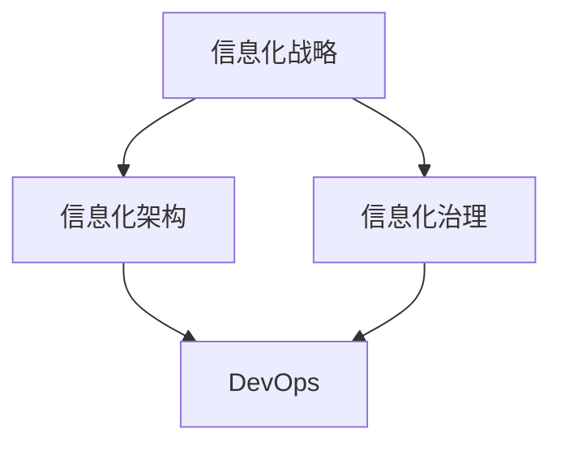

# 大型企业信息化策划、组织、架构、开发、管理

## 1. 背景介绍
### 1.1 大型企业信息化的重要性
### 1.2 信息化对大型企业的影响
### 1.3 信息化的发展历程和趋势

在当今数字化时代，信息技术已经成为企业生存和发展的关键因素。对于大型企业而言，有效地进行信息化建设和管理，可以显著提升企业的运营效率、决策水平和市场竞争力。信息化不仅改变了企业的业务模式和管理方式，也为企业创造了新的价值和机遇。

纵观信息化的发展历程，从早期的单一应用系统到现在的全面集成平台，企业信息化经历了从点到面、从局部到整体的演进过程。随着云计算、大数据、人工智能等新兴技术的兴起，企业信息化正朝着智能化、平台化、生态化的方向发展。大型企业需要审时度势，制定符合自身特点的信息化战略，建立健全的信息化管理体系，才能在数字化浪潮中立于不败之地。

## 2. 核心概念与联系
### 2.1 信息化战略
### 2.2 信息化架构
### 2.3 信息化治理
### 2.4 DevOps
### 2.5 核心概念之间的关系

在大型企业信息化的语境下，有几个核心概念需要厘清：

- 信息化战略：企业基于自身的业务特点、市场环境和发展目标，制定的信息化总体规划和长远布局。
- 信息化架构：企业IT系统的整体蓝图，包括业务架构、数据架构、应用架构和技术架构等层次。
- 信息化治理：企业对信息化建设和运营进行规划、组织、指挥、协调和控制的制度体系和管理过程。
- DevOps：一种重视"开发"和"运维"协作的文化、运动或惯例，旨在打造更快、更频繁、更稳定的高质量软件发布。

这些概念之间是相辅相成、环环相扣的。信息化战略为企业的信息化建设指明方向，信息化架构是战略的具体实施蓝图，信息化治理为信息化活动提供规范和保障，而DevOps则是落实信息化战略、优化信息化架构、提升信息化治理水平的重要抓手。



## 3. 核心算法原理具体操作步骤
### 3.1 企业架构规划方法论
#### 3.1.1 业务架构规划
#### 3.1.2 数据架构规划 
#### 3.1.3 应用架构规划
#### 3.1.4 技术架构规划
### 3.2 需求管理流程
#### 3.2.1 需求收集
#### 3.2.2 需求分析
#### 3.2.3 需求评审
#### 3.2.4 需求变更管理
### 3.3 项目管理流程
#### 3.3.1 项目立项
#### 3.3.2 项目计划
#### 3.3.3 项目执行
#### 3.3.4 项目监控
#### 3.3.5 项目收尾

在大型企业信息化的实践中，有一些行之有效的方法论和流程，可供借鉴。

企业架构规划通常采用自顶向下的方式，先明确企业的业务战略和业务模式，再据此规划数据架构、应用架构和技术架构。具体来说：
1. 业务架构规划：识别企业的核心业务能力，梳理业务流程，定义业务组件。
2. 数据架构规划：基于业务需求，设计企业级数据模型，定义主数据、元数据标准。
3. 应用架构规划：根据业务架构，规划应用系统的功能边界和集成关系。
4. 技术架构规划：选择合适的技术平台和开发框架，制定技术标准和原则。

需求管理是信息化项目成败的关键。需求管理流程通常包括：
1. 需求收集：通过访谈、调研、研讨等方式，广泛收集各方需求。
2. 需求分析：对收集到的需求进行分类、排序和分析，识别真正的业务需求。
3. 需求评审：组织相关干系人对需求进行评审，确保需求的正确性、完整性和一致性。
4. 需求变更管理：建立需求变更机制，规范需求变更流程，评估变更影响。

项目管理是保障信息化项目有序推进的重要手段。项目管理流程通常包括：
1. 项目立项：论证项目的必要性和可行性，设定项目目标，编制项目章程。
2. 项目计划：制定项目进度计划、资源计划、质量计划、风险应对计划等。
3. 项目执行：组建项目团队，落实项目计划，推动项目进度。
4. 项目监控：跟踪项目进展，管理项目变更，控制项目风险。
5. 项目收尾：验收项目交付物，总结项目经验教训，释放项目资源。

## 4. 数学模型和公式详细讲解举例说明
### 4.1 软件规模度量
### 4.2 软件开发工作量估算
### 4.3 软件可靠性模型

在信息化项目管理中，经常需要运用数学模型和公式来进行定量分析和科学决策。下面举几个例子：

软件规模度量常用的方法是功能点分析法。功能点用来度量软件的功能规模，与编程语言无关。功能点计算公式为：
$$
FP = (UFP + CFP) * VAF
$$
其中，$UFP$为未调整功能点，$CFP$为调整后的功能点，$VAF$为价值调整因子，取值范围为0.65~1.35。

软件开发工作量估算常用的方法是COCOMO II模型。COCOMO II的基本公式为：
$$
PM = A * {Size}^{E} * \prod_{i=1}^{n}EM_{i}
$$
其中，$PM$为人月数，$A$为系数，$Size$为软件规模（代码行数），$E$为规模指数，$EM_{i}$为第$i$个努力乘数。

软件可靠性模型用于度量和预测软件系统的可靠性指标。常用的模型有JM模型、GO模型等。以JM模型为例，其失效强度函数为：
$$
\lambda(t) = \frac{N * \phi * \exp(-\phi * t)}{1 + N * \exp(-\phi * t)}
$$
其中，$N$为软件中初始的错误数，$\phi$为每个错误引起失效的比例。

这些模型和公式可以帮助项目经理进行定量分析，但在实际应用时需要根据项目的具体情况，选择合适的参数和假设。同时，定量分析只是决策的辅助手段，还需要结合定性分析和专家经验，才能做出科学的判断。

## 5. 项目实践：代码实例和详细解释说明
### 5.1 代码实例1：需求管理系统
#### 5.1.1 需求管理流程的实现
#### 5.1.2 需求文档的版本控制
#### 5.1.3 需求跟踪矩阵的生成
### 5.2 代码实例2：自动化运维平台
#### 5.2.1 CMDB的数据采集与同步
#### 5.2.2 批量任务的调度与执行
#### 5.2.3 配置管理与版本控制

下面通过两个代码实例，展示信息化项目中的一些典型应用场景。

代码实例1是一个需求管理系统，主要功能包括：
1. 需求管理流程的实现：包括需求的提交、审核、变更等环节，通过工作流引擎实现流程的自动化控制。
2. 需求文档的版本控制：采用SVN等版本控制工具，记录需求文档的变更历史，便于追溯和回滚。
3. 需求跟踪矩阵的生成：建立需求与测试用例、开发任务之间的跟踪关系，自动生成需求跟踪矩阵，确保需求的全面覆盖。

代码实例2是一个自动化运维平台，主要功能包括：
1. CMDB的数据采集与同步：通过各种适配器采集不同来源的配置数据，并进行清洗、归一化处理，保证CMDB数据的准确性和时效性。
2. 批量任务的调度与执行：通过任务调度引擎，支持定时任务、事件触发任务等多种调度方式，自动执行批量操作，提高运维效率。
3. 配置管理与版本控制：将配置文件纳入版本控制，记录配置变更历史，实现配置的可审计、可追溯、可回滚。

以下是需求管理系统中需求提交流程的简要代码示意：

```java
public class RequirementServiceImpl implements RequirementService {
  
  @Autowired
  private WorkflowService workflowService;
  
  @Override
  public void submitRequirement(Requirement requirement) {
    // 保存需求基本信息
    requirementDao.save(requirement);
    
    // 启动需求审核流程
    Map<String, Object> variables = new HashMap<>();
    variables.put("requirement", requirement);
    workflowService.startWorkflow("requirementReview", variables);
  }
}
```

这段代码展示了需求提交时，如何启动一个需求审核流程。通过工作流引擎，可以将需求审核的各个环节串联起来，实现自动化控制。

再举一个自动化运维平台中CMDB数据采集的代码例子：

```python
class ServerCollector(BaseCollector):
  
  def collect(self):
    # 通过SSH采集服务器配置信息
    with SSHClient() as ssh:
      ssh.set_missing_host_key_policy(paramiko.AutoAddPolicy()) 
      ssh.connect(hostname=self.server_ip, port=22, username=self.username, password=self.password)
      
      stdin, stdout, stderr = ssh.exec_command('uname -a')
      uname = stdout.read().decode('utf-8')
      
      stdin, stdout, stderr = ssh.exec_command('df -h')
      disk = stdout.read().decode('utf-8')
    
    # 将采集到的数据录入CMDB
    server = Server()
    server.ip = self.server_ip
    server.uname = uname
    server.disk = disk
    server.save()
```

这段代码展示了如何通过SSH协议采集Linux服务器的配置信息，包括操作系统版本、磁盘使用情况等，并将采集到的数据录入CMDB。

通过这两个代码实例，可以看出，信息化项目需要开发各种工具和平台，来支撑企业的管理和运营。而这些系统的开发，离不开成熟的基础架构和通用组件，例如工作流引擎、任务调度引擎、版本控制系统等。同时，还需要遵循一些最佳实践，如领域驱动设计、微服务架构、自动化测试等，来保证系统的高内聚低耦合和持续交付能力。

## 6. 实际应用场景
### 6.1 电商平台的业务中台建设
### 6.2 制造企业的智能工厂升级
### 6.3 金融机构的数字化转型

信息化在各行各业都有广泛的应用，下面列举几个有代表性的场景。

电商平台的业务中台建设：随着电商业务的快速发展，单体应用架构暴露出扩展性和维护性的问题。为了解决这些问题，许多电商企业开始建设业务中台。业务中台将业务能力进行抽象和封装，以API的形式提供给前台应用调用。这样可以实现前后台的解耦，提高系统的灵活性和复用性。同时，业务中台还可以沉淀企业的核心业务模型和业务规则，实现业务逻辑的标准化和统一化管理。典型的业务中台包括会员中心、商品中心、订单中心、营销中心等。

制造企业的智能工厂升级：在工业4.0的背景下，制造企业纷纷开展智能制造的探索和实践。智能工厂的核心是通过信息技术与制造技术的深度融合，实现生产过程的智能感知、智能分析、智能决策和智能执行。这需要打通设计、生产、管理、服务等环节的信息流，建立统一的数字化平台。例如，利用物联网技术采集设备的实时运行数据，利用大数据技术进行工艺参数优化，利用人工智能技术