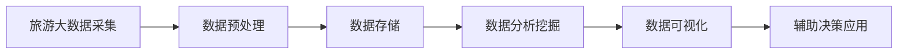

# 大数据背景下铜仁市旅游数据分析与研究

## 1.背景介绍
### 1.1 大数据时代的到来
#### 1.1.1 大数据的定义与特征
#### 1.1.2 大数据在各行各业的应用现状
#### 1.1.3 大数据给旅游业带来的机遇与挑战

### 1.2 铜仁市旅游业发展现状
#### 1.2.1 铜仁市旅游资源概况  
#### 1.2.2 铜仁市旅游业发展现状
#### 1.2.3 铜仁市旅游业面临的问题与不足

### 1.3 课题研究的意义
#### 1.3.1 理论意义
#### 1.3.2 现实意义

## 2.核心概念与联系
### 2.1 旅游大数据
#### 2.1.1 旅游大数据的概念
旅游大数据是指在旅游活动中产生的、通过各种渠道采集而来的海量数据，包括游客行为数据、景区运营数据、交通出行数据、住宿餐饮数据、旅游产品交易数据等。这些数据具有Volume大、Velocity快、Variety多、Value高等"4V"特征。

#### 2.1.2 旅游大数据的来源与类型
旅游大数据主要来源于以下几个方面：
1. 在线旅游平台(OTA)：如携程、飞猪等在线旅游网站和APP，记录游客浏览、搜索、预订等行为数据。
2. 旅游景区管理系统：包括售票系统、客流监测系统等，记录游客数量、客流分布等数据。
3. 酒店与餐饮管理系统：记录游客住宿、餐饮消费等数据。
4. 交通运输系统：如航空、铁路、公路的售票与客流数据。
5. 旅游政务系统：旅游主管部门的统计数据。
6. 社交网络平台：游客在微博、小红书等平台上发布的UGC内容，反映游客偏好、评价等。
7. 移动通信运营商数据：基于手机信令、位置等数据反映游客出行轨迹。

#### 2.1.3 旅游大数据分析的价值
旅游大数据蕴含着巨大的商业价值和社会价值，通过大数据分析可以：
1. 洞察游客需求，优化旅游产品和服务。
2. 预测旅游市场趋势，指导旅游规划决策。
3. 优化旅游资源配置，缓解景区"过载"问题。
4. 创新旅游营销方式，实现精准营销。
5. 完善智慧旅游，提升游客体验。

### 2.2 数据挖掘
#### 2.2.1 数据挖掘的概念
数据挖掘是从大量的、不完全的、有噪声的、模糊的、随机的数据中提取隐含的、事先未知的、但是潜在有用的信息和知识的过程。它是数据库知识发现(Database Knowledge Discovery)的核心步骤。

#### 2.2.2 数据挖掘的任务与方法
数据挖掘主要任务包括：
1. 关联分析(Association Analysis)：发现数据项之间的关联规则。
2. 聚类分析(Cluster Analysis)：把相似的数据对象归到同一簇中。
3. 分类与预测(Classification and Prediction)：构建分类模型或预测模型。
4. 时序模式挖掘(Sequential Pattern Mining)：发现数据序列中的模式。
5. 异常检测(Anomaly Detection)：发现数据中的异常或离群点。

常用的数据挖掘方法包括决策树、神经网络、支持向量机、贝叶斯分类、K-Means聚类、Apriori关联规则等。

#### 2.2.3 数据挖掘在旅游领域的应用
在旅游领域，数据挖掘可应用于以下方面：
1. 游客行为分析与个性化推荐。
2. 旅游市场细分与目标市场选择。
3. 景区客流量预测与管理。
4. 旅游产品组合优化与定价。
5. 旅游服务质量评价与改进。

### 2.3 铜仁市旅游大数据分析框架
下图使用Mermaid流程图展示了本文构建的铜仁市旅游大数据分析框架：



## 3.核心算法原理具体操作步骤
### 3.1 数据采集与预处理
#### 3.1.1 数据采集渠道与方法
#### 3.1.2 数据清洗
#### 3.1.3 数据集成
#### 3.1.4 数据变换

### 3.2 数据存储与管理
#### 3.2.1 Hadoop分布式文件系统HDFS
#### 3.2.2 NoSQL数据库HBase
#### 3.2.3 数据仓库Hive

### 3.3 数据分析挖掘算法
#### 3.3.1 游客行为分析
##### 3.3.1.1 RFM模型
##### 3.3.1.2 关联规则挖掘
##### 3.3.1.3 序列模式挖掘
#### 3.3.2 景区客流预测
##### 3.3.2.1 ARIMA时序模型
##### 3.3.2.2 BP神经网络
#### 3.3.3 旅游产品评价分析
##### 3.3.3.1 情感分析
##### 3.3.3.2 主题模型LDA

### 3.4 数据可视化技术
#### 3.4.1 ECharts
#### 3.4.2 D3.js
#### 3.4.3 GIS地图可视化

## 4.数学模型和公式详细讲解举例说明
### 4.1 RFM模型
RFM模型是衡量客户价值和客户创利能力的重要工具和手段，其中由3个要素构成：
- R(Recency)：最近一次消费时间距离现在的时间
- F(Frequency)：消费频率
- M(Monetary)：消费金额

对每个要素做分层量化，然后对不同维度分值进行加权平均，得到综合RFM得分：

$$RFM Score = \alpha \times R + \beta \times F + \gamma \times M$$

其中$\alpha$、$\beta$、$\gamma$为权重系数，满足$\alpha + \beta + \gamma = 1$。

根据综合RFM得分，可以将游客划分为重要价值客户、重点保持客户、高潜力客户、新客户、流失客户等不同类型，制定差异化营销策略。

### 4.2 Apriori关联规则挖掘
Apriori算法是常用的关联规则挖掘算法，用于从大规模数据集中挖掘物品项之间的关联规则，发现频繁项集。

Apriori算法的基本思想是：如果一个项集是频繁的，那么它的所有子集也是频繁的。该算法使用一种称作逐层搜索的迭代方法，k项集用于探索k+1项集。

关联规则定义为一个形如$X \to Y$的蕴涵式，其中$X$和$Y$是不相交的项集，支持度和置信度是关联规则的两个重要度量：
- 支持度(Support)：包含$X$和$Y$的事务占总事务的比例。
$$Support(X \to Y) = P(X \cup Y) = \frac{freq(X \cup Y)}{N}$$
- 置信度(Confidence)：包含$X$的同时包含$Y$的事务占包含$X$的事务的比例。
$$Confidence(X \to Y) = P(Y|X) = \frac{freq(X \cup Y)}{freq(X)}$$

Apriori算法的基本过程如下：
1. 生成频繁1项集的集合。
2. 由频繁k项集生成候选k+1项集。 
3. 检查候选k+1项集的支持度，确定频繁k+1项集。
4. 重复步骤2和3，直到不能生成更多的候选集。
5. 由频繁项集产生强关联规则，选择满足最小支持度和最小置信度的规则。

### 4.3 ARIMA时序预测模型
ARIMA(Auto Regressive Integrated Moving Average)模型是研究时间序列数据预测的重要方法，由差分整合移动平均自回归混合模型。

ARIMA(p,d,q)模型可表示为：

$$(1-\sum_{i=1}^{p}\phi_iB^i)(1-B)^dX_t = (1+\sum_{i=1}^{q}\theta_iB^i)\varepsilon_t$$

其中：
- $p$：自回归项数
- $d$：差分次数
- $q$：移动平均项数
- $\phi_i$：自回归系数
- $\theta_i$：移动平均系数
- $B$：滞后算子，$BX_t=X_{t-1}$
- $\varepsilon_t$：白噪声序列

ARIMA模型构建的一般步骤如下：
1. 平稳性检验：通过时序图、自相关图和单位根检验判断序列是否平稳，若不平稳需进行差分运算。
2. 模型识别：根据平稳序列的自相关系数(ACF)和偏自相关系数(PACF)图识别ARMA模型的阶数p和q。
3. 模型估计：利用最小二乘法或极大似然估计法估计模型参数。
4. 模型诊断：对拟合残差进行白噪声检验，判断模型是否合理。
5. 模型预测：用所建模型进行预测。

## 5.项目实践：代码实例和详细解释说明
### 5.1 数据采集与预处理
使用Python的requests库从携程旅游网站抓取铜仁市酒店数据，并进行清洗、去重。

```python
import requests
from bs4 import BeautifulSoup

url = 'https://hotels.ctrip.com/hotel/tongren222'
headers = {
    'User-Agent': 'Mozilla/5.0 (Windows NT 10.0; Win64; x64) AppleWebKit/537.36 (KHTML, like Gecko) Chrome/91.0.4472.124 Safari/537.36'
}

def get_hotel_info(url):
    res = requests.get(url, headers=headers)
    soup = BeautifulSoup(res.text, 'html.parser')
    hotel_list = soup.find_all('div', class_='hotel_item')
    data = []
    for hotel in hotel_list:
        name = hotel.find('a', class_='hotel_name').text
        address = hotel.find('p', class_='hotel_item_htladdress').text
        price = hotel.find('span', class_='J_price_lowList').text
        data.append([name, address, price])
    return data

hotel_data = get_hotel_info(url)
print(hotel_data)
```

### 5.2 关联规则挖掘
使用mlxtend库实现Apriori算法，挖掘铜仁市景区之间的关联规则。

```python
import pandas as pd
from mlxtend.preprocessing import TransactionEncoder
from mlxtend.frequent_patterns import apriori
from mlxtend.frequent_patterns import association_rules

data = [['梵净山', '铜仁大峡谷', '万山'],
        ['梵净山', '铜仁大峡谷'],
        ['梵净山', '万山'],  
        ['梵净山', '铜仁大峡谷', '万山', '玉屏侗族自治县'],
        ['铜仁大峡谷', '玉屏侗族自治县']]

te = TransactionEncoder()
te_ary = te.fit(data).transform(data)
df = pd.DataFrame(te_ary, columns=te.columns_)

frequent_itemsets = apriori(df, min_support=0.4, use_colnames=True)
rules = association_rules(frequent_itemsets, metric="confidence", min_threshold=0.6)
print(rules)
```

### 5.3 客流量预测
使用statsmodels库构建ARIMA模型，对铜仁市某景区未来客流量进行预测。

```python
import pandas as pd
from statsmodels.tsa.arima.model import ARIMA
from statsmodels.graphics.tsaplots import plot_acf, plot_pacf

data = pd.read_csv('visitor.csv', index_col='date', parse_dates=['date'])

# 平稳性检验
from statsmodels.tsa.stattools import adfuller
result = adfuller(data['visitor'])
print(f'ADF Statistic: {result[0]}')
print(f'p-value: {result[1]}')

# 差分运算
diff_data = data.diff().dropna()

# 模型识别
plot_acf(diff_data).show()
plot_pacf(diff_data).show()

# 模型估计
model = ARIMA(data, order=(1, 1, 1))
result = model.fit()
print(result.summary())

# 模型预