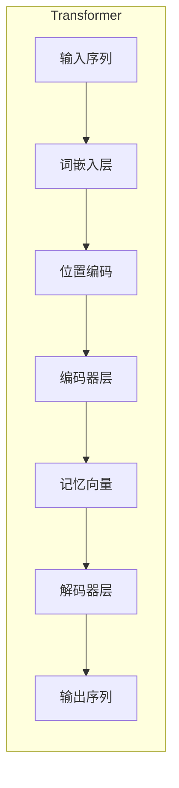
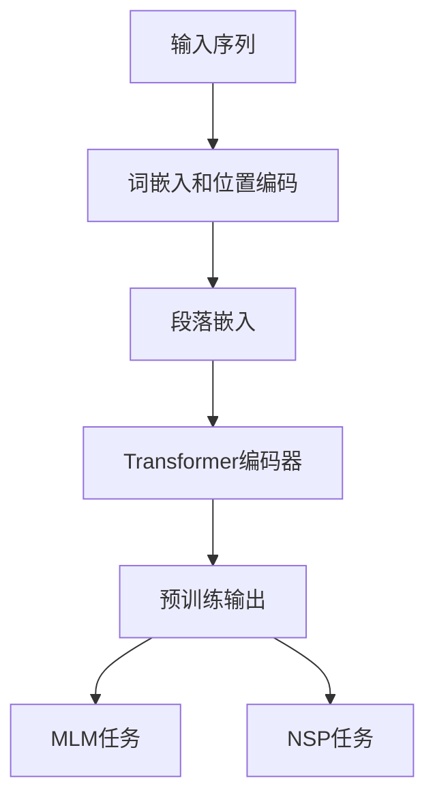
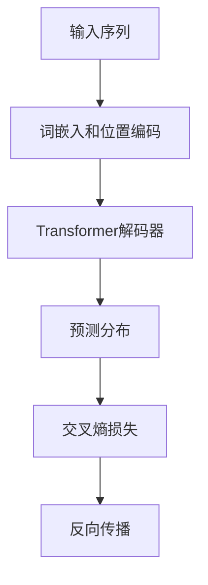

# 大规模语言模型从理论到实践 开源数据集

## 1. 背景介绍

### 1.1 语言模型的重要性

语言模型是自然语言处理领域的核心技术之一,它能够学习和捕捉语言的统计规律,为下游任务提供有力支撑。随着深度学习技术的发展,大规模语言模型展现出了强大的语言理解和生成能力,在机器翻译、问答系统、文本摘要等诸多领域取得了突破性进展。

### 1.2 大规模语言模型的兴起

传统的语言模型通常基于 N-gram 统计方法,其参数量和上下文捕捉能力有限。而大规模语言模型则利用深度神经网络和海量语料训练,能够学习更丰富的语义和上下文信息。自 2018 年 Transformer 模型问世以来,GPT、BERT、T5 等一系列大规模语言模型相继推出,展现出了令人惊艳的性能。

### 1.3 开源数据集的重要性

高质量的数据集是训练大规模语言模型的关键。然而,由于隐私、版权等原因,公开的高质量语料资源一直较为匮乏。近年来,一些机构和个人推出了多个开源数据集,为语言模型的研究和应用提供了宝贵资源。本文将重点介绍几个具有代表性的开源数据集。

## 2. 核心概念与联系

### 2.1 语言模型的任务定义

语言模型的核心任务是学习一个概率分布 $P(X)$,使其能够很好地估计一个句子 $X=\{x_1, x_2, \ldots, x_n\}$ 的概率。根据链式法则,该概率可以分解为:

$$
P(X) = \prod_{t=1}^{n} P(x_t | x_1, \ldots, x_{t-1})
$$

其中 $P(x_t | x_1, \ldots, x_{t-1})$ 表示在给定前 $t-1$ 个词的情况下,第 $t$ 个词出现的条件概率。语言模型的目标就是最大化上述条件概率的乘积。

### 2.2 自回归语言模型

自回归语言模型是一种常见的语言模型架构,它将语句生成视为一个序列决策问题。在每一步,模型根据之前生成的内容,预测下一个最可能的词。这种方式虽然高效,但也存在一些缺陷,比如无法并行化、暴露偏置等。

### 2.3 掩码语言模型

掩码语言模型(Masked Language Model, MLM)是 BERT 等模型采用的预训练方式。它将部分词随机用特殊符号[MASK]替换,然后让模型去预测被遮掩的词。这种方式允许模型同时看到上下文的左右信息,但也需要更多的计算资源。

### 2.4 前馈语言模型

前馈语言模型(Feedforward Language Model)是一种新兴的语言模型范式,它试图通过消除自回归的限制,提高训练和推理的效率。这类模型直接生成整个序列,避免了序列决策所带来的开销。

## 3. 核心算法原理具体操作步骤 

### 3.1 Transformer 模型

Transformer 是目前主流的序列到序列(Seq2Seq)模型,也是大规模语言模型的核心架构。它完全基于注意力机制,摒弃了 RNN 和 CNN 等传统结构,大大提高了并行能力。

Transformer 的主要流程如下:

1. 输入序列通过词嵌入层获得初始表示
2. 位置编码被添加到词嵌入,提供位置信息
3. 多个编码器层对输入进行编码,生成记忆向量
4. 多个解码器层根据记忆向量生成输出序列

其中,编码器层和解码器层的核心是多头注意力机制,它允许模型同时关注输入序列的不同部分,捕捉长程依赖关系。



### 3.2 BERT 模型

BERT(Bidirectional Encoder Representations from Transformers)是一种基于 Transformer 的掩码语言模型,通过预训练的方式学习双向语义表示。它的预训练任务包括:

1. **掩码语言模型(MLM)**: 随机遮掩部分输入词,并要求模型预测被遮掩的词。
2. **下一句预测(NSP)**: 判断两个句子是否为连续的句子对。

BERT 预训练的流程如下:

1. 输入序列经过词嵌入和位置编码
2. 输入被划分为多个段落,每个段落前添加专门的段落嵌入
3. 输入序列被馈送到 Transformer 编码器进行编码
4. 最后一层编码器输出作为预训练的目标
5. MLM 和 NSP 任务通过添加特殊标记实现

通过预训练,BERT 学习到了通用的语义表示,可以迁移到下游任务上做进一步微调。



### 3.3 GPT 模型

GPT(Generative Pre-trained Transformer)是一种基于自回归的生成式语言模型,由 OpenAI 提出。它的预训练目标是最大化语料库中所有文本序列的概率。

GPT 预训练的主要步骤包括:

1. 输入序列经过词嵌入和位置编码
2. 输入序列被馈送到 Transformer 解码器进行编码
3. 对于每个位置,模型预测下一个词的概率分布
4. 使用交叉熵损失函数最小化预测和真实标签的差异

通过预训练,GPT 学习到了生成式的语言表示,可以用于文本生成、机器翻译等任务。后续的 GPT-2 和 GPT-3 进一步扩大了模型规模,展现出了强大的文本生成能力。



## 4. 数学模型和公式详细讲解举例说明

### 4.1 自注意力机制

自注意力机制是 Transformer 模型的核心,它允许模型捕捉输入序列中任意位置之间的依赖关系。给定一个查询向量 $\boldsymbol{q}$、键向量 $\boldsymbol{K}=[\boldsymbol{k}_1, \boldsymbol{k}_2, \ldots, \boldsymbol{k}_n]$ 和值向量 $\boldsymbol{V}=[\boldsymbol{v}_1, \boldsymbol{v}_2, \ldots, \boldsymbol{v}_n]$,自注意力的计算过程如下:

$$
\begin{aligned}
\text{Attention}(\boldsymbol{Q}, \boldsymbol{K}, \boldsymbol{V}) &= \text{softmax}\left(\frac{\boldsymbol{Q}\boldsymbol{K}^\top}{\sqrt{d_k}}\right)\boldsymbol{V} \\
&= \sum_{i=1}^n \alpha_i \boldsymbol{v}_i
\end{aligned}
$$

其中 $\alpha_i = \text{softmax}\left(\frac{\boldsymbol{q}\boldsymbol{k}_i^\top}{\sqrt{d_k}}\right)$ 是注意力权重,表示查询向量对第 $i$ 个键向量的关注程度。$d_k$ 是缩放因子,用于防止内积过大导致的梯度饱和。

自注意力机制的优点在于,它可以自适应地为每个位置分配注意力权重,从而捕捉长程依赖关系。此外,它还具有高度的并行性,可以显著提高计算效率。

### 4.2 多头注意力机制

为了进一步提高表示能力,Transformer 采用了多头注意力机制。它将查询、键和值分别线性投影到不同的子空间,并在每个子空间内执行自注意力操作,最后将所有头的结果拼接起来。

具体来说,给定查询 $\boldsymbol{Q}$、键 $\boldsymbol{K}$ 和值 $\boldsymbol{V}$,以及投影矩阵 $\boldsymbol{W}_i^Q$、$\boldsymbol{W}_i^K$、$\boldsymbol{W}_i^V$,第 $i$ 个注意力头的计算过程为:

$$
\begin{aligned}
\text{head}_i &= \text{Attention}\left(\boldsymbol{QW}_i^Q, \boldsymbol{KW}_i^K, \boldsymbol{VW}_i^V\right) \\
\text{MultiHead}(\boldsymbol{Q}, \boldsymbol{K}, \boldsymbol{V}) &= \text{Concat}(\text{head}_1, \text{head}_2, \ldots, \text{head}_h)\boldsymbol{W}^O
\end{aligned}
$$

其中 $h$ 是注意力头的数量,每个头可以关注输入序列的不同子空间表示,最终通过拼接和线性变换得到最终的多头注意力输出。

多头注意力机制不仅提高了模型的表示能力,而且增加了模型的稳定性和泛化性。它已经成为 Transformer 及其变体模型的标配。

### 4.3 位置编码

由于 Transformer 模型完全基于注意力机制,因此它无法像 RNN 那样自然地捕捉序列的位置信息。为了解决这个问题,Transformer 在输入嵌入中添加了位置编码,显式地为每个位置提供位置信息。

位置编码可以通过不同的函数生成,例如正弦和余弦函数:

$$
\begin{aligned}
\text{PE}_{(pos, 2i)} &= \sin\left(pos / 10000^{2i/d_\text{model}}\right) \\
\text{PE}_{(pos, 2i+1)} &= \cos\left(pos / 10000^{2i/d_\text{model}}\right)
\end{aligned}
$$

其中 $pos$ 是词的位置索引,而 $i$ 是维度索引。不同的维度对应不同的周期,从而为每个位置构建了一个独特的位置编码向量。

位置编码被直接加到输入嵌入上,使 Transformer 能够关注到序列的位置信息。这种简单而有效的方式,避免了引入递归或卷积结构,保持了 Transformer 的高效性和并行性。

## 5. 项目实践: 代码实例和详细解释说明

以下是使用 PyTorch 实现 Transformer 模型的简化代码示例,包括多头注意力和位置编码的实现。

```python
import math
import torch
import torch.nn as nn

# 多头注意力实现
class MultiHeadAttention(nn.Module):
    def __init__(self, d_model, num_heads):
        super().__init__()
        self.num_heads = num_heads
        self.d_model = d_model

        self.W_q = nn.Linear(d_model, d_model)
        self.W_k = nn.Linear(d_model, d_model)
        self.W_v = nn.Linear(d_model, d_model)
        self.W_o = nn.Linear(d_model, d_model)

    def forward(self, query, key, value, mask=None):
        # 线性投影
        query = self.W_q(query)
        key = self.W_k(key)
        value = self.W_v(value)

        # 分头
        query = query.view(query.size(0), -1, self.num_heads, self.d_model // self.num_heads).permute(0, 2, 1, 3)
        key = key.view(key.size(0), -1, self.num_heads, self.d_model // self.num_heads).permute(0, 2, 1, 3)
        value = value.view(value.size(0), -1, self.num_heads, self.d_model // self.num_heads).permute(0, 2, 1, 3)

        # 计算注意力
        scores = torch.matmul(query, key.permute(0, 1, 3, 2)) / math.sqrt(query.size(-1))
        if mask is not None:
            scores = scores.masked_fill(mask == 0, -1e9)
        