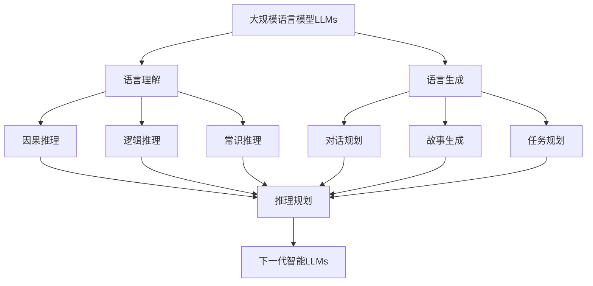

# 大规模语言模型从理论到实践 推理规划

## 1.背景介绍

大规模语言模型(Large Language Models, LLMs)是自然语言处理(NLP)领域近年来的重大突破。它们是在海量文本数据上训练的深度神经网络模型,能够学习和理解人类语言,并生成连贯、流畅的文本。LLMs在机器翻译、文本摘要、问答系统、对话生成等任务上取得了显著成果,展现出强大的语言理解和生成能力。

然而,当前的LLMs主要侧重于语言建模和生成,在推理和规划等高阶认知任务上仍面临挑战。为了进一步提升LLMs的智能水平,我们需要探索如何赋予它们推理和规划的能力,使其能够像人类一样进行逻辑推理、因果分析、多步规划等。这不仅需要在理论上深入研究LLMs的内在机制,还需要在实践中设计创新的训练范式和架构。

本文将系统地探讨大规模语言模型中的推理规划问题,从理论到实践,深入剖析其内在机理和最新进展。我们将首先介绍LLMs的核心概念和关键技术,然后重点分析推理规划的理论基础和算法原理。在此基础上,我们将结合具体的数学模型和代码实例,讨论如何将推理规划能力融入LLMs的训练和应用中。最后,我们将展望LLMs推理规划的未来发展方向和挑战,为相关研究提供思路和参考。

## 2.核心概念与联系

### 2.1 大规模语言模型(LLMs)

LLMs是基于深度学习的语言模型,旨在从大规模文本语料中学习语言的统计规律和语义表示。与传统的n-gram语言模型不同,LLMs采用多层神经网络(如Transformer)来建模语言的长程依赖关系,能够生成更加连贯、语义丰富的文本。代表性的LLMs包括GPT系列、BERT、XLNet等。

### 2.2 推理(Reasoning)

推理是一种认知过程,通过已知信息推导出新的结论或判断。在人工智能中,推理通常分为演绎推理、归纳推理和类比推理三种类型。演绎推理从一般性原则出发,推导出具体的结论;归纳推理从具体事实出发,总结出一般性规律;类比推理根据两个事物的相似性,从一个事物的性质推断另一个事物的性质。

### 2.3 规划(Planning)

规划是为了实现特定目标而对行动步骤进行决策的过程。它涉及对当前状态的分析、目标的设定、行动方案的生成和评估等。规划通常需要考虑行动的先后顺序、资源的约束条件以及不确定性因素,以找到最优的行动策略。在人工智能中,规划问题可以用状态空间搜索、启发式搜索、马尔可夫决策过程等方法求解。

### 2.4 LLMs中的推理规划

将推理规划引入LLMs,就是要赋予语言模型逻辑推理和策略规划的能力。这需要LLMs不仅能理解文本的字面意思,还要能把握其中蕴含的因果关系、时序逻辑等,并据此进行推理和决策。例如,在阅读理解任务中,LLMs不仅要找到问题的答案,还要能解释其推理过程;在开放域对话中,LLMs要能根据上下文进行多轮推理,以生成连贯的对话;在任务规划中,LLMs要能根据目标和约束条件,自主地生成行动序列。

下图展示了LLMs推理规划的总体架构:

可以看出,LLMs的语言理解和生成能力是推理规划的基础。在理解方面,LLMs需要掌握因果推理、逻辑推理、常识推理等能力;在生成方面,LLMs要能进行对话规划、故事生成、任务规划等。这两个方面相互融合,最终形成LLMs的推理规划能力,推动其向更高层次的智能迈进。

## 3.核心算法原理具体操作步骤

本节我们将详细介绍LLMs推理规划的核心算法原理和操作步骤。主要涉及基于符号逻辑的推理、基于神经网络的推理以及基于强化学习的规划三个方面。

### 3.1 基于符号逻辑的推理

符号逻辑是人工智能早期的重要工具,可以用谓词逻辑、一阶逻辑等形式化语言来表示知识和推理规则。将符号逻辑与LLMs相结合,可以让语言模型具备严谨的逻辑推理能力。其基本步骤如下:

1. 知识表示:将文本中的概念、实体、关系等抽取出来,用逻辑谓词表示为知识库中的事实和规则。

2. 查询分解:将自然语言查询转化为逻辑表达式,并分解为一系列子目标或子问题。

3. 推理搜索:利用知识库中的事实和规则,通过前向推理或反向推理的方式,对子目标进行演绎或归结,直到得出最终结论。

4. 结果生成:将推理得出的逻辑表达式转化为自然语言,作为最终的输出结果。

基于符号逻辑的推理可以保证推理过程的可解释性和可追溯性,但其表达能力和泛化能力有限,难以处理大规模、开放域的语言数据。

### 3.2 基于神经网络的推理

随着深度学习的发展,越来越多的研究开始探索基于神经网络的推理方法。与符号逻辑不同,神经网络可以直接从数据中学习推理规则,具有更强的表达能力和泛化能力。目前主要有以下几种思路:

1. 注意力机制:通过注意力机制来动态地聚焦于与推理相关的词语或句子,提取推理所需的关键信息。如R-NET等。 

2. 图神经网络:将文本转化为知识图谱或语义图,然后利用图神经网络在节点和边上传播信息,实现跨层次的推理。如TextGCN等。

3. 记忆网络:引入外部存储器来保存推理过程中的中间状态和结果,实现多步推理和可解释性。如EntNet等。

4. 预训练-微调范式:先在大规模语料上预训练语言模型,学习通用的语言表示;然后在特定的推理任务上微调模型,学习任务特定的推理模式。如ERNIE等。

基于神经网络的推理方法更加灵活和强大,但也面临可解释性差、数据依赖性强等问题。如何将符号推理与神经推理相结合,是一个值得探索的方向。

### 3.3 基于强化学习的规划

规划问题可以看作是在状态空间中寻找从初始状态到目标状态的最优路径。传统的规划算法,如A*搜索、STRIPS等,需要依赖人工定义的状态表示和转移规则。而基于强化学习的规划方法,可以让智能体自主学习状态表示和行动策略,适用于复杂和动态的环境。其基本步骤如下:

1. 状态表示:将任务环境抽象为状态空间,状态可以是结构化的符号表示,也可以是分布式的向量表示。

2. 行动空间:定义智能体可以采取的行动集合,行动可以是离散的符号行动,也可以是连续的参数行动。

3. 奖励函数:设计奖励函数来评估每个状态-行动对的好坏,奖励可以是即时的,也可以是长期的。

4. 价值函数:通过价值函数来估计每个状态或状态-行动对的长期累积奖励,用于指导行动选择。

5. 策略学习:通过价值迭代、策略梯度等强化学习算法,不断更新价值函数和策略函数,最终学习到最优策略。

基于强化学习的规划方法可以让LLMs学习到更加灵活和鲁棒的策略,但也面临探索-利用困境、样本效率低等难题。如何将规划与推理相结合,形成端到端的决策系统,是未来的一个重要方向。

## 4.数学模型和公式详细讲解举例说明

本节我们将介绍LLMs推理规划涉及的几个关键数学模型,并给出详细的公式推导和举例说明。

### 4.1 Transformer模型

Transformer是当前大规模语言模型的主流架构,其核心是自注意力机制和前馈神经网络。给定输入序列$\mathbf{x}=(x_1,\dots,x_n)$,Transformer的编码器首先计算自注意力权重:

$$\alpha_{ij}=\frac{\exp(e_{ij})}{\sum_{k=1}^n \exp(e_{ik})}$$

其中$e_{ij}$是查询向量$\mathbf{q}_i$和键向量$\mathbf{k}_j$的相似度:

$$e_{ij}=\frac{\mathbf{q}_i^\top \mathbf{k}_j}{\sqrt{d_k}}$$

然后利用自注意力权重对值向量$\mathbf{v}_j$进行加权求和,得到上下文表示:

$$\mathbf{z}_i=\sum_{j=1}^n \alpha_{ij}\mathbf{v}_j$$

最后经过前馈神经网络得到输出表示:

$$\mathbf{h}_i=\mathrm{FFN}(\mathbf{z}_i)$$

Transformer的解码器在编码器的基础上引入了masked self-attention和encoder-decoder attention,以实现自回归生成。

例如,考虑输入序列"我爱自然语言处理",编码器首先将其转化为词嵌入向量$\mathbf{x}=(\mathbf{x}_1,\mathbf{x}_2,\mathbf{x}_3,\mathbf{x}_4)$,然后通过自注意力机制计算上下文表示$\mathbf{z}=(\mathbf{z}_1,\mathbf{z}_2,\mathbf{z}_3,\mathbf{z}_4)$,最后经过前馈网络得到输出表示$\mathbf{h}=(\mathbf{h}_1,\mathbf{h}_2,\mathbf{h}_3,\mathbf{h}_4)$。解码器根据编码器的输出表示,自回归地生成目标序列"I love natural language processing"。

### 4.2 知识图谱嵌入

知识图谱是一种结构化的知识表示方式,由实体(entity)和关系(relation)组成。知识图谱嵌入旨在学习实体和关系的低维向量表示,以便于推理和泛化。最经典的是TransE模型,假设对于一个三元组$(h,r,t)$,头实体嵌入向量$\mathbf{h}$经过关系嵌入向量$\mathbf{r}$的平移应该接近尾实体嵌入向量$\mathbf{t}$,即:

$$\mathbf{h}+\mathbf{r}\approx\mathbf{t}$$

因此,TransE的目标是最小化以下损失函数:

$$\mathcal{L}=\sum_{(h,r,t)\in \mathcal{S}}\sum_{(h',r,t')\in \mathcal{S}'}\max(0,\gamma+d(\mathbf{h}+\mathbf{r},\mathbf{t})-d(\mathbf{h}'+\mathbf{r},\mathbf{t}'))$$

其中$\mathcal{S}$是正例三元组集合,$\mathcal{S}'$是负例三元组集合,$\gamma$是超参数,$d$是距离函数(如L1距离或L2距离)。

例如,给定知识图谱中的三元组(爱因斯坦,出生地,乌尔姆),TransE将其转化为嵌入向量$(\mathbf{e}_爱因斯坦,\mathbf{r}_出生地,\mathbf{e}_乌尔姆)$,并最小化以下损失:

$$\max(0,\gamma+\|\mathbf{e}_爱因斯坦+\mathbf{r}_出生地-\math