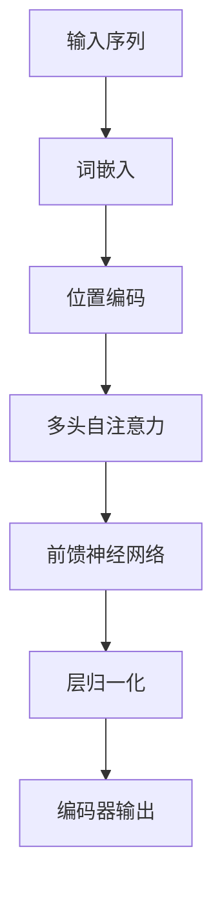
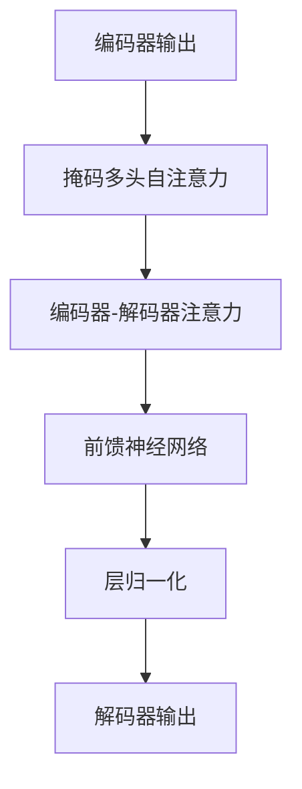

# 大规模语言模型从理论到实践 自定义模型

## 1.背景介绍

### 1.1 大规模语言模型的兴起

近年来,随着计算能力的飞速提升和海量数据的积累,大规模语言模型(Large Language Models, LLMs)在自然语言处理领域取得了令人瞩目的进展。LLMs通过在大量文本语料上进行预训练,学习语言的统计规律和语义关联,从而获得强大的语言理解和生成能力。

代表性的大规模语言模型包括GPT(Generative Pre-trained Transformer)系列、BERT(Bidirectional Encoder Representations from Transformers)、XLNet、RoBERTa等。其中,GPT-3凭借高达1750亿参数的庞大规模,展现出了令人惊叹的文本生成质量,可以生成看似人类水平的文本。

### 1.2 自定义大规模语言模型的需求

尽管现有的大规模语言模型已经取得了卓越的成绩,但它们通常是在通用语料上进行预训练的,缺乏针对特定领域和任务的定制化能力。因此,自定义大规模语言模型以满足特定需求和场景就显得尤为重要。

自定义语言模型可以让模型在特定领域的语料上进行额外的训练,从而获得更准确的领域知识表示和更高的任务性能。此外,自定义模型还可以根据实际需求调整模型架构、训练策略等,使其更加高效和可控。

## 2.核心概念与联系  

### 2.1 语言模型基本概念

语言模型(Language Model)是一种概率模型,旨在捕捉语言的统计规律,预测下一个词或字符出现的概率。形式化地,给定一个长度为n的序列$X=(x_1, x_2, ..., x_n)$,语言模型的目标是最大化该序列出现的概率:

$$P(X) = \prod_{i=1}^{n}P(x_i|x_1, x_2, ..., x_{i-1})$$

传统的语言模型通常基于n-gram统计或神经网络等方法进行建模。而大规模语言模型则是基于Transformer等注意力机制,在大量语料上进行预训练,从而获得强大的语言理解和生成能力。

### 2.2 Transformer和自注意力机制

Transformer是一种全新的序列到序列(Seq2Seq)模型架构,它完全基于注意力机制,摒弃了传统的RNN和CNN结构。Transformer的核心是自注意力(Self-Attention)机制,它允许输入序列中的每个位置都直接关注到其他位置,捕捉长距离依赖关系。

自注意力机制可以形式化表示为:

$$\text{Attention}(Q, K, V) = \text{softmax}(\frac{QK^T}{\sqrt{d_k}})V$$

其中,Q、K、V分别表示Query、Key和Value,通过计算Query与Key的相似性得分,对Value进行加权求和。这种机制使得Transformer能够高效地建模长距离依赖,成为大规模语言模型的核心组件。

### 2.3 预训练与微调

大规模语言模型的训练通常分为两个阶段:预训练(Pre-training)和微调(Fine-tuning)。

预训练阶段是在大量通用语料上进行无监督训练,目标是学习通用的语言表示。常用的预训练目标包括掩码语言模型(Masked Language Modeling)、下一句预测(Next Sentence Prediction)等。

微调阶段则是在特定任务的标注数据上进行有监督训练,通过对预训练模型的参数进行微调,使其适应特定任务。这种预训练+微调的范式大大提高了模型的泛化能力和训练效率。

## 3.核心算法原理具体操作步骤

### 3.1 Transformer编码器

Transformer编码器是大规模语言模型的核心组件之一,它将输入序列编码为上下文表示。编码器的主要步骤如下:

1. **词嵌入(Word Embedding)**: 将输入序列的每个词映射为一个固定维度的向量表示。
2. **位置编码(Positional Encoding)**: 为每个位置添加位置信息,使模型能够捕捉序列的顺序信息。
3. **多头自注意力(Multi-Head Self-Attention)**: 计算输入序列中每个位置与其他位置的注意力权重,捕捉长距离依赖关系。
4. **前馈神经网络(Feed-Forward Neural Network)**: 对每个位置的表示进行非线性变换,提取更高层次的特征。
5. **层归一化(Layer Normalization)**: 对每一层的输出进行归一化,加速训练收敛。

通过堆叠多个编码器层,Transformer编码器可以逐层提取输入序列的上下文表示,为后续的任务提供有效的语义信息。



### 3.2 Transformer解码器

Transformer解码器与编码器类似,但增加了一个掩码自注意力(Masked Self-Attention)层,用于防止解码器看到未来的信息。解码器的主要步骤如下:

1. **掩码多头自注意力(Masked Multi-Head Self-Attention)**: 计算当前位置与之前位置的注意力权重,防止看到未来信息。
2. **编码器-解码器注意力(Encoder-Decoder Attention)**: 计算解码器输出与编码器输出的注意力权重,融合编码器的上下文信息。
3. **前馈神经网络(Feed-Forward Neural Network)**: 对每个位置的表示进行非线性变换,提取更高层次的特征。
4. **层归一化(Layer Normalization)**: 对每一层的输出进行归一化,加速训练收敛。

通过堆叠多个解码器层,Transformer解码器可以逐步生成输出序列,同时利用编码器的上下文信息指导生成。



### 3.3 预训练目标

大规模语言模型的预训练通常采用以下目标:

1. **掩码语言模型(Masked Language Modeling, MLM)**: 随机掩码输入序列中的一部分词,让模型预测被掩码的词。这有助于模型学习语义和上下文信息。
2. **下一句预测(Next Sentence Prediction, NSP)**: 给定两个句子,让模型判断第二个句子是否为第一个句子的下一句。这有助于模型学习捕捉句子之间的关系。
3. **因果语言模型(Causal Language Modeling, CLM)**: 给定一个序列的前缀,让模型预测下一个词或字符。这是传统语言模型的目标,有助于模型学习生成连贯的文本。

通过组合使用上述预训练目标,大规模语言模型可以在海量语料上学习丰富的语言知识,为后续的微调和下游任务奠定基础。

## 4.数学模型和公式详细讲解举例说明

### 4.1 自注意力计算

自注意力机制是Transformer的核心,它允许输入序列中的每个位置都直接关注到其他位置,捕捉长距离依赖关系。自注意力的计算过程如下:

1. 将输入序列$X=(x_1, x_2, ..., x_n)$分别映射为Query、Key和Value向量:

   $$Q = X W^Q, K = X W^K, V = X W^V$$

   其中,$ W^Q $、$ W^K $、$ W^V $是可学习的权重矩阵。

2. 计算Query与Key的点积,得到注意力分数矩阵:

   $$\text{Attention}(Q, K) = \text{softmax}(\frac{QK^T}{\sqrt{d_k}})$$

   其中,$ d_k $是Key向量的维度,用于缩放注意力分数。

3. 将注意力分数矩阵与Value向量相乘,得到加权和表示:

   $$\text{Attention}(Q, K, V) = \text{softmax}(\frac{QK^T}{\sqrt{d_k}})V$$

通过多头注意力(Multi-Head Attention)机制,模型可以从不同的子空间捕捉不同的依赖关系,进一步提高表示能力。

### 4.2 位置编码

由于Transformer完全基于注意力机制,缺乏捕捉序列顺序信息的能力。为了解决这个问题,Transformer引入了位置编码(Positional Encoding),将位置信息直接编码到输入序列的表示中。

位置编码可以通过正弦和余弦函数计算:

$$
\begin{aligned}
\text{PE}_{(pos, 2i)} &= \sin(pos / 10000^{2i / d_\text{model}}) \\
\text{PE}_{(pos, 2i+1)} &= \cos(pos / 10000^{2i / d_\text{model}})
\end{aligned}
$$

其中,$ pos $表示位置索引,$ i $表示维度索引,$ d_\text{model} $是模型的隐藏层维度。

位置编码与输入序列的词嵌入相加,形成最终的输入表示,从而为模型提供位置信息。

### 4.3 掩码语言模型

掩码语言模型(Masked Language Modeling, MLM)是大规模语言模型预训练的主要目标之一。它的基本思想是随机掩码输入序列中的一部分词,让模型预测被掩码的词。

具体来说,给定一个长度为n的输入序列$X=(x_1, x_2, ..., x_n)$,我们随机选择一部分位置进行掩码,得到掩码后的序列$\tilde{X}=(\tilde{x}_1, \tilde{x}_2, ..., \tilde{x}_n)$,其中$\tilde{x}_i$可能是原始词、掩码标记[MASK]或随机词。

模型的目标是最大化被掩码词的条件概率:

$$\max_\theta \sum_{i=1}^n \log P(x_i | \tilde{X}, \theta)$$

其中,$ \theta $表示模型参数。

通过掩码语言模型的预训练,模型可以学习到丰富的语义和上下文信息,为后续的微调和下游任务奠定基础。

## 5.项目实践:代码实例和详细解释说明

在本节中,我们将通过一个实际的代码示例,展示如何使用Hugging Face的Transformers库来进行大规模语言模型的微调和推理。

### 5.1 环境配置

首先,我们需要安装必要的依赖库:

```bash
pip install transformers datasets
```

### 5.2 数据准备

我们将使用Hugging Face的`datasets`库加载一个示例数据集。这里以情感分析任务为例:

```python
from datasets import load_dataset

dataset = load_dataset("emotion")
```

数据集包含文本和对应的情感标签,我们可以对其进行预处理:

```python
def preprocess_function(examples):
    return tokenizer(examples["text"], truncation=True)

tokenized_datasets = dataset.map(preprocess_function, batched=True)
```

### 5.3 模型微调

接下来,我们将加载一个预训练的BERT模型,并对其进行微调:

```python
from transformers import AutoModelForSequenceClassification, TrainingArguments, Trainer

model = AutoModelForSequenceClassification.from_pretrained("bert-base-uncased", num_labels=6)

training_args = TrainingArguments(
    output_dir="./results",
    evaluation_strategy="epoch",
    learning_rate=2e-5,
    per_device_train_batch_size=16,
    per_device_eval_batch_size=16,
    num_train_epochs=3,
    weight_decay=0.01,
)

trainer = Trainer(
    model=model,
    args=training_args,
    train_dataset=tokenized_datasets["train"],
    eval_dataset=tokenized_datasets["validation"],
    tokenizer=tokenizer,
)

trainer.train()
```

在训练过程中,模型将在训练集上进行多轮迭代,并在验证集上评估性能,最终得到一个微调后的模型。

### 5.4 模型推理

最后,我们可以使用微调后的模型进行推理:

```python
from transformers import pipeline

classifier = pipeline("text-classification", model=model, tokenizer=tokenizer)
text = "I'm so happy today!"
result = classifier(text)
print(result)
```

输出结果将包含文本的预测情感标签及其概率分数。

通过这个示例,我们可以看到,使用Hugging Face的