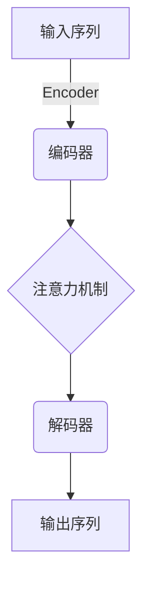
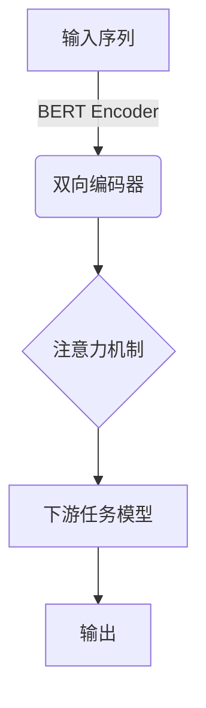

# 大语言模型原理与工程实践：Encoder 的代表：BERT

## 1. 背景介绍

### 1.1 自然语言处理的重要性

在当今信息时代,自然语言处理(Natural Language Processing, NLP)已经成为人工智能领域中最重要和最具挑战性的研究方向之一。随着大数据时代的到来,海量的非结构化文本数据的存在,使得自然语言处理技术的应用价值日益凸显。自然语言处理技术可以帮助我们高效地处理和理解人类语言,从而实现人机交互、信息检索、文本挖掘、机器翻译等众多应用场景。

### 1.2 语言模型的发展历程

语言模型(Language Model)是自然语言处理领域的核心技术之一。早期的统计语言模型主要基于n-gram模型,利用语料库中词序列的统计信息来预测下一个词的概率。随着深度学习技术的兴起,神经网络语言模型(Neural Network Language Model)应运而生,能够更好地捕捉语言的上下文信息和语义关系。

### 1.3 Transformer 与 BERT 的重要性

2017年,Transformer模型在机器翻译任务上取得了突破性的成果,它完全基于注意力机制,摒弃了传统序列模型中的循环神经网络和卷积神经网络结构。Transformer的出现,为后续的自然语言处理模型奠定了基础。2018年,谷歌推出了基于Transformer的预训练语言模型BERT(Bidirectional Encoder Representations from Transformers),它通过双向编码器表示,能够更好地捕捉语句中词与词之间的关系,在多项自然语言处理任务上取得了卓越的表现,开启了预训练语言模型的新时代。

## 2. 核心概念与联系

### 2.1 Transformer 模型

Transformer 是一种全新的基于注意力机制的序列到序列(Sequence-to-Sequence)模型,它完全摒弃了传统序列模型中的循环神经网络和卷积神经网络结构,而是依赖于注意力机制来捕捉输入和输出之间的全局依赖关系。Transformer 模型主要由编码器(Encoder)和解码器(Decoder)两个模块组成。

### 2.2 BERT 模型

BERT(Bidirectional Encoder Representations from Transformers)是一种基于 Transformer 的双向编码器表示,它能够有效地捕捉语句中词与词之间的关系,从而更好地理解语言的上下文信息。BERT 的核心思想是通过预训练的方式,在大规模语料库上学习通用的语言表示,然后将这些表示迁移到下游的自然语言处理任务中,从而显著提高模型的性能。

BERT 的预训练过程包括两个重要的任务:

1. **Masked Language Model (MLM)**: 随机掩蔽输入序列中的部分词,并要求模型预测被掩蔽的词。这种方式可以让模型学习到双向的语言表示,从而更好地理解上下文信息。

2. **Next Sentence Prediction (NSP)**: 判断两个句子是否相邻,从而让模型学习捕捉句子之间的关系。

通过这两个预训练任务,BERT 能够在大规模语料库上学习到通用的语言表示,并将这些表示迁移到下游的自然语言处理任务中,如文本分类、问答系统、序列标注等,从而显著提高模型的性能。

## 3. 核心算法原理具体操作步骤

### 3.1 Transformer 编码器

Transformer 编码器的核心是多头注意力机制(Multi-Head Attention)和位置编码(Positional Encoding)。

1. **多头注意力机制**

多头注意力机制是 Transformer 模型中最关键的组件之一。它允许模型同时关注输入序列中的不同位置,从而捕捉更丰富的上下文信息。具体操作步骤如下:

i) 将输入序列 $X = (x_1, x_2, \dots, x_n)$ 映射到查询(Query)、键(Key)和值(Value)矩阵 $Q$、$K$、$V$。

$$Q = XW_Q, K = XW_K, V = XW_V$$

其中 $W_Q$、$W_K$、$W_V$ 是可学习的权重矩阵。

ii) 计算注意力分数矩阵 $A$:

$$A = \text{softmax}\left(\frac{QK^T}{\sqrt{d_k}}\right)$$

其中 $d_k$ 是缩放因子,用于防止内积值过大导致梯度消失。

iii) 计算注意力加权值矩阵:

$$\text{Attention}(Q, K, V) = AV$$

iv) 多头注意力机制将上述过程重复执行 $h$ 次,每次使用不同的投影矩阵,最后将所有头的结果拼接起来:

$$\text{MultiHead}(Q, K, V) = \text{Concat}(\text{head}_1, \dots, \text{head}_h)W^O$$

其中 $W^O$ 是另一个可学习的权重矩阵。

2. **位置编码**

由于 Transformer 没有使用循环或卷积神经网络,因此无法直接捕捉序列的位置信息。为了解决这个问题,Transformer 引入了位置编码(Positional Encoding)。具体操作步骤如下:

i) 对于序列中的每个位置 $i$,计算其位置编码向量 $PE(i)$:

$$PE(i, 2j) = \sin\left(\frac{i}{10000^{2j/d_\text{model}}}\right)$$
$$PE(i, 2j+1) = \cos\left(\frac{i}{10000^{2j/d_\text{model}}}\right)$$

其中 $j$ 是维度索引,范围为 $[0, d_\text{model}/2)$。

ii) 将位置编码向量与输入embedding相加,从而将位置信息融入到embedding中:

$$X' = X + PE$$

通过这种方式,Transformer 编码器可以捕捉输入序列中词与词之间的位置关系。

### 3.2 BERT 预训练

BERT 的预训练过程包括两个重要的任务:Masked Language Model (MLM) 和 Next Sentence Prediction (NSP)。

1. **Masked Language Model (MLM)**

MLM 任务的目标是根据上下文预测被掩蔽的词。具体操作步骤如下:

i) 从输入序列中随机选择 15% 的词进行掩蔽,其中 80% 的词被替换为特殊标记 `[MASK]`,10% 的词被替换为随机词,剩余 10% 的词保持不变。

ii) 将掩蔽后的序列输入到 BERT 模型中,得到每个位置的上下文表示向量。

iii) 对于被掩蔽的位置,使用其上下文表示向量预测原始词的概率分布:

$$P(x_i | x_1, \dots, x_{i-1}, x_{i+1}, \dots, x_n) = \text{softmax}(W_e h_i + b_e)$$

其中 $W_e$ 和 $b_e$ 是可学习的参数,用于将上下文表示向量 $h_i$ 映射到词汇表的维度。

iv) 最小化掩蔽位置的交叉熵损失函数:

$$\mathcal{L}_\text{MLM} = -\frac{1}{N}\sum_{i=1}^N \log P(x_i | x_1, \dots, x_{i-1}, x_{i+1}, \dots, x_n)$$

其中 $N$ 是掩蔽位置的数量。

2. **Next Sentence Prediction (NSP)**

NSP 任务的目标是判断两个句子是否相邻。具体操作步骤如下:

i) 从语料库中随机抽取句子对 $(A, B)$,其中 50% 的时候 $B$ 是 $A$ 的下一句,另外 50% 的时候 $B$ 是随机选取的句子。

ii) 将句子对 $(A, B)$ 拼接为单个序列 `[CLS] A [SEP] B [SEP]`,其中 `[CLS]` 是分类标记, `[SEP]` 是句子分隔符。

iii) 将拼接后的序列输入到 BERT 模型中,得到 `[CLS]` 标记的上下文表示向量 $h_\text{CLS}$。

iv) 使用 $h_\text{CLS}$ 预测句子对是否相邻:

$$P_\text{NSP} = \sigma(W_n h_\text{CLS} + b_n)$$

其中 $W_n$ 和 $b_n$ 是可学习的参数, $\sigma$ 是 sigmoid 函数。

v) 最小化 NSP 任务的交叉熵损失函数:

$$\mathcal{L}_\text{NSP} = -\frac{1}{M}\sum_{i=1}^M y_i \log P_\text{NSP}^{(i)} + (1 - y_i) \log (1 - P_\text{NSP}^{(i)})$$

其中 $M$ 是训练样本的数量, $y_i$ 是标签 (0 或 1)。

BERT 的总损失函数是 MLM 损失和 NSP 损失的加权和:

$$\mathcal{L} = \mathcal{L}_\text{MLM} + \lambda \mathcal{L}_\text{NSP}$$

其中 $\lambda$ 是一个超参数,用于平衡两个任务的重要性。

通过上述预训练过程,BERT 能够在大规模语料库上学习到通用的语言表示,并将这些表示迁移到下游的自然语言处理任务中,从而显著提高模型的性能。

## 4. 数学模型和公式详细讲解举例说明

### 4.1 注意力机制

注意力机制(Attention Mechanism)是 Transformer 模型的核心,它允许模型动态地关注输入序列中的不同部分,从而捕捉更丰富的上下文信息。

在注意力机制中,我们首先将输入序列 $X = (x_1, x_2, \dots, x_n)$ 映射到查询(Query)、键(Key)和值(Value)矩阵 $Q$、$K$、$V$:

$$Q = XW_Q, K = XW_K, V = XW_V$$

其中 $W_Q$、$W_K$、$W_V$ 是可学习的权重矩阵。

接下来,我们计算注意力分数矩阵 $A$,它表示查询向量与键向量之间的相似性:

$$A = \text{softmax}\left(\frac{QK^T}{\sqrt{d_k}}\right)$$

其中 $d_k$ 是缩放因子,用于防止内积值过大导致梯度消失。softmax 函数用于将分数归一化为概率分布。

然后,我们计算注意力加权值矩阵,它是值矩阵 $V$ 根据注意力分数矩阵 $A$ 进行加权求和的结果:

$$\text{Attention}(Q, K, V) = AV$$

这个加权和向量就是注意力机制的输出,它捕捉了输入序列中与查询相关的重要信息。

在 Transformer 中,注意力机制被扩展为多头注意力机制(Multi-Head Attention),它将上述过程重复执行 $h$ 次,每次使用不同的投影矩阵,最后将所有头的结果拼接起来:

$$\text{MultiHead}(Q, K, V) = \text{Concat}(\text{head}_1, \dots, \text{head}_h)W^O$$

其中 $W^O$ 是另一个可学习的权重矩阵。

多头注意力机制允许模型从不同的表示子空间捕捉不同的相关信息,从而提高模型的表现力。

### 4.2 位置编码

由于 Transformer 没有使用循环或卷积神经网络,因此无法直接捕捉序列的位置信息。为了解决这个问题,Transformer 引入了位置编码(Positional Encoding)。

对于序列中的每个位置 $i$,我们计算其位置编码向量 $PE(i)$:

$$PE(i, 2j) = \sin\left(\frac{i}{10000^{2j/d_\text{model}}}\right)$$
$$PE(i, 2j+1) = \cos\left(\frac{i}{10000^{2j/d_\text{model}}}\right)$$

其中 $j$ 是维度索引,范围为 $[0