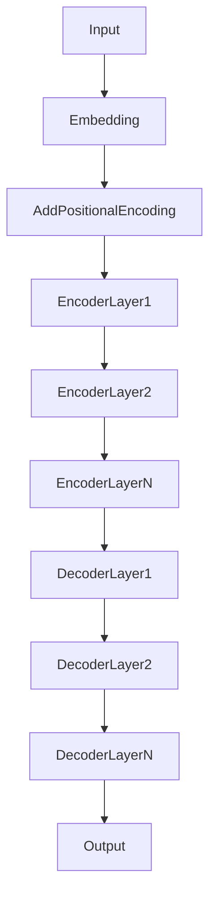

# 大语言模型原理与工程实践：主要的评测维度和基准概述

## 1. 背景介绍
### 1.1 大语言模型的兴起
近年来,随着深度学习技术的快速发展,大语言模型(Large Language Models, LLMs)在自然语言处理(Natural Language Processing, NLP)领域取得了巨大的突破。从2018年的BERT(Bidirectional Encoder Representations from Transformers)到2020年的GPT-3(Generative Pre-trained Transformer 3),再到最新的PaLM(Pathways Language Model),大语言模型的性能不断刷新记录,展现出了惊人的语言理解和生成能力。

### 1.2 大语言模型的应用前景
大语言模型在许多NLP任务上取得了state-of-the-art的表现,如文本分类、命名实体识别、问答系统、机器翻译等。同时,大语言模型还催生了许多创新性的应用,如对话系统、内容生成、知识图谱构建等。可以预见,大语言模型将在未来继续引领NLP技术的发展,并为人机交互、知识挖掘等领域带来革命性的变革。

### 1.3 评测的重要性
为了客观衡量大语言模型的性能,需要建立科学、全面的评测体系。通过在标准数据集上的评测,可以比较不同模型的优劣,推动算法的改进和创新。同时,评测结果也为大语言模型的实际应用提供了重要参考。因此,探讨大语言模型的评测维度和基准,对于NLP领域的研究者和工程师都具有重要意义。

## 2. 核心概念与联系
### 2.1 大语言模型的定义与特点
大语言模型是一类基于深度神经网络,在大规模文本语料上预训练得到的语言模型。与传统的n-gram语言模型不同,大语言模型能够学习到词语之间的深层次语义关系,具有更强的语言理解和生成能力。大语言模型的主要特点包括:

- 模型参数量巨大,通常在数亿到数千亿量级
- 采用Transformer等高效的神经网络结构
- 在大规模无标注语料上进行自监督预训练
- 可以通过微调(fine-tuning)应用于下游任务

### 2.2 预训练和微调范式
大语言模型的训练通常分为两个阶段:预训练和微调。在预训练阶段,模型在大规模无标注语料上进行自监督学习,通过掩码语言模型(Masked Language Model)、次句预测(Next Sentence Prediction)等任务,学习通用的语言表征。在微调阶段,预训练模型被应用于特定的下游任务,通过在标注数据上进行监督学习,进一步提升模型性能。预训练-微调范式极大地提高了模型的泛化能力和数据效率。

### 2.3 评测维度与基准的关系
大语言模型的评测维度和基准密切相关。评测维度定义了模型性能的考察角度,如语言理解、语言生成、鲁棒性等。而评测基准则提供了标准化的数据集和评价指标,用于量化模型在各个维度上的表现。二者相辅相成,共同构成了大语言模型评测的框架。

## 3. 核心算法原理具体操作步骤
### 3.1 Transformer结构
Transformer是大语言模型的核心组件,其结构如下图所示:



Transformer的主要操作步骤包括:

1. 输入序列经过词嵌入(word embedding)和位置编码(positional encoding),得到连续向量表示。
2. 编码器(encoder)通过多层自注意力(self-attention)机制和前馈神经网络(feed-forward neural network),对输入序列进行特征提取和编码。
3. 解码器(decoder)同样采用多层自注意力和前馈神经网络,并引入编码-解码注意力(encoder-decoder attention),根据编码器的输出生成目标序列。
4. 输出层将解码器的隐藏状态映射为词表概率分布,进行下一个词的预测。

Transformer中的自注意力机制能够捕捉词语之间的长距离依赖关系,前馈神经网络则增强了模型的非线性表达能力。通过堆叠多层Transformer模块,大语言模型能够学习到更加丰富和抽象的语言表征。

### 3.2 预训练任务
大语言模型在预训练阶段通常采用以下任务:

1. 掩码语言模型(Masked Language Model, MLM):随机掩盖输入序列中的部分词语,让模型根据上下文预测被掩盖的词。MLM任务能够促使模型学习到词语的上下文表征。
2. 次句预测(Next Sentence Prediction, NSP):给定两个句子,让模型判断它们是否为连续的句子。NSP任务能够促使模型学习到句子之间的语义连贯性。
3. 置换语言模型(Permuted Language Model, PLM):随机打乱输入序列中词语的顺序,让模型根据置换后的上下文预测原始词语。PLM任务能够促使模型学习到词语的位置不变性表征。

不同的大语言模型在预训练任务的选择和设计上有所不同,但都遵循自监督学习的思想,利用无标注语料进行训练。

### 3.3 微调方法
在下游任务上微调大语言模型的常用方法包括:

1. 特定任务层(Task-specific Layer):在预训练模型之上添加特定于任务的输出层,如分类层、序列标注层等,并利用任务的标注数据对整个模型进行端到端的微调。
2. 提示学习(Prompt Learning):将下游任务转化为与预训练任务类似的形式,如在输入序列中添加提示模板,让模型根据提示生成任务的输出。提示学习能够更好地利用预训练模型的知识,减少微调所需的标注数据。
3. 参数高效微调(Parameter-efficient Fine-tuning):在微调过程中只更新模型的一小部分参数,如使用适配器(adapter)、前缀调优(prefix-tuning)等技术,减少微调的计算开销和存储需求。

微调方法的选择需要根据任务的特点、数据规模等因素进行权衡。一般来说,特定任务层适用于数据量较大的任务,提示学习和参数高效微调则适用于数据量较小或计算资源有限的场景。

## 4. 数学模型和公式详细讲解举例说明
### 4.1 自注意力机制
自注意力机制是Transformer的核心组件,其数学模型如下:

给定输入序列的隐藏状态矩阵 $H\in\mathbb{R}^{n\times d}$,自注意力机制首先计算查询矩阵(query matrix) $Q$、键矩阵(key matrix) $K$和值矩阵(value matrix) $V$:

$$
Q = HW^Q, K = HW^K, V = HW^V
$$

其中, $W^Q, W^K, W^V \in \mathbb{R}^{d\times d_k}$ 为可学习的权重矩阵。

然后,通过查询矩阵和键矩阵的乘积计算注意力分数(attention scores):

$$
A = \text{softmax}(\frac{QK^T}{\sqrt{d_k}})
$$

注意力分数经过 softmax 归一化后,与值矩阵相乘得到注意力输出(attention output):

$$
\text{Attention}(Q, K, V) = AV
$$

自注意力机制通过查询、键、值的交互,实现了序列中不同位置之间的信息融合和传递。多头注意力(multi-head attention)进一步增强了自注意力的表达能力,它将 $Q$、$K$、$V$ 划分为多个子空间,并行计算多个注意力函数,再将结果拼接起来:

$$
\text{MultiHead}(Q, K, V) = \text{Concat}(\text{head}_1, \ldots, \text{head}_h)W^O \\
\text{head}_i = \text{Attention}(QW^{Q}_i, KW^{K}_i, VW^{V}_i)
$$

其中, $W^{Q}_i, W^{K}_i, W^{V}_i \in \mathbb{R}^{d\times d_k}, W^O \in \mathbb{R}^{hd_k\times d}$ 为可学习的权重矩阵。

### 4.2 前馈神经网络
除了自注意力机制外,Transformer还采用前馈神经网络来增强模型的非线性表达能力。前馈神经网络对自注意力的输出进行逐位置的变换:

$$
\text{FFN}(x) = \max(0, xW_1 + b_1)W_2 + b_2
$$

其中, $W_1 \in \mathbb{R}^{d\times d_{ff}}, b_1 \in \mathbb{R}^{d_{ff}}, W_2 \in \mathbb{R}^{d_{ff}\times d}, b_2 \in \mathbb{R}^d$ 为可学习的参数。通过两层线性变换和ReLU激活函数,前馈神经网络可以对自注意力的输出进行非线性转换,提取更高级别的特征。

### 4.3 残差连接和层归一化
为了促进梯度的反向传播和模型的收敛,Transformer在自注意力和前馈神经网络之后分别引入残差连接(residual connection)和层归一化(layer normalization):

$$
x' = \text{LayerNorm}(x + \text{Sublayer}(x))
$$

其中, $\text{Sublayer}(x)$ 表示自注意力或前馈神经网络, $\text{LayerNorm}$ 为层归一化操作:

$$
\text{LayerNorm}(x) = \frac{x - \mu}{\sqrt{\sigma^2 + \epsilon}} * \gamma + \beta
$$

$\mu, \sigma^2$ 分别为 $x$ 的均值和方差, $\gamma, \beta$ 为可学习的缩放和偏移参数, $\epsilon$ 为平滑项,用于防止分母为零。

残差连接能够将输入信息直接传递到深层,缓解梯度消失问题。层归一化则通过规范化每一层的激活值,加速模型的收敛。

## 5. 项目实践：代码实例和详细解释说明
下面以PyTorch为例,给出Transformer编码器层的代码实现:

```python
import torch
import torch.nn as nn

class TransformerEncoderLayer(nn.Module):
    def __init__(self, d_model, nhead, dim_feedforward, dropout=0.1):
        super(TransformerEncoderLayer, self).__init__()
        self.self_attn = nn.MultiheadAttention(d_model, nhead, dropout=dropout)
        self.linear1 = nn.Linear(d_model, dim_feedforward)
        self.linear2 = nn.Linear(dim_feedforward, d_model)
        self.norm1 = nn.LayerNorm(d_model)
        self.norm2 = nn.LayerNorm(d_model)
        self.dropout1 = nn.Dropout(dropout)
        self.dropout2 = nn.Dropout(dropout)
        
    def forward(self, src, src_mask=None, src_key_padding_mask=None):
        src2 = self.self_attn(src, src, src, attn_mask=src_mask,
                              key_padding_mask=src_key_padding_mask)[0]
        src = src + self.dropout1(src2)
        src = self.norm1(src)
        src2 = self.linear2(self.dropout2(torch.relu(self.linear1(src))))
        src = src + self.dropout2(src2)
        src = self.norm2(src)
        return src
```

代码解释:

- `__init__` 方法定义了编码器层的组件,包括多头自注意力 `self_attn`、两个前馈神经网络 `linear1` 和 `linear2`、两个层归一化 `norm1` 和 `norm2`,以及两个dropout层。
- `forward` 方法定义了编码器层的前向传播过程:
  1. 输入 `src` 经过多头自注意力,得到 `src2`。
  2. `src2` 经过dropout和残差连接,得到 `src`。
  3. `src` 经过层归一化,得到归一化后的表示。
  4. `src` 经过第一个前馈神经网络 `linear1`、ReLU激活和第二个前馈神经网络 `linear2`,得到 `src2`。
  5. `src2` 经过dropout和残差连接,得到 `src`。
  6. `src` 再次经