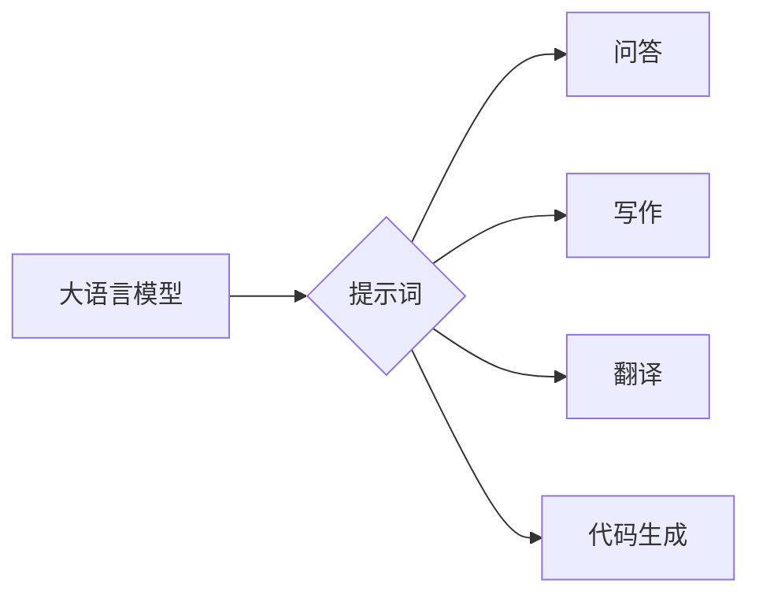

# 大语言模型原理与工程实践：什么是提示词

## 1. 背景介绍
### 1.1 大语言模型的崛起
近年来,随着深度学习技术的飞速发展,大语言模型(Large Language Model,LLM)在自然语言处理(NLP)领域取得了突破性的进展。从 GPT-3 到 ChatGPT,从 PaLM 到 LLaMA,大语言模型展现出了惊人的语言理解和生成能力,引发了学术界和产业界的广泛关注。

### 1.2 提示词的重要性
在大语言模型的实际应用中,提示词(Prompt)扮演着至关重要的角色。提示词是一种特殊的输入文本,用于引导和控制大语言模型生成所需的输出。通过精心设计的提示词,我们可以让大语言模型完成各种任务,如问答、写作、代码生成等。可以说,提示词是人类与大语言模型交互的桥梁和纽带。

### 1.3 本文的目的和结构
本文旨在深入探讨大语言模型中提示词的原理和工程实践。我们将从提示词的核心概念出发,分析其与大语言模型的内在联系,阐述提示词的设计原则和优化技巧,并通过实际案例演示如何利用提示词充分发挥大语言模型的潜力。全文分为以下几个部分:

1. 背景介绍
2. 核心概念与联系 
3. 核心算法原理具体操作步骤
4. 数学模型和公式详细讲解举例说明
5. 项目实践:代码实例和详细解释说明
6. 实际应用场景
7. 工具和资源推荐
8. 总结:未来发展趋势与挑战
9. 附录:常见问题与解答

## 2. 核心概念与联系
### 2.1 大语言模型的本质
大语言模型本质上是一种基于深度神经网络的语言模型。它通过在海量文本数据上进行预训练,学习到了丰富的语言知识和模式。这使得大语言模型具备了强大的语言理解和生成能力。从数学角度看,大语言模型可以被视为一个条件概率分布 $P(x|c)$,其中 $x$ 表示生成的文本,$c$ 表示给定的上下文或提示词。

### 2.2 提示词的定义与分类
提示词是一段输入给大语言模型的文本,用于指导模型生成所需的输出。根据形式和功能,提示词可以分为以下几类:

- 指令型提示词:明确告知模型要执行的任务,例如"请用中文写一首关于春天的诗"。
- 问答型提示词:以问题的形式引导模型生成答案,例如"茶文化起源于哪个朝代?"。
- 补全型提示词:给出不完整的句子或段落,让模型补全后续内容,例如"从前有座山,山里有座"。
- 示例型提示词:提供输入和输出的示例,让模型按照类似的模式生成内容。

### 2.3 提示词与大语言模型的关系
提示词与大语言模型之间存在着紧密的联系。从信息论的角度看,提示词相当于一个先验知识,它将大语言模型的生成空间从整个语言空间缩小到了特定的子空间。通过提示词,我们可以引导大语言模型生成符合特定要求和风格的内容,提高生成效果的可控性。下图展示了提示词如何影响大语言模型的生成过程:



## 3. 核心算法原理具体操作步骤
### 3.1 基于 Transformer 的大语言模型
目前主流的大语言模型大多基于 Transformer 架构。Transformer 通过自注意力机制和前馈神经网络,实现了并行化的序列建模。在预训练阶段,Transformer 编码器负责学习输入文本的表示,解码器负责根据编码器的输出生成目标文本。具体步骤如下:

1. 将输入文本切分为词元(Token)序列 $\mathbf{x}=(x_1,\cdots,x_n)$。
2. 对每个词元 $x_i$ 进行嵌入(Embedding),得到词嵌入向量 $\mathbf{e}_i$。
3. 将词嵌入向量序列 $\mathbf{e}=(\mathbf{e}_1,\cdots,\mathbf{e}_n)$ 输入到 Transformer 编码器。
4. 编码器通过多头自注意力机制和前馈网络,学习输入序列的上下文表示 $\mathbf{h}=(\mathbf{h}_1,\cdots,\mathbf{h}_n)$。
5. 将编码器的输出 $\mathbf{h}$ 和目标词元的嵌入向量输入到解码器。
6. 解码器通过自注意力、编码-解码注意力和前馈网络,生成目标词元的概率分布 $P(y_t|\mathbf{y}_{<t},\mathbf{x})$。
7. 根据生成的概率分布采样或选择最可能的词元,得到生成的文本序列 $\mathbf{y}=(y_1,\cdots,y_m)$。

### 3.2 提示词的嵌入表示
为了将提示词输入到大语言模型中,需要对其进行嵌入表示。常见的做法是将提示词视为一个特殊的输入序列,与普通的文本序列一起输入到编码器中。设提示词为 $\mathbf{p}=(p_1,\cdots,p_l)$,则输入序列变为:

$$\mathbf{x}^{'}=(\mathbf{p},\mathbf{x})=(p_1,\cdots,p_l,x_1,\cdots,x_n)$$

通过这种方式,提示词与输入文本共享同一个嵌入空间,使得编码器能够充分利用提示词中的信息。

### 3.3 基于提示词的微调
除了在预训练阶段引入提示词外,我们还可以在下游任务中对大语言模型进行基于提示词的微调(Prompt-based Fine-tuning)。具体步骤如下:

1. 根据任务需求,设计合适的提示词模板,例如"问题:xxx 答案:"。
2. 将下游任务的输入文本填充到提示词模板中,构造出完整的输入序列。
3. 将输入序列输入到预训练好的大语言模型中,得到输出序列。
4. 使用任务特定的损失函数(如交叉熵)计算模型的预测结果与真实标签之间的差异。
5. 通过反向传播算法更新模型参数,使其更好地适应当前任务。

通过基于提示词的微调,我们可以在保留大语言模型已学知识的同时,使其适应特定领域或任务的需求。

## 4. 数学模型和公式详细讲解举例说明
### 4.1 Transformer 的数学表示
Transformer 的核心是自注意力机制和前馈神经网络。对于输入序列 $\mathbf{x}=(x_1,\cdots,x_n)$,Transformer 的数学表示如下:

1. 输入嵌入:将词元 $x_i$ 映射为 $d$ 维嵌入向量 $\mathbf{e}_i\in\mathbb{R}^d$。

2. 位置编码:为了引入序列的位置信息,给每个词元的嵌入向量添加位置编码 $\mathbf{p}_i\in\mathbb{R}^d$,得到位置编码后的嵌入向量 $\mathbf{z}_i=\mathbf{e}_i+\mathbf{p}_i$。

3. 自注意力:通过查询(Query)、键(Key)、值(Value)的计算,得到注意力权重 $\alpha_{ij}$,表示位置 $i$ 对位置 $j$ 的注意力程度。

$$\alpha_{ij}=\frac{\exp(\mathbf{q}_i^T\mathbf{k}_j)}{\sum_{j=1}^n\exp(\mathbf{q}_i^T\mathbf{k}_j)}$$

其中,$\mathbf{q}_i=\mathbf{W}_q\mathbf{z}_i$,$\mathbf{k}_j=\mathbf{W}_k\mathbf{z}_j$,$\mathbf{W}_q,\mathbf{W}_k\in\mathbb{R}^{d\times d_k}$ 是可学习的参数矩阵。

4. 值聚合:根据注意力权重 $\alpha_{ij}$ 对值向量 $\mathbf{v}_j=\mathbf{W}_v\mathbf{z}_j$ 进行加权求和,得到位置 $i$ 的上下文表示 $\mathbf{c}_i$。

$$\mathbf{c}_i=\sum_{j=1}^n\alpha_{ij}\mathbf{v}_j$$

5. 多头注意力:将步骤 3 和 4 重复 $h$ 次,得到 $h$ 个上下文表示,再将它们拼接起来并经过线性变换,得到多头注意力的输出 $\mathbf{u}_i$。

$$\mathbf{u}_i=\mathbf{W}_o[\mathbf{c}_i^1;\cdots;\mathbf{c}_i^h]$$

其中,$\mathbf{W}_o\in\mathbb{R}^{hd_v\times d}$ 是可学习的参数矩阵。

6. 前馈网络:对多头注意力的输出 $\mathbf{u}_i$ 应用两层前馈神经网络,得到位置 $i$ 的最终表示 $\mathbf{h}_i$。

$$\mathbf{h}_i=\text{FFN}(\mathbf{u}_i)=\text{ReLU}(\mathbf{u}_i\mathbf{W}_1+\mathbf{b}_1)\mathbf{W}_2+\mathbf{b}_2$$

其中,$\mathbf{W}_1\in\mathbb{R}^{d\times d_{ff}}$,$\mathbf{W}_2\in\mathbb{R}^{d_{ff}\times d}$,$\mathbf{b}_1\in\mathbb{R}^{d_{ff}}$,$\mathbf{b}_2\in\mathbb{R}^d$ 是可学习的参数。

通过这一系列的计算,Transformer 编码器可以学习到输入序列的上下文表示 $\mathbf{h}=(\mathbf{h}_1,\cdots,\mathbf{h}_n)$。解码器的计算过程与编码器类似,只是在自注意力时引入了掩码以避免看到未来的信息。

### 4.2 提示词嵌入的数学表示
将提示词 $\mathbf{p}=(p_1,\cdots,p_l)$ 嵌入到大语言模型中,可以将其视为一个特殊的输入序列。设提示词的嵌入向量为 $\mathbf{e}_p=(\mathbf{e}_{p_1},\cdots,\mathbf{e}_{p_l})$,则输入序列的嵌入向量为:

$$\mathbf{e}^{'}=(\mathbf{e}_p,\mathbf{e})=(\mathbf{e}_{p_1},\cdots,\mathbf{e}_{p_l},\mathbf{e}_1,\cdots,\mathbf{e}_n)$$

将 $\mathbf{e}^{'}$ 输入到 Transformer 编码器,即可得到融合了提示词信息的上下文表示。

### 4.3 提示词微调的损失函数
在基于提示词的微调中,我们通常使用交叉熵损失函数来衡量模型预测结果与真实标签之间的差异。设模型在位置 $t$ 的预测概率分布为 $P(y_t|\mathbf{y}_{<t},\mathbf{x})$,真实标签为 $y_t^*$,则交叉熵损失为:

$$\mathcal{L}=-\sum_{t=1}^m\log P(y_t^*|\mathbf{y}_{<t},\mathbf{x})$$

通过最小化损失函数,模型可以学习到更好的参数,使其生成的文本更加符合任务要求。

## 5. 项目实践:代码实例和详细解释说明
下面我们通过一个简单的示例来演示如何使用提示词与大语言模型进行交互。我们将使用 OpenAI 的 GPT-3 模型和 Python 编程语言。

```python
import openai

# 设置 OpenAI API 密钥
openai.api_key = "your_api_key"

# 定义提示词
prompt = "请用中文写一首关于春天的诗:"

# 调用 GPT-{"msg_type":"generate_answer_finish","data":"","from_module":null,"from_unit":null}