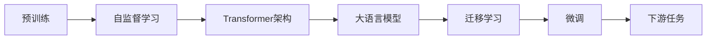

# 大语言模型原理与工程实践：全参数微调

## 1. 背景介绍
### 1.1 大语言模型概述
#### 1.1.1 大语言模型的定义
大语言模型(Large Language Model, LLM)是一种基于海量文本数据训练的深度神经网络模型,旨在学习语言的统计规律和语义表示,从而能够生成连贯、通顺的文本。它通过学习单词、短语和句子之间的关系,来理解和生成自然语言。

#### 1.1.2 大语言模型的发展历程
大语言模型的发展可以追溯到2018年,GPT(Generative Pre-trained Transformer)模型的提出标志着大语言模型时代的开启。此后,GPT-2、GPT-3、BERT、RoBERTa等一系列大语言模型相继问世,在多个自然语言处理任务上取得了突破性进展。近年来,大语言模型的参数量持续增长,训练数据规模不断扩大,模型性能也在不断提升。

#### 1.1.3 大语言模型的应用价值 
大语言模型具有广泛的应用前景,它可以应用于问答系统、对话生成、文本摘要、机器翻译、情感分析等多个自然语言处理领域。同时,大语言模型强大的语言理解和生成能力,也为人机交互、知识图谱构建等人工智能应用提供了新的思路和方法。

### 1.2 全参数微调简介
#### 1.2.1 全参数微调的定义
全参数微调(Full Parameter Fine-tuning)是指在下游任务上,对预训练语言模型的所有参数进行微调,使其适应特定任务的需求。与传统的特征抽取方法不同,全参数微调可以更好地利用预训练模型学到的语言知识,实现更好的任务性能。

#### 1.2.2 全参数微调的优势
全参数微调相比于特征抽取和部分参数微调,具有以下优势:

1. 更充分地利用预训练模型的知识,实现更好的迁移学习效果。
2. 可以针对特定任务进行更细粒度的调整,获得更高的性能表现。  
3. 适用于各种下游任务,具有更好的通用性和灵活性。

#### 1.2.3 全参数微调的挑战
尽管全参数微调具有诸多优势,但它也面临一些挑战:

1. 计算和存储开销大,对硬件资源要求高。
2. 容易出现过拟合问题,需要合理设置超参数和正则化策略。
3. 需要较多的标注数据,对数据质量要求较高。

## 2. 核心概念与联系
### 2.1 预训练(Pre-training)
预训练是指在大规模无标注语料上,通过自监督学习的方式训练语言模型。常见的预训练任务包括语言模型、去噪自编码器等。预训练阶段旨在让模型学习语言的基本规律和语义表示,为下游任务提供良好的初始化参数。

### 2.2 微调(Fine-tuning) 
微调是指在预训练模型的基础上,针对特定的下游任务进行训练,使模型适应任务的需求。微调阶段通常使用较小的学习率,并引入任务相关的损失函数,以实现模型在目标任务上的优化。

### 2.3 迁移学习(Transfer Learning)
迁移学习是指将在源任务上学习到的知识迁移到目标任务中,以提高目标任务的性能。在大语言模型中,预训练阶段学习到的语言知识可以迁移到各种下游任务中,实现知识的复用和泛化。

### 2.4 自监督学习(Self-supervised Learning)  
自监督学习是一种无需人工标注的学习范式,它通过设计合适的预训练任务,让模型从大规模无标注数据中自主学习有用的特征表示。常见的自监督学习任务包括自回归语言模型、去噪自编码器、对比学习等。

### 2.5 Transformer架构
Transformer是一种基于自注意力机制的神经网络架构,它通过引入多头注意力和位置编码,实现了对长距离依赖的建模。Transformer架构在大语言模型中得到了广泛应用,如BERT、GPT等模型都基于Transformer构建。

### 2.6 概念之间的联系
下图展示了上述核心概念之间的联系:

预训练阶段通过自监督学习,利用Transformer架构构建大语言模型。在迁移学习阶段,预训练模型的知识被迁移到下游任务中。通过微调,模型适应特定任务的需求,实现了端到端的学习过程。

## 3. 核心算法原理具体操作步骤
### 3.1 预训练阶段
#### 3.1.1 数据准备
1. 收集大规模无标注文本语料,如维基百科、新闻文章、书籍等。
2. 对文本进行清洗和预处理,如去除HTML标签、特殊字符,转换为小写等。
3. 使用字节对编码(Byte Pair Encoding, BPE)或WordPiece等方法对文本进行分词。
4. 将分词后的文本转换为模型可接受的输入格式,如token id序列。

#### 3.1.2 模型构建
1. 根据Transformer架构,构建多层编码器和解码器。
2. 在编码器中引入多头注意力机制和前馈神经网络。
3. 在解码器中引入掩码多头注意力、编码-解码注意力和前馈神经网络。  
4. 添加位置编码,以引入序列的位置信息。

#### 3.1.3 损失函数设计
1. 对于自回归语言模型,使用交叉熵损失函数,最小化模型预测概率分布与真实概率分布之间的差异。
2. 对于去噪自编码器,使用重构损失函数,最小化模型重构输出与原始输入之间的差异。
3. 对于对比学习,使用对比损失函数,最大化正样本对的相似度,最小化负样本对的相似度。

#### 3.1.4 模型训练
1. 使用大规模无标注语料,按照设定的批次大小和训练轮数进行训练。
2. 采用Adam、AdamW等优化算法,调整学习率和权重衰减等超参数。
3. 使用梯度裁剪、dropout等正则化技术,防止模型过拟合。
4. 定期评估模型在验证集上的性能,根据需要调整超参数或进行早停。

### 3.2 微调阶段 
#### 3.2.1 任务定义
1. 明确下游任务的类型,如文本分类、命名实体识别、问答等。
2. 确定任务的输入和输出格式,如输入文本、标签集合等。

#### 3.2.2 数据准备
1. 收集与任务相关的标注数据,如文本分类数据集、问答数据集等。
2. 对数据进行清洗和预处理,与预训练阶段的处理方式保持一致。
3. 将数据划分为训练集、验证集和测试集。

#### 3.2.3 模型调整
1. 在预训练模型的基础上,根据任务需求调整模型结构。
2. 对于分类任务,在编码器输出上添加分类器,如线性层+softmax。
3. 对于序列标注任务,在编码器输出上添加条件随机场(CRF)层。
4. 对于生成任务,在解码器输出上添加生成器,如线性层+softmax。

#### 3.2.4 损失函数设计
1. 根据任务类型,选择合适的损失函数。
2. 对于分类任务,使用交叉熵损失函数。
3. 对于序列标注任务,使用CRF损失函数。
4. 对于生成任务,使用交叉熵损失函数或强化学习目标函数。

#### 3.2.5 模型训练
1. 使用任务相关的标注数据,按照设定的批次大小和训练轮数进行训练。
2. 采用较小的学习率,如0.00001~0.0001,以避免破坏预训练权重。
3. 使用梯度裁剪、dropout等正则化技术,防止模型过拟合。
4. 定期评估模型在验证集上的性能,根据需要调整超参数或进行早停。

#### 3.2.6 模型评估
1. 在测试集上评估模型的性能,使用任务相关的评价指标,如准确率、F1值等。
2. 分析模型的错误样本,总结模型的优缺点和改进方向。
3. 与其他模型进行对比,评估模型的优劣。

## 4. 数学模型和公式详细讲解举例说明
### 4.1 Transformer编码器
Transformer编码器由多个编码器层组成,每个编码器层包含两个子层:多头自注意力层和前馈神经网络层。

#### 4.1.1 多头自注意力
多头自注意力允许模型在不同的表示子空间中计算注意力,捕捉不同角度的信息。给定输入序列$X\in\mathbb{R}^{n\times d}$,多头自注意力的计算过程如下:

1. 计算查询矩阵$Q$、键矩阵$K$和值矩阵$V$:
$$
Q=XW^Q,K=XW^K,V=XW^V
$$
其中$W^Q,W^K,W^V\in\mathbb{R}^{d\times d_k}$为可学习的参数矩阵。

2. 将$Q$、$K$、$V$划分为$h$个头,每个头的维度为$d_k/h$:
$$
Q_i=Q[:,i*d_k/h:(i+1)*d_k/h]\\
K_i=K[:,i*d_k/h:(i+1)*d_k/h]\\  
V_i=V[:,i*d_k/h:(i+1)*d_k/h]
$$

3. 对每个头计算注意力得分和注意力权重:
$$
A_i=\text{softmax}(\frac{Q_iK_i^T}{\sqrt{d_k/h}})
$$

4. 计算每个头的注意力输出,并拼接:
$$
\text{head}_i=A_iV_i\\
\text{MultiHead}(Q,K,V)=\text{Concat}(\text{head}_1,\dots,\text{head}_h)W^O
$$
其中$W^O\in\mathbb{R}^{d_k\times d}$为可学习的参数矩阵。

#### 4.1.2 前馈神经网络
前馈神经网络对多头自注意力的输出进行非线性变换,增强模型的表达能力。给定输入$X\in\mathbb{R}^{n\times d}$,前馈神经网络的计算过程如下:
$$
\text{FFN}(X)=\text{ReLU}(XW_1+b_1)W_2+b_2
$$
其中$W_1\in\mathbb{R}^{d\times d_{ff}},b_1\in\mathbb{R}^{d_{ff}},W_2\in\mathbb{R}^{d_{ff}\times d},b_2\in\mathbb{R}^d$为可学习的参数。

### 4.2 Transformer解码器
Transformer解码器由多个解码器层组成,每个解码器层包含三个子层:掩码多头自注意力层、编码-解码注意力层和前馈神经网络层。

#### 4.2.1 掩码多头自注意力
掩码多头自注意力在解码器的自注意力计算中引入掩码矩阵,防止模型利用未来的信息。给定输入序列$X\in\mathbb{R}^{m\times d}$和掩码矩阵$M\in\mathbb{R}^{m\times m}$,掩码多头自注意力的计算过程如下:

1. 计算查询矩阵$Q$、键矩阵$K$和值矩阵$V$,与编码器中的计算方式相同。

2. 将$Q$、$K$、$V$划分为$h$个头,每个头的维度为$d_k/h$。

3. 对每个头计算掩码注意力得分和注意力权重:
$$
A_i=\text{softmax}(\frac{Q_iK_i^T+M}{\sqrt{d_k/h}})
$$

4. 计算每个头的注意力输出,并拼接,与编码器中的计算方式相同。

#### 4.2.2 编