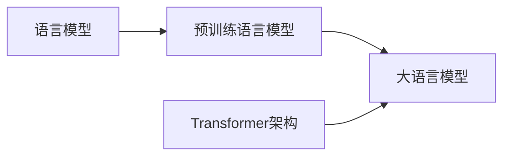

# 大语言模型原理与工程实践：大语言模型训练优化秘籍

## 1. 背景介绍
### 1.1 大语言模型的兴起
近年来,随着深度学习技术的飞速发展,自然语言处理(NLP)领域也取得了巨大的进步。其中,大语言模型(Large Language Model,LLM)的出现,更是掀起了NLP领域的一场革命。大语言模型以其强大的语言理解和生成能力,在机器翻译、对话系统、文本摘要等诸多任务上取得了显著的性能提升,受到了学术界和工业界的广泛关注。

### 1.2 大语言模型面临的挑战
然而,训练一个高质量的大语言模型并非易事。首先,大语言模型通常需要在海量的文本数据上进行训练,这对计算资源提出了极高的要求。其次,大语言模型的参数量往往高达数十亿甚至上百亿,优化如此庞大的模型需要精心设计的训练策略和优化算法。此外,如何在特定领域进一步提升大语言模型的性能,如何降低模型的推理延迟和内存占用,也是工程实践中面临的重要挑战。

### 1.3 本文的主要内容
本文将全面探讨大语言模型的原理和工程实践,重点介绍大语言模型训练和优化的各项关键技术。我们将从大语言模型的核心概念出发,详细阐述其内在原理和数学基础。在此基础上,我们将系统梳理大语言模型训练的流程和算法,并给出详尽的代码实例和解释说明。同时,本文也将介绍大语言模型在实际应用场景中的优化实践,总结当前的研究进展和未来的发展方向。通过本文的学习,读者将全面掌握大语言模型的原理和实践,并能够应用这些技术解决实际问题,推动NLP技术的进一步发展。

## 2. 核心概念与联系
### 2.1 语言模型
语言模型是NLP的一个核心概念,其目标是学习自然语言的概率分布。给定一个句子 $S=(w_1,w_2,...,w_n)$,语言模型的任务是估计该句子的概率 $P(S)$。传统的语言模型主要基于n-gram等统计方法,而现代的语言模型则广泛采用神经网络,特别是循环神经网络(RNN)和Transformer等架构。

### 2.2 预训练语言模型
预训练语言模型(Pre-trained Language Model)是近年来NLP领域的一个重要突破。与传统的语言模型不同,预训练语言模型首先在大规模无标注语料上进行自监督预训练,学习通用的语言表示;然后再针对具体任务进行微调(fine-tuning),快速适应下游应用。代表性的预训练语言模型包括BERT、GPT、XLNet等。预训练语言模型的优势在于其强大的迁移学习能力和语言理解能力。

### 2.3 大语言模型
大语言模型是预训练语言模型的进一步发展。相比普通的预训练语言模型,大语言模型的参数量更大(通常在数十亿到上千亿量级),训练语料更加海量(动辄数百GB到数TB),因此其语言建模能力也更加强大。当前主流的大语言模型包括GPT-3、PaLM、Chinchilla等。大语言模型在few-shot和zero-shot学习、多任务学习等方面表现出众。

### 2.4 Transformer 架构
Transformer是大语言模型的核心架构。与传统的RNN不同,Transformer完全基于注意力机制(attention mechanism),通过自注意力(self-attention)机制建模序列内部的长距离依赖关系。Transformer的编码器和解码器都由若干个相同的层(layer)组成,每一层包含自注意力子层和前馈神经网络子层。Transformer 在并行计算、长程建模等方面优于 RNN,成为大语言模型的首选架构。

### 2.5 核心概念之间的联系
下图展示了几个核心概念之间的联系:

可以看到,大语言模型是预训练语言模型的进一步发展,而预训练语言模型又是语言模型的一种特殊形式。Transformer架构是实现大语言模型的关键,其强大的建模能力是大语言模型性能卓越的重要原因。理解这些概念之间的联系,有助于我们系统地掌握大语言模型的原理和实践。

## 3. 核心算法原理具体操作步骤
### 3.1 预训练阶段
大语言模型的训练分为两个阶段:无监督预训练阶段和特定任务微调阶段。预训练阶段的目标是让模型学习通用的语言知识和表示。以BERT为例,其预训练任务包括:

1. Masked Language Modeling(MLM):随机遮挡句子中的部分token,让模型根据上下文预测被遮挡的token。
2. Next Sentence Prediction(NSP):给定两个句子,让模型判断它们是否前后相邻。

MLM任务可以帮助模型学习词汇语义和上下文信息,NSP任务可以帮助模型学习句子级别的连贯性。在海量语料上训练足够长的时间后,模型就可以学到丰富的语言知识。

### 3.2 微调阶段
预训练完成后,我们需要将模型适配到具体任务。这个过程称为微调(fine-tuning),具体步骤如下:

1. 根据任务的输入输出格式,在预训练模型的基础上添加任务特定的输入层和输出层。
2. 使用任务的有标注数据对整个模型进行端到端的微调训练。微调时一般使用较小的学习率。
3. 微调完成后,模型就可以用于任务的推理预测。

微调的优势在于只需少量的任务数据和训练时间,就可以让模型快速适应新任务,达到较好的性能。

### 3.3 训练优化技巧
为了进一步提升大语言模型的性能和效率,我们可以采用以下优化技巧:

1. 学习率调度:使用Warmup、Decay等策略动态调整学习率,加速收敛并避免过拟合。
2. 梯度裁剪:限制梯度的最大范数,防止梯度爆炸。
3. 权重衰减:在损失函数中添加L2正则化项,控制模型复杂度。
4. 优化器选择:使用Adam、AdamW等自适应优化器,自动调整每个参数的学习率。
5. 混合精度训练:在前向和反向传播中使用FP16,减少内存占用并加速训练。
6. 梯度累积:在多个小批量上累积梯度,然后再进行参数更新,相当于使用更大的批量。
7. 参数高效微调:只微调模型的一部分参数(如最后几层),减少训练开销。

综合运用这些优化技巧,可以显著提升大语言模型的训练效率和性能表现。

## 4. 数学模型和公式详细讲解举例说明
本节我们将详细讲解大语言模型中的关键数学模型和公式,并给出具体的举例说明。

### 4.1 语言模型的概率公式
如前所述,语言模型的目标是估计一个句子 $S=(w_1,w_2,...,w_n)$ 的概率 $P(S)$。根据概率论的链式法则,我们有:

$$P(S)=P(w_1,w_2,...,w_n)=\prod_{i=1}^n P(w_i|w_1,...,w_{i-1})$$

其中 $P(w_i|w_1,...,w_{i-1})$ 表示在给定前 $i-1$ 个词的条件下,第 $i$ 个词为 $w_i$ 的条件概率。语言模型的任务就是学习如何计算这个条件概率。

举例来说,假设我们有一个句子"我爱自然语言处理"。语言模型需要估计以下概率:

$$\begin{aligned}
P(我爱自然语言处理) &= P(我) \cdot P(爱|我) \cdot P(自然|我,爱) \\
&\cdot P(语言|我,爱,自然) \cdot P(处理|我,爱,自然,语言)
\end{aligned}$$

可以看到,语言模型是一个自左向右的生成过程,每一步都依赖于之前生成的词。

### 4.2 Transformer 的注意力机制
Transformer的核心是注意力机制,特别是自注意力机制。对于一个长度为 $n$ 的输入序列 $X=(x_1,x_2,...,x_n)$,自注意力的计算过程如下:

1. 将每个输入向量 $x_i$ 通过三个线性变换得到查询向量 $q_i$、键向量 $k_i$ 和值向量 $v_i$:

$$q_i=W_q x_i, \quad k_i=W_k x_i, \quad v_i=W_v x_i$$

其中 $W_q$、$W_k$、$W_v$ 是可学习的参数矩阵。

2. 计算查询向量和所有键向量的注意力分数:

$$\alpha_{ij}=\frac{\exp(q_i k_j^T / \sqrt{d})}{\sum_{l=1}^n \exp(q_i k_l^T / \sqrt{d})}$$

其中 $d$ 是查询/键向量的维度,$\alpha_{ij}$ 表示查询 $q_i$ 对键 $k_j$ 的注意力分数。

3. 将注意力分数作为权重,对所有值向量进行加权求和,得到输出向量 $z_i$:

$$z_i=\sum_{j=1}^n \alpha_{ij} v_j$$

直观地说,自注意力机制允许序列中的每个位置都能与其他位置进行信息交互和聚合,从而能够捕捉到长距离的依赖关系。

举例来说,考虑输入序列"我爱自然语言处理"。对于"语言"这个词,自注意力机制可以让其重点关注与之语义相关的"自然"和"处理",而不是更远的"我"和"爱"。这种选择性的信息聚合能力是Transformer得以建模长程依赖的关键。

### 4.3 预训练的目标函数
以BERT为例,其预训练目标函数由两部分组成:MLM损失和NSP损失。

MLM损失对应于Masked Language Modeling任务。假设句子 $S$ 中被遮挡的词的集合为 $M$,则MLM损失为:

$$\mathcal{L}_{MLM}(S)=-\sum_{w_i \in M} \log P(w_i|S_{\backslash M})$$

其中 $S_{\backslash M}$ 表示去掉被遮挡词的句子,$P(w_i|S_{\backslash M})$ 表示根据上下文预测被遮挡词 $w_i$ 的概率。

NSP损失对应于Next Sentence Prediction任务。给定两个句子 $S_1$ 和 $S_2$,以及它们是否相邻的标签 $y \in \{0,1\}$,NSP损失为:

$$\mathcal{L}_{NSP}(S_1,S_2,y)=-y \log P(y=1|S_1,S_2) - (1-y) \log P(y=0|S_1,S_2)$$

最终,BERT的预训练目标是最小化MLM损失和NSP损失的加权和:

$$\mathcal{L}=\mathcal{L}_{MLM} + \lambda \mathcal{L}_{NSP}$$

其中 $\lambda$ 是平衡两个损失的超参数。

举例来说,假设我们有以下两个句子:

- $S_1$:"我爱自然语言处理"
- $S_2$:"它是人工智能的一个重要分支"

如果我们将 $S_1$ 中的"语言"遮挡,让BERT去预测,并且判断 $S_2$ 是 $S_1$ 的下一句,那么BERT的预训练损失就是:

$$\mathcal{L}=-\log P(语言|我,爱,自然,处理) - \log P(y=1|S_1,S_2)$$

通过最小化这个损失,BERT可以学习到填补遮挡词以及判断句子相邻性的能力,从而掌握语言的语法语义知识。

## 5. 项目实践：代码实例和详细解释说明
本节我们将通过一个完整的代码实例,演示如何使