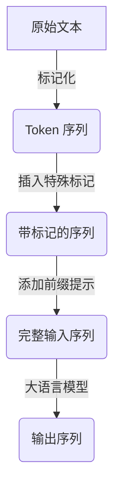

# 大语言模型原理与工程实践：有监督微调数据的格式

## 1.背景介绍

### 1.1 大语言模型的兴起

近年来,大型语言模型(Large Language Models, LLMs)在自然语言处理(NLP)领域取得了令人瞩目的成就。这些模型通过在海量文本数据上进行预训练,学习了丰富的语言知识和上下文信息,展现出惊人的泛化能力,可以应用于广泛的自然语言任务,如文本生成、机器翻译、问答系统等。

代表性的大语言模型包括 GPT (Generative Pre-trained Transformer)、BERT (Bidirectional Encoder Representations from Transformers)、XLNet、RoBERTa、ALBERT 等。其中,GPT 系列模型采用自回归(Autoregressive)语言模型架构,擅长生成式任务;而 BERT 系列模型采用编码器(Encoder)架构,擅长理解式任务。

### 1.2 有监督微调的重要性

尽管大语言模型在预训练阶段已经学习了丰富的语言知识,但它们的泛化能力仍然有限。为了在特定的下游任务上获得更好的性能,需要进行有监督微调(Supervised Fine-tuning)。有监督微调的过程是在预训练模型的基础上,利用与目标任务相关的标注数据,对模型进行进一步的训练和调整。

有监督微调对于提高大语言模型在特定任务上的性能至关重要。通过微调,模型可以学习到目标任务的特定模式和规律,从而更好地适应该任务。同时,有监督微调也可以缓解大语言模型在某些方面的不足,如事实一致性、逻辑缺陷等。

### 1.3 有监督微调数据格式的重要性

有监督微调的效果在很大程度上取决于微调数据的质量和格式。合理的数据格式不仅可以提高模型的学习效率,还可以减少数据噪声,从而提升模型的性能。因此,了解和掌握有监督微调数据的格式对于成功地应用大语言模型至关重要。

本文将深入探讨有监督微调数据的格式,包括不同任务类型的数据格式要求、数据预处理技术,以及一些最佳实践和工具推荐。我们的目标是为读者提供一个全面的指南,帮助他们更好地利用大语言模型的强大能力。

## 2.核心概念与联系

在探讨有监督微调数据格式之前,我们需要先了解一些核心概念及其相互关系。

### 2.1 序列到序列建模

大多数自然语言处理任务可以归纳为序列到序列(Sequence-to-Sequence, Seq2Seq)建模问题。输入是一个token序列,输出也是一个token序列。例如:

- 机器翻译: 输入为源语言句子,输出为目标语言句子
- 文本摘要: 输入为原始文本,输出为摘要文本
- 问答系统: 输入为问题,输出为答案

将任务建模为序列到序列问题,可以利用大语言模型强大的序列建模能力。

### 2.2 标记化(Tokenization)

标记化是将原始文本转换为模型可以理解的token序列的过程。常用的标记化方法包括字符级(Character-level)、子词级(Subword-level,如BPE、WordPiece)和词级(Word-level)标记化。

不同的标记化方式会影响模型的词汇表大小、未见词(OOV)比例等,进而影响模型性能。因此,选择合适的标记化方式对于构建高质量的微调数据集至关重要。

### 2.3 特殊标记(Special Tokens)

为了指示输入和输出的边界,或者表示一些特殊的语义信息,我们通常需要在序列中插入特殊标记。常见的特殊标记包括:

- `<bos>` / `<eos>`: 分别表示序列的开始和结束
- `<sep>`: 用于分隔输入和输出序列
- `<cls>`: 表示输入序列的类别(用于分类任务)
- `<mask>`: 用于掩码语言模型(Masked Language Model)任务

不同的任务类型和模型架构对特殊标记的使用有所不同,正确使用特殊标记对于构建高质量的微调数据集至关重要。

### 2.4 前缀提示(Prompt)

前缀提示是一种为大语言模型提供额外上下文信息的技术,可以显著提高模型在特定任务上的性能。通过在输入序列前添加一个特定的提示(Prompt),可以引导模型更好地理解任务的语义,产生更准确的输出。

前缀提示的设计需要结合任务的特点和模型的架构,是构建高质量微调数据集的重要一环。

### 2.5 Mermaid 流程图



上图使用 Mermaid 流程图展示了从原始文本到模型输出的数据处理流程,体现了标记化、特殊标记和前缀提示在构建微调数据集中的作用。

## 3.核心算法原理具体操作步骤  

### 3.1 标记化算法

标记化算法的主要目标是将原始文本分割为一系列有意义的token。常见的标记化算法包括:

#### 3.1.1 字符级标记化

字符级标记化是最基本的标记化方法,它将每个字符视为一个单独的token。这种方法的优点是简单高效,但缺点是会导致词汇表过大,增加模型的计算复杂度。

#### 3.1.2 词级标记化

词级标记化将每个单词视为一个token,可以有效减小词汇表大小。但是,它无法很好地处理未见词(OOV)问题,对于生僻词或新词,模型的性能会受到影响。

#### 3.1.3 子词级标记化

子词级标记化算法(如 BPE 和 WordPiece)试图在字符级和词级标记化之间寻求平衡。它们通过构建一个有限的子词词汇表,将单词分解为多个子词token。这种方法可以有效缓解 OOV 问题,同时保持合理的词汇表大小。

BPE(Byte Pair Encoding)算法是一种流行的子词级标记化算法,它的核心思想是基于语料库中token对的共现频率,迭代地构建子词词汇表。具体步骤如下:

1. 初始化词汇表为字符集合
2. 在语料库中统计所有相邻字符对的频率
3. 选择频率最高的字符对,将它们合并为一个新的token,加入词汇表
4. 重复步骤2和3,直到达到预设的词汇表大小或其他停止条件

通过上述迭代过程,BPE算法可以学习到常见的词根、词缀和完整单词,从而平衡词汇表大小和 OOV 率。

#### 3.1.4 SentencePiece

SentencePiece 是另一种流行的子词标记化算法,它基于 BPE 算法,但做了一些改进和扩展。SentencePiece 不仅支持无监督的 BPE 模型训练,还支持有监督的单词分割模型和字符分割模型训练。

此外,SentencePiece 还提供了多种编码方式(如 unigram、bpe、char 等)供选择,并支持在线编码/解码,可以有效降低内存占用。由于其高效和灵活的特点,SentencePiece 被广泛应用于各种大语言模型的标记化过程中。

### 3.2 特殊标记插入算法

在完成标记化之后,我们需要根据任务类型和模型架构,在序列中插入适当的特殊标记。以 BERT 模型为例,对于序列分类任务,我们需要在序列开头插入 `[CLS]` 标记,用于表示整个序列的类别;对于序列到序列任务(如机器翻译),我们需要在输入和输出序列之间插入 `[SEP]` 标记,用于分隔它们。

特殊标记的插入位置和数量需要根据具体情况而定。一般来说,我们可以遵循以下原则:

1. 在序列开头插入 `[CLS]` 或 `[BOS]`(Begin of Sequence) 标记
2. 在输入序列末尾插入 `[SEP]` 标记
3. 如果是序列到序列任务,在输出序列开头插入 `[BOS]`,结尾插入 `[EOS]`(End of Sequence)
4. 如果需要掩码语言模型(Masked LM),在输入序列中随机替换一些token为 `[MASK]` 标记

以机器翻译任务为例,完整的输入序列可能如下所示:

```
[BOS] 源语言句子 [SEP] 目标语言句子 [EOS]
```

需要注意的是,不同的模型架构对特殊标记的使用可能有所不同,因此在插入特殊标记时,我们需要参考相应模型的文档说明。

### 3.3 前缀提示构建算法

前缀提示的构建是一个需要结合任务语义和模型架构的过程。一般来说,我们可以遵循以下步骤来构建高质量的前缀提示:

1. **分析任务语义**:首先需要深入理解任务的语义,包括输入、输出及其之间的映射关系。
2. **设计提示模板**:根据任务语义,设计一个通用的提示模板。模板中可以包含一些固定的上下文信息,以及一些占位符,用于插入具体的输入。
3. **填充占位符**:将具体的输入数据填充到提示模板的占位符中,得到最终的前缀提示。

以文本摘要任务为例,我们可以设计如下的提示模板:

```
总结: [X]

摘要:
```

其中 `[X]` 是一个占位符,用于插入待摘要的原始文本。在构建微调数据集时,我们将原始文本填充到该占位符,得到完整的前缀提示,如:

```
总结: 人工智能是当代最具影响力和发展前景的技术之一,它正在从根本上改变着我们的生活、工作和思维方式。人工智能系统正在不断扩展其应用领域,包括医疗保健、教育、交通、制造业等众多行业。然而,人工智能的发展也带来了一些潜在的风险和挑战,如算法偏差、隐私和安全问题等,需要我们高度重视并采取适当的监管措施。

摘要:
```

通过这种方式,我们可以为大语言模型提供丰富的上下文信息,引导它生成高质量的摘要。值得注意的是,前缀提示的设计需要结合具体任务和模型架构,没有一种万能的提示模板。在实践中,我们需要不断尝试和调整,以找到最佳的提示形式。

## 4.数学模型和公式详细讲解举例说明

在大语言模型的训练和微调过程中,数学模型和公式扮演着重要的角色。本节将详细介绍一些核心的数学模型和公式,并通过实例说明它们的应用。

### 4.1 自回归语言模型

自回归语言模型(Autoregressive Language Model)是大语言模型中一种常见的架构,它试图学习条件概率分布 $P(x_t | x_{<t})$,即给定前缀 $x_{<t}$,预测下一个token $x_t$ 的概率。

对于一个长度为 $T$ 的序列 $X = (x_1, x_2, \ldots, x_T)$,其概率可以通过链式法则分解为:

$$
P(X) = \prod_{t=1}^T P(x_t | x_{<t})
$$

自回归语言模型的目标是最大化上述联合概率。在训练过程中,我们最小化负对数似然损失:

$$
\mathcal{L}(\theta) = -\frac{1}{N} \sum_{i=1}^N \log P_\theta(X^{(i)})
$$

其中 $\theta$ 表示模型参数, $N$ 是训练样本数量。

以 GPT 模型为例,它采用 Transformer 解码器(Decoder)架构来建模 $P(x_t | x_{<t})$。在生成过