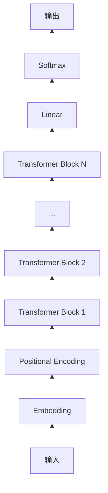

# 大语言模型原理与工程实践：案例分析

## 1. 背景介绍
### 1.1 大语言模型的兴起
近年来,随着深度学习技术的飞速发展,自然语言处理(NLP)领域取得了令人瞩目的进展。其中,大语言模型(Large Language Model,LLM)的出现,更是掀起了 NLP 领域的一场革命。大语言模型是一种基于海量文本数据训练的语言模型,通过学习文本数据中的语言规律和知识,可以生成连贯、通顺的文本,完成诸如对话、翻译、摘要、问答等多种 NLP 任务。

### 1.2 大语言模型的代表
目前,业界涌现出许多优秀的大语言模型,如 OpenAI 的 GPT 系列模型、Google 的 BERT、XLNet 等。这些模型在各种 NLP 任务上取得了 state-of-the-art 的性能,展现出了大语言模型的强大能力。尤其是 2020 年 OpenAI 发布的 GPT-3 模型,其参数量高达 1750 亿,在零样本学习(zero-shot learning)等方面表现出惊人的性能,引发了业界的广泛关注。

### 1.3 大语言模型面临的挑战
尽管大语言模型取得了瞩目的成绩,但在工程实践中仍面临诸多挑战:
1. 训练难度大,需要海量的计算资源和训练数据;
2. 模型体积庞大,部署困难;
3. 推理速度慢,难以满足实时响应的需求;
4. 可解释性差,难以分析模型的决策过程;
5. 存在偏见和安全隐患,容易产生有害或错误的内容。

因此,如何解决这些问题,实现大语言模型的工程落地,是目前 NLP 领域亟待攻克的难题。本文将围绕大语言模型的原理和工程实践展开讨论,深入剖析其内在机制,总结工程落地的经验教训,为大语言模型的研究和应用提供参考。

## 2. 核心概念与联系
### 2.1 语言模型
语言模型是 NLP 的核心概念之一,其目的是学习语言的统计规律,计算一个句子出现的概率。形式化地,语言模型要学习如下概率分布:
$$P(w_1, w_2, ..., w_n) = \prod_{i=1}^n P(w_i | w_1, ..., w_{i-1})$$
其中,$w_1, w_2, ..., w_n$为句子中的单词序列。传统的语言模型如 N-gram 模型,其缺陷在于难以刻画长距离依赖,且面临维度灾难问题。

### 2.2 神经网络语言模型
神经网络语言模型(Neural Network Language Model,NNLM)采用神经网络来建模语言,克服了传统语言模型的不足。如下图所示,NNLM 主要由三部分组成:
1. 词嵌入层(Embedding Layer),将离散的单词映射为连续的稠密向量。
2. 隐藏层(Hidden Layer),学习词嵌入之间的非线性组合。常见的神经网络有 RNN、CNN、Transformer 等。
3. Softmax 层,基于隐藏层的输出,计算下一个单词的概率分布。

NNLM 相比传统语言模型,具有更强的表达能力和泛化能力,能够学习到更准确的语言模型。

### 2.3 预训练语言模型
预训练语言模型(Pre-trained Language Model)是指先在大规模无标注语料上训练通用的语言模型,再在特定任务的标注数据上进行微调(fine-tuning)。这种"预训练+微调"的范式能够显著提升模型性能,降低对标注数据的依赖。常见的预训练方法有:
1. 自回归语言模型(Auto-Regressive LM),如 GPT 系列。
2. 自编码语言模型(Auto-Encoding LM),如 BERT。
3. 序列到序列语言模型(Seq2Seq LM),如 T5、BART。

预训练语言模型是大语言模型的基础,使其能够学习到更加通用、强大的语言表示。

### 2.4 Zero-shot/Few-shot Learning
Zero-shot Learning 和 Few-shot Learning 是大语言模型的重要能力,使其无需或很少微调,即可适应新的任务。
- Zero-shot Learning:无需任何标注数据,直接用自然语言指令描述任务,即可生成结果。如 GPT-3 模型。
- Few-shot Learning:用少量标注样本(如 10 个)对模型进行微调,即可在新任务上取得不错的性能。

大语言模型强大的 Zero-shot/Few-shot 能力,使其能够快速适应各种 NLP 任务,大大拓展了其应用范围。

## 3. 核心算法原理具体操作步骤
本节将以 GPT(Generative Pre-trained Transformer)模型为例,详细讲解大语言模型的核心算法原理和操作步骤。

### 3.1 模型结构
GPT 模型采用 Transformer 的 Decoder 结构,如下图所示:

模型主要包括:
1. 输入嵌入(Input Embedding):将输入单词转为稠密向量。
2. 位置编码(Positional Encoding):为每个位置的单词添加位置信息。
3. Transformer Block:多层堆叠的 Transformer Decoder Block,用于学习输入序列的上下文表示。
4. 线性层和 Softmax 层:基于 Transformer 的输出,预测下一个单词的概率分布。

### 3.2 预训练阶段
GPT 模型采用自回归语言模型进行预训练,具体步骤如下:
1. 数据准备:收集大规模无标注文本语料,进行清洗、分词等预处理。
2. 构建训练样本:将文本语料划分为固定长度(如 512)的序列,每个序列为一个训练样本。
3. 模型训练:将训练样本输入 GPT 模型,优化如下损失函数:
$$ L(\theta) = -\sum_{i=1}^n \log P(w_i|w_{<i};\theta) $$
其中,$\theta$为模型参数,$w_{<i}$为第$i$个单词之前的所有单词。通过最小化该损失函数,模型可以学习到单词之间的依赖关系和语言规律。
4. 模型评估:在验证集上评估模型的困惑度(Perplexity),选择性能最优的模型。

预训练得到的 GPT 模型可以作为下游任务的基础模型,具有很好的迁移性和泛化性。

### 3.3 微调阶段
在特定任务上微调 GPT 模型的步骤如下:
1. 任务定义:根据任务类型(如分类、生成等),设计输入/输出格式。
2. 数据准备:收集任务相关的标注数据,进行预处理。
3. 模型微调:以预训练的 GPT 模型为初始化,在标注数据上进行梯度下降,优化任务相关的损失函数。常见的微调技巧有学习率热身、层次学习率等。
4. 模型评估:在测试集上评估模型性能,选择最优模型进行部署。

微调阶段使 GPT 模型适应特定任务,显著提升了模型性能。同时,GPT 模型还具有 Zero-shot/Few-shot 能力,可以直接根据指令生成结果,或用很少的样本进行微调。

## 4. 数学模型和公式详细讲解举例说明
本节将详细讲解 GPT 模型中的关键数学模型和公式,并给出具体的例子说明。

### 4.1 Self-Attention
Self-Attention 是 Transformer 的核心组件,用于学习序列内元素之间的依赖关系。其数学公式为:

$$
\begin{aligned}
Q &= X W^Q \\
K &= X W^K \\
V &= X W^V \\
\text{Attention}(Q,K,V) &= \text{softmax}(\frac{QK^T}{\sqrt{d_k}})V
\end{aligned}
$$

其中,$X \in \mathbb{R}^{n \times d}$为输入序列,$W^Q, W^K, W^V \in \mathbb{R}^{d \times d_k}$为可学习的参数矩阵,$Q,K,V$分别为查询(Query)、键(Key)、值(Value)矩阵,$d_k$为缩放因子(通常取$\sqrt{d}$)。

具体来说,Self-Attention 的计算过程如下:
1. 将输入$X$通过三个线性变换得到$Q,K,V$矩阵。
2. 计算$Q$与$K$的点积并除以缩放因子,得到注意力分数(attention scores)矩阵。
3. 对注意力分数矩阵进行 softmax 归一化,得到注意力权重(attention weights)矩阵。
4. 将注意力权重矩阵与$V$相乘,得到加权求和的输出。

直观地理解,Self-Attention 可以学习序列内任意两个位置之间的关联度,捕捉长距离依赖。例如,在句子"The animal didn't cross the street because it was too tired"中,"it"指代的是"animal",Self-Attention 可以学习到这种指代关系。

### 4.2 Masked Self-Attention
在 GPT 模型的预训练阶段,采用了 Masked Self-Attention 机制,即在计算注意力时,只能看到当前位置之前的内容,而看不到之后的内容。这是为了避免在预训练阶段看到未来的信息。

具体来说,Masked Self-Attention 在计算注意力分数矩阵时,将当前位置之后的位置加上一个很大的负数(如-1e9),然后再进行 softmax 归一化:

$$
\text{Attention}(Q,K,V) = \text{softmax}(\frac{QK^T}{\sqrt{d_k}} + M)V
$$

其中,$M$为 Mask 矩阵,其元素$M_{ij}$定义为:

$$
  M_{ij} =
  \begin{cases}
    0 & \text{if } i \leq j \\
    -\infty & \text{if } i > j
  \end{cases}
$$

这样,在 softmax 归一化后,当前位置之后的注意力权重会变为 0,从而实现了 Masked Self-Attention。

例如,对于句子"The animal didn't cross the street"的第三个单词"cross",其 Mask 矩阵为:

$$
M = 
\begin{bmatrix}
0 & 0 & 0 & -\infty & -\infty & -\infty \\
0 & 0 & 0 & -\infty & -\infty & -\infty \\ 
0 & 0 & 0 & -\infty & -\infty & -\infty \\
0 & 0 & 0 & 0 & -\infty & -\infty \\
0 & 0 & 0 & 0 & 0 & -\infty \\
0 & 0 & 0 & 0 & 0 & 0
\end{bmatrix}
$$

### 4.3 位置编码
由于 Transformer 不包含 RNN 等顺序结构,需要显式地为输入序列添加位置信息,这就是位置编码(Positional Encoding)的作用。GPT 模型采用的是正弦位置编码,其数学公式为:

$$
\begin{aligned}
PE_{(pos,2i)} &= \sin(pos/10000^{2i/d}) \\
PE_{(pos,2i+1)} &= \cos(pos/10000^{2i/d})
\end{aligned}
$$

其中,$pos$为单词在序列中的位置下标,$i$为维度下标,$d$为词嵌入维度。

例如,对于$d=512$,前 5 个位置的位置编码为:

$$
PE = 
\begin{bmatrix}
0 & 0 & 0 & 0.841 & 0.540 & \dots \\
0 & 1 & 0 & 0.540 & -0.841 & \dots \\
0 & 0 & 1 & 0.909 & -0.416 & \dots \\
0 & 0 & 0 & -0.416 & -0.909 & \dots \\
0 & 0 & 0 & -0