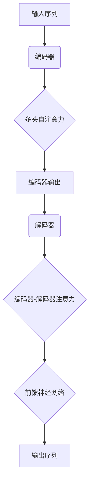

# 大语言模型原理与工程实践：百科数据

## 1. 背景介绍

### 1.1 人工智能的新时代

在过去的几年里,人工智能(AI)技术取得了长足的进步,尤其是在自然语言处理(NLP)领域。大型语言模型的出现,标志着人工智能进入了一个新的里程碑。这些模型能够从海量文本数据中学习,并生成看似人类写作的自然语言输出。

随着计算能力的不断提高和数据的快速积累,训练大规模语言模型成为可能。这些模型通过在大量文本数据上进行无监督预训练,学习到了丰富的语言知识和上下文理解能力,为下游的各种NLP任务提供了强大的基础模型。

### 1.2 百科数据在语言模型中的重要性

在训练大型语言模型时,高质量的训练数据至关重要。百科数据作为一种结构化的知识库,包含了广泛的领域知识,涵盖了科学、历史、地理、艺术等多个领域。将百科数据融入语言模型的训练过程中,可以帮助模型获取更多的知识,提高其对事实和常识的理解能力。

此外,百科数据中的条目通常由专业人士编写和审核,内容准确性较高。将这些高质量的数据纳入语言模型的训练集,有助于提高模型生成的输出的可靠性和准确性。

## 2. 核心概念与联系

### 2.1 语言模型概述

语言模型是自然语言处理领域的一个基础任务,旨在学习并预测给定上下文中下一个词或标记的概率分布。传统的语言模型通常基于n-gram或神经网络等方法,在有限的上下文窗口内建模。

大型语言模型则采用了transformer等注意力机制,能够在更长的上下文范围内捕捉语义依赖关系。这些模型通过自回归(自监督)方式在大规模文本语料库上进行预训练,学习到丰富的语言知识和上下文理解能力。

### 2.2 预训练与微调

大型语言模型通常采用两阶段训练策略:预训练(Pre-training)和微调(Fine-tuning)。

在预训练阶段,模型在大量无标注文本数据上进行自监督学习,获取通用的语言知识和上下文理解能力。常用的预训练目标包括掩码语言模型(Masked Language Modeling)和下一句预测(Next Sentence Prediction)等。

在微调阶段,预训练好的模型将被转移到特定的下游任务上,通过有监督的方式在任务数据上进行进一步训练,使模型适应特定任务的需求。这种预训练-微调的范式大大提高了模型的性能和训练效率。

### 2.3 百科数据的结构化知识

百科数据通常以结构化的形式存在,例如维基百科中的条目。每个条目包含标题、正文内容、分类标签等结构化信息。这种结构化的知识表示形式,有助于语言模型更好地理解和学习知识。

将百科数据融入语言模型的训练过程中,可以通过多种方式来实现,例如:

1. 将百科条目的正文作为训练语料的一部分,直接融入语料库中。
2. 将百科条目的标题、正文、分类标签等信息编码为特殊的标记序列,作为训练样本输入模型。
3. 构建知识图谱,将百科条目之间的关系显式地编码到模型中。

通过上述方式,语言模型可以更好地学习和掌握百科数据中蕴含的知识,提高其在各种下游任务中的性能表现。

## 3. 核心算法原理具体操作步骤

### 3.1 Transformer模型架构

Transformer是大型语言模型中广泛采用的核心架构,它完全基于注意力机制,摒弃了传统的循环神经网络和卷积神经网络结构。Transformer的主要组成部分包括编码器(Encoder)和解码器(Decoder)。

编码器的作用是将输入序列(如文本)映射到一系列连续的向量表示,解码器则根据编码器的输出生成目标序列(如翻译或生成的文本)。两者之间通过注意力机制建立联系,使解码器能够关注输入序列中的不同位置,捕捉长距离依赖关系。

Transformer的注意力机制可以分为多头自注意力(Multi-Head Self-Attention)和编码器-解码器注意力(Encoder-Decoder Attention)两种形式。前者用于捕捉输入序列内部的依赖关系,后者则建立输入序列和输出序列之间的映射关系。

上图展示了Transformer模型的基本架构和数据流程。输入序列首先经过编码器进行编码,编码器内部使用多头自注意力机制捕捉输入序列内部的依赖关系。编码器的输出then被送入解码器,解码器通过编码器-解码器注意力机制关注输入序列的不同部分,并生成最终的输出序列。

### 3.2 预训练目标

大型语言模型在预训练阶段通常采用自监督学习的方式,常见的预训练目标包括:

1. **掩码语言模型(Masked Language Modeling, MLM)**: 在输入序列中随机掩码部分词元,模型需要预测被掩码的词元。这种方式可以让模型学习到双向的语境信息。

2. **下一句预测(Next Sentence Prediction, NSP)**: 给定两个句子,模型需要预测它们是否为连续的句子。这有助于模型学习捕捉句子之间的关系和语境一致性。

3. **序列到序列(Sequence-to-Sequence)**: 将输入序列作为条件,生成相应的目标序列。常见的任务包括机器翻译、文本摘要等。

4. **因果语言模型(Causal Language Modeling)**: 基于前文上下文预测下一个词元,这种传统的语言模型任务可以作为预训练目标之一。

通过上述预训练目标,语言模型可以在大规模无标注数据上学习到通用的语言知识和上下文理解能力,为后续的下游任务奠定基础。

### 3.3 微调策略

在完成预训练后,大型语言模型需要针对特定的下游任务进行微调,以适应任务的需求。常见的微调策略包括:

1. **全模型微调(Full Model Fine-tuning)**: 在下游任务的训练数据上,对整个预训练模型(包括编码器和解码器)进行端到端的微调。这种策略可以充分利用预训练模型的知识,但计算代价较高。

2. **编码器微调(Encoder Fine-tuning)**: 只微调预训练模型的编码器部分,解码器部分保持不变或重新初始化。这种策略的计算代价较低,适用于生成型任务。

3. **预测头微调(Head Fine-tuning)**: 只微调预训练模型的输出层(预测头),保持其他部分参数不变。这种策略计算代价最低,但效果可能受到一定影响。

4. **PromPt 微调(Prompt Fine-tuning)**: 将下游任务的输入转化为一个填空式的提示(Prompt),利用预训练模型生成填空内容,从而完成任务。这种策略无需微调模型参数,但需要设计合适的提示模板。

不同的微调策略在计算代价、效果和灵活性之间存在权衡。实际应用中需要根据具体任务和资源情况选择合适的策略。

## 4. 数学模型和公式详细讲解举例说明

### 4.1 Transformer中的注意力机制

注意力机制是Transformer模型的核心,它允许模型动态地关注输入序列的不同部分,捕捉长距离依赖关系。在Transformer中,注意力机制可以分为两种形式:多头自注意力和编码器-解码器注意力。

#### 4.1.1 多头自注意力

多头自注意力机制用于捕捉输入序列内部的依赖关系。给定一个长度为 $n$ 的输入序列 $X = (x_1, x_2, \dots, x_n)$,其中每个 $x_i$ 是一个 $d$ 维向量,多头自注意力的计算过程如下:

1. 线性投影:将输入序列 $X$ 分别投影到查询(Query)、键(Key)和值(Value)空间,得到 $Q$、$K$ 和 $V$。

$$Q = XW^Q, K = XW^K, V = XW^V$$

其中 $W^Q \in \mathbb{R}^{d \times d_q}$、$W^K \in \mathbb{R}^{d \times d_k}$、$W^V \in \mathbb{R}^{d \times d_v}$ 是可学习的投影矩阵。

2. 计算注意力分数:通过查询 $Q$ 和键 $K$ 的点积,计算每个位置对其他位置的注意力分数。

$$\text{Attention}(Q, K, V) = \text{softmax}\left(\frac{QK^T}{\sqrt{d_k}}\right)V$$

其中 $\sqrt{d_k}$ 是一个缩放因子,用于防止内积过大导致梯度消失或爆炸。

3. 多头注意力:为了捕捉不同的子空间信息,多头注意力机制将注意力计算过程独立执行 $h$ 次(即 $h$ 个注意力头),然后将结果拼接。

$$\text{MultiHead}(Q, K, V) = \text{Concat}(head_1, \dots, head_h)W^O$$
$$\text{where } head_i = \text{Attention}(QW_i^Q, KW_i^K, VW_i^V)$$

其中 $W_i^Q \in \mathbb{R}^{d_q \times d_q}$、$W_i^K \in \mathbb{R}^{d_k \times d_k}$、$W_i^V \in \mathbb{R}^{d_v \times d_v}$ 和 $W^O \in \mathbb{R}^{hd_v \times d}$ 是可学习的线性变换矩阵。

通过多头自注意力机制,Transformer能够同时关注输入序列中的不同位置,捕捉全局依赖关系。

#### 4.1.2 编码器-解码器注意力

编码器-解码器注意力机制用于建立输入序列和输出序列之间的映射关系。给定编码器的输出 $H = (h_1, h_2, \dots, h_n)$ 和解码器的隐状态 $S$,编码器-解码器注意力的计算过程如下:

1. 线性投影:将解码器的隐状态 $S$ 投影到查询空间,编码器输出 $H$ 投影到键和值空间。

$$Q = SW^Q, K = HW^K, V = HW^V$$

其中 $W^Q \in \mathbb{R}^{d \times d_q}$、$W^K \in \mathbb{R}^{d \times d_k}$、$W^V \in \mathbb{R}^{d \times d_v}$ 是可学习的投影矩阵。

2. 计算注意力分数:通过查询 $Q$ 和键 $K$ 的点积,计算解码器对编码器输出的注意力分数。

$$\text{Attention}(Q, K, V) = \text{softmax}\left(\frac{QK^T}{\sqrt{d_k}}\right)V$$

3. 注意力输出:将注意力加权后的值向量与解码器的隐状态 $S$ 进行残差连接,得到更新后的解码器隐状态。

$$S' = S + \text{Attention}(Q, K, V)$$

通过编码器-解码器注意力机制,解码器可以动态地关注输入序列的不同部分,捕捉输入和输出之间的对应关系,从而生成更准确的输出序列。

### 4.2 掩码语言模型目标函数

掩码语言模型(Masked Language Modeling, MLM)是大型语言模型预训练中常用的一种目标函数。在MLM中,模型需要预测输入序列中被掩码(替换为特殊标记)的词元。

给定一个长度为 $n$ 的输入序列 $X = (x_1, x_2, \dots, x_n)$,其中某些位置的词元被掩码,记为 $\mathcal{M}$。模型