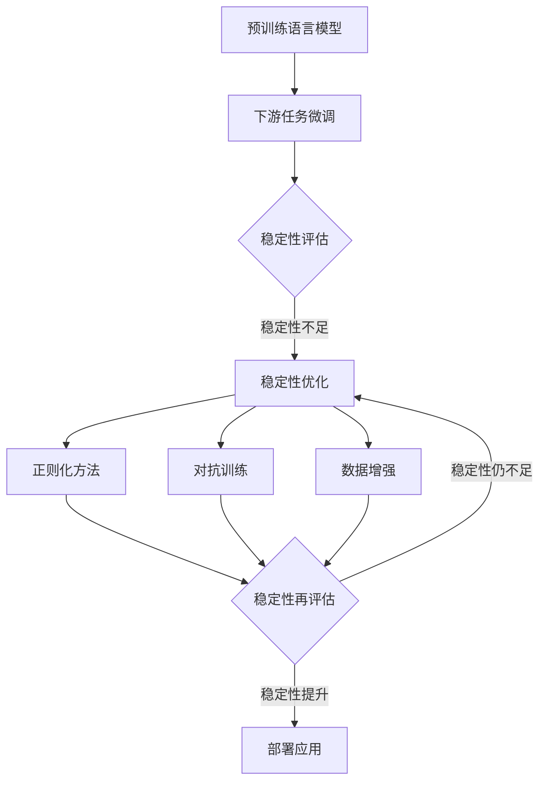

# 大语言模型原理与工程实践：稳定性优化

## 1. 背景介绍
### 1.1 大语言模型的发展历程
### 1.2 大语言模型面临的稳定性挑战
### 1.3 稳定性优化的重要意义

## 2. 核心概念与联系
### 2.1 大语言模型的定义与特点
### 2.2 稳定性的定义与度量
### 2.3 大语言模型稳定性与其他性能指标的关系

## 3. 核心算法原理具体操作步骤
### 3.1 基于正则化的稳定性优化方法
#### 3.1.1 L1/L2正则化
#### 3.1.2 Dropout正则化
#### 3.1.3 层归一化
### 3.2 基于对抗训练的稳定性优化方法 
#### 3.2.1 对抗样本生成
#### 3.2.2 对抗训练过程
#### 3.2.3 虚拟对抗训练
### 3.3 基于数据增强的稳定性优化方法
#### 3.3.1 回译数据增强
#### 3.3.2 TF-IDF词替换
#### 3.3.3 随机插入/删除/交换

## 4. 数学模型和公式详细讲解举例说明
### 4.1 语言模型的数学表示
### 4.2 交叉熵损失函数与优化目标
### 4.3 正则化项的数学形式与作用机制
### 4.4 对抗训练中的梯度反转公式推导

## 5. 项目实践：代码实例和详细解释说明
### 5.1 基于PyTorch的大语言模型实现
#### 5.1.1 模型结构定义
#### 5.1.2 数据预处理与加载
#### 5.1.3 训练循环与评估 
### 5.2 稳定性优化技术的代码实现
#### 5.2.1 正则化方法的代码实现
#### 5.2.2 对抗训练的代码实现
#### 5.2.3 数据增强的代码实现
### 5.3 实验结果分析与可视化

## 6. 实际应用场景
### 6.1 机器翻译中的稳定性优化应用
### 6.2 文本摘要中的稳定性优化应用
### 6.3 对话系统中的稳定性优化应用

## 7. 工具和资源推荐
### 7.1 开源大语言模型及其预训练权重
### 7.2 稳定性优化相关的开源工具包
### 7.3 相关学术论文与技术博客推荐

## 8. 总结：未来发展趋势与挑战
### 8.1 大语言模型稳定性优化的研究进展总结
### 8.2 稳定性优化面临的技术挑战 
### 8.3 未来的发展方向与展望

## 9. 附录：常见问题与解答
### 9.1 如何评估大语言模型的稳定性？
### 9.2 稳定性优化会对模型的其他性能产生怎样的影响？
### 9.3 稳定性优化技术是否可以迁移到其他类型的深度学习模型？

大语言模型（Large Language Model, LLM）是自然语言处理领域近年来的重要突破，其在机器翻译、文本摘要、对话系统等任务上取得了显著的性能提升。然而，大语言模型也面临着稳定性不足的挑战，表现为在面对对抗样本、噪声数据等情况下，模型的性能会出现显著下降。因此，如何提升大语言模型的稳定性，成为了学术界和工业界共同关注的重要问题。

本文将全面探讨大语言模型稳定性优化的原理和实践。首先，我们将介绍大语言模型的发展历程和面临的稳定性挑战，阐述稳定性优化的重要意义。然后，我们将明确大语言模型和稳定性的核心概念，分析它们之间的内在联系。

在算法原理方面，本文将重点介绍三类主流的稳定性优化方法：基于正则化的方法、基于对抗训练的方法和基于数据增强的方法。我们将详细阐述每一类方法的具体操作步骤，并给出形式化的数学模型与公式，通过具体的例子来帮助读者深入理解其工作机制。

在工程实践方面，我们将基于PyTorch框架，提供大语言模型实现的完整代码示例，并对关键的稳定性优化技术的代码实现进行详细的解释说明。我们还将展示实验结果，通过可视化的方式直观地呈现稳定性优化前后模型性能的变化。

此外，本文还将讨论稳定性优化在机器翻译、文本摘要、对话系统等实际应用场景中的案例，介绍相关的开源工具和资源，并总结稳定性优化技术的最新研究进展、面临的技术挑战以及未来的发展方向。

最后，我们将以附录的形式，解答一些读者可能关心的常见问题，如稳定性的评估方法、稳定性优化对其他性能指标的影响、稳定性优化技术的可迁移性等。

通过本文的学习，读者将全面掌握大语言模型稳定性优化的原理和实践，了解其在实际应用中的重要价值，并为进一步开展相关研究和应用实践做好准备。

## 2. 核心概念与联系

### 2.1 大语言模型的定义与特点

大语言模型（Large Language Model, LLM）是一类基于深度神经网络，以自监督学习方式在大规模语料上预训练得到的语言模型。与传统的语言模型相比，大语言模型具有以下显著特点：

1. 模型规模巨大：大语言模型通常包含数亿到数千亿的参数，远超传统语言模型的规模。这使得大语言模型能够学习到更加丰富和抽象的语言知识。

2. 预训练与微调：大语言模型采用两阶段的训练范式，首先在大规模通用语料上进行预训练，学习通用的语言表示；然后针对特定任务进行微调，快速适应下游应用。

3. 上下文建模能力强：得益于注意力机制和深层网络结构，大语言模型能够建模长距离的上下文依赖，捕捉语言中的长程语义信息。

4. 零样本/少样本学习：大语言模型在预训练阶段学习到的语言知识具有很强的泛化能力，可以在零样本或少样本的情况下，直接应用于新的任务。

### 2.2 稳定性的定义与度量

稳定性（Stability）是指大语言模型在面对对抗样本、噪声数据等扰动时，其性能表现的鲁棒性。具体而言，稳定性可以从以下几个方面来度量：

1. 对抗鲁棒性：模型在面对对抗样本时，其性能下降的程度。常见的度量指标包括对抗准确率（Adversarial Accuracy）、对抗误差（Adversarial Error）等。

2. 噪声鲁棒性：模型在输入数据存在噪声（如随机插入、删除、替换等）时，其性能下降的程度。常见的度量指标包括噪声准确率（Noise Accuracy）、噪声误差（Noise Error）等。

3. 泛化稳定性：模型在面对不同分布的数据（如不同领域、不同风格）时，其性能表现的一致性。常见的度量指标包括域间准确率差（Cross-domain Accuracy Gap）、风格间准确率差（Cross-style Accuracy Gap）等。

### 2.3 大语言模型稳定性与其他性能指标的关系

大语言模型的稳定性与其他性能指标（如准确率、流畅度等）之间存在着复杂的关系，需要在实践中进行权衡取舍。

一方面，提升模型的稳定性通常会在一定程度上牺牲模型的性能表现。例如，采用正则化方法虽然能够提高模型的泛化能力和鲁棒性，但也可能导致模型的拟合能力下降，在训练集上的性能有所损失。

另一方面，稳定性和其他性能指标并非总是矛盾的，有时候提升稳定性反而能够带来性能的提升。例如，通过数据增强引入更多的变化样本，可以提高模型的鲁棒性的同时，也有助于缓解过拟合，提升模型的泛化性能。

因此，在实践中需要根据具体任务的需求，权衡稳定性和其他性能指标，选择合适的优化方法和策略。通过稳定性与性能的动态平衡，最终达到大语言模型在实际应用中的最优表现。

## 3. 核心算法原理具体操作步骤

本节将详细介绍三类主流的大语言模型稳定性优化方法：基于正则化的方法、基于对抗训练的方法和基于数据增强的方法。我们将阐述每一类方法的核心算法原理，给出具体的操作步骤，帮助读者深入理解其工作机制。

### 3.1 基于正则化的稳定性优化方法

正则化是一类通过在损失函数中引入额外的正则化项，来约束模型参数大小或复杂度的方法。合适的正则化能够提升模型的泛化能力和鲁棒性，是提高大语言模型稳定性的重要手段。

#### 3.1.1 L1/L2正则化

L1和L2正则化是最常见的两种正则化方法，其核心思想是在损失函数中加入参数的L1范数或L2范数，以约束参数的大小。

- L1正则化：$L_{reg} = \lambda \sum_{i} |w_i|$
- L2正则化：$L_{reg} = \lambda \sum_{i} w_i^2$

其中，$\lambda$是正则化强度系数，$w_i$是模型参数。L1正则化倾向于产生稀疏的参数，而L2正则化倾向于产生较小的参数。

在实践中，L1和L2正则化可以直接加入到模型的损失函数中，与原始的任务损失一起进行优化。通过调节$\lambda$的大小，可以控制正则化的强度，从而在性能和稳定性之间进行权衡。

#### 3.1.2 Dropout正则化

Dropout是一种通过在训练过程中随机屏蔽部分神经元的方法，来抑制模型过拟合的正则化技术。在大语言模型中，Dropout可以应用于以下几个层面：

1. 词嵌入层：随机屏蔽部分词嵌入向量的维度。
2. 注意力层：随机屏蔽部分注意力头。
3. 前馈层：随机屏蔽部分前馈神经元。

通过Dropout，可以减少神经元之间的相互依赖，提高模型的鲁棒性。在推理阶段，需要将所有神经元的输出乘以$1-p$（$p$为Dropout概率），以保证输出的期望不变。

#### 3.1.3 层归一化

层归一化（Layer Normalization）是一种对神经网络每一层的激活值进行归一化的方法，可以加速模型的收敛，提高模型的泛化能力。

层归一化的具体操作如下：

1. 对每一层的激活值$x$计算均值$\mu$和方差$\sigma^2$：

$\mu = \frac{1}{H} \sum_{i=1}^H x_i$

$\sigma^2 = \frac{1}{H} \sum_{i=1}^H (x_i - \mu)^2$

其中，$H$为隐藏层维度。

2. 对激活值进行归一化：

$\hat{x}_i = \frac{x_i - \mu}{\sqrt{\sigma^2 + \epsilon}}$

其中，$\epsilon$是一个小常数，用于防止分母为零。

3. 引入可学习的仿射变换参数$\gamma$和$\beta$，对归一化后的激活值进行缩放和平移：

$y_i = \gamma \hat{