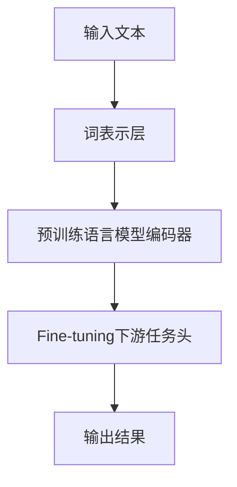
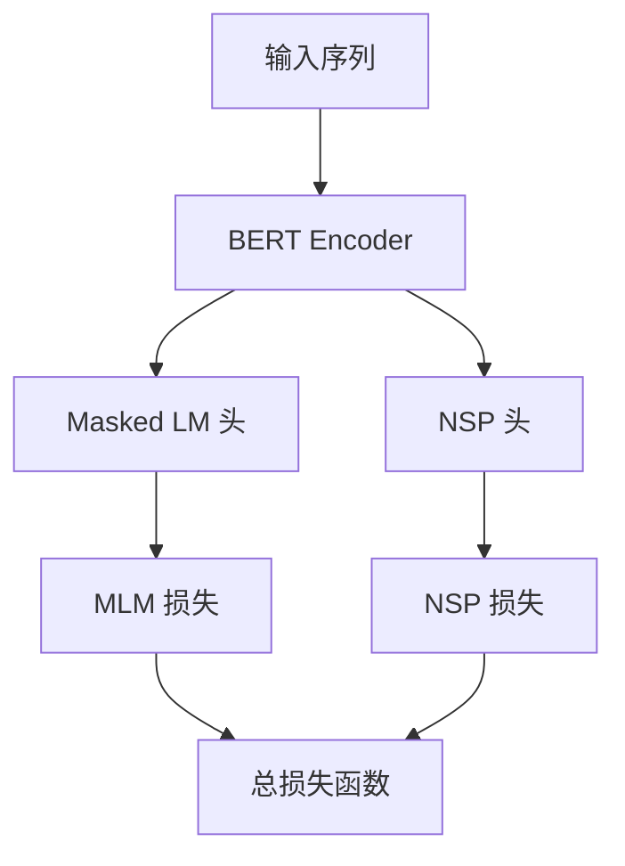

# 大语言模型原理与工程实践：词表示技术

## 1.背景介绍

在自然语言处理(NLP)领域,词表示技术是一个基础且关键的问题。将文本转化为计算机可以理解和处理的数值向量表示是NLP任务的第一步。高质量的词表示对于语言模型、文本分类、机器翻译等下游任务的性能有着重要影响。

传统的词表示方法如One-Hot编码虽然简单,但存在着维度灾难和无法捕捉词与词之间语义关系的缺陷。为了解决这些问题,分布式词表示(Distributed Word Representation)应运而生,其中最著名的是Word2Vec和GloVe。这些方法通过神经网络模型从大规模语料中学习词向量表示,能够较好地捕捉词与词之间的语义和句法关系。

随着深度学习的发展,基于transformer的大型语言模型(Large Language Model,LLM)逐渐成为NLP领域的主流方法。这些预训练语言模型通过自监督学习在大规模无标注语料上进行训练,学习到通用的语义表示,在下游任务上取得了卓越的性能表现。著名的LLM有BERT、GPT、XLNet等。

## 2.核心概念与联系

### 2.1 One-Hot编码

One-Hot编码是最简单的词表示方法。对于一个固定的词表V,每个单词用一个|V|维的向量表示,该向量除了对应单词位置的元素为1,其余元素全为0。

One-Hot编码的优点是简单直观,缺点是高维稀疏、无法刻画词与词之间的语义关系。

### 2.2 分布式词表示(Word Embedding)

分布式词表示通过神经网络模型从大规模语料中学习低维密集的词向量表示。每个单词对应一个低维的密集实值向量,语义相似的单词在向量空间中彼此靠近。常用的词向量学习算法有Word2Vec和GloVe。

Word2Vec包括CBOW(连续词袋模型)和Skip-Gram两种模型,通过最大化目标词与上下文词之间的条件概率来学习词向量。GloVe则是基于全局词共现统计信息的低秩分解方法。这些词向量编码了单词的语义和句法信息,为NLP任务提供了有效的特征表示。

### 2.3 预训练语言模型(PLM)

预训练语言模型通过自监督学习在大规模无标注语料上进行预训练,学习到通用的语义表示。常见的预训练任务包括掩码语言模型(Masked LM)和下一句预测等。预训练后的模型参数可以在下游任务上进行微调(fine-tuning),大大提升了性能。

BERT是最早的transformer编码器结构的预训练模型,GPT则采用transformer解码器结构,XLNet使用Permutation LM预训练目标等。这些大型语言模型在各种NLP任务上取得了state-of-the-art的性能。



## 3.核心算法原理具体操作步骤

### 3.1 Word2Vec原理

Word2Vec包括CBOW和Skip-Gram两种模型,都是基于浅层神经网络进行训练。

1. **CBOW**:给定上下文词的词向量序列,预测目标词。
2. **Skip-Gram**:给定目标词的词向量,预测上下文词序列。

两种模型均采用负采样(Negative Sampling)和层序Softmax等技术提高训练效率。损失函数为最大化目标词与上下文词之间的条件概率。

$$J_{\text{CBOW}}=\frac{1}{T}\sum_{t=1}^{T}\log p(w_t|w_{t-c},\dots,w_{t+c})$$

$$J_{\text{Skip-Gram}}=\frac{1}{T}\sum_{t=1}^{T}\sum_{j=-c}^{c}\log p(w_{t+j}|w_t)$$

通过梯度下降优化损失函数,得到词向量表示。

### 3.2 GloVe原理

GloVe基于全局词共现统计信息,采用基于最小化加权最小二乘重构词共现概率矩阵的方法学习词向量。

1. 构建词共现矩阵 $X$,其中 $X_{ij}$ 表示单词 $i$ 和单词 $j$ 在语料库中同时出现的次数。
2. 对 $X$ 进行某种衰减处理,得到新矩阵 $\tilde{X}$。
3. 学习词向量 $w_i,\tilde{w}_j$,使得 $w_i^T\tilde{w}_j \approx \log\tilde{X}_{ij}$。
4. 优化损失函数:

$$J=\sum_{i,j=1}^{V}f(X_{ij})(w_i^T\tilde{w}_j+b_i+\tilde{b}_j-\log X_{ij})^2$$

其中 $f(x)$ 是加权函数,对小值进行放大。通过梯度下降优化损失函数得到词向量。

### 3.3 BERT原理

BERT采用transformer编码器结构,通过掩码语言模型(Masked LM)和下一句预测(Next Sentence Prediction)两个任务进行预训练。

1. **Masked LM**: 随机掩码部分输入token,模型需预测被掩码的token。
2. **NSP**: 判断两个句子是否为连续句子对。

预训练过程中,BERT从大规模无标注语料中学习到通用的语义表示,预训练后的模型可在下游任务上进行微调(fine-tuning)以获得性能提升。



## 4.数学模型和公式详细讲解举例说明

### 4.1 Word2Vec损失函数

Word2Vec采用的是最大化目标词与上下文词之间的条件概率作为目标函数。对于CBOW模型,目标函数为:

$$J_{\text{CBOW}}=\frac{1}{T}\sum_{t=1}^{T}\log p(w_t|w_{t-c},\dots,w_{t+c})$$

其中 $T$ 为语料库中词的总数, $c$ 为上下文窗口大小, $w_t$ 为目标词, $w_{t-c},\dots,w_{t+c}$ 为上下文词序列。

对于Skip-Gram模型,目标函数为:

$$J_{\text{Skip-Gram}}=\frac{1}{T}\sum_{t=1}^{T}\sum_{j=-c}^{c}\log p(w_{t+j}|w_t)$$

即最大化目标词 $w_t$ 给定时,上下文词 $w_{t+j}$ 的条件概率。

以Skip-Gram为例,条件概率 $p(w_O|w_I)$ 通过 Softmax 函数计算:

$$p(w_O|w_I)=\frac{\exp(v_{w_O}^{\top}v_{w_I})}{\sum_{w=1}^{V}\exp(v_w^{\top}v_{w_I})}$$

其中 $v_w$ 和 $v_{w_I}$ 分别为词 $w$ 和 $w_I$ 的词向量,词表大小为 $V$。

为了提高计算效率,Word2Vec引入了层序Softmax和负采样等技术近似计算。

### 4.2 GloVe重构损失函数

GloVe的损失函数基于最小化加权最小二乘重构词共现概率矩阵:

$$J=\sum_{i,j=1}^{V}f(X_{ij})(w_i^T\tilde{w}_j+b_i+\tilde{b}_j-\log X_{ij})^2$$

其中:

- $X_{ij}$ 为单词 $i$ 和单词 $j$ 在语料库中同时出现的次数
- $w_i$ 和 $\tilde{w}_j$ 分别为单词 $i$ 和 $j$ 的词向量
- $b_i$ 和 $\tilde{b}_j$ 为词偏置项
- $f(x)$ 为加权函数,对小值进行放大,如 $f(x)=(\frac{x}{x_{\max}})^\alpha$

GloVe通过最小化该损失函数,使得词向量内积 $w_i^T\tilde{w}_j$ 近似重构词共现概率 $\log X_{ij}$。

### 4.3 BERT损失函数

BERT的损失函数由两部分组成:掩码语言模型(MLM)损失和下一句预测(NSP)损失。

**MLM损失**:

$$\mathcal{L}_{\text{MLM}}=-\sum_{i}\log P(x_i|x_{\backslash i})$$

其中 $x_i$ 为被掩码的token, $x_{\backslash i}$ 为其他输入token序列。

**NSP损失**:

$$\mathcal{L}_{\text{NSP}}=-\log P(y|\boldsymbol{x}_1,\boldsymbol{x}_2)$$

其中 $y$ 为二分类标签(是否为连续句子对), $\boldsymbol{x}_1$ 和 $\boldsymbol{x}_2$ 为两个输入句子序列。

BERT的总损失函数为:

$$\mathcal{L}=\mathcal{L}_{\text{MLM}}+\lambda\mathcal{L}_{\text{NSP}}$$

其中 $\lambda$ 为平衡两个损失的超参数。

以上损失函数通过梯度下降优化,使得BERT在大规模语料上学习到通用的语义表示。

## 5.项目实践：代码实例和详细解释说明

### 5.1 Word2Vec实现

以下是使用Gensim库实现Word2Vec的Python代码示例:

```python
from gensim.models import Word2Vec

# 加载语料
sentences = [['this', 'is', 'the', 'first', 'sentence'], 
             ['this', 'is', 'the', 'second', 'sentence']]

# 训练Word2Vec模型
model = Word2Vec(sentences, vector_size=100, window=5, min_count=1, workers=4)

# 获取词向量
print(model.wv['this'])

# 最相似词
print(model.wv.most_similar(positive=['woman', 'king'], negative=['man']))

# 词向量运算
print(model.wv['king'] - model.wv['man'] + model.wv['woman'])
```

代码首先加载样例语料,然后实例化Word2Vec模型并设置参数如向量维度、窗口大小等。通过`model.wv`可以访问训练得到的词向量字典。

`most_similar`函数可以找到与给定词或词向量相似的词,`wv.most_similar(positive=['woman', 'king'], negative=['man'])`相当于执行"king - man + woman"的词向量运算。

### 5.2 GloVe实现

以下是使用Python实现GloVe的代码示例:

```python
import numpy as np

# 构建共现矩阵
word_coocurrence = np.array([[0, 10, 6, 6, 9], 
                             [10, 0, 8, 9, 3],
                             [6, 8, 0, 3, 6],
                             [6, 9, 3, 0, 1],
                             [9, 3, 6, 1, 0]])

# 初始化词向量
num_words = len(word_coocurrence)
vector_dim = 4
W = np.random.randn(num_words, vector_dim)
W_context = np.random.randn(num_words, vector_dim)

# 定义损失函数
def glove_loss(W, W_context, word_coocurrence, alpha, x_max):
    v_w = (W[np.arange(num_words), :].squeeze(1))
    v_c = (W_context[np.arange(num_words), :])
    
    eps = 1e-8
    x_max = np.maximum(x_max, eps)
    
    weight = (x_max / word_coocurrence) ** alpha
    weight[word_coocurrence == 0] = 0
    
    loss = np.sum(weight * (np.log(word_coocurrence + eps) - np.sum(v_w * v_c, axis=1)) ** 2)
    return loss

# 梯度下降优化
learning_rate = 1e-3
alpha = 0.75
x_max = np.max(word_coocurrence)

for i in range(1000):
    loss = glove_loss(W, W_context, word_coocurrence, alpha, x_max)
    
    W_grad, W_context_grad = np.zeros((num_words, vector_dim)), np.zeros((num_words, vector_dim))
    # 计算梯度...
    
    W -= learning_rate * W_grad
    W_context -= learning_rate * W_context_grad
    
    if i % 100 == 0:
        print(