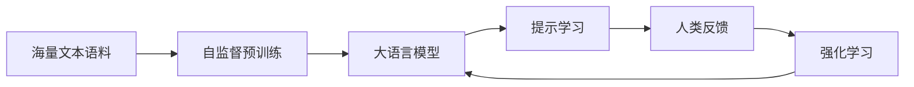

# 大语言模型原理基础与前沿 基于语言反馈进行微调

## 1. 背景介绍
### 1.1 大语言模型概述
#### 1.1.1 大语言模型的定义
大语言模型(Large Language Model, LLM)是一类基于海量文本数据训练的语言模型,通过自监督学习和迁移学习等技术,可以在各种自然语言处理任务上取得优异表现。LLM通常包含数十亿到数万亿参数,并在大规模语料库上进行预训练,具有强大的语言理解和生成能力。

#### 1.1.2 大语言模型的发展历程
近年来,随着计算能力的提升和训练数据的增长,大语言模型取得了长足进步。从2018年的BERT、GPT等模型,到2020年的GPT-3,再到最近的PaLM、Chinchilla等模型,LLM的参数量级和性能不断刷新纪录。目前最大的语言模型已达到了万亿参数量级。

#### 1.1.3 大语言模型的应用价值
大语言模型为自然语言处理领域带来了革命性变革。它们可以用于问答、对话、摘要、翻译、写作等多种任务,大大提升了NLP系统的智能化水平。LLM正在深刻影响着搜索引擎、智能助手、内容创作等诸多行业,为人机交互和知识服务开辟了新的可能性。

### 1.2 基于反馈的微调方法
#### 1.2.1 RLHF的提出背景
尽管大语言模型展现出了惊人的zero-shot和few-shot能力,但它们生成的文本仍然存在事实性、安全性、伦理性等诸多问题。为了进一步提升LLM的可控性和实用性,斯坦福大学等机构提出了基于人类反馈强化学习(Reinforcement Learning with Human Feedback, RLHF)的微调范式。

#### 1.2.2 RLHF的基本思想
RLHF旨在利用人类反馈信号来指导语言模型的微调过程。具体而言,人类标注者会对LLM生成的多个候选响应进行排序打分,得到一个偏好奖励函数。然后,该奖励函数被用于优化语言模型的策略,使其倾向于生成符合人类偏好的高质量文本。通过迭代式的交互学习,LLM可以逐步适应特定的应用需求。

#### 1.2.3 RLHF的代表性工作
自2022年以来,RLHF方法得到了广泛关注和应用。OpenAI的InstructGPT、Anthropic的Claude、DeepMind的Sparrow等系统都采用了类似的微调范式,在安全对齐、知识问答等任务上取得了瞩目成绩。微软的RLHF框架也被应用到了新必应的对话模型优化中。

## 2. 核心概念与联系
### 2.1 语言模型(Language Model)
语言模型是对语言概率分布的建模,旨在学习单词序列的生成规律。给定前置词语,语言模型可以预测下一个最可能出现的单词。常见的语言模型有n-gram、RNN、Transformer等。大语言模型基于 Transformer 架构,利用注意力机制建模长距离语义依赖。

### 2.2 自监督预训练(Self-supervised Pre-training) 
自监督学习是一种无需人工标注的表示学习范式。对于语言模型,自监督预训练通常采用掩码语言建模(Masked Language Modeling)的方式,随机遮挡部分单词,并训练模型去预测被遮挡位置的原始词语。这使得模型能学习到语言的通用表征。大语言模型往往在超大规模语料库上进行长时间的预训练。

### 2.3 提示学习(Prompt Learning)
提示学习是指将下游任务转化为语言模型的输入提示,利用LLM的语言理解和生成能力直接进行zero-shot或few-shot预测。通过设计恰当的提示模板,并在少量样本上进行演示,语言模型可以自动适应不同的任务形式。提示学习大大简化了传统的微调流程。

### 2.4 强化学习(Reinforcement Learning)
强化学习是一种序贯决策优化算法。智能体(agent)通过与环境的交互,根据反馈的奖励信号不断调整策略,最终学习到最优的行为序列。在RLHF中,语言模型扮演智能体的角色,而人类偏好则作为奖励函数来指导模型的优化方向。策略梯度等算法被用于语言模型的策略学习。

### 2.5 核心概念之间的联系
下图展示了大语言模型、自监督预训练、提示学习、强化学习等核心概念之间的逻辑关系:

大语言模型通过在海量语料上进行自监督预训练,学习到通用的语言表征能力。在应用阶段,可以利用提示学习方式让LLM适应具体任务。而人类反馈则进一步引导语言模型生成符合特定需求的输出。强化学习算法以人类偏好为奖励信号,微调优化原有的语言模型,实现闭环的交互学习。这一系列技术的结合,构成了 RLHF 的核心范式。

## 3. 核心算法原理具体操作步骤
RLHF的核心算法主要包括以下几个步骤:

### 3.1 语言模型的初始化
首先需要选择一个预训练的语言模型作为基础模型,如GPT-3、PaLM等。这些模型已经在大规模语料上学习到了丰富的语言知识,具备了一定的理解和生成能力。我们将基于此进行后续的微调优化。

### 3.2 构建人类反馈数据集
为了获得人类偏好信号,需要构建一个高质量的反馈数据集。具体步骤如下:

1. 准备一批种子任务示例,涵盖不同的应用场景和任务类型。
2. 利用语言模型生成每个示例的多个候选响应。
3. 人类标注者对候选响应进行排序打分,给出相对偏好。
4. 将示例、候选响应、人类排序结果整理成标准的数据格式。

反馈数据集的质量直接影响到后续模型训练的效果,需要投入足够的人力物力。一般需要数万到数十万级别的标注样本。

### 3.3 奖励模型的训练
基于人类反馈数据集,我们训练一个奖励模型(reward model)来拟合人类偏好。奖励模型本质上是一个打分函数,输入为候选响应,输出为标量分值。我们希望奖励模型能够学习到人类偏好判断的一般规律。

奖励模型通常采用 RankNet、RankSVM 等排序学习算法来训练。模型结构可以是 MLP、Transformer 等。目标是最小化排序损失,使得模型打分与人类排序尽可能一致。训练时需要对不同标注者的偏好进行校准和归一化处理。

### 3.4 语言模型的策略学习
有了奖励模型,我们就可以开始语言模型的策略学习了。这里采用强化学习中的策略梯度算法,通过梯度上升来最大化期望奖励。

1. 从语言模型的当前策略出发,采样生成一批候选响应。
2. 用奖励模型对候选响应进行打分,得到相应的奖励值。
3. 根据策略梯度定理,计算语言模型参数的梯度,并进行更新。
$$\nabla_{\theta} J(\theta)=\mathbb{E}_{\tau \sim \pi_{\theta}}[\sum_{t=1}^{T} \nabla_{\theta} \log \pi_{\theta}\left(a_{t} | s_{t}\right) \cdot R(\tau)]$$
其中$\theta$为语言模型参数,$\pi_{\theta}$为语言模型策略,$\tau$为生成的文本序列,$R(\tau)$为奖励模型给出的分值。

4. 重复步骤1-3,直到策略收敛或达到预设的迭代次数。

策略学习阶段是 RLHF 的核心,通过不断的探索优化,语言模型逐渐适应人类偏好,生成更加符合预期的高质量文本。

### 3.5 模型评估与部署
经过策略学习后,我们得到了一个微调优化的语言模型。为了评估其实际表现,需要在目标任务上进行测试。

1. 准备一批测试样例,涵盖不同的输入模式和难度。
2. 用微调后的语言模型生成测试样例的响应。
3. 对生成结果进行人工评估,包括流畅度、相关性、安全性等多个维度。
4. 统计各项指标,对比优化前后的模型性能差异。

如果模型表现满足应用要求,就可以正式部署上线。后续还需要持续监控模型输出,收集用户反馈,视情况进行迭代更新。

## 4. 数学模型和公式详细讲解举例说明
本节我们将详细讲解 RLHF 中涉及的几个关键数学模型和公式,并给出具体的例子说明。

### 4.1 语言模型的概率公式
语言模型的目标是估计单词序列 $x=(x_1,\cdots,x_T)$ 的概率分布 $p(x)$。根据概率链式法则,这个概率可以分解为:

$$p(x)=\prod_{t=1}^{T} p\left(x_{t} | x_{<t}\right)$$

其中$p\left(x_{t} | x_{<t}\right)$表示在给定前t-1个单词$x_{<t}$的条件下,第t个单词$x_t$的条件概率。语言模型就是要学习这个条件概率分布。

以 GPT 为例,它使用 Transformer 解码器结构来建模这个条件概率。模型参数 $\theta$ 包括词嵌入矩阵、位置编码、自注意力层、前馈层等。输入单词序列 $x_{<t}$ 首先被映射为对应的词向量和位置向量,然后通过多层的自注意力计算和前馈变换,得到每个位置的隐状态 $h_t$。最后,隐状态 $h_t$ 乘以词嵌入矩阵的转置,再经过 softmax 归一化,就得到了下一个单词的概率分布:

$$p\left(x_{t} | x_{<t}\right)=\operatorname{softmax}\left(h_{t} W_{e}^{T}\right)$$

其中 $W_e$ 为词嵌入矩阵。语言模型的训练目标是最小化负对数似然损失:

$$\mathcal{L}(\theta)=-\sum_{i=1}^{N} \log p_{\theta}\left(x^{(i)}\right)=-\sum_{i=1}^{N} \sum_{t=1}^{T} \log p_{\theta}\left(x_{t}^{(i)} | x_{<t}^{(i)}\right)$$

其中 $\{x^{(i)}\}_{i=1}^N$ 为训练语料库中的所有句子。

### 4.2 奖励模型的排序学习
奖励模型的任务是根据人类反馈对候选响应进行打分排序。我们将其建模为一个打分函数 $f_{\phi}(x)$,其中 $\phi$ 为奖励模型的参数,x 为候选响应文本。给定一对响应 $(x_1,x_2)$ 及其人类标注的偏好关系 $y \in \{0, 1\}$ (0表示x1优于x2,1表示x2优于x1),我们希望:

$$f_{\phi}\left(x_{1}\right)>f_{\phi}\left(x_{2}\right) \Leftrightarrow y=0$$

$$f_{\phi}\left(x_{1}\right)<f_{\phi}\left(x_{2}\right) \Leftrightarrow y=1$$

常用的排序学习损失函数有 Pairwise ranking loss:

$$\mathcal{L}(\phi)=\sum_{i=1}^{N} \max \left(0,1-\operatorname{sign}\left(y^{(i)}-0.5\right)\left(f_{\phi}\left(x_{1}^{(i)}\right)-f_{\phi}\left(x_{2}^{(i)}\right)\right)\right)$$

和 Listwise ranking loss:

$$\mathcal{L}(\phi)=-\sum