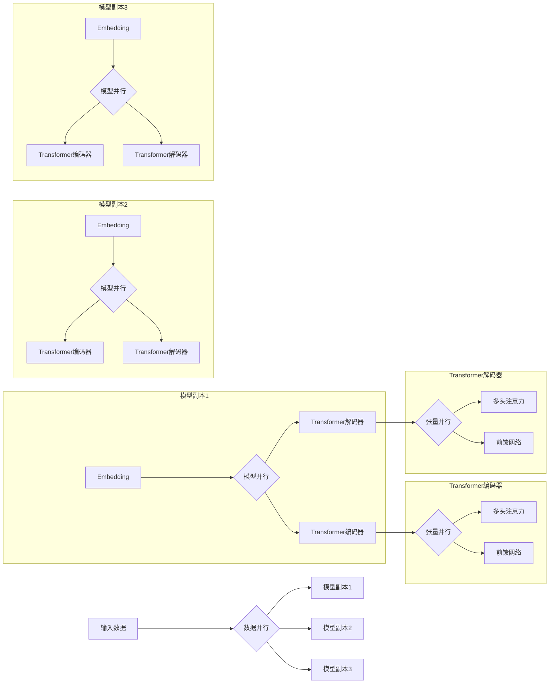
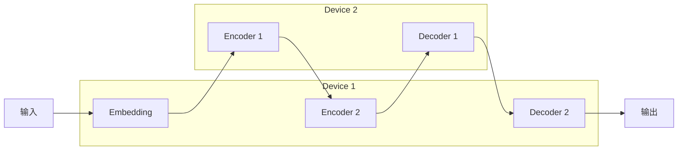

# 大语言模型原理基础与前沿 张量/模型并行

## 1. 背景介绍

### 1.1 大语言模型概述
近年来,自然语言处理(NLP)领域取得了巨大的进展,其中大语言模型(Large Language Models, LLMs)功不可没。LLMs 通过在海量文本数据上进行预训练,学习到丰富的语言知识和通用表示,可以应用于各种下游 NLP 任务,展现出强大的性能。代表性的 LLMs 包括 GPT 系列[1]、BERT[2]、XLNet[3] 等。

### 1.2 LLMs 面临的挑战
然而,随着模型规模和参数量的不断增长,LLMs 的训练也面临着前所未有的挑战:
1. 计算资源需求大幅增加,单个 GPU 已无法承载;
2. 模型参数已超过单机内存容量,无法直接加载;  
3. 训练时间大幅延长,训练效率降低。

为了应对这些挑战,学术界和工业界都在积极探索新的分布式训练范式。

### 1.3 张量并行与模型并行
目前,主流的分布式训练范式可分为数据并行(Data Parallelism)、模型并行(Model Parallelism)和流水线并行(Pipeline Parallelism)[4]。

本文将重点介绍**张量并行(Tensor Parallelism)**和**模型并行**技术在 LLMs 训练中的应用。通过张量切分和模型切分,可以将庞大的模型参数和中间变量分布到多个设备上,突破单机内存瓶颈,实现超大规模模型的高效训练。

## 2. 核心概念与联系

### 2.1 张量并行
张量并行是一种细粒度的并行策略,通过将张量(如模型权重、梯度、激活值等)切分到不同的设备上,实现并行计算。常见的切分方式有:
- 权重分片(Weight Sharding):将模型权重矩阵按行/列切分到不同设备
- 激活值分片(Activation Sharding):将前向传播的激活值切分到不同设备
- 梯度分片(Gradient Sharding):将反向传播的梯度切分到不同设备

张量并行的优点是可以充分利用多个设备的内存和算力,加速训练过程。但它也带来了额外的通信开销,需要在设备间频繁交换数据。

### 2.2 模型并行
模型并行是一种粗粒度的并行策略,通过将模型的不同部分(如层、Attention heads、MLP等)分配到不同的设备上,实现并行计算。常见的模型切分方式有:
- 纵向切分(Vertical Parallelism):将模型的不同层分配到不同设备
- 横向切分(Horizontal Parallelism):将同一层的不同部分(如 Attention heads)分配到不同设备

模型并行的优点是可以支持更大规模的模型,但也面临着负载均衡和通信开销的挑战。

### 2.3 混合并行
实践中,张量并行和模型并行往往会结合使用,形成混合并行(Hybrid Parallelism)策略。通过灵活组合不同的并行维度,可以在扩展性、效率、通信开销等方面取得平衡。例如:
- 在 Transformer 层内采用张量并行,在层间采用流水线并行
- 对 MLP 和 Attention 采取不同的并行策略
- 在数据、模型、张量三个维度混合并行

下图展示了一个混合并行训练的示意:

## 3. 核心算法原理与具体操作步骤

本节将详细介绍几种典型的张量并行和模型并行算法,包括权重分片、激活值分片、纵向切分等。

### 3.1 权重分片
权重分片是指将模型权重矩阵按行或列切分到不同的设备上。以最简单的行切分为例,假设权重矩阵 $W \in \mathbb{R}^{m \times n}$ 分布在 $p$ 个设备上,每个设备存储 $\frac{m}{p}$ 行,则有:

$$
W=\begin{bmatrix}
W_1 \\
W_2 \\
\vdots \\
W_p
\end{bmatrix}
$$

其中 $W_i \in \mathbb{R}^{\frac{m}{p} \times n}$ 为第 $i$ 个设备上的权重子矩阵。

前向传播时,输入向量 $x \in \mathbb{R}^{n}$ 需要广播到所有设备,每个设备计算自己的部分:

$$
y_i = W_i x, \quad i=1,2,\dots,p
$$

最后通过 AllGather 通信原语,将各设备的结果拼接成完整的输出向量 $y \in \mathbb{R}^{m}$。

反向传播时,梯度 $\nabla_y \in \mathbb{R}^{m}$ 也被切分成 $p$ 份,每个设备计算权重梯度的一部分:

$$
\nabla_{W_i} = \nabla_{y_i} x^T, \quad i=1,2,\dots,p
$$

同时,各设备需要 AllReduce 通信,对输入梯度 $\nabla_x$ 进行聚合:

$$
\nabla_x = \sum_{i=1}^p W_i^T \nabla_{y_i}
$$

列切分的原理与行切分类似,区别在于每个设备存储 $\frac{n}{p}$ 列,前向传播时输入向量 $x$ 被切分,反向传播时 $\nabla_y$ 需要广播。

### 3.2 激活值分片
激活值分片是指将前向传播的中间激活值切分到不同设备上。以 Transformer 的 Self-Attention 层为例,假设序列长度为 $s$,隐藏层维度为 $d$,激活值矩阵 $X \in \mathbb{R}^{s \times d}$ 按行切分到 $p$ 个设备:

$$
X=\begin{bmatrix}
X_1 \\
X_2 \\
\vdots \\
X_p  
\end{bmatrix}
$$

其中 $X_i \in \mathbb{R}^{\frac{s}{p} \times d}$ 为第 $i$ 个设备上的激活值子矩阵。

Self-Attention 的计算公式为:

$$
\text{Attention}(Q,K,V) = \text{softmax}\left(\frac{QK^T}{\sqrt{d}}\right)V
$$

其中 $Q,K,V \in \mathbb{R}^{s \times d}$ 分别为查询矩阵、键矩阵和值矩阵,可以通过线性变换得到:

$$
Q = XW_Q, \quad K = XW_K, \quad V = XW_V
$$

假设 $W_Q, W_K, W_V \in \mathbb{R}^{d \times d}$ 也做行切分,每个设备可以并行计算:

$$
Q_i = X_iW_{Q_i}, \quad K_i = X_iW_{K_i}, \quad V_i = X_iW_{V_i}, \quad i=1,2,\dots,p
$$

接下来需要计算 Attention 矩阵 $A=\text{softmax}\left(\frac{QK^T}{\sqrt{d}}\right)$。由于 $Q$ 和 $K$ 分别按行切分,两者相乘需要通信。一种解决方案是:
1. 每个设备先计算 $Q_iK_i^T$
2. AllReduce 通信对 $p$ 个 $\frac{s}{p} \times \frac{s}{p}$ 矩阵求和,得到完整的 $QK^T$
3. 每个设备计算 $A_i = \text{softmax}\left(\frac{(QK^T)_i}{\sqrt{d}}\right)$

最后,每个设备计算 $O_i=A_iV_i$,再通过 AllGather 得到完整的输出矩阵 $O$。

反向传播时,需要切分梯度 $\nabla_O$,并计算 $\nabla_X$、$\nabla_{W_Q}$、$\nabla_{W_K}$、$\nabla_{W_V}$ 的一部分,步骤与前向类似。

### 3.3 纵向切分
纵向切分是指将模型的不同层分配到不同设备上。以 Transformer 为例,可以将编码器层和解码器层交替分配:

前向传播时,各层依次在不同设备上计算,每层的输出通过通信传递给下一层。反向传播时,梯度沿相反方向流动,每个设备更新自己负责的层的参数。

纵向切分的优点是模型的每个部分只需要在一个设备上,避免了张量通信。但也带来了新的挑战:
- 流水线并行:前向传播和反向传播都需要按顺序进行,难以提高设备利用率
- 负载均衡:不同层的计算量和内存占用差异大,需要仔细调度避免设备空闲

因此,纵向切分常与流水线并行等技术结合,如 GPipe[5]、PipeDream[6] 等。

## 4. 数学模型和公式详细讲解举例说明
本节将以 Transformer 的 Self-Attention 层为例,详细推导张量并行下的数学公式。考虑最简单的行切分,假设隐藏层维度为 $d$,批大小为 $b$,序列长度为 $s$,模型并行度为 $p$。

输入 $X \in \mathbb{R}^{b \times s \times d}$ 和权重矩阵 $W_Q, W_K, W_V \in \mathbb{R}^{d \times d}$ 都按第一维切分:

$$
X = \begin{bmatrix}
X^{(1)} \\
X^{(2)} \\
\vdots \\
X^{(p)}
\end{bmatrix}, \quad
W_Q = \begin{bmatrix}
W_Q^{(1)} \\
W_Q^{(2)} \\
\vdots \\
W_Q^{(p)}  
\end{bmatrix}, \quad
W_K = \begin{bmatrix}
W_K^{(1)} \\
W_K^{(2)} \\
\vdots \\
W_K^{(p)}
\end{bmatrix}, \quad
W_V = \begin{bmatrix}  
W_V^{(1)} \\
W_V^{(2)} \\
\vdots \\
W_V^{(p)}
\end{bmatrix}
$$

其中 $X^{(i)} \in \mathbb{R}^{\frac{b}{p} \times s \times d}$,$W_Q^{(i)},W_K^{(i)},W_V^{(i)} \in \mathbb{R}^{\frac{d}{p} \times d}$。

前向传播时,每个设备 $i$ 计算:

$$
\begin{aligned}
Q^{(i)} &= X^{(i)}W_Q^{(i)} \\
K^{(i)} &= X^{(i)}W_K^{(i)} \\  
V^{(i)} &= X^{(i)}W_V^{(i)}
\end{aligned}
$$

其中 $Q^{(i)},K^{(i)},V^{(i)} \in \mathbb{R}^{\frac{b}{p} \times s \times d}$。接下来需要计算:

$$
\begin{aligned}
A &= \text{softmax}\left(\frac{QK^T}{\sqrt{d}}\right) \\
  &= \text{softmax}\left(\frac{1}{\sqrt{d}}\begin{bmatrix}
Q^{(1)} \\
\vdots \\
Q