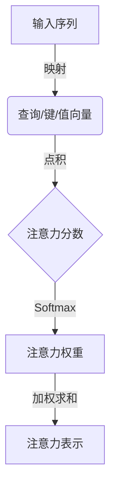
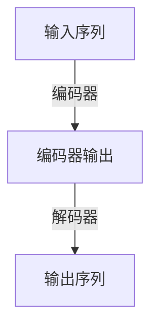

# 大语言模型原理基础与前沿 更长的上下文

## 1.背景介绍

### 1.1 大语言模型的兴起

近年来,大型语言模型(Large Language Models, LLMs)在自然语言处理领域掀起了一场革命。这些模型通过在大规模语料库上进行预训练,学习到了丰富的语言知识,展现出令人惊叹的语言生成和理解能力。

大语言模型的兴起可以追溯到2018年,当时OpenAI发布了GPT(Generative Pre-trained Transformer)模型,这是第一个在大规模语料库上预训练的大型语言模型。随后,谷歌推出了BERT(Bidirectional Encoder Representations from Transformers)模型,它采用了双向编码器,在自然语言理解任务上取得了突破性进展。

### 1.2 长上下文语言模型的重要性

尽管大语言模型在各种自然语言处理任务上表现出色,但它们仍然存在一个重要的限制:上下文长度。传统的语言模型通常只能处理有限长度的文本,这限制了它们在长文本理解和生成方面的能力。

为了解决这一问题,研究人员开始探索长上下文语言模型(Long Context Language Models, LCLMs),旨在提高模型处理长文本的能力。这些模型不仅可以捕捉更长范围的语义和逻辑关系,还能更好地理解和生成连贯的长文本。

长上下文语言模型的发展为自然语言处理领域带来了新的机遇和挑战,它们有望推动语言模型在各种复杂任务中的应用,如文本摘要、对话系统、内容生成等。

## 2.核心概念与联系

### 2.1 自注意力机制

自注意力机制是大语言模型的核心组成部分,它允许模型捕捉输入序列中任意两个位置之间的关系。与传统的序列模型(如RNN和LSTM)不同,自注意力机制不需要按顺序处理输入,而是可以并行计算每个位置与其他位置的关系。

在自注意力机制中,每个输入位置都会被映射到一个查询(Query)、键(Key)和值(Value)向量。然后,查询向量与所有键向量进行点积运算,得到一个注意力分数向量。该向量经过softmax归一化后,与值向量相乘,得到该位置的注意力表示。通过这种方式,模型可以自适应地关注输入序列中的不同部分。

自注意力机制为长上下文语言模型提供了强大的表示能力,使其能够捕捉远距离的依赖关系和全局上下文信息。

### 2.2 transformer架构

Transformer是一种基于自注意力机制的神经网络架构,它被广泛应用于大语言模型中。Transformer由编码器(Encoder)和解码器(Decoder)两部分组成,两者都采用了多头自注意力机制和前馈神经网络。

编码器负责将输入序列映射到一系列连续的表示,而解码器则根据编码器的输出和先前生成的tokens,生成目标序列。在自回归语言模型中,解码器的输入和输出序列是相同的。

Transformer架构的优势在于并行计算能力和长程依赖捕捉能力。它不受序列长度的限制,可以有效处理长文本,因此非常适合构建长上下文语言模型。

### 2.3 预训练与微调

大语言模型通常采用预训练与微调的范式。在预训练阶段,模型在大规模无监督语料库上进行自监督学习,捕捉通用的语言知识。常见的预训练目标包括掩码语言模型(Masked Language Modeling)和下一句预测(Next Sentence Prediction)等。

在微调阶段,预训练模型在特定的下游任务数据集上进行监督微调,使模型适应特定任务。这种转移学习方法可以显著提高模型在下游任务上的性能,同时节省了大量的计算资源和标注成本。

长上下文语言模型的预训练和微调过程与传统语言模型类似,但需要处理更长的文本序列,这对模型的计算能力和内存需求提出了更高的要求。

## 3.核心算法原理具体操作步骤

### 3.1 长上下文语言模型的训练

长上下文语言模型的训练过程可以分为以下几个步骤:

1. **数据预处理**:首先需要准备大规模的文本语料库,并对其进行必要的预处理,如分词、标记化等。为了训练长上下文模型,需要保留足够长的文本片段,而不是将其分割成较短的序列。

2. **模型初始化**:初始化Transformer模型的参数,包括embedding层、编码器层、解码器层等。

3. **预训练**:在无监督语料库上进行自监督预训练,常用的预训练目标包括掩码语言模型(Masked Language Modeling)和下一句预测(Next Sentence Prediction)等。预训练过程中,需要采用特殊的技术来处理长文本序列,如滑动窗口、记忆增强等。

4. **微调**:将预训练模型在下游任务数据集上进行监督微调,根据任务的不同,可以采用不同的微调策略,如仅微调部分层、层次微调等。

5. **评估与优化**:在验证集上评估模型性能,根据评估指标对模型进行优化,如调整超参数、修改损失函数等。

6. **模型部署**:将训练好的模型部署到生产环境中,用于实际的自然语言处理任务。

长上下文语言模型的训练过程通常需要大量的计算资源和内存,因此常常需要在大型GPU集群或TPU集群上进行训练。此外,还需要采用一些优化技术,如梯度累积、混合精度训练等,以提高训练效率。

### 3.2 长上下文建模技术

为了有效处理长文本序列,研究人员提出了多种长上下文建模技术,这些技术可以与Transformer模型相结合,提高模型处理长上下文的能力。以下是一些常见的长上下文建模技术:

1. **滑动窗口(Sliding Window)**:将长文本划分为多个重叠的窗口,模型在每个窗口上进行训练,并通过注意力机制捕捉窗口之间的依赖关系。这种方法可以有效减少内存占用,但可能会丢失一些全局上下文信息。

2. **层次注意力(Hierarchical Attention)**:将文本按照语义结构(如段落、句子)划分为多个层次,在每个层次上应用自注意力机制,并通过跨层次的注意力机制捕捉全局上下文信息。

3. **记忆增强(Memory Augmented)**:引入外部记忆模块,用于存储和检索长期上下文信息。模型可以根据需要从记忆模块中读取和写入信息,从而更好地处理长文本。

4. **压缩编码(Compressive Encoding)**:将长文本序列压缩成更短的表示,然后在这些压缩表示上应用Transformer模型。这种方法可以减少计算开销,但可能会导致一些信息丢失。

5. **局部注意力(Local Attention)**:只计算每个位置与其局部窗口内的其他位置之间的注意力,从而降低计算复杂度。这种方法可以加速训练,但可能会丢失一些长程依赖关系。

6. **稀疏注意力(Sparse Attention)**:通过稀疏化注意力矩阵,只计算一部分位置对之间的注意力,从而降低计算复杂度。这种方法可以有效处理长序列,但需要合理设计稀疏模式。

上述技术各有优缺点,研究人员通常会根据具体任务和资源约束,选择合适的长上下文建模技术,或者将多种技术相结合,以获得最佳性能。

## 4.数学模型和公式详细讲解举例说明

### 4.1 自注意力机制

自注意力机制是Transformer模型的核心组成部分,它允许模型捕捉输入序列中任意两个位置之间的关系。下面我们将详细介绍自注意力机制的数学原理。

给定一个长度为 $n$ 的输入序列 $X = (x_1, x_2, \dots, x_n)$,我们首先将每个输入 $x_i$ 映射到一个查询向量 $q_i$、一个键向量 $k_i$ 和一个值向量 $v_i$:

$$
q_i = W^Q x_i, \quad k_i = W^K x_i, \quad v_i = W^V x_i
$$

其中 $W^Q$、$W^K$ 和 $W^V$ 分别是查询、键和值的线性映射矩阵。

然后,我们计算每个查询向量 $q_i$ 与所有键向量 $k_j$ 之间的点积,得到一个注意力分数向量 $e_i$:

$$
e_{i,j} = \frac{q_i^T k_j}{\sqrt{d_k}}
$$

其中 $d_k$ 是键向量的维度,用于缩放点积值,防止过大或过小的值。

接下来,我们对注意力分数向量 $e_i$ 进行softmax归一化,得到注意力权重向量 $\alpha_i$:

$$
\alpha_{i,j} = \frac{\exp(e_{i,j})}{\sum_{k=1}^n \exp(e_{i,k})}
$$

最后,我们将注意力权重向量 $\alpha_i$ 与值向量 $v_j$ 相乘,并对所有位置求和,得到该位置的注意力表示 $z_i$:

$$
z_i = \sum_{j=1}^n \alpha_{i,j} v_j
$$

通过上述步骤,模型可以自适应地关注输入序列中的不同部分,捕捉长程依赖关系和全局上下文信息。

在实际应用中,自注意力机制通常采用多头(Multi-Head)形式,即对输入序列进行多次线性映射,得到多个注意力表示,然后将它们拼接起来,形成最终的输出表示。这种方式可以允许模型从不同的子空间捕捉不同的依赖关系,提高模型的表示能力。

### 4.2 掩码语言模型(Masked Language Modeling)

掩码语言模型(Masked Language Modeling, MLM)是一种常用的预训练目标,它要求模型根据上下文预测被掩码的tokens。具体来说,给定一个输入序列 $X = (x_1, x_2, \dots, x_n)$,我们随机选择一些位置,将对应的tokens替换为特殊的掩码符号 [MASK]。模型的目标是根据上下文,预测这些被掩码的tokens的原始值。

设 $M$ 为被掩码的位置集合,对于每个 $i \in M$,我们希望模型预测出 $x_i$ 的概率分布 $P(x_i | X, M)$。这可以通过softmax函数来实现:

$$
P(x_i | X, M) = \frac{\exp(s_{x_i})}{\sum_{x' \in \mathcal{V}} \exp(s_{x'})}
$$

其中 $\mathcal{V}$ 是词汇表, $s_{x_i}$ 是模型对 $x_i$ 的打分(score)。

为了优化模型参数,我们定义掩码语言模型的损失函数为:

$$
\mathcal{L}_\text{MLM} = -\sum_{i \in M} \log P(x_i | X, M)
$$

在训练过程中,模型会最小化这个损失函数,从而学习到如何根据上下文预测被掩码的tokens。

掩码语言模型的优点在于,它可以同时捕捉双向上下文信息,并且通过随机掩码的方式,可以增强模型的鲁棒性和泛化能力。此外,由于被掩码的tokens是随机分布的,因此模型需要学习捕捉整个序列的上下文信息,而不是过度关注局部信息。

### 4.3 下一句预测(Next Sentence Prediction)

下一句预测(Next Sentence Prediction, NSP)是另一种常用的预训练目标,它要求模型判断两个句子是否相关。具体