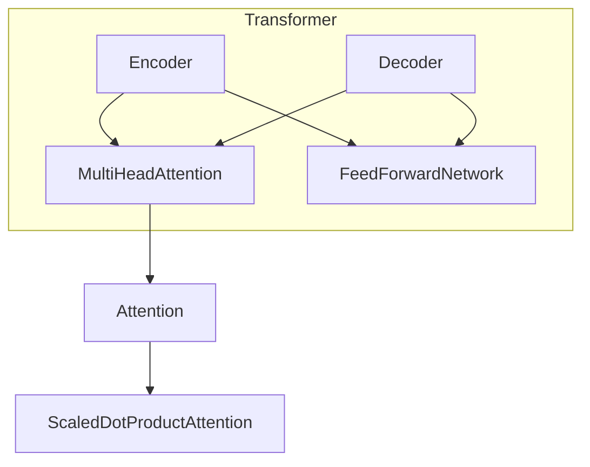

# 大语言模型原理基础与前沿 环境影响

## 1.背景介绍

### 1.1 什么是大语言模型？

大语言模型(Large Language Model, LLM)是一种基于深度学习的自然语言处理模型,通过在海量文本数据上进行预训练,学习语言的统计规律和语义表达,从而获得强大的语言理解和生成能力。这些模型通常包含数十亿甚至上千亿个参数,能够捕捉语言的复杂性和丰富语义,在各种自然语言处理任务上表现出色。

### 1.2 大语言模型的发展历程

大语言模型的发展可以追溯到2018年,Google发布了Transformer模型,展示了注意力机制在序列建模任务中的卓越表现。2019年,OpenAI发布GPT(Generative Pre-trained Transformer),成为首个真正意义上的大规模语言模型。随后,BERT、XLNet、RoBERTa等模型相继问世,推动了NLP领域的飞速发展。

2020年,OpenAI发布GPT-3,参数量高达1750亿,展现了大模型在各种下游任务中的出色泛化能力,引发了学术界和工业界的广泛关注。2021年,谷歌发布了Switch Transformer,参数量超过1.6万亿,成为当时最大的语言模型。2022年,OpenAI、DeepMind、谷歌等机构相继发布了PaLM、Chinchilla、PaLM 2等更大更强的语言模型。

### 1.3 大语言模型的重要性

大语言模型已成为当前人工智能领域最重要的技术之一,对推动自然语言处理、机器学习和人工智能的发展具有重大意义。它们展现了深度学习在语言理解和生成方面的强大能力,为众多应用场景带来了革命性的变革,如对话系统、机器翻译、文本摘要、问答系统等。

大模型还为人工智能系统的通用性和智能化发展提供了新的可能性。通过少量的指令微调,大语言模型可以快速适应新任务,实现跨领域的泛化能力,这为构建通用人工智能(AGI)系统奠定了基础。同时,大模型的出现也带来了一些伦理和安全方面的挑战,如隐私保护、偏见传播、虚假信息生成等,需要引起高度重视。

## 2.核心概念与联系

### 2.1 自然语言处理(NLP)

自然语言处理是人工智能的一个分支,旨在使计算机能够理解和生成人类语言。它包括多个子任务,如文本分类、机器翻译、问答系统、文本摘要等。传统的NLP方法主要基于规则和特征工程,效果有限。

### 2.2 深度学习在NLP中的应用

深度学习技术在NLP领域的应用,使得模型能够从大量数据中自动学习特征表示,极大提高了性能。词向量(Word Embedding)、卷积神经网络(CNN)、循环神经网络(RNN)等技术相继被应用于NLP任务。

### 2.3 Transformer与自注意力机制

Transformer是一种全新的基于自注意力机制的序列建模架构,避免了RNN的长距离依赖问题,能够并行计算,显著提高了训练效率。自注意力机制使模型能够捕捉输入序列中任意两个位置之间的关系,从而更好地建模语言。

### 2.4 预训练与微调

预训练(Pre-training)是大语言模型的核心思想。模型首先在海量无标注文本数据上进行通用表示学习,获得对语言的深入理解。然后通过在特定任务上的微调(Fine-tuning),即在有标注数据上进行进一步训练,使模型快速适应新任务。这种先预训练、后微调的范式大幅提高了模型的泛化能力。

### 2.5 大模型与规模效应

随着模型规模(参数量)和训练数据量的不断增加,大语言模型的性能也呈现出明显的规模效应。更大的模型能够捕捉更丰富的语言知识,在下游任务上表现更加出色。但同时,大模型也带来了更高的计算和存储开销,以及潜在的负面影响。

## 3.核心算法原理具体操作步骤

### 3.1 Transformer模型架构

Transformer是大语言模型的核心架构,主要由编码器(Encoder)和解码器(Decoder)两个部分组成。编码器将输入序列映射为上下文表示,解码器根据上下文表示生成输出序列。两者都由多个相同的层组成,每层包含多头自注意力(Multi-Head Attention)和前馈神经网络(Feed-Forward Network)两个子层。



### 3.2 多头自注意力机制

多头自注意力机制是Transformer的核心部分,它允许模型同时关注输入序列中的不同位置,捕捉长距离依赖关系。具体来说,它将输入序列分成多个头(Head),每个头计算一个注意力分布,然后将所有头的注意力结果拼接起来,形成最终的表示。

$$\mathrm{MultiHead}(Q, K, V) = \mathrm{Concat}(head_1, \ldots, head_h)W^O$$
$$\text{where } head_i = \mathrm{Attention}(QW_i^Q, KW_i^K, VW_i^V)$$

其中, $Q$、$K$、$V$分别表示查询(Query)、键(Key)和值(Value)。$W_i^Q$、$W_i^K$、$W_i^V$和$W^O$是可学习的权重矩阵。

### 3.3 缩放点积注意力

缩放点积注意力(Scaled Dot-Product Attention)是多头自注意力机制中使用的具体注意力计算方式。它通过查询和键的点积来计算注意力分数,然后对分数进行缩放和softmax操作,得到注意力权重。最后,将注意力权重与值相乘,得到加权和作为注意力的输出。

$$\mathrm{Attention}(Q, K, V) = \mathrm{softmax}(\frac{QK^\top}{\sqrt{d_k}})V$$

其中, $d_k$是键的维度,用于缩放点积,避免过大的值导致softmax饱和。

### 3.4 位置编码

由于Transformer没有像RNN那样的递归结构,因此需要一种机制来捕捉序列的位置信息。位置编码就是将序列的位置信息编码为向量,并将其加到输入的嵌入向量中,使模型能够学习到位置的概念。

$$\mathrm{PE}_{(pos, 2i)} = \sin(pos / 10000^{2i / d_\mathrm{model}})$$
$$\mathrm{PE}_{(pos, 2i+1)} = \cos(pos / 10000^{2i / d_\mathrm{model}})$$

其中, $pos$是词元的位置, $i$是维度索引, $d_\mathrm{model}$是模型的维度。

### 3.5 前馈神经网络

每个Transformer层中,自注意力子层之后是一个前馈神经网络子层,它对每个位置的表示进行独立的非线性转换。这个子层由两个全连接层组成,中间使用ReLU激活函数。

$$\mathrm{FFN}(x) = \max(0, xW_1 + b_1)W_2 + b_2$$

前馈网络可以看作是在每个位置上应用的简单的变换,对于不同的位置是完全独立的。它为模型增加了非线性能力,有助于更好地拟合复杂的函数。

## 4.数学模型和公式详细讲解举例说明

### 4.1 交叉熵损失函数

在大语言模型的训练过程中,常用的损失函数是交叉熵损失(Cross-Entropy Loss)。它衡量了模型预测的概率分布与真实标签之间的差异。对于一个长度为$T$的序列,交叉熵损失定义如下:

$$\mathcal{L} = -\frac{1}{T}\sum_{t=1}^{T}\log P(y_t|y_{<t}, X)$$

其中, $y_t$是第$t$个位置的真实标签, $y_{<t}$表示前$t-1$个位置的标签, $X$是输入序列, $P(y_t|y_{<t}, X)$是模型预测第$t$个位置标签的概率。

在实践中,还常常加入一些正则化项,如权重衰减(Weight Decay)、标签平滑(Label Smoothing)等,以提高模型的泛化能力。

### 4.2 注意力分数计算

注意力机制是Transformer的核心部分,它通过计算查询(Query)和键(Key)之间的相关性来确定注意力分数。具体来说,对于一个查询$q$和一组键$\{k_1, k_2, \ldots, k_n\}$,注意力分数计算如下:

$$\mathrm{Attention}(q, k_i) = \frac{q \cdot k_i}{\sqrt{d_k}}$$

其中, $d_k$是键的维度,用于缩放点积,避免过大的值导致softmax饱和。然后,对所有注意力分数进行softmax操作,得到注意力权重:

$$\alpha_i = \frac{\exp(\mathrm{Attention}(q, k_i))}{\sum_{j=1}^{n}\exp(\mathrm{Attention}(q, k_j))}$$

最后,将注意力权重与对应的值(Value)相乘,得到加权和作为注意力的输出:

$$\mathrm{Attention}(q, \{k_1, \ldots, k_n\}, \{v_1, \ldots, v_n\}) = \sum_{i=1}^{n}\alpha_i v_i$$

这种注意力机制允许模型动态地关注输入序列中的不同部分,捕捉长距离依赖关系。

### 4.3 层归一化

为了加速模型收敛并提高训练稳定性,Transformer采用了层归一化(Layer Normalization)技术。层归一化对每个样本的每个特征通道进行归一化,而不是像批归一化那样对整个小批量进行归一化。

具体来说,对于一个输入$x \in \mathbb{R}^{m \times n}$,其中$m$是批量大小,

 $n$是特征维度,层归一化的计算过程如下:

$$\mu = \frac{1}{n}\sum_{i=1}^{n}x_i \qquad \sigma^2 = \frac{1}{n}\sum_{i=1}^{n}(x_i - \mu)^2$$
$$\hat{x}_i = \frac{x_i - \mu}{\sqrt{\sigma^2 + \epsilon}}$$
$$\mathrm{LN}(x) = \gamma \odot \hat{x} + \beta$$

其中, $\mu$和$\sigma^2$分别是输入的均值和方差, $\epsilon$是一个很小的常数,用于避免分母为零。$\gamma$和$\beta$是可学习的缩放和偏移参数,用于保留表示能力。$\odot$表示元素wise乘积。

层归一化可以加速梯度传播,并且不会引入小批量移位(Internal Covariate Shift)问题,因此在Transformer中得到了广泛应用。

### 4.4 残差连接

为了更好地训练深层神经网络,Transformer采用了残差连接(Residual Connection)技术。残差连接将输入直接加到子层的输出上,形成一条直接的shortcut路径,有助于梯度传播和信息流动。

$$\mathrm{output} = \mathrm{LayerNorm}(x + \mathrm{Sublayer}(x))$$

其中, $x$是子层的输入, $\mathrm{Sublayer}(\cdot)$表示子层的计算过程,如多头自注意力或前馈网络。$\mathrm{LayerNorm}(\cdot)$表示层归一化操作。

残差连接不仅有助于梯度传播,还起到了正则化的作用,可以一定程度上缓解过拟合问题。

## 5.项目实践: 代码实例和详细解释说明

以下是一个使用PyTorch实现Transformer模型的简化代码示例,包括了编码器(Encoder)和解码器(Decoder)的核心部分。为了简洁起见,省略了一些辅助函数和细节。

```python
import math
import torch
import torch.nn as nn

class MultiHeadAttention(nn.Module):
    def __init__(self, d_model, num_heads):
        super().__init__()
        self.num_heads =