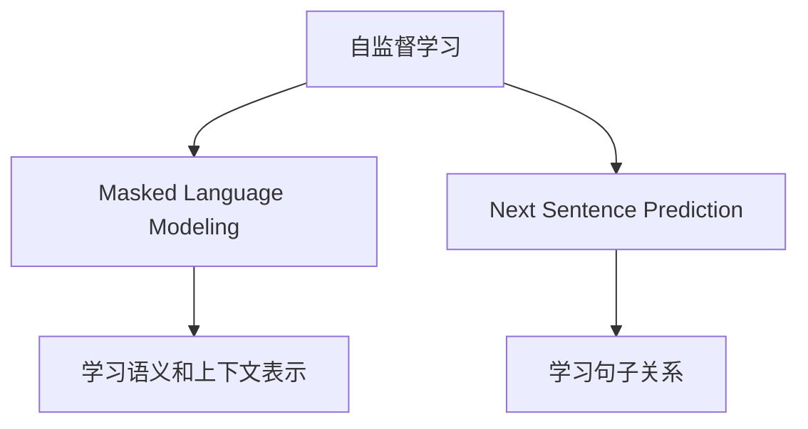
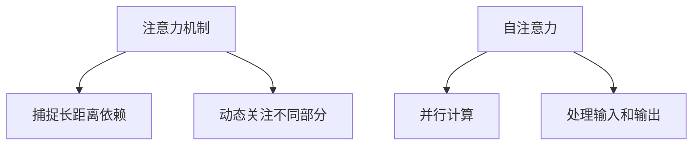
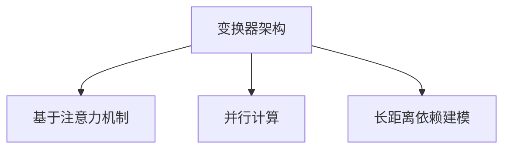
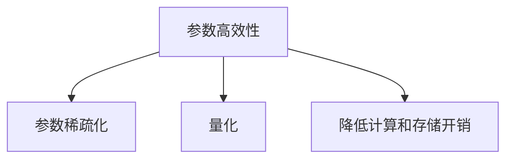

# 大语言模型原理基础与前沿：系统性和全面泛化

## 1. 背景介绍

### 1.1 人工智能的演进

人工智能(AI)的发展经历了多个阶段,从早期的专家系统和机器学习算法,到深度学习的兴起,再到当前大规模预训练语言模型的崛起。大型语言模型代表了人工智能发展的最新阶段,展现出前所未有的能力,在自然语言处理、推理、多模态等领域取得了突破性进展。

### 1.2 大语言模型的兴起

大型语言模型(Large Language Models,LLMs)是一种基于自然语言的人工智能模型,通过在海量文本数据上进行预训练,学习语言的内在规律和知识表示。代表性模型包括GPT-3、PaLM、Chinchilla等。这些模型具有惊人的泛化能力,可以在看似无关的任务上表现出色,展现出"全面泛化"的潜力。

### 1.3 重要性和挑战

大语言模型被誉为"下一个操作系统",有望成为通用人工智能的基石。然而,它们也面临着诸多挑战,如数据质量、模型稳健性、公平性、隐私等。全面理解大语言模型的原理和局限性,对于推动人工智能的可持续发展至关重要。

## 2. 核心概念与联系

### 2.1 自监督学习

大语言模型的核心是自监督学习(Self-Supervised Learning),即通过预测被掩蔽的词或句子来学习语言表示。这种方式不需要人工标注的数据,可以利用互联网上的海量文本进行训练。



### 2.2 注意力机制

注意力机制(Attention Mechanism)是大语言模型的关键组成部分,它允许模型动态地关注输入序列的不同部分,捕捉长距离依赖关系。自注意力(Self-Attention)是一种特殊的注意力机制,它使模型能够同时处理输入和输出,提高了并行计算能力。



### 2.3 变换器架构

变换器(Transformer)是大语言模型的核心架构,它完全基于注意力机制,摒弃了传统的递归神经网络和卷积神经网络。变换器架构具有并行性强、长距离依赖建模能力强等优点,成为大语言模型的标准选择。



### 2.4 参数高效性

大语言模型通常拥有数十亿甚至上万亿个参数,这使得它们能够学习到丰富的语言知识。然而,过多的参数也带来了计算和存储的挑战。因此,提高参数的高效性是一个重要的研究方向,例如参数稀疏化、量化等技术。



## 3. 核心算法原理具体操作步骤

### 3.1 预训练阶段

大语言模型的训练分为两个阶段:预训练和微调。在预训练阶段,模型在大规模无标注文本数据上进行自监督学习,获取通用的语言表示能力。

1. **数据预处理**:将原始文本数据进行标记化、分词、构建词表等预处理操作。
2. **掩蔽策略**:根据一定策略(如随机掩蔽、连续掩蔽等)对输入序列进行掩蔽。
3. **前向传播**:将掩蔽后的序列输入变换器模型,计算掩蔽位置的预测概率分布。
4. **损失计算**:将预测概率与真实标签进行比较,计算掩蔽语言模型(MLM)损失。
5. **反向传播**:根据损失对模型参数进行更新,使用优化器(如AdamW)进行参数更新。
6. **模型保存**:在训练过程中定期保存模型参数的检查点。

### 3.2 微调阶段

在特定的下游任务上,需要对预训练的大语言模型进行微调(Fine-tuning),使其适应任务的特征。

1. **任务数据准备**:收集并预处理特定任务的训练数据。
2. **模型加载**:加载预训练的大语言模型参数。
3. **输入构造**:根据任务要求构造模型的输入序列,例如问题-答案对、文本-标签对等。
4. **微调训练**:在任务数据上对模型进行有监督的微调训练,更新模型参数。
5. **评估和选择**:在验证集上评估模型性能,选择最优的模型参数。
6. **模型部署**:将微调后的模型部署到生产环境中,用于实际推理和预测。

## 4. 数学模型和公式详细讲解举例说明

### 4.1 自注意力机制

自注意力机制是变换器架构的核心组件,它允许模型动态地关注输入序列的不同部分,捕捉长距离依赖关系。给定一个输入序列 $X = (x_1, x_2, \dots, x_n)$,自注意力计算过程如下:

1. **查询、键和值的计算**:
   $$
   \begin{aligned}
   Q &= X \cdot W_Q \\
   K &= X \cdot W_K \\
   V &= X \cdot W_V
   \end{aligned}
   $$
   其中 $W_Q$、$W_K$ 和 $W_V$ 分别是查询、键和值的线性变换矩阵。

2. **注意力分数计算**:
   $$
   \text{Attention}(Q, K, V) = \text{softmax}\left(\frac{Q \cdot K^T}{\sqrt{d_k}}\right) \cdot V
   $$
   其中 $d_k$ 是缩放因子,用于防止点积过大导致的梯度饱和问题。

3. **多头注意力**:为了捕捉不同的关系,引入了多头注意力机制。每个注意力头捕捉不同的子空间表示,最终将它们concatenate起来作为输出。
   $$
   \text{MultiHead}(Q, K, V) = \text{Concat}(\text{head}_1, \dots, \text{head}_h) \cdot W_O
   $$
   其中 $\text{head}_i = \text{Attention}(Q \cdot W_i^Q, K \cdot W_i^K, V \cdot W_i^V)$,并且 $W_i^Q$、$W_i^K$、$W_i^V$ 和 $W_O$ 都是可学习的线性变换矩阵。

自注意力机制赋予了模型强大的长距离依赖建模能力,是大语言模型取得卓越性能的关键所在。

### 4.2 掩蔽语言模型损失函数

在预训练阶段,大语言模型通常采用掩蔽语言模型(Masked Language Model,MLM)的目标函数进行训练。给定一个长度为 $n$ 的输入序列 $X = (x_1, x_2, \dots, x_n)$,以及掩蔽位置集合 $\mathcal{M}$,MLM损失函数定义如下:

$$
\mathcal{L}_\text{MLM} = -\frac{1}{|\mathcal{M}|} \sum_{i \in \mathcal{M}} \log P(x_i | X_{\backslash i})
$$

其中 $X_{\backslash i}$ 表示将 $x_i$ 掩蔽后的输入序列,模型的目标是最大化掩蔽位置的条件概率 $P(x_i | X_{\backslash i})$。通过最小化MLM损失函数,模型可以学习到语言的内在规律和知识表示。

在实际训练中,通常还会引入其他辅助目标函数,如下一句预测(Next Sentence Prediction,NSP)等,以提高模型的泛化能力。

## 5. 项目实践:代码实例和详细解释说明

以下是一个使用PyTorch实现的简单掩蔽语言模型的示例代码,用于说明核心原理。

```python
import torch
import torch.nn as nn
from transformers import BertTokenizer, BertModel

# 加载预训练的BERT模型和分词器
tokenizer = BertTokenizer.from_pretrained('bert-base-uncased')
bert_model = BertModel.from_pretrained('bert-base-uncased')

# 定义掩蔽语言模型
class MaskedLanguageModel(nn.Module):
    def __init__(self, bert_model):
        super(MaskedLanguageModel, self).__init__()
        self.bert = bert_model
        self.mlm_head = nn.Linear(bert_model.config.hidden_size, bert_model.config.vocab_size)

    def forward(self, input_ids, attention_mask, masked_lm_labels):
        outputs = self.bert(input_ids, attention_mask=attention_mask)
        sequence_output = outputs.last_hidden_state
        prediction_scores = self.mlm_head(sequence_output)

        masked_lm_loss = None
        if masked_lm_labels is not None:
            loss_fct = nn.CrossEntropyLoss()
            masked_lm_loss = loss_fct(prediction_scores.view(-1, self.bert.config.vocab_size),
                                      masked_lm_labels.view(-1))

        return prediction_scores, masked_lm_loss

# 示例输入
text = "The quick brown fox [MASK] over the lazy dog."
encoded_input = tokenizer.encode_plus(text, return_tensors='pt', max_length=128, pad_to_max_length=True)
input_ids = encoded_input['input_ids']
attention_mask = encoded_input['attention_mask']

# 获取掩蔽位置的标签
masked_index = (input_ids == tokenizer.mask_token_id).nonzero().item()
masked_label = input_ids[0, masked_index]

# 构建模型并进行前向传播
model = MaskedLanguageModel(bert_model)
outputs = model(input_ids, attention_mask, masked_lm_labels=masked_label.unsqueeze(0))
prediction_scores, masked_lm_loss = outputs

# 输出预测结果
predicted_index = torch.argmax(prediction_scores[0, masked_index]).item()
predicted_token = tokenizer.decode([predicted_index])
print(f"Predicted token: {predicted_token}")
```

在上述示例中,我们首先加载预训练的BERT模型和分词器。然后定义了一个掩蔽语言模型,它包含BERT模型和一个线性层作为MLM头。在前向传播过程中,输入序列首先通过BERT模型获取序列输出表示,然后将其输入到MLM头进行掩蔽词预测。如果提供了掩蔽位置的标签,则计算交叉熵损失作为MLM损失。

最后,我们构造了一个示例输入序列,获取掩蔽位置的标签,并将它们输入到模型中进行预测。输出结果是预测的词元。通过这个简单的示例,我们可以直观地了解掩蔽语言模型的核心原理和实现方式。

## 6. 实际应用场景

大语言模型在自然语言处理的各个领域都有广泛的应用,包括但不限于以下场景:

### 6.1 文本生成

利用大语言模型的强大生成能力,可以生成高质量的文本内容,如新闻报道、小说创作、广告文案等。GPT-3等模型已经展现出惊人的文本生成能力,在某些领域甚至可以媲美人类作者。

### 6.2 问答系统

大语言模型可以作为问答系统的核心组件,通过理解问题并从知识库中检索相关信息,生成自然语言形式的答案。这种问答系统可以应用于客户服务、智能助手等场景。

### 6.3 机器翻译

将大语言模型应用于机器翻译任务,可以显著提高翻译质量。模型可以同时捕捉源语言和目标语言的语义和语法特征,生成更加流畅和准确的翻译结果。

### 6.4 文本摘要

大语言模型可以用于自动生成文本摘要,捕捉原文的核心内容并以简洁的形式呈现。这对于处理海量文本信息非常有帮助,可以应用于新闻摘要、文献摘要等场景。

###