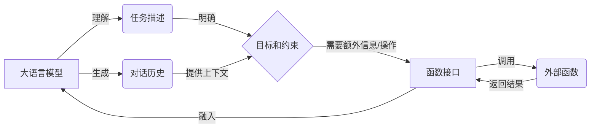

# 大语言模型应用指南：function calling

## 1. 背景介绍

### 1.1 大语言模型概述
大语言模型(Large Language Model, LLM)是近年来自然语言处理(NLP)领域最重要的突破之一。它们是在海量文本数据上训练的深度神经网络模型,具有强大的语言理解和生成能力。代表模型有GPT-3、PaLM、BLOOM等。

### 1.2 大语言模型的应用场景
- 对话系统:LLM可以作为对话系统的核心组件,理解用户输入并生成自然流畅的回复。
- 文本生成:LLM可以根据给定的上下文或提示生成连贯、富有创意的文本。
- 知识问答:基于LLM构建的问答系统可以从海量知识库中检索相关信息,生成准确的答案。
- 代码生成:LLM在代码补全、代码生成等任务上表现出色,提高开发效率。
- 其他应用:如文本摘要、情感分析、文本分类、机器翻译等。

### 1.3 Function Calling的提出
尽管LLM在多个NLP任务上取得了瞩目的成绩,但它们仍然存在一些局限性:
1. LLM生成的文本可能与事实不符,存在幻觉现象。
2. LLM难以执行需要多步推理、数学计算等复杂任务。
3. LLM无法主动获取实时信息,知识容易过时。

为了克服这些局限性,研究者提出了Function Calling的思路,即赋予LLM调用外部函数的能力,拓展其应用场景。

## 2. 核心概念与联系

### 2.1 Function Calling的定义
Function Calling是指大语言模型在生成文本的过程中,通过某种机制调用预定义的外部函数,获取所需信息或执行特定操作,并将结果融入到生成的文本中的过程。

### 2.2 涉及的核心概念
- 大语言模型:掌握语言知识、执行语言任务的基础模型。
- 外部函数:提供特定功能的独立模块,如数据库查询、数学计算、第三方API调用等。
- 函数接口:定义函数的输入输出格式,实现LLM与外部函数的交互。
- 对话历史:LLM与用户之间的多轮对话记录,为函数调用提供上下文信息。
- 任务描述:用户输入的自然语言指令,明确对话的目标和约束条件。

### 2.3 核心概念之间的关系


## 3. 核心算法原理与具体操作步骤

### 3.1 模型微调
为了使LLM具备Function Calling的能力,首先需要在特定领域数据上对预训练模型进行微调。微调过程分为以下步骤:
1. 构建包含函数调用的训练数据集。数据格式为<context, question, function_call, answer>的四元组。
2. 在预训练模型的基础上,添加一个函数调用分类器和一个文本生成器。
3. 使用训练数据集对模型进行微调,优化分类器和生成器的参数。分类器学习在给定上下文时是否需要调用函数,生成器学习生成包含函数调用的文本片段。
4. 微调完成后,模型具备了根据上下文判断是否需要调用函数,以及生成函数调用文本的能力。

### 3.2 函数调用流程
模型完成微调后,可以应用于实际的对话场景中。函数调用的具体流程如下:
1. 用户输入自然语言指令,明确对话的目标和约束条件。
2. LLM对用户输入进行理解,结合对话历史信息判断是否需要调用外部函数。
3. 如果需要调用函数,LLM生成包含函数名、参数等信息的文本片段。
4. 解析LLM生成的文本片段,提取函数名和参数,通过函数接口调用相应的外部函数。
5. 外部函数执行完毕后,将返回结果传递给LLM。
6. LLM将函数返回的结果融入到后续生成的文本中,形成完整的回复。
7. 将LLM生成的回复返回给用户,更新对话历史。
8. 重复步骤2-7,直到对话结束。

## 4. 数学模型和公式详细讲解举例说明

### 4.1 大语言模型的数学描述
大语言模型的本质是一个条件语言模型,给定上下文 $c$,预测下一个词 $x$ 的概率分布 $P(x|c)$。假设词表大小为 $V$,上下文 $c$ 由 $n$ 个词组成,则模型可以表示为:

$$
P(x|c) = \frac{\exp(e_x^T h_c)}{\sum_{i=1}^V \exp(e_i^T h_c)}
$$

其中, $e_i \in \mathbb{R}^d$ 是词表中第 $i$ 个词的嵌入向量, $h_c \in \mathbb{R}^d$ 是上下文 $c$ 的隐藏状态,可以通过神经网络编码器获得:

$$
h_c = \text{Encoder}(c) = \text{Encoder}(x_1, x_2, \dots, x_n)
$$

编码器的具体实现可以采用RNN、Transformer等结构。

### 4.2 函数调用分类器
函数调用分类器的作用是判断在给定上下文 $c$ 时,是否需要调用外部函数。可以将其建模为一个二分类问题,使用sigmoid函数输出调用函数的概率:

$$
P(\text{call}|c) = \sigma(w^T h_c + b)
$$

其中, $w \in \mathbb{R}^d$ 和 $b \in \mathbb{R}$ 是分类器的参数。如果 $P(\text{call}|c) > 0.5$,则表示需要调用函数。

### 4.3 函数调用生成器
函数调用生成器的作用是生成包含函数名、参数等信息的文本片段。可以使用与大语言模型相同的条件语言模型结构,只不过词表换成了函数名、参数、括号等特殊符号。生成的概率分布为:

$$
P(y|c) = \prod_{i=1}^m P(y_i|c, y_1, \dots, y_{i-1})
$$

其中, $y=(y_1,\dots,y_m)$ 是生成的函数调用文本片段,长度为 $m$。生成器的训练目标是最小化负对数似然损失:

$$
\mathcal{L} = -\sum_{i=1}^m \log P(y_i|c, y_1, \dots, y_{i-1})
$$

## 5. 项目实践:代码实例和详细解释说明

下面是一个简单的Python代码示例,展示了如何使用Function Calling增强大语言模型的功能。

```python
import torch
import torch.nn as nn
import torch.nn.functional as F

class FunctionCallingLM(nn.Module):
    def __init__(self, pretrained_model, num_functions):
        super().__init__()
        self.pretrained_model = pretrained_model
        self.function_classifier = nn.Linear(pretrained_model.config.hidden_size, 1)
        self.function_generator = nn.Linear(pretrained_model.config.hidden_size, num_functions)
    
    def forward(self, input_ids, attention_mask):
        outputs = self.pretrained_model(input_ids, attention_mask=attention_mask)
        hidden_states = outputs.last_hidden_state
        pooled_output = hidden_states[:, 0]  # 取第一个token的隐藏状态作为整个输入的表示
        
        # 函数调用分类器
        call_logits = self.function_classifier(pooled_output)
        call_probs = torch.sigmoid(call_logits)
        
        # 函数调用生成器
        gen_logits = self.function_generator(pooled_output)
        gen_probs = F.softmax(gen_logits, dim=-1)
        
        return call_probs, gen_probs

# 加载预训练模型
pretrained_model = transformers.AutoModel.from_pretrained("bert-base-uncased")

# 定义函数调用增强的大语言模型
model = FunctionCallingLM(pretrained_model, num_functions=10)

# 准备训练数据
train_data = [
    {
        "context": "What is the capital of France?",
        "question": "The capital of France is",
        "function_call": "database_lookup(country=France, key=capital)",
        "answer": "Paris"
    },
    ...
]

# 模型微调
optimizer = torch.optim.AdamW(model.parameters(), lr=1e-5)
for epoch in range(num_epochs):
    for batch in train_data:
        input_ids = ...  # 将context和question转换为模型输入
        attention_mask = ...
        call_labels = ...  # 根据是否有function_call生成标签
        gen_labels = ...  # 将function_call转换为模型输出
        
        call_probs, gen_probs = model(input_ids, attention_mask)
        
        call_loss = F.binary_cross_entropy(call_probs, call_labels)
        gen_loss = F.cross_entropy(gen_probs, gen_labels)
        
        loss = call_loss + gen_loss
        loss.backward()
        optimizer.step()
        optimizer.zero_grad()

# 模型推理
context = "What is the population of New York City?"
input_ids = ...
attention_mask = ...

with torch.no_grad():
    call_probs, gen_probs = model(input_ids, attention_mask)

if call_probs > 0.5:
    function_call = ...  # 根据gen_probs解码出函数调用文本
    result = execute_function_call(function_call)  # 调用外部函数
    answer = generate_answer(result)  # 将函数结果融入到生成的答案中
else:
    answer = generate_answer()  # 直接生成答案

print(answer)
```

以上代码实现了一个简单的Function Calling增强大语言模型,主要步骤如下:
1. 定义了一个 `FunctionCallingLM` 类,在预训练模型的基础上添加了函数调用分类器和生成器。
2. 准备了包含函数调用的训练数据,用于模型微调。
3. 在训练过程中,根据是否需要调用函数生成分类标签,将函数调用文本转换为生成标签,计算分类损失和生成损失,并更新模型参数。
4. 在推理阶段,根据函数调用分类器的输出判断是否需要调用函数。如果需要,则解码函数调用文本并执行,将结果融入到生成的答案中;否则直接生成答案。

实际应用中,还需要根据具体任务设计合适的函数接口和调用方式,并收集高质量的训练数据。

## 6. 实际应用场景

Function Calling增强的大语言模型可以应用于多个实际场景,例如:

### 6.1 智能客服
- 场景描述:用户通过文字或语音与智能客服系统进行交互,系统根据用户的问题提供相应的答复和服务。
- Function Calling的应用:客服系统可以调用公司内部的数据库、知识库、订单系统等,获取用户所需的信息,如订单状态、产品参数、服务指南等。同时还可以调用第三方服务,如天气查询、股票行情等。

### 6.2 虚拟助手
- 场景描述:用户通过智能音箱、手机等设备与虚拟助手进行交互,助手根据用户的指令提供相应的服务,如播放音乐、设置提醒、回答问题等。
- Function Calling的应用:虚拟助手可以调用各种本地或云端的服务,如音乐播放器、日历、搜索引擎、物联网设备控制等,极大地扩展了助手的功能范围。

### 6.3 智能教育
- 场景描述:学生在智能教育平台上学习,系统根据学生的提问和互动情况,提供个性化的答疑和指导。
- Function Calling的应用:智能教育系统可以调用题库、知识图谱、在线实验环境等教学资源,针对学生的问题给出详细的解释和演示。同时还可以调用学生的学习历史数据,对学生的知识掌握情况进行分析,提供个性化的学习建议。

### 6.4 医疗诊断
- 场景描述:医生或患者通过智能诊断系统输入症状描述,系统给出可能的疾病和治疗方案。
- Function Calling的应用:智能诊断系统可以调用医