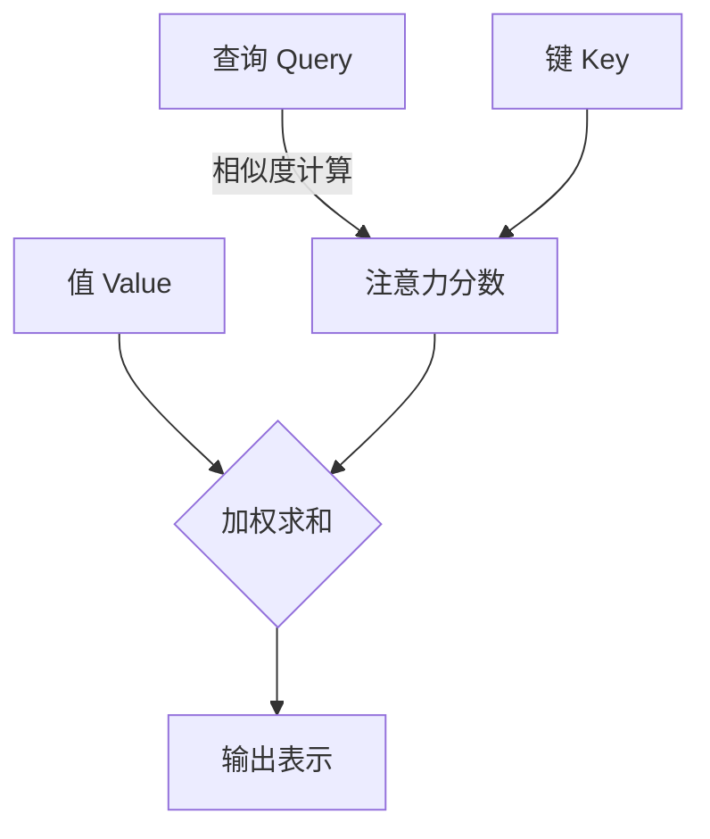

# 大语言模型应用指南：入门

## 1.背景介绍

### 1.1 什么是大语言模型?

大语言模型(Large Language Model, LLM)是一种基于深度学习的自然语言处理(NLP)技术,旨在从大量文本数据中学习语言模式和语义关系。这些模型通过训练巨大的神经网络,能够生成看似人类写作的连贯、流畅的文本输出。

LLM的出现源于近年来计算能力、数据可用性和算法创新的飞跃进步。例如GPT-3、BERT等模型在各种NLP任务上展现出了令人惊叹的性能,引发了学术界和工业界的广泛关注。

### 1.2 为什么要关注大语言模型?

大语言模型正在彻底改变人机交互的方式,为智能系统赋予更自然、更富表现力的语言能力。它们可以在以下领域发挥重要作用:

- 对话系统和虚拟助手
- 内容创作和自动化写作 
- 问答系统和知识库构建
- 文本摘要和文本分类等NLP任务
- 代码生成和程序合成

随着模型规模和性能的不断提升,大语言模型将为越来越多的应用场景提供支持,成为推动人工智能发展的重要动力。

## 2.核心概念与联系

### 2.1 语言模型的本质

语言模型的核心目标是学习文本序列的概率分布,即给定前面的单词序列,预测下一个单词的概率是多少。形式化地,对于单词序列$w_1, w_2, ..., w_n$,语言模型需要学习联合概率:

$$P(w_1, w_2, ..., w_n) = \prod_{i=1}^{n}P(w_i|w_1, ..., w_{i-1})$$

根据链式法则,该联合概率可以分解为一系列条件概率的乘积。传统的n-gram语言模型由于马尔可夫假设,只考虑了有限历史窗口,而大语言模型则试图捕捉更长范围的上下文依赖关系。

### 2.2 自回归模型与Transformer

大语言模型通常采用自回归(Auto-Regressive)结构,即模型逐个生成单词,每个时间步只看到之前的单词。自回归模型的关键是学习条件概率分布$P(w_t|w_1,...,w_{t-1})$,其中$w_t$是当前时间步要生成的单词。

```mermaid
graph TD
    A[输入序列] -->|Embedding| B(Transformer Encoder)
    B --> C{生成单词 w_t}
    C -->|生成概率分布| D[P(w_t|w_1,...,w_{t-1})]
    D --> |输出| E(w_t)
    E --> F[输入序列 + w_t]
    F --> B
```

上图展示了自回归模型的工作流程。Transformer编码器被用于捕捉输入序列的上下文信息,然后基于上下文生成当前单词的概率分布,并从中采样输出单词。

值得注意的是,由于自回归特性,生成的单词将被送回作为下一步的输入,这种特性使得生成的文本具有很强的连贯性和一致性。

### 2.3 注意力机制与长距离依赖

传统的序列模型如RNN在捕捉长距离依赖关系时存在困难,而Transformer凭借其全新的注意力机制得以突破这一瓶颈。注意力机制使得模型可以直接关注整个输入序列中的任何单词,从而更好地建模长程依赖关系。

具体来说,注意力机制通过计算查询(Query)与键(Key)的相似性来确定应该分配多少注意力给值(Value),从而捕捉输入序列中不同位置单词之间的联系。这种灵活的加权方式使得Transformer能够自适应地聚焦于对当前预测目标最相关的上下文信息。



注意力机制赋予了大语言模型强大的表达能力,使其能够更好地理解和生成复杂的、富有语义的自然语言序列。

## 3.核心算法原理具体操作步骤

### 3.1 Transformer编码器

Transformer编码器是大语言模型的核心组件,负责从输入序列中构建上下文表示。它由多个相同的编码器层组成,每一层都包含两个关键的子层:多头注意力机制和前馈神经网络。

1. **embedding层**: 将输入单词映射为embedding向量表示
2. **位置编码**: 因为Transformer没有循环或卷积结构,无法直接获取序列的位置信息,因此需要将位置信息编码到embedding中
3. **多头注意力**: 计算embedding与自身的注意力,获取输入序列各单词之间的相关性
    - 将查询(Q)、键(K)、值(V)进行线性投影得到多个头
    - 分别计算每个头的注意力权重: $\mathrm{Attention}(Q, K, V) = \mathrm{softmax}(\frac{QK^T}{\sqrt{d_k}})V$
    - 对多头注意力的结果进行拼接
4. **残差连接**: 将注意力输出与输入相加,保留了输入的全部信息
5. **层归一化**: 对残差连接的结果进行归一化,加快收敛
6. **前馈网络**: 两个全连接层,引入非线性,提高模型表达能力
7. **残差连接和归一化**: 与注意力子层类似的操作
8. **堆叠编码器层**: 将上述过程重复堆叠多次,使表示更加抽象

通过上述层层计算,Transformer编码器能够捕捉输入序列中的长程依赖关系,为下游的语言生成任务提供有力的上下文表示。

### 3.2 GPT语言模型

GPT(Generative Pre-trained Transformer)是一种常见的基于Transformer解码器的自回归语言模型。与编码器不同,解码器在每一个位置只能看到该位置之前的单词,以实现自回归生成。

1. **输入embedding和位置编码**: 与编码器类似
2. **掩码自注意力**: 在标准的注意力机制之上,引入一个掩码向量,使注意力只能看到当前位置之前的输入
3. **残差连接和层归一化**
4. **前馈网络**
5. **残差连接和层归一化**
6. **堆叠解码器层**
7. **生成概率**: 通过线性层和softmax,从最终的输出向量中生成下一个单词的概率分布
8. **输出采样**: 从概率分布中采样出单词,作为下一步的输入

GPT模型通过掩码机制实现了自回归生成,使得生成的单词可以作为下一步的输入,从而产生连贯的文本序列。在预训练阶段,GPT在大规模无监督语料上进行训练,学习通用的语言知识。在下游任务中,可以通过微调的方式指导GPT生成特定类型的文本。

## 4.数学模型和公式详细讲解举例说明

### 4.1 Transformer注意力计算

Transformer的注意力机制是整个模型的核心,它使用了一种全新的方法来捕捉输入序列中任意两个单词之间的相关性。我们来具体分析一下注意力计算的数学原理。

给定一个序列$X = (x_1, x_2, ..., x_n)$,我们首先将其映射为一系列的查询(Query)、键(Key)和值(Value)向量:

$$\begin{aligned}
Q &= X \cdot W^Q\\
K &= X \cdot W^K\\
V &= X \cdot W^V
\end{aligned}$$

其中$W^Q, W^K, W^V$是可学习的权重矩阵。接下来,我们计算查询$q_t$与所有键的相似性,并通过softmax函数得到注意力权重:

$$\mathrm{Attention}(q_t, K, V) = \mathrm{softmax}(\frac{q_tK^T}{\sqrt{d_k}})V$$

其中$d_k$是缩放因子,防止点积过大导致softmax梯度饱和。最终,注意力输出就是所有值向量的加权和:

$$\mathrm{Attention}(Q, K, V) = \left(\mathrm{softmax}(\frac{QK^T}{\sqrt{d_k}})V\right)^T$$

以上是单头注意力的计算过程。在实践中,我们会使用多头注意力(Multi-Head Attention),即分别计算$h$个注意力头,然后将它们的结果拼接起来:

$$\begin{aligned}
\mathrm{MultiHead}(Q, K, V) &= \mathrm{Concat}(\mathrm{head}_1, ..., \mathrm{head}_h) \cdot W^O\\
\mathrm{where}\ \mathrm{head}_i &= \mathrm{Attention}(Q \cdot W_i^Q, K \cdot W_i^K, V \cdot W_i^V)
\end{aligned}$$

多头注意力能够从不同的表示子空间捕捉输入序列的相关性,增强了模型的表达能力。

### 4.2 掩码自注意力与自回归

在语言生成任务中,我们希望模型能够基于已生成的单词序列,预测下一个最可能的单词。这就需要用到掩码自注意力(Masked Self-Attention)机制。

具体来说,在标准的自注意力计算中,我们会引入一个掩码向量$M$,使得注意力只能看到当前位置之前的输入:

$$\mathrm{MaskedAttention}(Q, K, V) = \mathrm{softmax}(\frac{QK^T + M}{\sqrt{d_k}})V$$

其中$M$是一个三角掩码矩阵,对于序列位置$(t, s)$,如果$t \leq s$,则$M_{t,s} = 0$,否则$M_{t,s} = -\infty$。这样一来,softmax的输出注意力权重就只会分配给当前位置之前的单词。

通过掩码自注意力,语言模型可以自回归地生成单词序列。在时间步$t$,模型会根据$x_{<t} = (x_1, ..., x_{t-1})$生成$x_t$,并将其附加到序列末尾,作为下一步的输入。这种自回归的生成方式,确保了输出序列的连贯性和一致性。

### 4.3 示例:生成文本

假设我们希望生成一个简单的句子"我爱学习自然语言处理"。首先,我们将其转化为单词序列:

$$X = (\mathrm{我}, \mathrm{爱}, \mathrm{学习}, \mathrm{自然}, \mathrm{语言}, \mathrm{处理})$$

接下来,我们使用Transformer解码器进行自回归生成:

1. 将起始符号"<s>"输入解码器,得到初始隐状态$h_0$
2. 在时间步$t=1$,计算$P(x_1|\mathrm{<s>}) = \mathrm{softmax}(W_o h_0)$,从中采样得到$x_1 = \mathrm{我}$
3. 将$x_1$附加到输入序列,得到$X' = (\mathrm{<s>}, \mathrm{我})$,计算新的隐状态$h_1 = \mathrm{Decoder}(X')$
4. 在时间步$t=2$,计算$P(x_2|X') = \mathrm{softmax}(W_o h_1)$,从中采样得到$x_2 = \mathrm{爱}$
5. 重复上述过程,直到生成终止符号"<\s>"或达到最大长度

通过上面的自回归过程,我们就能够一步步生成期望的句子。需要注意的是,在每一步生成时,模型都只能看到之前的单词序列,这保证了生成的连贯性。同时,模型也会受到预训练语料的影响,倾向于生成更自然、更符合语言习惯的句子。

## 5.项目实践:代码实例和详细解释说明

为了帮助读者更好地理解大语言模型的实际应用,我们将使用Python中的transformers库,构建一个基于GPT2的文本生成系统。

### 5.1 安装依赖库

首先,我们需要安装所需的Python库:

```bash
pip install transformers
```

### 5.2 加载预训练模型

接下来,我们加载GPT2的预训练模型和tokenizer:

```python
from transformers import GPT2LMHeadModel, GPT2Token