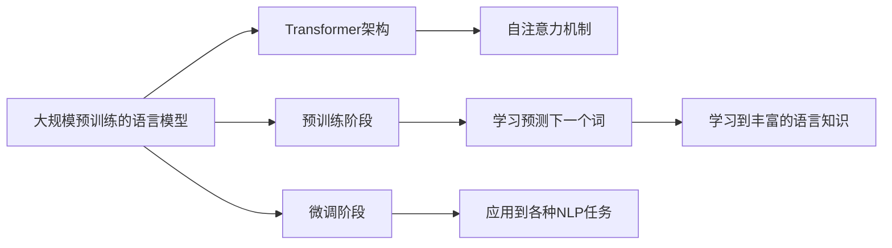

## 1.背景介绍

在过去的几年中，大规模预训练的语言模型（Large-Scale Pretrained Language Models，简称PLMs）如GPT-3、BERT等在自然语言处理（Natural Language Processing，简称NLP）领域取得了显著的成就。这些模型通过对大量文本数据进行预训练，学习到了丰富的语言知识，从而在各种NLP任务中取得了优异的表现。然而，尽管大语言模型在许多应用中表现出色，但它们也存在一些局限性，这些局限性可能会影响到它们在实际应用中的效果。

## 2.核心概念与联系

大规模预训练的语言模型是通过在大量的文本数据上进行预训练，学习到了丰富的语言知识。这些模型通常使用Transformer架构，这是一种基于自注意力（Self-Attention）机制的深度学习模型。预训练阶段，模型通过学习预测文本中的下一个词，从而学习到了丰富的语言知识。在此基础上，模型可以通过微调（Fine-tuning）应用到各种NLP任务中，如文本分类、情感分析、问答系统等。



## 3.核心算法原理具体操作步骤

大规模预训练的语言模型的训练通常包括两个阶段：预训练阶段和微调阶段。

### 3.1 预训练阶段

在预训练阶段，模型通过学习预测文本中的下一个词，从而学习到了丰富的语言知识。这一阶段的训练数据通常是大量的无标注文本数据，如维基百科等。

### 3.2 微调阶段

在微调阶段，模型在预训练的基础上，进行微调，以适应特定的NLP任务。这一阶段的训练数据是标注的数据，如文本分类任务的数据。

## 4.数学模型和公式详细讲解举例说明

大规模预训练的语言模型通常使用Transformer架构，这是一种基于自注意力（Self-Attention）机制的深度学习模型。自注意力机制的数学表达如下：

假设输入的序列为$x_1, x_2, ..., x_n$，则自注意力机制可以表示为：

$$
\text{Attention}(Q, K, V) = \text{softmax}\left(\frac{QK^T}{\sqrt{d_k}}\right)V
$$

其中，$Q$, $K$, $V$分别是查询（Query），键（Key），值（Value），它们是输入序列的线性变换，$d_k$是键的维度。

## 5.项目实践：代码实例和详细解释说明

以下是使用Hugging Face的Transformers库进行大规模预训练语言模型微调的代码示例：

```python
from transformers import BertForSequenceClassification, BertTokenizer, Trainer, TrainingArguments

# 加载预训练模型和分词器
model = BertForSequenceClassification.from_pretrained('bert-base-uncased')
tokenizer = BertTokenizer.from_pretrained('bert-base-uncased')

# 加载数据
train_dataset = load_dataset('my_train_dataset')
val_dataset = load_dataset('my_val_dataset')

# 初始化训练参数
training_args = TrainingArguments(
    output_dir='./results',
    num_train_epochs=3,
    per_device_train_batch_size=16,
    per_device_eval_batch_size=64,
    warmup_steps=500,
    weight_decay=0.01,
    logging_dir='./logs',
)

# 初始化训练器
trainer = Trainer(
    model=model,
    args=training_args,
    train_dataset=train_dataset,
    eval_dataset=val_dataset
)

# 开始训练
trainer.train()
```

## 6.实际应用场景

大规模预训练的语言模型在各种NLP任务中都有广泛的应用，如文本分类、情感分析、问答系统、机器翻译、文本生成等。然而，尽管大语言模型在许多应用中表现出色，但它们也存在一些局限性，如模型的解释性不强，模型可能会生成有偏见的结果等。

## 7.工具和资源推荐

- Hugging Face的Transformers库：这是一个提供各种预训练模型的库，包括BERT、GPT-3等。
- PyTorch和TensorFlow：这两个深度学习框架都支持Transformer模型的构建和训练。

## 8.总结：未来发展趋势与挑战

大规模预训练的语言模型是当前NLP领域的研究热点，它们在各种NLP任务中都取得了显著的成就。然而，这些模型也存在一些局限性，如模型的解释性不强，模型可能会生成有偏见的结果等。在未来，如何解决这些问题，提升模型的可解释性和公平性，将是研究的重要方向。

## 9.附录：常见问题与解答

1. **问：大规模预训练的语言模型有哪些局限性？**

   答：大规模预训练的语言模型主要有以下几个局限性：模型的解释性不强，模型可能会生成有偏见的结果，模型的训练需要大量的计算资源，模型的训练数据需要大量的文本数据。

2. **问：如何解决大规模预训练的语言模型的局限性？**

   答：解决大规模预训练的语言模型的局限性需要从多个方面来考虑，如提升模型的可解释性和公平性，优化模型的训练算法等。

作者：禅与计算机程序设计艺术 / Zen and the Art of Computer Programming