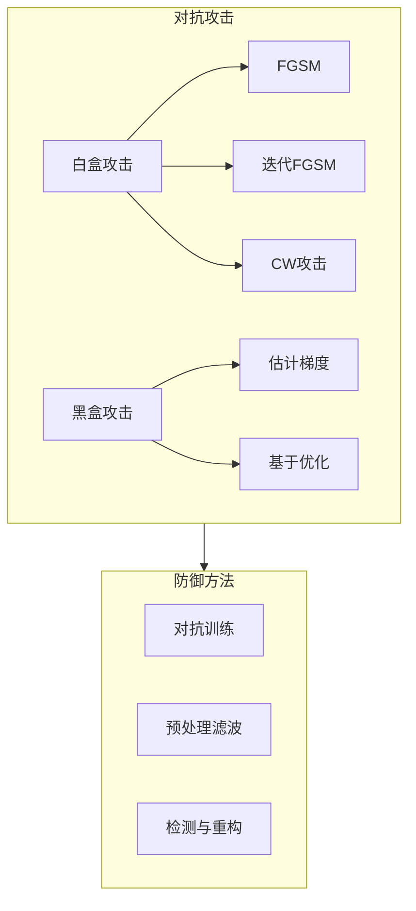

# 大语言模型应用指南：对抗样本

## 1.背景介绍

### 1.1 大语言模型的兴起

近年来,自然语言处理(NLP)领域取得了长足的进步,很大程度上归功于大型神经网络语言模型的出现和发展。这些大型语言模型通过在海量文本数据上进行预训练,学习到了丰富的语言知识和上下文表示能力,从而在下游的NLP任务中表现出了卓越的性能。

代表性的大型语言模型有谷歌的BERT、OpenAI的GPT系列、微软的MT-NLG等,它们在机器翻译、文本摘要、问答系统、情感分析等众多任务中都取得了令人瞩目的成绩。这些模型的出现极大地推动了NLP技术的发展和应用。

### 1.2 对抗样本的威胁

然而,尽管大型语言模型取得了巨大的成功,但它们也面临着一个严峻的安全挑战——对抗样本攻击。对抗样本指的是在原始输入数据上添加了精心设计的微小扰动,使得模型的预测结果发生明显错误,但这种扰动对人类来说是不可察觉的。

对抗样本攻击不仅会影响模型在线上应用场景的稳定性和可靠性,而且还会带来严重的安全隐患。比如在机器翻译系统中,对抗样本可能会导致关键信息的丢失或者错误翻译;在语音识别系统中,对抗样本可能会使系统识别出与原始音频完全不同的内容;在内容审核系统中,对抗样本可能会逃过审核从而传播有害信息等。

因此,研究对抗样本攻击机理并提出有效的防御方法,已经成为保障大型语言模型安全可靠应用的当务之急。

## 2.核心概念与联系

### 2.1 对抗样本的定义

对抗样本(Adversarial Example)是指在原始输入样本上添加了人类难以察觉但会导致模型预测错误的微小扰动后得到的样本。形式化地定义如下:

给定一个机器学习模型 $f: \mathcal{X} \rightarrow \mathcal{Y}$ 和原始输入样本 $x \in \mathcal{X}$,其对应的真实标签为 $y=f(x)$。对抗样本 $x^{adv}$ 满足:

$$
\begin{aligned}
x^{adv} &= x + \delta \\
f(x^{adv}) &\neq y \\
\|\delta\|_p &\leq \epsilon
\end{aligned}
$$

其中 $\delta$ 是添加到原始样本 $x$ 上的扰动, $\|\delta\|_p \leq \epsilon$ 表示扰动的大小是有限的,通常使用 $L_p$ 范数来度量,常用的有 $L_0$ 范数(非零元素个数)、$L_2$ 范数(欧几里得距离)和 $L_\infty$ 范数(最大绝对值)。$\epsilon$ 是一个较小的正常数,用于控制扰动的大小。

对抗样本 $x^{adv}$ 与原始样本 $x$ 在人眼难以区分,但会导致模型 $f$ 做出错误的预测 $f(x^{adv}) \neq y$。

### 2.2 对抗攻击与防御

对抗样本攻击可以分为白盒攻击和黑盒攻击两种情况:

- 白盒攻击: 攻击者知道被攻击模型的具体结构和参数信息,可以针对性地生成对抗样本。
- 黑盒攻击: 攻击者只能访问模型的输入输出接口,不知道内部细节,需要通过查询模型来估计对抗样本的梯度信息。

常见的对抗攻击方法有快速梯度符号方法(FGSM)、迭代FGSM、Carlini&Wagner(C&W)攻击等。而防御方法主要包括对抗训练、预处理滤波、检测与重构等。

### 2.3 NLP中的对抗样本

在自然语言处理领域,对抗样本主要是通过在输入文本中插入、删除、替换或者交换一些字词来实现的。由于自然语言的离散性和语义复杂性,生成对抗样本的难度要大于计算机视觉领域。

常见的NLP对抗攻击方法包括:

- 基于规则的攻击: 根据预定义的规则替换同义词、交换邻近词序等。
- 基于模型的攻击: 利用模型的梯度信息,通过优化来生成对抗样本。
- 基于语言模型的攻击: 利用语言模型的生成能力,生成语义上连贯但对目标模型有影响的对抗样本。

而防御方法包括对抗训练、词向量正则化、对抗样本检测与修复等。

## 3.核心算法原理具体操作步骤

### 3.1 快速梯度符号方法(FGSM)

FGSM是一种经典的白盒对抗攻击方法,其原理是利用模型损失函数关于输入数据的梯度信息,沿着使损失函数增大的方向对输入数据进行扰动,从而生成对抗样本。具体操作步骤如下:

1. 计算模型损失函数 $J(\theta, x, y)$ 关于输入 $x$ 的梯度 $\nabla_x J(\theta, x, y)$。
2. 根据梯度符号计算扰动量 $\delta = \epsilon \cdot \text{sign}(\nabla_x J(\theta, x, y))$。
3. 生成对抗样本 $x^{adv} = x + \delta$。

其中 $\theta$ 表示模型参数, $y$ 表示输入 $x$ 的真实标签, $\epsilon$ 控制扰动量的大小。

FGSM的优点是计算高效,缺点是扰动较大且对抗性能有限。后续研究提出了多步迭代的I-FGSM、针对非线性模型的MI-FGSM等改进方法。

### 3.2 Carlini&Wagner 攻击

C&W攻击是一种强有力的对抗攻击方法,其核心思想是将对抗样本的生成问题建模为一个约束优化问题:

$$
\begin{aligned}
\underset{\delta}{\text{minimize}} &\quad \|\delta\|_p + c \cdot f(x + \delta) \\
\text{subject to} &\quad x + \delta \in [0, 1]^n
\end{aligned}
$$

其中 $f$ 是被攻击模型, $c$ 是一个较大的常数,目标是最小化扰动量和模型置信度的加权和,同时满足对抗样本的像素值在 $[0, 1]$ 范围内的约束。

这个优化问题可以通过梯度下降、Adam等优化算法求解。C&W攻击的优点是对抗性能强,但计算代价较高。

### 3.3 基于语言模型的攻击

对于NLP任务,基于语言模型的攻击是一种常用方法。其基本思路是:

1. 使用预训练的语言模型(如BERT)对原始输入文本进行编码,得到其上下文表示 $\mathbf{h}$。
2. 定义一个目标函数 $\mathcal{L}(\mathbf{h}, y_{adv})$,其中 $y_{adv}$ 是期望的对抗标签。
3. 通过梯度下降等优化算法,最小化目标函数,得到对抗扰动 $\delta$。
4. 将扰动 $\delta$ 应用到原始输入文本中,生成对抗样本。

常见的目标函数包括最小化模型置信度、最大化非目标标签的概率等。此外,还需要添加语义保持、语法约束等正则项,以保证对抗样本的自然性。

## 4.数学模型和公式详细讲解举例说明

### 4.1 对抗样本的形式化定义

我们首先给出对抗样本的形式化定义:

给定一个机器学习模型 $f: \mathcal{X} \rightarrow \mathcal{Y}$ 和原始输入样本 $x \in \mathcal{X}$,其对应的真实标签为 $y=f(x)$。对抗样本 $x^{adv}$ 满足:

$$
\begin{aligned}
x^{adv} &= x + \delta \\
f(x^{adv}) &\neq y \\
\|\delta\|_p &\leq \epsilon
\end{aligned}
$$

其中 $\delta$ 是添加到原始样本 $x$ 上的扰动, $\|\delta\|_p \leq \epsilon$ 表示扰动的大小是有限的,通常使用 $L_p$ 范数来度量,常用的有 $L_0$ 范数(非零元素个数)、$L_2$ 范数(欧几里得距离)和 $L_\infty$ 范数(最大绝对值)。$\epsilon$ 是一个较小的正常数,用于控制扰动的大小。

对抗样本 $x^{adv}$ 与原始样本 $x$ 在人眼难以区分,但会导致模型 $f$ 做出错误的预测 $f(x^{adv}) \neq y$。

### 4.2 快速梯度符号方法(FGSM)

FGSM的核心思想是利用模型损失函数关于输入数据的梯度信息,沿着使损失函数增大的方向对输入数据进行扰动,从而生成对抗样本。

具体地,给定模型损失函数 $J(\theta, x, y)$,其中 $\theta$ 表示模型参数, $x$ 表示输入数据, $y$ 表示输入数据的真实标签。FGSM的操作步骤如下:

1. 计算损失函数 $J(\theta, x, y)$ 关于输入 $x$ 的梯度 $\nabla_x J(\theta, x, y)$。
2. 根据梯度符号计算扰动量 $\delta = \epsilon \cdot \text{sign}(\nabla_x J(\theta, x, y))$,其中 $\epsilon$ 控制扰动量的大小。
3. 生成对抗样本 $x^{adv} = x + \delta$。

FGSM的优点是计算高效,缺点是扰动较大且对抗性能有限。后续研究提出了多步迭代的I-FGSM、针对非线性模型的MI-FGSM等改进方法。

### 4.3 Carlini&Wagner 攻击

C&W攻击将对抗样本的生成问题建模为一个约束优化问题:

$$
\begin{aligned}
\underset{\delta}{\text{minimize}} &\quad \|\delta\|_p + c \cdot f(x + \delta) \\
\text{subject to} &\quad x + \delta \in [0, 1]^n
\end{aligned}
$$

其中 $f$ 是被攻击模型, $c$ 是一个较大的常数,目标是最小化扰动量和模型置信度的加权和,同时满足对抗样本的像素值在 $[0, 1]$ 范围内的约束。

这个优化问题可以通过梯度下降、Adam等优化算法求解。具体地,我们可以定义如下目标函数:

$$
\mathcal{L}(\delta) = \|\delta\|_p + c \cdot \max\left(-\kappa, f(x+\delta)_{y^{true}} - \max_{i\neq y^{true}} f(x+\delta)_i\right)
$$

其中 $f(x+\delta)_i$ 表示模型对类别 $i$ 的输出分数, $y^{true}$ 表示真实标签, $\kappa$ 是一个置信度界值,用于控制对抗样本的置信度。

然后使用梯度下降等优化算法最小化目标函数 $\mathcal{L}(\delta)$,得到对抗扰动 $\delta^*$,从而生成对抗样本 $x^{adv} = x + \delta^*$。

C&W攻击的优点是对抗性能强,但计算代价较高。

### 4.4 基于语言模型的攻击

对于NLP任务,基于语言模型的攻击方法可以生成语义上连贯且对目标模型有影响的对抗样本。{"msg_type":"generate_answer_finish","data":"","from_module":null,"from_unit":null}