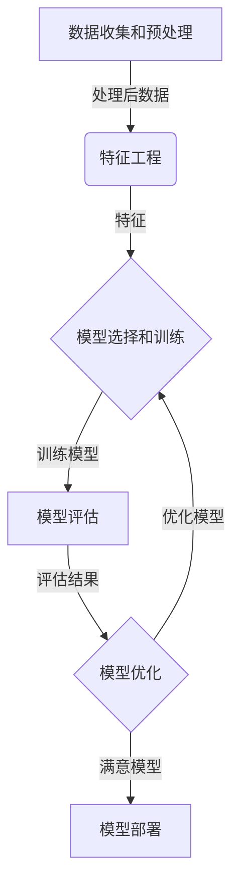

# 大语言模型应用指南：机器学习的过程

## 1. 背景介绍

### 1.1 人工智能的发展历程

人工智能(AI)是一个旨在使机器能够模仿人类智能行为的广阔领域。自20世纪50年代问世以来,人工智能经历了起伏跌宕的发展历程。早期的人工智能系统主要依赖于规则和逻辑推理,但由于知识库的局限性和缺乏学习能力,其应用范围受到了限制。

### 1.2 机器学习的兴起

21世纪初,机器学习(Machine Learning)的兴起为人工智能注入了新的活力。机器学习系统能够从数据中自动学习模式和规律,而不需要显式编程。这种数据驱动的方法极大地扩展了人工智能的应用范围,包括计算机视觉、自然语言处理、推荐系统等领域。

### 1.3 大语言模型的崛起

近年来,大型神经网络模型在自然语言处理(NLP)任务中取得了卓越的成绩,这些被称为"大语言模型"(Large Language Models, LLMs)。这些模型通过在海量文本数据上进行预训练,学习了丰富的语言知识和上下文关联能力,可以生成高质量的文本、回答问题、进行任务完成等。著名的大语言模型包括GPT-3、BERT、XLNet等。

## 2. 核心概念与联系

### 2.1 机器学习的过程

机器学习的过程通常包括以下几个关键步骤:

1. **数据收集和预处理**: 收集高质量、多样化的数据,并对其进行清洗、标注和格式化处理,为模型训练做好准备。

2. **特征工程**: 从原始数据中提取有意义的特征,这些特征对于模型学习任务至关重要。

3. **模型选择和训练**: 选择合适的机器学习算法和模型架构,并在训练数据上进行模型训练,使模型能够从数据中学习模式和规律。

4. **模型评估**: 在保留的测试数据上评估模型的性能,确保其能够很好地推广到新的、未见过的数据。

5. **模型优化**: 根据评估结果,通过调整超参数、特征工程或算法选择等方式优化模型性能。

6. **模型部署**: 将训练好的模型集成到实际应用系统中,为最终用户提供服务。

### 2.2 大语言模型的训练过程

大语言模型的训练过程与传统的机器学习模型存在一些差异,主要体现在以下几个方面:

1. **预训练-微调范式**: 大语言模型首先在大规模文本语料库上进行无监督预训练,学习通用的语言表示。然后,针对特定的下游任务(如文本分类、问答等),对预训练模型进行有监督的微调(fine-tuning),使其适应目标任务。

2. **自监督学习目标**: 预训练阶段通常采用自监督学习目标,如掩码语言模型(Masked Language Modeling)和下一句预测(Next Sentence Prediction),利用上下文信息预测被掩码的词或句子,促使模型学习语义和上下文关联。

3. **大规模参数和数据**: 大语言模型通常具有数十亿甚至上百亿个参数,需要在海量文本数据上进行训练,以充分利用其强大的表示能力。

4. **硬件需求**: 训练大语言模型需要大量的计算资源,通常需要采用多GPU或TPU等专用硬件加速训练。

5. **迁移学习**: 预训练模型可以被视为通用的知识库,可以通过微调迁移到各种下游任务,从而避免从头开始训练,提高效率和性能。

## 3. 核心算法原理具体操作步骤

### 3.1 自注意力机制(Self-Attention)

自注意力机制是大语言模型的核心算法之一,它能够捕捉输入序列中任意两个位置之间的关系,从而更好地建模长距离依赖。

具体操作步骤如下:

1. 将输入序列 $X = (x_1, x_2, ..., x_n)$ 映射到查询(Query)、键(Key)和值(Value)向量空间,得到 $Q = (q_1, q_2, ..., q_n)$、$K = (k_1, k_2, ..., k_n)$ 和 $V = (v_1, v_2, ..., v_n)$。

2. 计算查询和键之间的点积,得到注意力分数矩阵 $A$:

$$A = \text{softmax}\left(\frac{QK^T}{\sqrt{d_k}}\right)$$

其中 $d_k$ 是缩放因子,用于防止点积过大导致梯度饱和。

3. 将注意力分数矩阵 $A$ 与值向量 $V$ 相乘,得到加权和表示 $Z$:

$$Z = AV$$

4. 将加权和表示 $Z$ 输入到前馈神经网络中,得到最终的输出表示。

自注意力机制能够自适应地为每个位置分配注意力权重,捕捉长距离依赖关系,从而提高了模型的表现能力。

### 3.2 transformer 架构

Transformer 是一种全新的序列到序列(Sequence-to-Sequence)模型架构,它完全基于自注意力机制,不依赖于循环神经网络(RNN)或卷积神经网络(CNN)。Transformer 架构包括编码器(Encoder)和解码器(Decoder)两个主要组件。

**编码器(Encoder)**的具体操作步骤如下:

1. 将输入序列 $X = (x_1, x_2, ..., x_n)$ 映射到嵌入向量空间,得到嵌入表示 $E = (e_1, e_2, ..., e_n)$。

2. 在嵌入表示 $E$ 上添加位置编码(Positional Encoding),以引入位置信息。

3. 将位置编码后的表示输入到多层自注意力模块中,每层包含多头自注意力(Multi-Head Self-Attention)和前馈神经网络(Feed-Forward Neural Network)。

4. 编码器的最终输出是最后一层的输出表示,它捕捉了输入序列的上下文信息。

**解码器(Decoder)**的具体操作步骤如下:

1. 将目标序列 $Y = (y_1, y_2, ..., y_m)$ 映射到嵌入向量空间,得到嵌入表示 $F = (f_1, f_2, ..., f_m)$。

2. 在嵌入表示 $F$ 上添加位置编码。

3. 将位置编码后的表示输入到多层解码器模块中,每层包含三个子层:
   - 掩码多头自注意力(Masked Multi-Head Self-Attention),用于捕捉目标序列内部的依赖关系。
   - 多头编码器-解码器注意力(Multi-Head Encoder-Decoder Attention),用于将目标序列与编码器输出进行关联。
   - 前馈神经网络(Feed-Forward Neural Network)。

4. 解码器的最终输出是最后一层的输出表示,它综合了目标序列和编码器输出的信息。

Transformer 架构通过完全基于注意力机制的方式,避免了RNN的梯度消失问题,并且可以高效地并行计算,显著提高了模型的性能和训练效率。

## 4. 数学模型和公式详细讲解举例说明

### 4.1 掩码语言模型(Masked Language Modeling)

掩码语言模型是大语言模型预训练的一种常用目标,它要求模型预测被随机掩码的词。具体来说,给定一个输入序列 $X = (x_1, x_2, ..., x_n)$,我们随机将其中一些词替换为特殊的掩码符号 [MASK],得到掩码序列 $\tilde{X} = (\tilde{x}_1, \tilde{x}_2, ..., \tilde{x}_n)$。模型的目标是最大化掩码位置的条件概率:

$$\mathcal{L}_{\text{MLM}} = -\mathbb{E}_{X}\left[\sum_{i=1}^{n}\mathbb{1}_{\tilde{x}_i=\text{[MASK]}}\log P(x_i|\tilde{X})\right]$$

其中 $\mathbb{1}_{\tilde{x}_i=\text{[MASK]}}$ 是指示函数,表示当 $\tilde{x}_i$ 是掩码符号时取值为 1,否则为 0。$P(x_i|\tilde{X})$ 是模型预测的第 $i$ 个位置为 $x_i$ 的条件概率。

通过最小化掩码语言模型的损失函数 $\mathcal{L}_{\text{MLM}}$,模型可以学习到丰富的语言知识和上下文关联能力,从而为下游任务做好准备。

### 4.2 下一句预测(Next Sentence Prediction)

下一句预测是另一种常用的大语言模型预训练目标,它要求模型预测两个句子是否相邻。具体来说,给定两个句子 $S_1$ 和 $S_2$,我们将它们连接为一个序列 $X = (\text{[CLS]}, S_1, \text{[SEP]}, S_2, \text{[SEP]})$,其中 [CLS] 是分类符号,用于表示整个序列的表示;[SEP] 是分隔符号,用于分隔两个句子。

模型的目标是正确预测 $S_1$ 和 $S_2$ 是否相邻,即最大化二元分类的对数似然:

$$\mathcal{L}_{\text{NSP}} = -\mathbb{E}_{(S_1,S_2)}\left[\log P(y|\text{Transformer}(X))\right]$$

其中 $y \in \{0, 1\}$ 表示 $S_1$ 和 $S_2$ 是否相邻,取决于训练样本的标签;$\text{Transformer}(X)$ 是 Transformer 模型对输入序列 $X$ 的编码表示,通常取 [CLS] 位置的输出作为整个序列的表示。

通过最小化下一句预测的损失函数 $\mathcal{L}_{\text{NSP}}$,模型可以学习到句子之间的关系和语义连贯性,从而提高对语言的理解能力。

在实际预训练中,掩码语言模型和下一句预测通常会被同时优化,形成联合目标函数:

$$\mathcal{L} = \mathcal{L}_{\text{MLM}} + \mathcal{L}_{\text{NSP}}$$

### 4.3 示例:BERT 预训练

BERT(Bidirectional Encoder Representations from Transformers)是一种基于 Transformer 编码器的大语言模型,它采用了掩码语言模型和下一句预测作为预训练目标。

假设我们有一个输入序列 "今天天气很好,我们去[MASK]公园玩吧。",其中 "散步" 被掩码为 [MASK]。BERT 模型需要预测被掩码的词 "散步"。

1. 将输入序列映射到嵌入向量空间,并添加位置编码。

2. 将嵌入表示输入到 Transformer 编码器中,经过多层自注意力和前馈神经网络,得到每个位置的上下文编码表示。

3. 对于掩码位置 [MASK],取其对应的上下文编码表示 $h_{\text{[MASK]}}$,将其输入到一个分类器(如softmax层)中,计算每个词在该位置出现的概率分布:

$$P(x|\tilde{X}) = \text{softmax}(W_vh_{\text{[MASK]}} + b_v)$$

其中 $W_v$ 和 $b_v$ 是分类器的权重和偏置参数。

4. 最大化掩码位置的条件概率 $P(\text{"散步"}|\tilde{X})$,即最小化掩码语言模型损失函数 $\mathcal{L}_{\text{MLM}}$。

5. 对于下一句预测任务,将两个句子的 [CLS] 位置的编码表示输入到一个二分类器中,预测它们是否相邻,最小化下一句预测损失函数 $\mathcal{L}_{\text{NSP}}$。

通过预训练,BERT 模型学习了丰富的语言知识和上下文关联能力,可以在下游任务上进行微