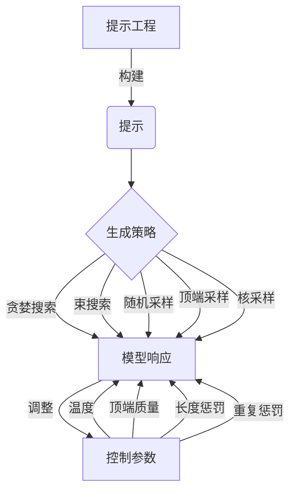

# 大语言模型应用指南：模型响应返回的参数

## 1. 背景介绍

### 1.1 大语言模型的兴起

近年来,大型语言模型(Large Language Models, LLMs)在自然语言处理(NLP)领域取得了令人瞩目的进展。这些模型通过在大规模语料库上进行预训练,学习了丰富的语言知识和上下文信息,展现出强大的语言生成和理解能力。

随着计算能力的不断提高和训练数据的积累,LLMs的规模也在不断扩大。从GPT-3拥有1750亿个参数,到PaLM达到5400亿个参数,再到Cerebras AI的Andromeda模型更是高达1.2万亿参数。这些庞大的模型在广泛的下游任务中表现出色,推动了NLP技术的快速发展。

### 1.2 模型响应返回的重要性

在实际应用中,LLMs通常被用作生成模型,根据给定的提示(prompt)生成相应的文本输出。这种输出通常被称为模型的"响应"(response)。模型响应的质量直接影响着用户体验和应用效果,因此理解和控制模型响应返回的参数就显得尤为重要。

合理设置和调整这些参数,可以优化模型输出,使其更加契合特定场景和需求。例如,在某些情况下,我们希望模型生成简洁的回答;而在另一些场景中,我们则期望获得详尽的解释和分析。同时,控制模型输出的多样性、一致性等特性,也有助于满足不同的应用需求。

### 1.3 本文概述

本文将围绕大语言模型响应返回的参数展开讨论,旨在为读者提供全面的理解和实践指南。我们将介绍常见的参数类型及其作用,探讨如何根据具体场景对这些参数进行调整和优化。此外,还将分享一些实用的技巧和最佳实践,帮助读者更好地利用LLMs的强大功能。

## 2. 核心概念与联系

在深入探讨模型响应返回的参数之前,我们先来了解一些核心概念和它们之间的联系。

### 2.1 提示工程(Prompt Engineering)

提示工程是指设计和优化提供给语言模型的提示(prompt),以获得所需的输出。良好的提示设计对于充分发挥LLMs的潜力至关重要。通过精心构造提示,我们可以引导模型生成更加准确、相关和符合预期的响应。

提示工程涉及多个方面,包括:

- 提示模板(Prompt Template):定义提示的整体结构和格式。
- 提示注入(Prompt Injection):在提示中注入特定的指令、示例或背景知识,以影响模型输出。
- 提示优化(Prompt Optimization):通过迭代和调整,不断改进提示的质量。

提示工程直接影响模型响应的质量,因此也是控制模型响应返回参数的基础。

### 2.2 生成策略(Generation Strategy)

生成策略指导模型如何从给定的提示中生成文本输出。不同的策略可以产生不同的响应特性,如多样性、一致性、长度等。常见的生成策略包括:

- 贪婪搜索(Greedy Search):每个时间步选择概率最高的token。
- 束搜索(Beam Search):保留k个最可能的候选序列,剪枝其他分支。
- 随机采样(Random Sampling):根据token概率分布随机采样。
- 顶端采样(Top-k Sampling):只从概率最高的k个token中采样。
- 核采样(Nucleus Sampling):基于累积概率密度函数采样。

生成策略的选择直接影响模型响应的多样性、一致性和质量,因此也是控制模型响应返回参数的关键因素之一。

### 2.3 控制参数(Control Parameters)

控制参数是一组用于调节模型输出特性的参数,通常与生成策略密切相关。常见的控制参数包括:

- 温度(Temperature):控制输出的随机性和多样性。较高温度产生更多样化的输出,较低温度则更加保守。
- 顶端质量(Top-p):与核采样策略相关,控制输出token的概率质量阈值。
- 长度惩罚(Length Penalty):惩罚或奖励较长的输出序列。
- 重复惩罚(Repetition Penalty):惩罚输出中的token重复,提高多样性。

通过合理设置这些参数,我们可以根据具体需求调整模型响应的多样性、一致性、长度等特性。

### 2.4 Mermaid 流程图

以下是模型响应生成过程的 Mermaid 流程图,展示了提示工程、生成策略和控制参数之间的关系:

上图清晰地展示了提示工程、生成策略和控制参数在模型响应生成过程中的作用。通过合理利用这些概念和技术,我们可以更好地控制和优化模型的输出。

## 3. 核心算法原理具体操作步骤

在本节中,我们将探讨大语言模型响应生成的核心算法原理,并介绍具体的操作步骤。

### 3.1 语言模型的基本原理

大型语言模型通常基于Transformer架构,使用自注意力(Self-Attention)机制来捕获输入序列中的长程依赖关系。模型的目标是根据给定的上下文(Context)预测下一个token的概率分布。

对于给定的上下文 $x_1, x_2, \ldots, x_t$,模型需要计算下一个token $x_{t+1}$的条件概率:

$$P(x_{t+1} | x_1, x_2, \ldots, x_t)$$

通过训练,模型学习了如何从大量语料中捕获语言的统计规律,从而能够生成自然、流畅的文本输出。

### 3.2 响应生成算法步骤

给定一个提示(prompt) $p$,模型响应生成的基本步骤如下:

1. **编码提示**:将提示 $p$ 编码为模型可以理解的表示形式,通常是一系列的token embeddings。
2. **初始化解码器状态**:使用编码后的提示初始化解码器(Decoder)的初始状态。
3. **生成第一个token**:根据解码器的当前状态,计算下一个token的概率分布 $P(x_1 | p)$,并根据生成策略(如贪婪搜索、束搜索等)采样或选择第一个token $x_1$。
4. **迭代生成后续token**:将生成的token $x_1$ 输入解码器,更新解码器状态。然后根据新的状态,计算下一个token的概率分布 $P(x_2 | p, x_1)$,并采样或选择第二个token $x_2$。重复该过程,直到达到预设的最大长度或满足停止条件。

在每一步的token生成过程中,都可以应用控制参数(如温度、顶端质量等)来调节输出的特性。

### 3.3 生成策略的实现

不同的生成策略对应不同的token采样或选择方式。以下是一些常见策略的实现细节:

1. **贪婪搜索**:在每个时间步,选择概率最大的token作为输出。
2. **束搜索**:维护一个候选序列的束(Beam),在每个时间步,从束中选择概率最大的k个序列,并为每个序列扩展出所有可能的下一个token,形成新的候选束。重复该过程,直到达到预设的最大长度或满足停止条件。
3. **随机采样**:根据token概率分布直接随机采样下一个token。
4. **顶端采样**:首先选择概率最高的k个token,然后从这k个token中根据它们的概率分布随机采样下一个token。
5. **核采样**:首先根据token概率分布计算累积概率密度函数(CDF),然后从CDF中随机采样一个值,选择对应的token作为输出。

不同的生成策略会产生不同的输出特性,需要根据具体场景选择合适的策略。

### 3.4 控制参数的应用

控制参数可以在生成策略的基础上进一步调节模型响应的特性。以下是一些常见控制参数的应用方式:

1. **温度**:将token概率分布的对数值缩放一个温度系数 $T$,公式为 $\frac{1}{T} \log P(x_i)$。较高的温度会增加低概率token被采样的机会,产生更多样化的输出;较低的温度则会集中在高概率token上,输出更加保守。
2. **顶端质量**:在核采样策略中,可以设置一个阈值 $p$,只考虑概率之和达到 $p$ 的那些token。这样可以过滤掉低概率的token,提高输出质量。
3. **长度惩罚**:对于较长的输出序列,可以应用一个惩罚项 $\alpha$,将其概率缩小一个系数 $\frac{1}{\text{len}(x)^\alpha}$。这样可以鼓励或抑制较长的输出,根据实际需求进行调整。
4. **重复惩罚**:对于已经生成的token,可以降低其在后续时间步被重复采样的概率,从而提高输出的多样性。

通过合理设置这些控制参数,我们可以根据具体需求调整模型响应的多样性、一致性、长度等特性,以满足不同场景的需求。

## 4. 数学模型和公式详细讲解举例说明

在上一节中,我们介绍了大语言模型响应生成的核心算法原理和操作步骤。现在,让我们深入探讨一些相关的数学模型和公式,并通过具体示例加深理解。

### 4.1 语言模型的概率计算

语言模型的目标是计算给定上下文下,下一个token的条件概率分布。对于一个长度为 $n$ 的序列 $X = (x_1, x_2, \ldots, x_n)$,我们可以将其概率表示为:

$$P(X) = P(x_1, x_2, \ldots, x_n) = \prod_{t=1}^n P(x_t | x_1, \ldots, x_{t-1})$$

其中,每一项 $P(x_t | x_1, \ldots, x_{t-1})$ 表示在给定前 $t-1$ 个token的情况下,预测第 $t$ 个token的条件概率。

在实践中,由于直接计算上述概率过于复杂,我们通常使用神经网络模型来近似这个概率分布。具体来说,给定一个上下文 $x_1, \ldots, x_t$,模型会输出一个概率向量 $\vec{y}$,其中第 $i$ 个元素 $y_i$ 表示下一个token为词汇表中第 $i$ 个token的概率估计值。

例如,假设我们的词汇表为 $\{a, b, c, d\}$,模型在给定上下文 "我爱" 后,输出的概率向量为 $\vec{y} = (0.1, 0.7, 0.1, 0.1)$。这意味着,根据模型的估计,在该上下文下,下一个token为 "b" 的概率最高,为 0.7。

### 4.2 生成策略的数学表示

不同的生成策略对应不同的数学表示方式。以下是一些常见策略的公式:

1. **贪婪搜索**:在每个时间步,选择概率最大的token作为输出。
   $$x_t = \arg\max_i y_i$$

2. **束搜索**:维护一个候选序列的束,在每个时间步,从束中选择概率最大的 $k$ 个序列,并为每个序列扩展出所有可能的下一个token,形成新的候选束。重复该过程,直到达到预设的最大长度或满足停止条件。束搜索的目标是最大化整个序列的概率:
   $$\max_X P(X) = \max_X \prod_{t=1}^n P(x_t | x_1, \ldots, x_{t-1})$$

3. **随机采样