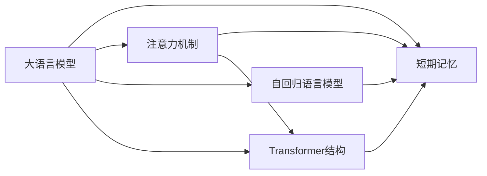

# 大语言模型应用指南：短期记忆

## 1. 背景介绍
### 1.1 大语言模型概述
#### 1.1.1 定义与特点
大语言模型(Large Language Model, LLM)是一种基于深度学习的自然语言处理模型,通过在大规模文本数据上进行预训练,可以学习到丰富的语言知识和语义表示。LLM 具有强大的语言理解和生成能力,在机器翻译、问答系统、文本摘要等任务上取得了显著的效果提升。

#### 1.1.2 发展历程
近年来,随着计算能力的增强和训练数据的丰富,LLM 取得了长足的进步。从 2018 年 Google 推出的 BERT 模型,到 2020 年 OpenAI 发布的 GPT-3 模型,再到最近的 PaLM、BLOOM 等模型,LLM 的参数量从百亿级增长到了万亿级,语言能力也得到了质的飞跃。

### 1.2 短期记忆的重要性
#### 1.2.1 连贯对话的需求
在人机交互场景中,LLM 需要具备连贯对话的能力,即能够理解上下文信息,根据之前的对话内容生成合适的回复。这就要求 LLM 具有一定的短期记忆能力,能够在生成回复时"记住"之前的对话。

#### 1.2.2 多轮问答的挑战  
此外,在一些复杂的应用场景如多轮问答中,LLM 需要在多轮对话中累积获取信息,推理出答案。这对 LLM 的短期记忆提出了更高的要求。没有短期记忆,LLM 就难以完成这类任务。

## 2. 核心概念与联系
### 2.1 短期记忆
短期记忆(Short-term Memory)是指 LLM 在生成文本的过程中,对之前生成的内容具有一定的"记忆",能够影响当前和未来的文本生成。它使得 LLM 生成的文本具有连贯性和一致性。

### 2.2 注意力机制
注意力机制(Attention Mechanism)是 LLM 的核心组件之一,它使得模型能够在生成每个词时,有选择地关注输入序列中的相关信息。Transformer 结构中的自注意力机制和交叉注意力机制都体现了这一思想。

### 2.3 自回归语言模型
自回归语言模型(Auto-regressive Language Model)是一种常见的 LLM 范式,它通过迭代地预测下一个词,从左到右生成文本序列。这一过程中,之前生成的内容会作为条件参与当前词的预测,体现了短期记忆的效果。

### 2.4 Transformer 结构
Transformer 是一种广泛使用的 LLM 结构,由编码器和解码器组成,大量使用了注意力机制。编码器负责对输入序列进行编码,解码器负责根据编码结果和之前生成的内容,预测下一个词。Transformer 结构使得 LLM 能够更好地捕捉长距离依赖关系。

### 2.5 概念联系
下图展示了以上核心概念之间的联系:



## 3. 核心算法原理具体操作步骤
### 3.1 基于 RNN 的短期记忆
传统的语言模型如 RNN,通过隐藏状态来实现短期记忆。具体步骤如下:

1. 在时间步 $t$,RNN 接收当前词 $x_t$ 和上一步的隐藏状态 $h_{t-1}$ 
2. 将 $x_t$ 和 $h_{t-1}$ 传入 RNN 单元,计算当前隐藏状态 $h_t$ 
3. 将 $h_t$ 传入输出层,预测下一个词的概率分布 $y_t$
4. 采样或选择概率最大的词作为 $x_{t+1}$,重复步骤 1-4

隐藏状态 $h_t$ 起到了短期记忆的作用,使得当前预测能够考虑之前的信息。但是,RNN 难以捕捉长距离依赖,短期记忆能力有限。

### 3.2 基于 Transformer 的短期记忆
Transformer 通过自注意力机制和前馈神经网络,实现了更强大的短期记忆。以 GPT 模型为例,具体步骤如下:

1. 将输入序列 $X=(x_1,\dots,x_n)$ 传入词嵌入层,得到词向量序列 $E=(e_1,\dots,e_n)$
2. 对 $E$ 进行位置编码,加入位置信息,得到 $\tilde{E}=(\tilde{e}_1,\dots,\tilde{e}_n)$  
3. 将 $\tilde{E}$ 传入 $N$ 个 Transformer 解码器块:
   - 在自注意力层,计算 $\tilde{E}$ 中每个位置与其他位置的注意力权重,得到上下文表示 $C=(c_1,\dots,c_n)$
   - 在前馈层,对 $C$ 进行非线性变换,得到 $\tilde{C}=(\tilde{c}_1,\dots,\tilde{c}_n)$
4. 将 $\tilde{C}$ 传入输出层,预测下一个词的概率分布 $y_t$
5. 采样或选择概率最大的词作为 $x_{t+1}$,重复步骤 1-5

自注意力机制使得每个位置都能够attend to之前的所有位置,从而建模任意长度的依赖关系。多个 Transformer 块的堆叠进一步增强了模型的短期记忆能力。

## 4. 数学模型和公式详细讲解举例说明
### 4.1 RNN 的数学模型
RNN 的核心是递归计算隐藏状态。给定时间步 $t$ 的输入 $x_t$ 和上一步隐藏状态 $h_{t-1}$,当前隐藏状态 $h_t$ 计算如下:

$$h_t=f(Ux_t+Wh_{t-1}+b)$$

其中,$U,W,b$ 分别是输入到隐藏层、隐藏层到隐藏层的权重矩阵和偏置项,$f$ 是激活函数(通常为 tanh 或 ReLU)。

输出层根据 $h_t$ 计算当前词的概率分布:

$$y_t=softmax(Vh_t+c)$$

其中,$V,c$ 是隐藏层到输出层的权重矩阵和偏置项。

### 4.2 Transformer 的数学模型 
Transformer 的核心是自注意力机制和前馈神经网络。以 GPT 为例,模型的数学描述如下:

1. 词嵌入层将词的 one-hot 向量 $x_t$ 映射为稠密向量 $e_t$:
$$e_t=Ex_t$$
其中,$E$ 是词嵌入矩阵。

2. 位置编码将位置信息 $p_t$ 与 $e_t$ 相加:
$$\tilde{e}_t=e_t+p_t$$

3. 自注意力层计算上下文表示 $c_t$。首先计算查询矩阵 $Q$、键矩阵 $K$ 和值矩阵 $V$:
$$Q=\tilde{E}W^Q, K=\tilde{E}W^K, V=\tilde{E}W^V$$
其中,$W^Q,W^K,W^V$ 是可学习的参数矩阵。

然后计算注意力权重矩阵 $A$:
$$A=softmax(\frac{QK^T}{\sqrt{d_k}})$$
其中,$d_k$ 是 $K$ 的维度。

最后计算上下文表示:
$$C=AV$$

4. 前馈层对 $C$ 进行非线性变换:
$$\tilde{C}=ReLU(CW_1+b_1)W_2+b_2$$
其中,$W_1,b_1,W_2,b_2$ 是可学习的参数。

5. 输出层计算下一个词的概率分布:
$$y_t=softmax(\tilde{C}W_o+b_o)$$
其中,$W_o,b_o$ 是输出层的参数。

## 5. 项目实践：代码实例和详细解释说明
下面是一个基于 PyTorch 实现 Transformer 语言模型的简化版代码示例:

```python
import torch
import torch.nn as nn

class TransformerBlock(nn.Module):
    def __init__(self, embed_dim, num_heads, ff_dim):
        super().__init__()
        self.attention = nn.MultiheadAttention(embed_dim, num_heads)
        self.ff = nn.Sequential(
            nn.Linear(embed_dim, ff_dim),
            nn.ReLU(),
            nn.Linear(ff_dim, embed_dim)
        )
        self.norm1 = nn.LayerNorm(embed_dim)
        self.norm2 = nn.LayerNorm(embed_dim)
        
    def forward(self, x):
        attended = self.attention(x, x, x)[0]
        x = self.norm1(attended + x)
        fed_forward = self.ff(x)
        x = self.norm2(fed_forward + x)
        return x

class TransformerLM(nn.Module):
    def __init__(self, vocab_size, embed_dim, num_heads, ff_dim, num_layers):
        super().__init__()
        self.embed = nn.Embedding(vocab_size, embed_dim)
        self.pos_encode = PositionalEncoding(embed_dim)
        self.blocks = nn.ModuleList([
            TransformerBlock(embed_dim, num_heads, ff_dim) 
            for _ in range(num_layers)
        ])
        self.out = nn.Linear(embed_dim, vocab_size)
        
    def forward(self, x):
        x = self.embed(x)
        x = self.pos_encode(x)
        for block in self.blocks:
            x = block(x)
        x = self.out(x)
        return x
```

代码说明:

- `TransformerBlock` 实现了 Transformer 的基本组件,包括多头自注意力层和前馈层,以及残差连接和层归一化。
  - `__init__` 方法定义了注意力层、前馈层和归一化层。
  - `forward` 方法依次应用自注意力、残差连接、归一化,再应用前馈、残差连接、归一化,返回结果。
- `TransformerLM` 实现了完整的 Transformer 语言模型。
  - `__init__` 方法定义了词嵌入层、位置编码、多个 Transformer 块和输出层。
  - `forward` 方法依次应用词嵌入、位置编码、Transformer 块和输出层,返回下一个词的 logits。
- `PositionalEncoding` 的实现未给出,它对应步骤 2 的位置编码,可以使用正弦函数实现。

以上代码展示了 Transformer 语言模型的核心组件和前向计算过程,体现了其强大的短期记忆能力。实际应用中还需要添加训练和推断逻辑。

## 6. 实际应用场景
短期记忆增强的大语言模型在以下场景中有广泛应用:

### 6.1 对话系统
在开放域对话和任务型对话中,LLM 需要根据之前的对话内容生成合适的回复。短期记忆使得 LLM 能够理解上下文,生成连贯一致的多轮对话。例如微软的小冰聊天机器人。

### 6.2 文本摘要
自动文本摘要任务需要 LLM 理解长文档的内容,提取关键信息生成简洁的摘要。短期记忆帮助 LLM 在生成摘要时把握全文脉络,捕捉重要细节。如 GPT-3 在 CNN/DailyMail 数据集上的摘要效果优于传统方法。

### 6.3 机器翻译
机器翻译任务需要 LLM 将源语言文本转换为目标语言文本。短期记忆使得 LLM 能够根据已翻译的内容调整后续翻译,从而生成流畅自然的译文。如 Google Translator 中使用的 Transformer 模型。

### 6.4 代码生成
LLM 还可用于根据自然语言描述自动生成代码。短期记忆使得模型能够根据之前生成的代码上下文,生成语法和语义正确的后续代码。如 OpenAI Codex 模型。

## 7. 工具和资源推荐
以下是一些有助于研究和应用短期记忆增强的大语言模型的工具和资源:

- PyTorch (https://pytorch.org/): 流行的深度学习框