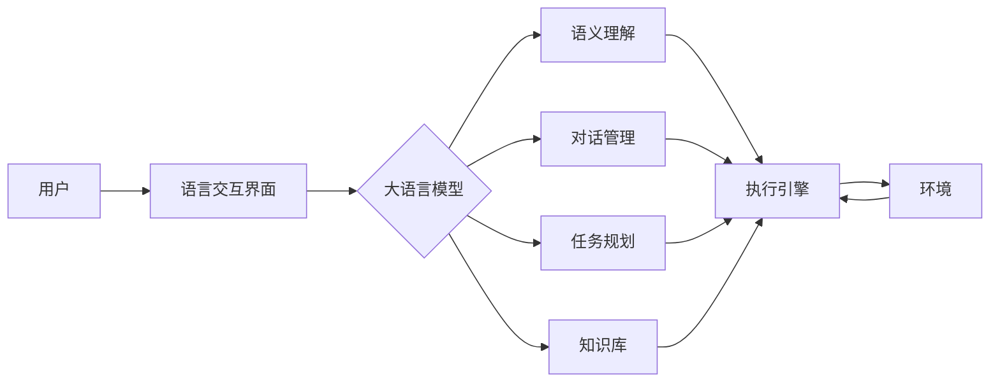

# 大语言模型应用指南：自主Agent系统案例分析（一）

## 1. 背景介绍
### 1.1 大语言模型的崛起
近年来，以 GPT-3、PaLM、BLOOM 等为代表的大语言模型取得了突破性进展，展现出了在自然语言理解、生成等任务上的惊人能力。这些模型通过在海量文本数据上进行无监督预训练，能够学习到丰富的语言知识和常识，为构建更加智能化的自然语言处理系统奠定了基础。

### 1.2 大语言模型的应用潜力
大语言模型强大的语言理解和生成能力，使其在诸多领域展现出广阔的应用前景，包括但不限于：
- 问答系统：利用大语言模型构建知识问答系统，提供更加准确和全面的答案。
- 对话系统：基于大语言模型开发智能对话代理，实现更加自然流畅的人机交互。  
- 内容生成：应用大语言模型自动生成文章、新闻、小说等各类文本内容。
- 机器翻译：借助大语言模型的语义理解能力，提升机器翻译的质量和流畅度。

### 1.3 自主Agent系统的兴起
近期，一个备受关注的大语言模型应用方向是自主Agent系统。所谓自主Agent，是指一种能够主动执行任务、自主学习和适应环境的智能系统。通过与大语言模型的结合，自主Agent系统在语言交互、任务规划、知识学习等方面展现出了令人瞩目的潜力。

### 1.4 本文的目的和结构
本文旨在深入探讨大语言模型在自主Agent系统中的应用，剖析其核心技术原理，分享实践经验和思考。全文分为9个部分：背景介绍、核心概念与联系、算法原理、数学建模、代码实例、应用场景、工具推荐、未来展望和常见问题解答。通过系统而全面的讲解，帮助读者全方位理解大语言模型驱动的自主Agent系统。

## 2. 核心概念与联系
### 2.1 大语言模型
大语言模型本质上是一种基于深度神经网络的语言模型，旨在学习自然语言的统计规律和语义表示。其"大"主要体现在两个方面：
- 模型参数量大：动辄数百亿、千亿级别的参数量，远超传统的语言模型。
- 训练数据量大：在海量的无标注文本语料上进行预训练，数据量高达TB甚至PB级别。

这种参数和数据的"双大"赋予了大语言模型强大的语言理解和生成能力。一些代表性的大语言模型包括GPT系列、BERT系列、XLNet、RoBERTa等。

### 2.2 自主Agent系统
自主Agent系统是一种能够感知环境、自主决策和执行任务的智能系统。其核心特点包括：
- 自主性：能够根据自身的知识和目标，自主地制定和执行计划。
- 适应性：能够根据环境的变化，动态调整自身的行为和策略。
- 持续学习：能够从与环境的交互中不断学习，积累知识和经验。

传统的自主Agent系统主要应用在机器人、无人驾驶、智能助理等领域。而随着大语言模型的发展，自主Agent系统在语言交互和认知推理方面取得了新的突破。

### 2.3 大语言模型与自主Agent系统的结合
将大语言模型引入自主Agent系统，可以极大地增强Agent的语言理解和交互能力。一方面，大语言模型可以作为Agent的"语言大脑"，赋予其处理复杂语言指令、进行多轮对话的能力；另一方面，大语言模型学习到的海量知识，可以作为Agent的"知识库"，供其进行推理决策和任务执行。

下图展示了一个基于大语言模型的自主Agent系统的典型架构：

在这个架构中，大语言模型位于系统的核心，负责语义理解、对话管理、任务规划等关键功能。用户通过语言交互界面输入指令或查询，大语言模型对其进行语义理解，提取关键信息，并根据对话历史和知识库进行推理，生成适当的回复或行动计划。执行引擎负责具体的任务执行，并根据环境反馈动态调整。

## 3. 核心算法原理具体操作步骤
大语言模型驱动的自主Agent系统涉及多个核心算法和技术，包括语言模型预训练、指令微调、强化学习等。下面我们重点介绍其中的几个关键算法。

### 3.1 语言模型预训练
语言模型预训练是大语言模型的基础，其目标是让模型从大规模无标注文本数据中学习语言的统计规律和语义表示。主要步骤包括：

1. 准备大规模高质量的文本语料，进行必要的清洗和预处理。
2. 选择合适的神经网络架构，如Transformer、GPT等。
3. 设计预训练目标，常见的有语言模型、掩码语言模型、对比学习等。
4. 在语料上进行预训练，优化模型参数，使其学习到通用的语言表示。
5. 在下游任务上进行微调或提示学习，将预训练模型应用到具体场景中。

一些常用的预训练算法包括：
- GPT (Generative Pre-Training)：基于Transformer解码器的单向语言模型预训练。
- BERT (Bidirectional Encoder Representations from Transformers)：基于Transformer编码器的双向语言模型预训练。
- RoBERTa (A Robustly Optimized BERT Pretraining Approach)：对BERT预训练过程进行优化，提高模型的鲁棒性和泛化能力。

### 3.2 指令微调
指令微调（Instruction Tuning）是一种将预训练语言模型适配到特定任务的技术，特别适用于自主Agent场景。其核心思想是在预训练模型上添加一个指令编码器，将自然语言指令映射为连续向量表示，引导模型进行任务特定的推理和生成。主要步骤包括：

1. 收集和标注一批指令-响应对，涵盖目标任务的各种指令模式。
2. 在预训练模型的基础上，添加指令编码器，将指令映射为向量表示。
3. 将指令向量与原始输入拼接，引入任务特定的位置编码。
4. 在指令-响应对上进行微调，优化模型参数，使其适应特定任务。
5. 在实际应用中，根据用户指令生成指令向量，引导模型进行推理和生成。

指令微调使得预训练模型能够理解自然语言指令，执行任务特定的操作，极大地提升了模型在自主Agent场景下的适用性和灵活性。

### 3.3 强化学习
强化学习是一种让Agent通过与环境的交互来学习最优策略的机器学习范式。将强化学习引入大语言模型驱动的自主Agent系统，可以让Agent学会根据用户反馈和环境状态动态调整策略，提高任务完成的效率和质量。主要步骤包括：

1. 定义状态空间、动作空间和奖励函数，用于描述Agent与环境的交互。
2. 将大语言模型作为Agent的策略网络，根据当前状态生成动作。
3. Agent根据策略网络的输出与环境交互，获得即时奖励和下一个状态。
4. 使用强化学习算法（如Q-learning、Policy Gradient等）更新策略网络的参数，最大化累积奖励。
5. 不断迭代上述过程，直到策略网络收敛到最优策略。

一些常用的强化学习算法包括：
- DQN (Deep Q-Network)：使用深度神经网络近似Q值函数，通过Q-learning更新网络参数。
- A3C (Asynchronous Advantage Actor-Critic)：一种基于Policy Gradient的异步强化学习算法，通过并行的Actor-Critic架构提高训练效率。
- PPO (Proximal Policy Optimization)：一种稳定高效的Policy Gradient算法，通过约束策略更新的幅度来平衡探索和利用。

将强化学习与大语言模型相结合，可以得到一个能够自主学习、动态适应的智能Agent，在复杂任务中展现出色的性能。

## 4. 数学模型和公式详细讲解举例说明
本节我们将详细讲解大语言模型和强化学习中涉及的一些关键数学模型和公式，并给出具体的例子帮助理解。

### 4.1 Transformer模型
Transformer是大语言模型的核心架构，其本质是一个基于自注意力机制的Seq2Seq模型。给定一个输入序列$\mathbf{x}=(x_1,\cdots,x_n)$，Transformer的编码器将其映射为一个连续的表示$\mathbf{z}=(z_1,\cdots,z_n)$：

$$\mathbf{z}=\text{Encoder}(\mathbf{x})$$

其中，编码器由多个自注意力层和前馈层组成。自注意力层用于捕捉输入序列中不同位置之间的依赖关系，其核心是注意力函数：

$$\text{Attention}(Q,K,V)=\text{softmax}(\frac{QK^T}{\sqrt{d_k}})V$$

其中，$Q$、$K$、$V$分别是查询、键、值矩阵，$d_k$是键向量的维度。注意力函数计算查询与每个键的相似度，并将相似度作为权重对值进行加权求和，得到注意力输出。

Transformer的解码器以编码器的输出$\mathbf{z}$和之前的生成结果$\mathbf{y}_{<t}$为输入，生成下一个token $y_t$：

$$p(y_t|\mathbf{y}_{<t},\mathbf{x})=\text{Decoder}(\mathbf{y}_{<t},\mathbf{z})$$

解码器同样由多个自注意力层和前馈层组成，此外还引入了编码-解码注意力层，用于在生成每个token时关注输入序列的不同部分。

例如，考虑一个英译汉的机器翻译任务，输入序列为"I love natural language processing"，目标输出为"我喜欢自然语言处理"。Transformer的编码器首先将输入序列映射为连续表示$\mathbf{z}$，解码器根据$\mathbf{z}$和之前生成的字符"我喜欢"，预测下一个最可能的字符为"自"。解码过程不断重复，直到生成完整的译文。

### 4.2 策略梯度定理
策略梯度定理是强化学习中的重要理论，指导了一类基于梯度上升的策略优化算法。考虑一个策略$\pi_\theta$，其中$\theta$为策略参数，定义期望累积奖励为：

$$J(\theta)=\mathbb{E}_{\tau\sim\pi_\theta}[R(\tau)]=\mathbb{E}_{\tau\sim\pi_\theta}[\sum_{t=0}^T\gamma^tr_t]$$

其中，$\tau$为一条轨迹，$R(\tau)$为该轨迹的累积奖励，$\gamma$为折扣因子。策略梯度定理给出了期望累积奖励对策略参数的梯度：

$$\nabla_\theta J(\theta)=\mathbb{E}_{\tau\sim\pi_\theta}[\sum_{t=0}^T\nabla_\theta\log\pi_\theta(a_t|s_t)Q^\pi(s_t,a_t)]$$

其中，$Q^\pi(s_t,a_t)$为在状态$s_t$下采取动作$a_t$的行动值函数。该定理表明，可以通过采样轨迹，计算每个状态-动作对的对数概率梯度和行动值函数，并求平均，来估计期望累积奖励的梯度，进而通过梯度上升更新策略参数。

例如，考虑一个自主聊天Agent，其策略网络为一个基于Transformer的语言模型。在与用户的对话中，Agent根据当前对话状态生成回复，并根据用户的反馈（如点赞、点踩等）获得即时奖励。通过采样多轮对话，