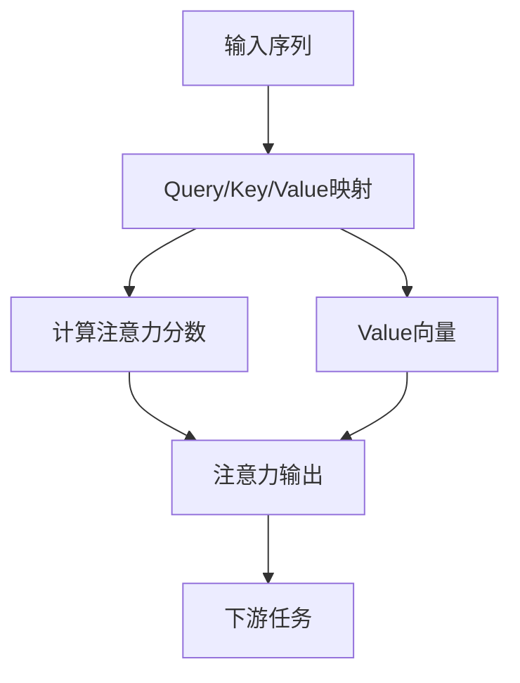
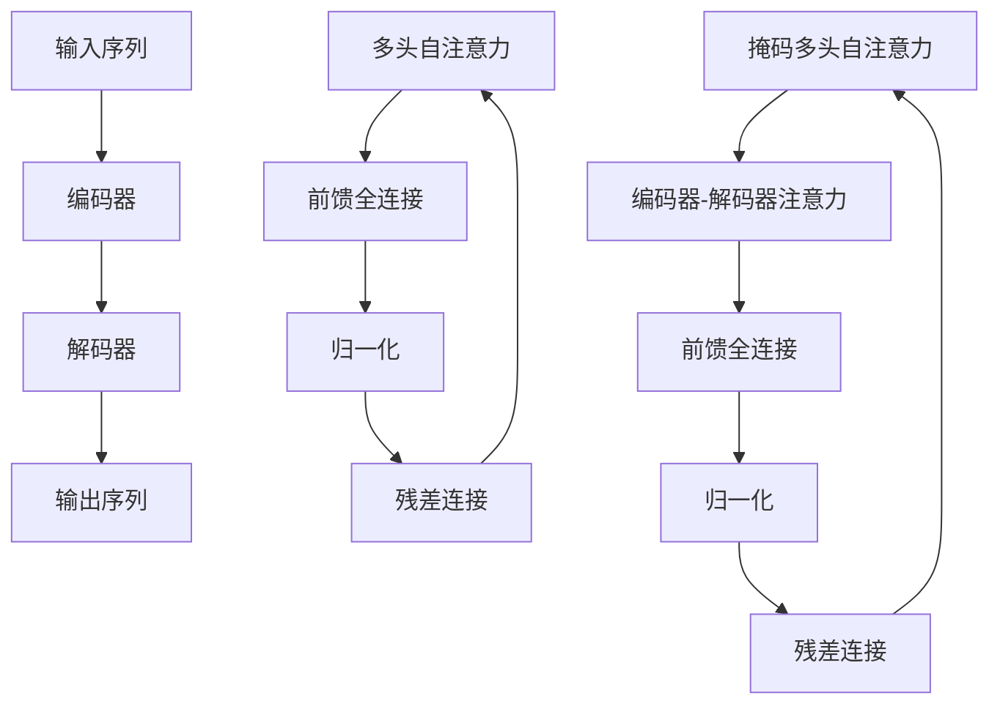

# 大语言模型应用指南：进阶

## 1.背景介绍

大语言模型(Large Language Models, LLMs)是一种基于深度学习的自然语言处理技术,近年来取得了令人瞩目的进展。它们被训练于大规模文本数据集,能够生成看似人类写作的连贯、流畅的文本输出。随着计算能力的不断提高和训练数据的积累,LLMs的性能不断提升,在多个自然语言处理任务中表现出色,如机器翻译、文本摘要、问答系统等。

LLMs的核心思想是利用自注意力机制(Self-Attention)和transformer架构,捕捉输入序列中词与词之间的长程依赖关系。与传统的序列模型(如RNN、LSTM)相比,transformer架构更适合并行计算,能够高效利用GPU/TPU等硬件资源,从而支持训练更大规模的语言模型。

目前,GPT(Generative Pre-trained Transformer)系列、BERT(Bidirectional Encoder Representations from Transformers)系列、T5(Text-to-Text Transfer Transformer)等都是业界广为人知的大型预训练语言模型。它们在自然语言生成、理解、推理等多个领域展现出强大的能力,为各种自然语言处理任务提供了通用的基础模型,极大推动了该领域的发展。

## 2.核心概念与联系

### 2.1 自注意力机制(Self-Attention)

自注意力机制是transformer架构的核心,它能够同时捕捉输入序列中任意两个位置的词之间的关系,而不受距离的限制。这与RNN/LSTM等序列模型不同,后者主要关注相邻词之间的短程依赖关系。

自注意力机制的计算过程可以概括为三个核心步骤:

1. 计算Query、Key和Value向量
2. 计算注意力分数(Attention Scores)
3. 加权求和Value向量,得到注意力输出

具体来说,对于输入序列的每个词,我们首先将其映射为Query、Key和Value向量。然后,Query向量与Key向量的点积可以衡量当前词与输入序列中其他词之间的关联程度,经过缩放和softmax操作后,即可得到注意力分数(Attention Scores)。最后,将注意力分数与Value向量加权求和,即可得到当前词的注意力输出,它融合了输入序列中所有其他词对当前词的影响。

自注意力机制的并行计算特性,使得transformer架构能够高效利用GPU/TPU等硬件资源,支持训练大规模语言模型。

### 2.2 transformer架构

Transformer是一种全新的基于注意力机制的序列到序列模型架构,由编码器(Encoder)和解码器(Decoder)组成。

编码器的作用是映射输入序列到一个连续的表示空间。它由多个相同的层组成,每一层都有两个子层:

1. 多头自注意力子层(Multi-Head Self-Attention)
2. 前馈全连接子层(Position-wise Feed-Forward)

解码器也由多个相同层组成,除了插入一个额外的注意力子层,对编码器输出序列进行注意力计算。

Transformer的优势在于完全摒弃了RNN/LSTM等递归结构,仅依赖注意力机制就能直接捕捉输入序列中任意两个位置的词之间的长程依赖关系。这不仅简化了模型结构,而且允许高度并行化,能够有效利用现代GPU/TPU等硬件资源,从而支持训练大规模的语言模型。

## 3.核心算法原理具体操作步骤

### 3.1 注意力计算细节

具体来说,自注意力机制的计算步骤如下:

1. **Query、Key和Value向量计算**

   对于输入序列$X = (x_1, x_2, \ldots, x_n)$中的每个词$x_i$,我们首先通过三个不同的线性投影将其映射到Query向量$q_i$、Key向量$k_i$和Value向量$v_i$:

   $$q_i = x_iW^Q$$
   $$k_i = x_iW^K$$
   $$v_i = x_iW^V$$

   其中,$W^Q, W^K, W^V$分别是可学习的投影矩阵。

2. **计算注意力分数**

   注意力分数$\alpha_{ij}$衡量的是Query向量$q_i$与Key向量$k_j$之间的相似程度,通常采用缩放点积注意力(Scaled Dot-Product Attention):

   $$\alpha_{ij} = \text{softmax}\left(\frac{q_i^Tk_j}{\sqrt{d_k}}\right)$$

   其中,$d_k$是Key向量的维度,缩放操作可以防止点积过大导致softmax函数梯度消失。

3. **加权求和Value向量**

   最后,将注意力分数$\alpha_{ij}$与Value向量$v_j$加权求和,即可得到注意力输出$z_i$:

   $$z_i = \sum_{j=1}^{n}\alpha_{ij}v_j$$

   $z_i$融合了输入序列中所有其他词对$x_i$的影响,成为了$x_i$的一种增强表示。

以上是单头注意力(Single-Head Attention)的计算过程。在实践中,通常会采用多头注意力(Multi-Head Attention),将注意力计算过程分成多个注意力头(Head),每个头捕捉输入序列中不同的关系,最后将各头的注意力输出拼接起来,得到最终的注意力表示。

### 3.2 transformer编码器

Transformer的编码器由N个相同的层组成,每一层包括两个子层:

1. **多头自注意力子层(Multi-Head Self-Attention)**

   这一子层的作用是计算输入序列中每个位置的词所对应的注意力表示。具体来说,对于第$l$层的输入$X^l$,我们首先通过多头自注意力机制计算出注意力输出$Z^l$:

   $$Z^l = \text{MultiHead}(X^l, X^l, X^l)$$

   其中,MultiHead函数表示多头注意力的计算过程。

2. **前馈全连接子层(Position-wise Feed-Forward)**

   这一子层对每个位置的词的表示进行独立的全连接变换,并引入非线性激活函数:

   $$\text{FFN}(x) = \max(0, xW_1 + b_1)W_2 + b_2$$

   其中,$W_1, W_2, b_1, b_2$是可学习的参数。

在每个子层的输出上,transformer编码器还引入了残差连接(Residual Connection)和层归一化(Layer Normalization),以帮助模型训练和提高性能。

最终,第$l$层的输出$X^{l+1}$可以表示为:

$$X^{l+1} = \text{LayerNorm}(X^l + \text{FFN}(\text{LayerNorm}(Z^l + X^l)))$$

通过堆叠N个这样的层,transformer编码器可以对输入序列进行编码,得到其在连续表示空间中的表示。

### 3.3 transformer解码器

Transformer的解码器与编码器类似,也由N个相同的层组成,每一层包括三个子层:

1. **掩码多头自注意力子层(Masked Multi-Head Self-Attention)**

   这一子层与编码器的多头自注意力子层类似,不同之处在于,对于输出序列中的每个位置,我们只允许关注之前的位置,避免关注未来的信息。这通过在softmax计算前给未来位置的注意力分数加上一个非常大的负值(掩码)来实现。

2. **编码器-解码器注意力子层(Encoder-Decoder Attention)**

   这一子层的作用是将解码器的输出与编码器的输出进行注意力计算,以融合输入序列的信息。

3. **前馈全连接子层(Position-wise Feed-Forward)**

   与编码器中的前馈全连接子层相同。

与编码器类似,解码器在每个子层的输出上也引入了残差连接和层归一化。最终,第$l$层的输出$Y^{l+1}$可以表示为:

$$\begin{aligned}
Y^{l+1} &= \text{LayerNorm}(Y^l + \text{FFN}(\text{LayerNorm}(E^l + Y^l))) \\
E^l &= \text{LayerNorm}(Z^l + \text{MultiHead}(Y^l, X, X))\\
Z^l &= \text{LayerNorm}(\text{MultiHead}(Y^l, Y^l, Y^l) + Y^l)
\end{aligned}$$

其中,$X$表示编码器的输出。通过堆叠N个这样的层,transformer解码器可以生成输出序列。

## 4.数学模型和公式详细讲解举例说明

在transformer模型中,自注意力机制是捕捉输入序列中词与词之间关系的核心。我们以一个具体的例子来详细解释自注意力机制的数学原理。

假设我们有一个长度为6的输入序列"The animal didn't cross the street"。我们将每个词映射为64维的Query、Key和Value向量,并计算单头注意力。

1. **Query、Key和Value向量计算**

   我们首先通过三个不同的线性投影将每个词映射到Query、Key和Value向量。以"The"这个词为例,假设其对应的64维词向量为$x_\text{The}$,则有:

   $$\begin{aligned}
   q_\text{The} &= x_\text{The}W^Q \\
   k_\text{The} &= x_\text{The}W^K\\
   v_\text{The} &= x_\text{The}W^V
   \end{aligned}$$

   其中,$W^Q, W^K, W^V \in \mathbb{R}^{64 \times 64}$是可学习的投影矩阵。对于输入序列中的其他词,计算方式类似。

2. **计算注意力分数**

   接下来,我们计算Query向量$q_\text{The}$与所有Key向量之间的缩放点积注意力分数:

   $$\begin{aligned}
   \alpha_\text{The,The} &= \frac{q_\text{The}^Tk_\text{The}}{\sqrt{64}} \\
   \alpha_\text{The,animal} &= \frac{q_\text{The}^Tk_\text{animal}}{\sqrt{64}} \\
   &\ldots \\
   \alpha_\text{The,street} &= \frac{q_\text{The}^Tk_\text{street}}{\sqrt{64}}
   \end{aligned}$$

   然后,我们对这些注意力分数做softmax运算,得到归一化的注意力权重:

   $$\begin{aligned}
   \beta_\text{The,The} &= \text{softmax}(\alpha_\text{The,The}, \alpha_\text{The,animal}, \ldots, \alpha_\text{The,street}) \\
   \beta_\text{The,animal} &= \text{softmax}(\alpha_\text{The,The}, \alpha_\text{The,animal}, \ldots, \alpha_\text{The,street}) \\
   &\ldots \\
   \beta_\text{The,street} &= \text{softmax}(\alpha_\text{The,The}, \alpha_\text{The,animal}, \ldots, \alpha_\text{The,street})
   \end{aligned}$$

3. **加权求和Value向量**

   最后,我们将注意力权重与Value向量加权求和,得到"The"这个词的注意力输出$z_\text{The}$:

   $$\begin{aligned}
   z_\text{The} &= \beta_\text{The,The}v_\text{The} + \beta_\text{The,animal}v_\text{animal} + \ldots + \beta_\text{The,street}v_\text{street} \\
            &= \sum_{j=1}^6 \beta_\text{The,j}v_j
   \end{aligned}$$

   $z_\text{The}$融合了输入序列中所有其他词对"The"的影响,成为了"The"的一种增强表示。对于输入序列中的其他词,计算方式类似。

通过这个例子,