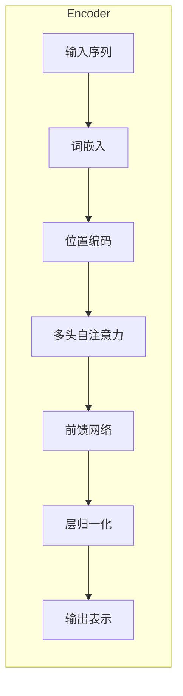
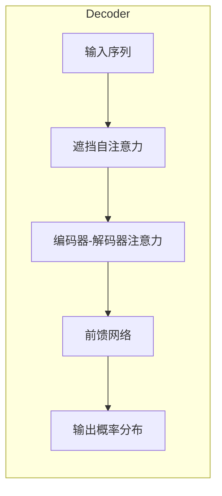
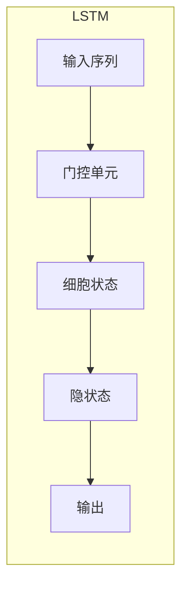

# 大语言模型应用指南：长短期记忆

## 1. 背景介绍

### 1.1 人工智能的发展历程

人工智能(Artificial Intelligence, AI)是当代科技发展的热点领域之一。自20世纪50年代AI概念被正式提出以来,经历了几个重要的发展阶段:

- 早期阶段(1950s-1960s):专家系统、博弈理论等奠基性研究
- 知识工程阶段(1970s-1980s):知识库、规则推理等
- 机器学习兴起(1990s-2000s):神经网络、支持向量机等
- 深度学习时代(2010s-):卷积神经网络、循环神经网络等

### 1.2 大语言模型的兴起

近年来,随着计算能力的飞速提升和海量数据的积累,大规模预训练语言模型(Large Pre-trained Language Models)成为AI发展的一个重要分支。这些模型通过在大型文本语料库上预训练,获得了强大的语言理解和生成能力,在自然语言处理领域取得了突破性进展。

代表性的大语言模型包括:

- GPT(Generative Pre-trained Transformer)系列模型
- BERT(Bidirectional Encoder Representations from Transformers)
- XLNet
- RoBERTa
- ALBERT
- ...

其中,GPT模型家族尤为突出,展现了大语言模型在文本生成、问答、摘要等任务上的卓越表现。

## 2. 核心概念与联系

### 2.1 自注意力机制(Self-Attention)

大语言模型的核心是基于Transformer架构,其中自注意力机制是关键。自注意力允许模型捕捉输入序列中任意两个位置之间的依赖关系,突破了传统RNN/CNN模型的局限性。

$$
\mathrm{Attention}(Q, K, V) = \mathrm{softmax}(\frac{QK^T}{\sqrt{d_k}})V
$$

其中 $Q$ 为查询(Query)、$K$ 为键(Key)、$V$ 为值(Value)。通过计算 $Q$ 和所有 $K$ 的相关性得分,对 $V$ 进行加权求和,获得注意力表示。

### 2.2 transformer解码器(Decoder)

Transformer解码器用于生成目标序列,通常包括以下几个核心组件:

1. **掩蔽自注意力层(Masked Self-Attention)**:只允许每个位置关注之前的位置。
2. **编码器-解码器注意力层(Encoder-Decoder Attention)**:将解码器和编码器连接,解码器可以关注整个输入序列。
3. **前馈神经网络(Feed-Forward Network)**:为每个位置提供额外的非线性转换。

### 2.3 长短期记忆(Long Short-Term Memory)

尽管Transformer已成为主流架构,但RNN及其变种LSTM/GRU在某些场景下仍有重要应用。LSTM的核心思想是使用门控机制来控制信息的流动,解决了传统RNN的长期依赖问题。

LSTM的关键方程如下:

$$
\begin{aligned}
f_t &= \sigma(W_f[h_{t-1}, x_t] + b_f) & \text{(forget gate)}\\
i_t &= \sigma(W_i[h_{t-1}, x_t] + b_i) & \text{(input gate)}\\
o_t &= \sigma(W_o[h_{t-1}, x_t] + b_o) & \text{(output gate)}\\
c_t &= f_t \odot c_{t-1} + i_t \odot \tanh(W_c[h_{t-1}, x_t] + b_c) & \text{(cell state)}\\
h_t &= o_t \odot \tanh(c_t) & \text{(hidden state)}
\end{aligned}
$$

其中 $\sigma$ 为sigmoid函数,  $\odot$ 为元素乘积。通过精心设计的门控机制,LSTM能够有效地捕捉长期依赖,在序列建模任务中表现优异。

### 2.4 注意力与记忆的关系

注意力机制和LSTM都旨在捕捉长期依赖关系,但采取了不同的方式:

- 注意力机制直接建模任意两个位置之间的关联,具有全局感知能力。
- LSTM通过门控机制控制信息流,隐式地捕捉长期依赖。

二者在不同场景下各有优缺点,注意力机制在捕捉长程依赖方面更加高效,但LSTM对序列建模能力更强。在实践中,研究人员常常结合两种机制的优点,设计出更加强大的混合模型。

## 3. 核心算法原理具体操作步骤

### 3.1 Transformer编码器(Encoder)

Transformer编码器将输入序列 $X=(x_1, x_2, ..., x_n)$ 映射为连续的表示 $Z=(z_1, z_2, ..., z_n)$,主要包括以下步骤:

1. **词嵌入(Word Embeddings)**: 将每个词 $x_i$ 映射为词向量 $\mathbf{x}_i$。
2. **位置编码(Positional Encoding)**: 为每个位置 $i$ 添加位置信息 $\mathbf{p}_i$,得到 $\mathbf{x}_i' = \mathbf{x}_i + \mathbf{p}_i$。
3. **多头自注意力(Multi-Head Self-Attention)**: 计算 $\mathbf{x}_i'$ 与所有 $\mathbf{x}_j'$ 的注意力权重,生成注意力表示 $\mathbf{z}_i^1$。
4. **前馈网络(Feed-Forward Network)**: 对每个 $\mathbf{z}_i^1$ 应用全连接层,得到 $\mathbf{z}_i^2$。
5. **层归一化(Layer Normalization)**: 对 $\mathbf{z}_i^2$ 进行归一化,得到最终表示 $\mathbf{z}_i$。

编码器通常包含多个这样的层堆叠,每一层的输出作为下一层的输入。

### 3.2 Transformer解码器(Decoder)

解码器的输入包括编码器输出 $Z$ 和目标序列 $Y=(y_1, y_2, ..., y_m)$,生成过程如下:

1. **遮挡自注意力(Masked Self-Attention)**: 计算 $y_i$ 与 $y_1, ..., y_{i-1}$ 的注意力表示 $\mathbf{s}_i^1$。
2. **编码器-解码器注意力(Encoder-Decoder Attention)**: 计算 $\mathbf{s}_i^1$ 与编码器输出 $Z$ 的注意力表示 $\mathbf{s}_i^2$。
3. **前馈网络(Feed-Forward Network)**: 对 $\mathbf{s}_i^2$ 应用全连接层,得到 $\mathbf{s}_i^3$。
4. **线性+softmax**: 将 $\mathbf{s}_i^3$ 映射为概率分布 $P(y_{i+1}|y_1, ..., y_i, X)$,采样得到 $y_{i+1}$。

该过程逐位置生成目标序列,直至生成结束符号或达到最大长度。

### 3.3 LSTM 网络

LSTM网络的核心思想是使用门控单元控制信息流动,从而解决传统RNN的梯度消失/爆炸问题。具体操作步骤如下:

1. **初始化**: 将初始隐状态 $h_0$ 和细胞状态 $c_0$ 设为全0向量。
2. **遍历序列**: 对于每个时间步 $t$:
    - 计算遗忘门 $f_t$、输入门 $i_t$、输出门 $o_t$
    - 更新细胞状态 $c_t = f_t \odot c_{t-1} + i_t \odot \tilde{c}_t$
    - 计算隐状态 $h_t = o_t \odot \tanh(c_t)$
3. **输出**: 使用最终隐状态 $h_T$ 或所有隐状态序列 $(h_1, h_2, ..., h_T)$ 作为输出。

LSTM通过精心设计的门控机制,能够有效地捕捉长期依赖关系,在序列建模任务中表现优异。

## 4. 数学模型和公式详细讲解举例说明

### 4.1 注意力机制(Attention Mechanism)

注意力机制是Transformer和其他大语言模型的核心,它允许模型动态地关注输入序列的不同部分,捕捉长期依赖关系。

给定查询 $Q$、键 $K$ 和值 $V$,注意力机制的计算过程如下:

1. 计算查询 $Q$ 与所有键 $K$ 的相关性得分(Relevance Score):

$$
e_{ij} = \frac{Q_iK_j^T}{\sqrt{d_k}}
$$

其中 $d_k$ 为缩放因子,用于防止内积过大导致的梯度饱和。

2. 对相关性得分应用softmax函数,得到注意力权重(Attention Weights):

$$
\alpha_{ij} = \mathrm{softmax}(e_{ij}) = \frac{e^{e_{ij}}}{\sum_k e^{e_{ik}}}
$$

3. 使用注意力权重对值 $V$ 进行加权求和,得到注意力输出(Attention Output):

$$
\mathrm{Attention}(Q, K, V) = \sum_{j=1}^n \alpha_{ij}V_j
$$

通过这种方式,注意力机制可以自适应地为每个查询位置分配不同的注意力权重,捕捉输入序列中的重要信息。

**示例**:假设我们有一个长度为3的查询向量 $Q$,以及长度为4的键 $K$ 和值 $V$:

$$
Q = \begin{bmatrix}0.1\\0.2\\0.3\end{bmatrix}, \quad
K = \begin{bmatrix}0.4&0.5&-0.1&0.2\\0.6&-0.2&-0.3&-0.4\\0.1&0.3&0.5&0.1\end{bmatrix}, \quad
V = \begin{bmatrix}0.1&0.9&0.3&0.2\\0.4&0.5&0.6&0.7\\0.8&0.1&0.2&0.3\end{bmatrix}
$$

计算过程如下:

1. 计算相关性得分:

$$
e = \begin{bmatrix}
0.1&0.2&0.3
\end{bmatrix}
\begin{bmatrix}
0.4&0.6&0.1\\
0.5&-0.2&0.3\\
-0.1&-0.3&0.5\\
0.2&-0.4&0.1
\end{bmatrix}^T = \begin{bmatrix}
0.19&-0.05&0.23\\
0.27&-0.17&0.17\\
0.07&-0.25&0.35
\end{bmatrix}
$$

2. 应用softmax:

$$
\alpha = \mathrm{softmax}(e) = \begin{bmatrix}
0.43&0.18&0.39\\
0.51&0.13&0.36\\
0.26&0.15&0.59
\end{bmatrix}
$$

3. 计算注意力输出:

$$
\mathrm{Attention}(Q, K, V) = \alpha V = \begin{bmatrix}
0.43&0.18&0.39\\
0.51&0.13&0.36\\
0.26&0.15&0.59
\end{bmatrix}
\begin{bmatrix}
0.1&0.9&0.3&0.2\\
0.4&0.5&0.6&0.7\\
0.8&0.1&0.2&0.3
\end{bmatrix} = \begin{bmatrix}
0.48&0.49&0.42\\
0.52&0.38&0.51\\
0.44&0.21&0.41
\end{bmatrix}
$$

可以看到,注意力机制为每个查询位置分配了不同的注意力权重,捕捉了输入