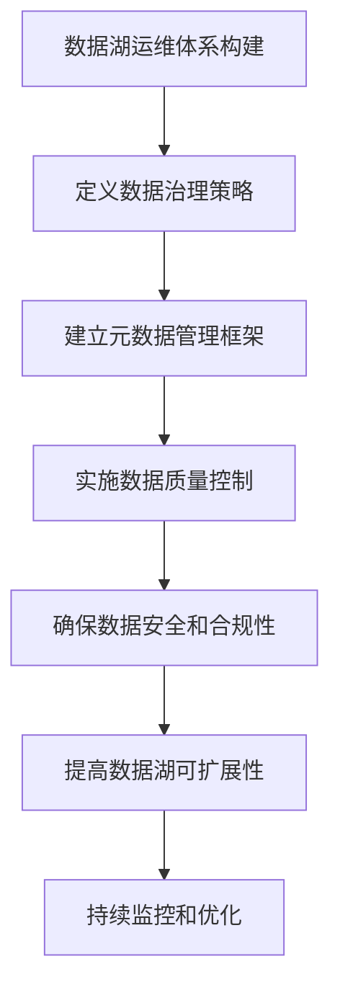

# 如何构建高效的数据湖运维体系？

## 1.背景介绍

随着大数据时代的到来,企业需要处理和存储海量的结构化和非结构化数据。传统的数据仓库已经无法满足现代数据处理的需求,因此数据湖(Data Lake)应运而生。数据湖是一种能够存储各种格式数据的集中式存储库,它为企业提供了一种更加灵活、可扩展和经济高效的大数据管理解决方案。

然而,构建和维护一个高效的数据湖运维体系并非一蹴而就。它需要考虑数据治理、元数据管理、数据质量、安全性和可扩展性等多个方面。本文将探讨如何构建一个健壮、高效的数据湖运维体系,以确保数据湖的稳定运行和数据资产的有效利用。

## 2.核心概念与联系

### 2.1 数据湖

数据湖是一种用于存储各种格式数据(结构化、半结构化和非结构化)的集中式存储库。与传统数据仓库不同,数据湖没有预定义的数据模式,可以存储原始数据,并在需要时进行处理和分析。

### 2.2 数据治理

数据治理是确保数据质量、一致性、可访问性、安全性和合规性的过程。在数据湖中,数据治理尤为重要,因为它涉及来自多个来源的大量数据。

### 2.3 元数据管理

元数据是描述数据的数据,包括数据的来源、格式、结构、质量和访问权限等信息。在数据湖中,有效的元数据管理对于发现、理解和利用数据资产至关重要。

### 2.4 数据质量

数据质量指数据的准确性、完整性、一致性和及时性。在数据湖中,由于数据来源多样,确保数据质量是一个巨大的挑战。

### 2.5 安全性和合规性

数据湖中存储着大量敏感数据,因此需要采取适当的安全措施来保护数据免受未经授权的访问、修改或删除。同时,还需要确保数据湖符合相关的法律法规和行业标准。

### 2.6 可扩展性

随着数据量的不断增长,数据湖需要具有良好的可扩展性,以确保其能够高效地存储和处理大量数据。

## 3.核心算法原理具体操作步骤

构建高效的数据湖运维体系需要遵循以下核心步骤:



### 3.1 定义数据治理策略

1. **确定数据治理目标**: 明确数据治理的目标,如提高数据质量、确保数据安全、支持业务决策等。
2. **建立数据治理组织**: 组建跨部门的数据治理委员会,负责制定和执行数据治理政策。
3. **制定数据治理政策**: 制定涵盖数据所有权、数据访问、数据质量、数据安全等方面的政策。
4. **实施数据治理流程**: 建立数据治理流程,包括数据发现、数据分类、数据清理、数据监控等。

### 3.2 建立元数据管理框架

1. **选择元数据管理工具**: 选择合适的元数据管理工具,如Apache Atlas、Cloudera Navigator等。
2. **定义元数据模型**: 根据业务需求定义元数据模型,包括数据资产、数据lineage、数据质量等信息。
3. **收集和管理元数据**: 从各种数据源收集元数据,并在元数据管理工具中进行集中管理。
4. **提供元数据服务**: 为数据湖用户提供元数据查询、搜索和浏览等服务。

### 3.3 实施数据质量控制

1. **定义数据质量标准**: 根据业务需求和数据特征,定义数据质量标准,如完整性、准确性、一致性等。
2. **建立数据质量规则**: 基于数据质量标准,建立数据质量规则,用于检测和评估数据质量。
3. **执行数据质量检查**: 在数据进入数据湖之前,执行数据质量检查,确保数据符合质量标准。
4. **数据清理和修复**: 对不符合质量标准的数据进行清理和修复,确保数据湖中的数据质量。

### 3.4 确保数据安全和合规性

1. **实施访问控制**: 通过身份认证和授权机制,控制对数据湖中数据的访问。
2. **加密敏感数据**: 对敏感数据进行加密,防止未经授权的访问和泄露。
3. **审计和监控**: 建立审计和监控机制,记录和跟踪对数据湖的访问和操作。
4. **合规性检查**: 定期检查数据湖是否符合相关法律法规和行业标准。

### 3.5 提高数据湖可扩展性

1. **选择合适的存储技术**: 根据数据量和访问模式,选择合适的存储技术,如HDFS、对象存储等。
2. **实施数据分区和压缩**: 对数据进行分区和压缩,提高存储和查询效率。
3. **采用分布式计算框架**: 使用分布式计算框架(如Apache Spark)进行大规模数据处理。
4. **实施自动扩展**: 根据数据量和负载,自动扩展存储和计算资源。

### 3.6 持续监控和优化

1. **建立监控系统**: 监控数据湖的运行状态、资源利用率、性能指标等。
2. **分析和诊断问题**: 分析监控数据,及时发现和诊断问题。
3. **优化配置和资源**: 根据监控数据和问题诊断结果,优化配置和资源分配。
4. **持续改进**: 基于运维经验和反馈,持续改进数据湖运维体系。

## 4.数学模型和公式详细讲解举例说明

在数据湖运维体系中,数学模型和公式主要应用于以下几个方面:

### 4.1 数据压缩

数据压缩可以减小数据的存储空间,提高存储和传输效率。常用的数据压缩算法包括:

1. **熵编码**

熵编码是一种无损压缩算法,基于数据中符号出现的概率进行编码。常用的熵编码算法包括霍夫曼编码和算术编码。

$$
H(X) = -\sum_{i=1}^{n} p(x_i) \log_2 p(x_i)
$$

其中,$$H(X)$$表示数据$$X$$的熵,$$p(x_i)$$表示符号$$x_i$$出现的概率。

2. **字典编码**

字典编码是一种无损压缩算法,将重复出现的数据模式替换为较短的编码。常用的字典编码算法包括LZW算法。

### 4.2 数据分区

数据分区可以提高查询效率,减少数据扫描范围。常用的数据分区策略包括:

1. **范围分区**

根据数据值的范围进行分区,例如按照时间范围或数值范围分区。

2. **哈希分区**

根据数据值的哈希值进行分区,可以实现较好的数据分布均匀性。

$$
bucket = hash(key) \bmod N
$$

其中,$$bucket$$表示分区编号,$$key$$表示分区键,$$N$$表示分区数量。

### 4.3 数据采样

在大数据场景下,对全量数据进行处理和分析往往成本较高。因此,常常需要进行数据采样,从而降低计算复杂度。常用的数据采样方法包括:

1. **简单随机采样**

从总体中随机抽取样本,每个样本被抽取的概率相等。

$$
P(x_i) = \frac{1}{N}
$$

其中,$$P(x_i)$$表示样本$$x_i$$被抽取的概率,$$N$$表示总体大小。

2. **分层采样**

根据总体的某些特征将总体分为若干层,然后在每一层中进行简单随机采样。

### 4.4 数据质量评估

评估数据质量是数据湖运维体系的重要环节。常用的数据质量指标包括:

1. **完整性**

评估数据是否缺失或存在空值。

$$
Completeness = 1 - \frac{count(null \ or \ missing)}{total}
$$

2. **准确性**

评估数据是否符合预期的格式和约束条件。

$$
Accuracy = 1 - \frac{count(invalid)}{total}
$$

3. **一致性**

评估数据在不同来源或不同时间点是否一致。

$$
Consistency = 1 - \frac{count(inconsistent)}{total}
$$

4. **及时性**

评估数据是否及时更新和反映实际情况。

$$
Timeliness = 1 - \frac{count(outdated)}{total}
$$

## 5.项目实践：代码实例和详细解释说明

在本节中,我们将提供一些代码示例,展示如何在实际项目中构建和维护数据湖运维体系。

### 5.1 Apache Atlas: 元数据管理

Apache Atlas是一个开源的元数据管理框架,可以帮助我们管理数据湖中的元数据。以下是一个使用Apache Atlas创建实体类型和实体实例的示例:

```java
// 创建实体类型
AtlasEntityType entityType = new AtlasEntityType("hive_table");
entityType.setAttribute("owner", AtlasAttributeDef.isString("owner"));
entityType.setAttribute("lastAccessTime", AtlasAttributeDef.isDate("lastAccessTime"));
atlasClientV2.createAtlasEntityType(entityType);

// 创建实体实例
Map<String, Object> attributes = new HashMap<>();
attributes.put("owner", "John Doe");
attributes.put("lastAccessTime", new Date());

AtlasEntity entity = new AtlasEntity("hive_table", attributes);
atlasClientV2.createAtlasEntity(entity);
```

在上面的示例中,我们首先创建了一个名为`hive_table`的实体类型,并为其定义了`owner`和`lastAccessTime`两个属性。然后,我们创建了一个`hive_table`实体实例,并设置了相应的属性值。

### 5.2 Apache Ranger: 数据安全和访问控制

Apache Ranger是一个开源的数据安全和访问控制框架,可以帮助我们管理数据湖中的数据访问权限。以下是一个使用Apache Ranger创建策略和授权的示例:

```java
// 创建策略
RangerPolicy policy = new RangerPolicy();
policy.setName("finance-data-policy");
policy.setIsAuditEnabled(true);
policy.setResources(Collections.singletonMap(RangerPolicy.RESOURCE_PATH, "/finance/data"));

// 授权用户
List<RangerPolicyItem> policyItems = new ArrayList<>();
RangerPolicyItem policyItem = new RangerPolicyItem();
policyItem.setUsers(Collections.singletonList("john_doe"));
policyItem.setAccesses(Collections.singletonList(RangerPolicyItem.ALLOW_OPS));
policyItems.add(policyItem);
policy.setPolicyItems(policyItems);

rangerClient.createPolicy(policy);
```

在上面的示例中,我们创建了一个名为`finance-data-policy`的策略,该策略授权用户`john_doe`对`/finance/data`路径下的数据拥有访问权限。我们还启用了审计功能,以记录对该策略的访问和操作。

### 5.3 Apache Spark: 数据处理和质量检查

Apache Spark是一个开源的大数据处理框架,可以帮助我们进行数据处理和质量检查。以下是一个使用Apache Spark进行数据质量检查的示例:

```scala
import org.apache.spark.sql.functions._

val df = spark.read.parquet("/data/sales")

// 检查缺失值
val missingCount = df.select(count(when(col("sales_amount").isNull, true)).alias("missing_count"))
println(s"Missing sales_amount count: ${missingCount.first().getLong(0)}")

// 检查异常值
val invalidCount = df.filter(col("sales_amount") < 0).count()
println(s"Invalid sales_amount count: $invalidCount")

// 检查重复值
val duplicateCount = df.groupBy("order_id").count().filter(col("count") > 1).count()
println(s"Duplicate order_id count: $duplicateCount")
```

在上面的示例中,我们首先从数据湖中读取销售数据。然后,我们使用Apache Spark进行以下数据质量检查:

1. 检查`sales_amount`列中的缺失