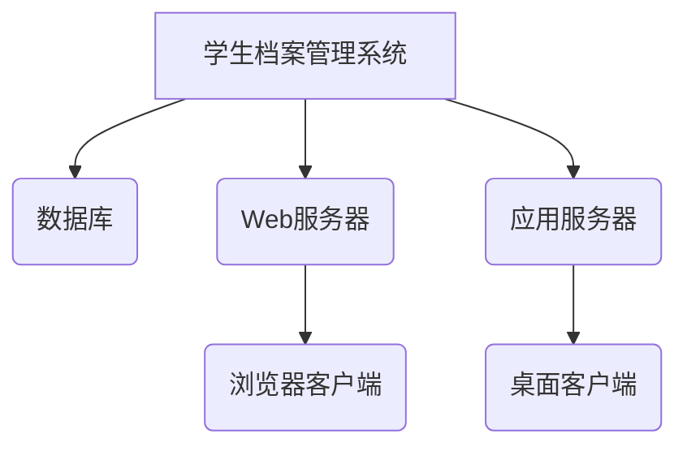
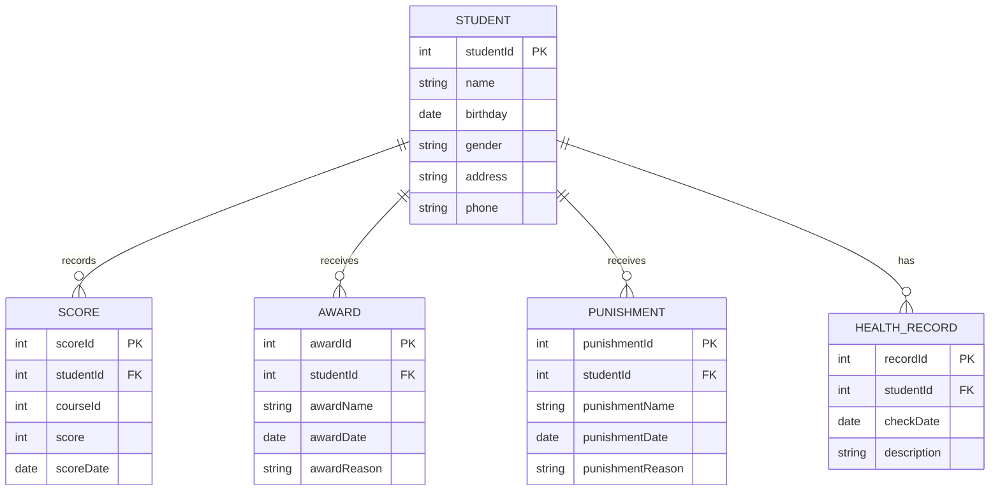
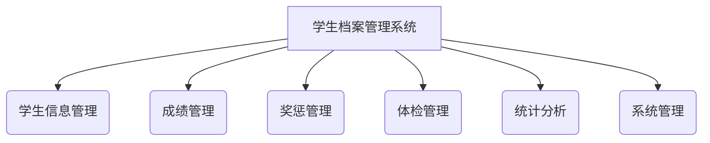
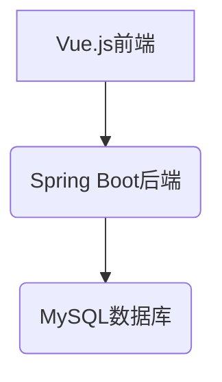

# 学生档案管理系统详细设计与具体代码实现

## 1.背景介绍

随着教育信息化的不断推进,学校对于学生信息的管理需求日益增长。传统的纸质档案管理方式已经无法满足当前的需求,因此构建一个高效、安全、可扩展的学生档案管理系统势在必行。学生档案管理系统的建设可以实现学生信息的集中存储、方便查询、快速更新和数据安全管理,为学校的教学管理和决策提供有力支持。

## 2.核心概念与联系

### 2.1 学生档案

学生档案是指学生在校期间的各种信息记录,包括个人基本信息、学习成绩、奖惩情况、体检报告等,是学校对学生进行综合管理的重要依据。

### 2.2 数据库

数据库是存储和管理学生档案数据的核心,采用关系型数据库可以保证数据的完整性、一致性和安全性。常用的关系型数据库有MySQL、PostgreSQL、Oracle等。

### 2.3 系统架构

学生档案管理系统通常采用B/S(Browser/Server)或C/S(Client/Server)架构,前者以Web应用的形式提供服务,后者以传统的客户端/服务器模式运行。



## 3.核心算法原理具体操作步骤

### 3.1 数据库设计

#### 3.1.1 E-R模型

在进行数据库设计之前,我们需要构建实体-关系(E-R)模型,用于描述学生档案管理系统中各个实体及其之间的关系。



#### 3.1.2 数据库表设计

根据E-R模型,我们可以设计出以下数据库表:

- Student表:存储学生的基本信息
- Score表:存储学生的课程成绩记录
- Award表:存储学生的奖励记录
- Punishment表:存储学生的惩罚记录
- HealthRecord表:存储学生的体检记录

#### 3.1.3 索引设计

为了提高查询效率,我们需要为经常作为查询条件的字段建立索引,如学生ID、课程ID、奖惩名称等。

### 3.2 系统功能设计

学生档案管理系统的主要功能模块包括:

- 学生信息管理:实现学生基本信息的增加、修改、删除和查询。
- 成绩管理:录入和查询学生的课程成绩。
- 奖惩管理:录入和查询学生的奖惩记录。
- 体检管理:录入和查询学生的体检报告。
- 统计分析:对学生的各种信息进行统计和分析,为决策提供依据。
- 系统管理:实现用户权限管理、系统参数配置、数据备份等功能。



### 3.3 系统开发技术选型

- 前端技术:HTML、CSS、JavaScript、Vue.js/React
- 后端技术:Java/Python/Node.js
- 数据库:MySQL/PostgreSQL
- 开发框架:Spring Boot/Django/Express
- 部署环境:Linux服务器、Docker容器

### 3.4 系统安全设计

- 用户身份认证:实现用户注册、登录、密码加密等功能。
- 数据访问控制:根据用户角色划分权限,控制对数据的访问。
- 数据传输加密:采用HTTPS协议,保证数据在网络传输过程中的安全性。
- 数据备份与恢复:定期对数据进行备份,防止数据丢失。

## 4.数学模型和公式详细讲解举例说明

在学生档案管理系统中,我们可以利用数学模型对学生的成绩进行分析和预测。

### 4.1 平均分和标准差

计算学生的平均分和标准差,可以反映学生的总体学习水平和分数分布情况。

平均分公式:

$$\overline{x} = \frac{\sum_{i=1}^{n}x_i}{n}$$

其中,$x_i$表示第i个学生的分数,$n$表示学生总数。

标准差公式:

$$s = \sqrt{\frac{\sum_{i=1}^{n}(x_i - \overline{x})^2}{n-1}}$$

标准差越小,说明学生的分数越集中;标准差越大,说明学生的分数差异越大。

### 4.2 线性回归模型

线性回归模型可以用于预测学生的成绩,建立学生的期末成绩与平时分、出勤率等因素之间的线性关系。

假设学生的期末成绩$y$与$m$个自变量$x_1,x_2,...,x_m$之间满足线性关系:

$$y = \beta_0 + \beta_1x_1 + \beta_2x_2 + ... + \beta_mx_m + \epsilon$$

其中,$\beta_0,\beta_1,...,\beta_m$是待估计的回归系数,$\epsilon$是随机误差项。

我们可以使用最小二乘法估计回归系数,从而得到预测模型。该模型可以帮助教师了解影响学生成绩的主要因素,并为学生的学习提供指导。

### 4.3 示例:线性回归预测期末成绩

假设我们有如下学生的数据:

| 学生ID | 平时分 | 出勤率 | 期末成绩 |
|--------|--------|--------|----------|
| 1      | 85     | 0.9    | 88       |
| 2      | 92     | 0.95   | 94       |
| ...    | ...    | ...    | ...      |
| 100    | 78     | 0.85   | 80       |

我们可以建立如下线性回归模型:

$$y = \beta_0 + \beta_1x_1 + \beta_2x_2 + \epsilon$$

其中,$y$表示期末成绩,$x_1$表示平时分,$x_2$表示出勤率。

使用Python的scikit-learn库,我们可以估计回归系数并进行预测:

```python
import numpy as np
from sklearn.linear_model import LinearRegression

# 样本数据
X = np.array([[85, 0.9], [92, 0.95], ..., [78, 0.85]])
y = np.array([88, 94, ..., 80])

# 创建线性回归模型
model = LinearRegression()

# 训练模型
model.fit(X, y)

# 预测新数据的期末成绩
new_data = np.array([[90, 0.92]])
predicted_score = model.predict(new_data)
print(f"预测期末成绩: {predicted_score[0]}")
```

通过线性回归模型,我们可以预测学生的期末成绩,并分析平时分和出勤率对期末成绩的影响程度。

## 5.项目实践:代码实例和详细解释说明

### 5.1 系统架构

我们采用基于Spring Boot和Vue.js的前后端分离架构,其中:

- 后端使用Spring Boot框架,提供RESTful API接口
- 前端使用Vue.js框架,通过调用后端API实现功能
- 数据库使用MySQL



### 5.2 后端实现

#### 5.2.1 Spring Boot配置

在`pom.xml`文件中添加相关依赖:

```xml
<dependencies>
    <dependency>
        <groupId>org.springframework.boot</groupId>
        <artifactId>spring-boot-starter-web</artifactId>
    </dependency>
    <dependency>
        <groupId>org.springframework.boot</groupId>
        <artifactId>spring-boot-starter-data-jpa</artifactId>
    </dependency>
    <dependency>
        <groupId>mysql</groupId>
        <artifactId>mysql-connector-java</artifactId>
    </dependency>
</dependencies>
```

在`application.properties`文件中配置数据库连接:

```properties
spring.datasource.url=jdbc:mysql://localhost:3306/student_db
spring.datasource.username=root
spring.datasource.password=password
```

#### 5.2.2 实体类

定义学生实体类`Student.java`:

```java
import javax.persistence.*;
import java.util.Date;

@Entity
@Table(name = "student")
public class Student {
    @Id
    @GeneratedValue(strategy = GenerationType.IDENTITY)
    private Long id;

    @Column(nullable = false)
    private String name;

    @Column(nullable = false)
    @Temporal(TemporalType.DATE)
    private Date birthday;

    // 其他属性和getter/setter方法
}
```

#### 5.2.3 Repository接口

定义学生Repository接口`StudentRepository.java`:

```java
import org.springframework.data.jpa.repository.JpaRepository;

public interface StudentRepository extends JpaRepository<Student, Long> {
}
```

#### 5.2.4 Service层

定义学生Service接口`StudentService.java`和实现类`StudentServiceImpl.java`:

```java
public interface StudentService {
    Student saveStudent(Student student);
    List<Student> getAllStudents();
    Student getStudentById(Long id);
    void deleteStudent(Long id);
}
```

```java
@Service
public class StudentServiceImpl implements StudentService {
    private final StudentRepository studentRepository;

    public StudentServiceImpl(StudentRepository studentRepository) {
        this.studentRepository = studentRepository;
    }

    @Override
    public Student saveStudent(Student student) {
        return studentRepository.save(student);
    }

    @Override
    public List<Student> getAllStudents() {
        return studentRepository.findAll();
    }

    @Override
    public Student getStudentById(Long id) {
        return studentRepository.findById(id).orElse(null);
    }

    @Override
    public void deleteStudent(Long id) {
        studentRepository.deleteById(id);
    }
}
```

#### 5.2.5 Controller层

定义学生Controller`StudentController.java`:

```java
@RestController
@RequestMapping("/api/students")
public class StudentController {
    private final StudentService studentService;

    public StudentController(StudentService studentService) {
        this.studentService = studentService;
    }

    @PostMapping
    public Student saveStudent(@RequestBody Student student) {
        return studentService.saveStudent(student);
    }

    @GetMapping
    public List<Student> getAllStudents() {
        return studentService.getAllStudents();
    }

    @GetMapping("/{id}")
    public Student getStudentById(@PathVariable Long id) {
        return studentService.getStudentById(id);
    }

    @DeleteMapping("/{id}")
    public void deleteStudent(@PathVariable Long id) {
        studentService.deleteStudent(id);
    }
}
```

### 5.3 前端实现

#### 5.3.1 Vue.js配置

使用Vue CLI创建新项目:

```bash
vue create student-management-frontend
```

安装Axios库用于发送HTTP请求:

```bash
npm install axios
```

#### 5.3.2 学生列表组件

在`components`目录下创建`StudentList.vue`组件:

```vue
<template>
  <div>
    <h2>学生列表</h2>
    <table>
      <thead>
        <tr>
          <th>ID</th>
          <th>姓名</th>
          <th>生日</th>
          <th>操作</th>
        </tr>
      </thead>
      <tbody>
        <tr v-for="student in students" :key="student.id">
          <td>{{ student.id }}</td>
          <td>{{ student.name }}</td>
          <td>{{ formatDate(student.birthday) }}</td>
          <td>
            <button @click="editStudent(student)">编辑</button>
            <button @click="deleteStudent(student.id)">删除</button>
          </td>
        </tr>
      </tbody>
    </table>
  </div>
</template>

<script>
import axios from 'axios'

export default {
  name: 'StudentList',
  data() {
    return {
      students: []
    }
  },
  mounted() {
    this.fetchStudents()
  },
  methods: {
    fetchStudents() {
      axios.get('/api/students')
        .then(response => {
          this.students = response.data
        })
        .catch(error => {
          console.error(error)
        })
    },
    formatDate(dateString) {
      const date = new Date