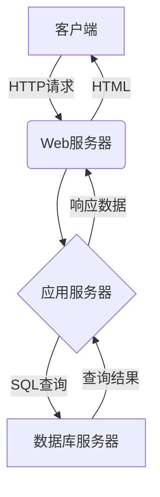

# 学生网上选课系统详细设计与具体代码实现

## 1.背景介绍

随着互联网技术的快速发展和普及,网上选课系统已经成为高校教务管理的重要组成部分。传统的选课方式存在诸多不足,例如学生需要排长队选课、选课信息透明度低、选课过程效率低下等问题。网上选课系统的出现很大程度上解决了这些痛点,为师生带来了极大的便利。

网上选课系统是一种基于Web的分布式信息系统,涉及多个子系统的集成,包括用户管理、课程管理、选课管理、教学资源管理等模块。系统需要具备良好的可用性、可扩展性、安全性和并发处理能力,以满足日益增长的用户需求。

## 2.核心概念与联系

### 2.1 用户管理

用户管理模块负责管理系统的用户信息,包括学生、教师和管理员三种角色。每个用户都有唯一的用户名和密码,可以登录系统并根据角色权限执行相应的操作。

### 2.2 课程管理

课程管理模块负责维护课程相关信息,如课程名称、课程编号、任课教师、上课时间和地点等。管理员和教师可以增加、修改和删除课程信息。

### 2.3 选课管理

选课管理是系统的核心模块,负责处理学生的选课请求。学生可以根据自己的需求在规定时间内选择心仪的课程。系统需要处理并发选课请求,防止出现超量选课的情况。

### 2.4 教学资源管理

教学资源管理模块用于管理课程相关的教学资源,如课件、参考书目、实验数据等。教师可以上传和维护相关资源,学生可以下载和查阅这些资源。

### 2.5 系统架构

整个网上选课系统采用经典的三层架构,包括表示层(客户端)、业务逻辑层(应用服务器)和数据访问层(数据库服务器)。表示层通过Web浏览器与用户交互;业务逻辑层处理用户请求,实现系统的核心功能;数据访问层负责与数据库进行交互,实现数据的持久化存储。



## 3.核心算法原理具体操作步骤

### 3.1 选课算法

选课算法是系统的核心算法,需要满足以下要求:

1. 公平性:所有学生都有选课的机会,不存在某些学生永远选不上课的情况。
2. 高效性:算法的时间复杂度和空间复杂度要尽可能地低。
3. 并发安全:能够处理大量并发选课请求,防止出现超量选课和数据竞争的情况。

常见的选课算法有:

1. 先到先得算法
2. 随机选课算法
3. 优先级选课算法

我们采用了优先级选课算法,具体步骤如下:

1. 系统为每个学生分配一个优先级值,可以根据学生的年级、绩点等因素计算得出。
2. 在选课时间开放后,学生可以提交选课请求。
3. 系统按照学生的优先级值从高到低的顺序处理选课请求。
4. 对于每个选课请求,系统检查所选课程的余量,如果还有余量,就将该生加入选课名单,并减少课程余量;否则拒绝该选课请求。
5. 所有请求处理完毕后,选课结束。

该算法的优点是公平性好,能够保证优先级高的学生优先选课。缺点是实现相对复杂,需要维护学生的优先级值。

### 3.2 并发控制

由于选课请求是并发的,我们需要采取并发控制措施,防止出现超量选课和数据竞争的情况。常见的并发控制方法有:

1. 悲观并发控制(Pessimistic Concurrency Control,PCC)
2. 乐观并发控制(Optimistic Concurrency Control,OCC)

我们采用了乐观并发控制的方法,具体步骤如下:

1. 学生提交选课请求时,系统返回课程的版本号(version)。
2. 学生将版本号和选课请求一起提交给系统。
3. 系统检查该课程的当前版本号是否与学生提交的版本号相同。如果相同,说明该课程从学生获取版本号到提交选课请求这段时间内没有其他并发操作,可以执行选课操作,并更新课程的版本号。
4. 如果当前版本号已经不同,说明该课程在此期间已经被其他操作修改过,拒绝该选课请求,让学生重新获取版本号并提交选课请求。

这种乐观并发控制的思路是:"假设不会发生并发冲突,只在提交操作时检查是否有冲突,如果没有冲突就执行操作,如果有冲突就重试"。它的优点是不需要在执行操作时持有长期锁,从而避免了长期等待和死锁的问题。缺点是不能解决脏读的问题,而且在并发冲突比较频繁的情况下,重试的代价比较高。

## 4.数学模型和公式详细讲解举例说明

### 4.1 优先级计算公式

我们采用加权平均的方法计算学生的优先级值,公式如下:

$$
priority = \frac{\sum_{i=1}^{n}w_i \times x_i}{\sum_{i=1}^{n}w_i}
$$

其中:
- $n$是考虑的因素个数
- $w_i$是第$i$个因素的权重,权重之和为1
- $x_i$是第$i$个因素的分数,范围在0到1之间

例如,我们考虑年级(40%权重)和绩点(60%权重)两个因素,一个大三学生的绩点为3.6,则他的优先级值为:

$$
priority = \frac{0.4 \times 3 + 0.6 \times 0.9}{0.4 + 0.6} = 0.78
$$

其中年级的分数按照大一为1分、大二为2分、大三为3分、大四为4分计算。绩点的分数为绩点值除以4。

### 4.2 版本号更新公式

在乐观并发控制中,我们需要一个版本号来标识数据的版本。一种常见的做法是使用时间戳作为版本号,例如:

$$
version = \lfloor\frac{timestamp}{1000}\rfloor
$$

其中$timestamp$是当前时间的Unix时间戳(单位为毫秒),我们将它除以1000并向下取整,就得到了一个版本号。这种做法的优点是版本号是递增的,并且版本号之间的差值正好等于相差的秒数,方便判断版本先后。

例如,现在的Unix时间戳是`1623847263782`,则对应的版本号为:

$$
version = \lfloor\frac{1623847263782}{1000}\rfloor = 1623847263
$$

如果1秒钟后再更新一次数据,新的Unix时间戳是`1623847264872`,则新的版本号为:

$$
version = \lfloor\frac{1623847264872}{1000}\rfloor = 1623847264
$$

我们可以看到,新版本号比旧版本号大1,它们之间的差值正好是1秒。

## 5.项目实践:代码实例和详细解释说明

### 5.1 数据库设计

我们使用关系型数据库MySQL存储系统数据,包括用户、课程、选课和教学资源等信息。数据库中的主要表如下:

**用户表(user)**
```sql
CREATE TABLE `user` (
  `id` int(11) NOT NULL AUTO_INCREMENT,
  `username` varchar(50) NOT NULL,
  `password` varchar(100) NOT NULL,
  `role` varchar(10) NOT NULL,
  `grade` int(11) DEFAULT NULL,
  `gpa` float DEFAULT NULL,
  PRIMARY KEY (`id`),
  UNIQUE KEY `username` (`username`)
) ENGINE=InnoDB DEFAULT CHARSET=utf8mb4;
```

**课程表(course)**
```sql
CREATE TABLE `course` (
  `id` int(11) NOT NULL AUTO_INCREMENT,
  `code` varchar(20) NOT NULL,
  `name` varchar(100) NOT NULL,
  `teacher` varchar(50) NOT NULL,
  `time` varchar(20) NOT NULL,
  `place` varchar(50) NOT NULL,
  `capacity` int(11) NOT NULL,
  `version` bigint(20) NOT NULL,
  PRIMARY KEY (`id`),
  UNIQUE KEY `code` (`code`)
) ENGINE=InnoDB DEFAULT CHARSET=utf8mb4;
```

**选课表(enrollment)**
```sql 
CREATE TABLE `enrollment` (
  `id` int(11) NOT NULL AUTO_INCREMENT,
  `student_id` int(11) NOT NULL,
  `course_id` int(11) NOT NULL,
  PRIMARY KEY (`id`),
  UNIQUE KEY `unique_enrollment` (`student_id`,`course_id`)
) ENGINE=InnoDB DEFAULT CHARSET=utf8mb4;
```

**教学资源表(resource)**
```sql
CREATE TABLE `resource` (
  `id` int(11) NOT NULL AUTO_INCREMENT,
  `course_id` int(11) NOT NULL,
  `name` varchar(100) NOT NULL,
  `type` varchar(20) NOT NULL,
  `data` longblob NOT NULL,
  PRIMARY KEY (`id`)
) ENGINE=InnoDB DEFAULT CHARSET=utf8mb4;
```

### 5.2 选课功能实现

选课功能是系统的核心功能,我们使用Java语言、SpringBoot框架和MyBatis持久层框架实现。

**选课请求处理**

```java
@RestController
@RequestMapping("/enrollment")
public class EnrollmentController {

    @Autowired
    private EnrollmentService enrollmentService;

    @PostMapping
    public ResponseEntity<String> enroll(@RequestBody EnrollmentRequest request) {
        try {
            enrollmentService.enroll(request.getStudentId(), request.getCourseId(), request.getVersion());
            return ResponseEntity.ok("选课成功");
        } catch (VersionMismatchException e) {
            return ResponseEntity.status(HttpStatus.CONFLICT).body("版本号不匹配,请重试");
        } catch (CourseFullException e) {
            return ResponseEntity.status(HttpStatus.FORBIDDEN).body("课程已满,无法选课");
        } catch (Exception e) {
            return ResponseEntity.status(HttpStatus.INTERNAL_SERVER_ERROR).body("服务器错误");
        }
    }
}
```

该控制器接收学生的选课请求,调用`EnrollmentService`的`enroll`方法处理选课逻辑。如果选课成功,返回200 OK;如果版本号不匹配,返回409 Conflict;如果课程已满,返回403 Forbidden;如果出现其他异常,返回500 Internal Server Error。

**选课服务实现**

```java
@Service
public class EnrollmentServiceImpl implements EnrollmentService {

    @Autowired
    private StudentMapper studentMapper;

    @Autowired
    private CourseMapper courseMapper;

    @Autowired
    private EnrollmentMapper enrollmentMapper;

    @Override
    @Transactional
    public void enroll(int studentId, int courseId, long version) throws VersionMismatchException, CourseFullException {
        // 检查版本号
        Course course = courseMapper.selectByPrimaryKey(courseId);
        if (course.getVersion() != version) {
            throw new VersionMismatchException();
        }

        // 检查课程余量
        if (course.getCapacity() <= enrollmentMapper.countByCourseId(courseId)) {
            throw new CourseFullException();
        }

        // 执行选课操作
        Enrollment enrollment = new Enrollment();
        enrollment.setStudentId(studentId);
        enrollment.setCourseId(courseId);
        enrollmentMapper.insert(enrollment);

        // 更新课程版本号
        course.setVersion(System.currentTimeMillis() / 1000);
        courseMapper.updateByPrimaryKey(course);
    }
}
```

`EnrollmentService`的`enroll`方法首先检查课程的版本号是否与学生提交的版本号相同,如果不同就抛出`VersionMismatchException`异常。然后检查课程的余量是否足够,如果余量不足就抛出`CourseFullException`异常。如果以上检查都通过,就执行选课操作,插入一条选课记录到`enrollment`表中。最后,更新课程的版本号为当前时间戳。

该方法使用了`@Transactional`注解,保证选课操作的原子性。如果在执行过程中抛出异常,数据库操作会自动回滚。

### 5.3 并发控制实现

为了保证并发选课的正确性,我们在选课服务中加入了锁机制,防止并发问题。

```java
@Service
public class EnrollmentServiceImpl implements EnrollmentService {

    private static final ConcurrentMap<Integer, Lock> courseLocks = new ConcurrentHashMap<>();

    // ...

    @Override
    @Transactional
    public void enroll(int studentId, int courseId, long version) throws VersionMismatchException, CourseFullException {
        // 