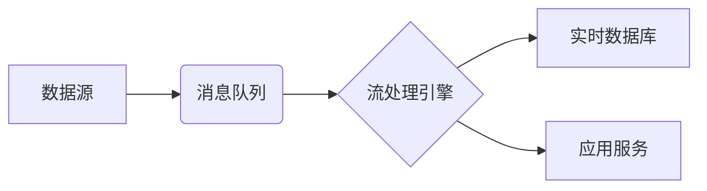

# 实时数据处理 原理与代码实例讲解

## 1.背景介绍
### 1.1 实时数据处理的定义与特点
实时数据处理(Real-time Data Processing)是指对源源不断产生的数据进行实时采集、传输、处理和分析,并在极短的延迟内返回处理结果,从而对数据进行实时响应和决策的一种数据处理方式。它具有低延迟、高吞吐、高并发等特点。

### 1.2 实时数据处理的应用场景
实时数据处理在互联网、物联网、金融、电商、交通等领域有广泛应用,如实时推荐、实时风控、实时物流跟踪、实时交通路况分析等。

### 1.3 实时数据处理面临的挑战
海量数据、高并发请求、复杂的数据处理逻辑、低延迟和高可用性需求等,给实时数据处理系统的架构设计和技术选型带来挑战。

## 2.核心概念与联系
### 2.1 实时计算
实时计算(Real-time Computing)是实时数据处理的核心,它要求系统在收到数据后尽可能快地完成计算处理,并及时返回结果。常见的实时计算模型有流处理(Stream Processing)和微批处理(Micro-Batch Processing)。

### 2.2 消息队列
消息队列(Message Queue)用于缓存并发送实时数据,使数据产生端与数据处理端解耦,并支持削峰填谷。常用的消息队列有Apache Kafka、RabbitMQ等。

### 2.3 流处理框架
流处理框架用于对实时数据进行连续计算,常用的流处理框架有Apache Flink、Spark Streaming等。

### 2.4 时序数据库  
时序数据库(Time Series Database)专门用于存储时间序列数据,支持快速的数据写入和聚合查询,常用于监控和物联网等场景。代表有InfluxDB、OpenTSDB等。

### 2.5 实时数据处理架构
下图是一个典型的实时数据处理架构,展示了各组件如何协同工作:



## 3.核心算法原理具体操作步骤
### 3.1 窗口机制
窗口是流处理中对无界数据进行有界处理的一种机制,可以在无限流上定义一个有限大小的窗口,在窗口内完成数据计算。常见的窗口类型有滚动窗口(Tumbling Window)、滑动窗口(Sliding Window)和会话窗口(Session Window)。

以滑动窗口为例,假设窗口大小为10分钟,滑动步长为5分钟,具体步骤如下:

1. 每隔5分钟,创建一个新的窗口
2. 新到来的数据被分配到一个或多个窗口中
3. 当一个窗口超过10分钟,对窗口内的所有数据执行计算
4. 窗口关闭,并输出计算结果

### 3.2 状态管理
在流处理过程中,我们经常需要在不同事件或不同窗口之间维护和传递一些状态数据,如汇总统计值等。流处理框架中一般提供了状态管理API,常见的有键值状态(Key-Value State)和窗口状态(Window State)等。

以键值状态为例,当我们需要对用户的行为事件进行统计时:

1. 定义一个键值状态,以用户ID为键,以用户的访问次数为值
2. 每来一个用户的访问事件,就将对应键的值加1
3. 定时或在特定的触发条件下,输出统计结果并清空状态

### 3.3 水印机制
在分布式流处理场景下,不同分区的数据到达时间可能不一致,即存在乱序问题。水印机制可以在一定程度上容忍乱序,它定义了一个延迟阈值,将小于阈值的延迟数据纳入窗口计算,代表了流中的一个特殊时间点,用于触发窗口的计算或关闭。

水印的传递和更新步骤如下:

1. 数据源根据自身的业务逻辑,定期生成水印并插入到流中
2. 水印随着数据流向下游传递,算子根据接收到的水印更新自己的事件时间
3. 当算子的事件时间达到水印时间时,触发对应窗口的计算或关闭

## 4.数学模型和公式详细讲解举例说明
### 4.1 异常检测模型
在实时数据处理中,我们经常需要对数据进行异常检测,如识别网站的恶意点击流量。异常检测可以基于统计学原理,假设正常数据服从某种概率分布,而异常数据偏离这种分布。

以高斯分布为例,假设正常数据服从均值为$\mu$,标准差为$\sigma$的高斯分布,对于一个新的观测值$x$,它属于异常值的概率为:

$$P(x) = \frac{1}{\sigma\sqrt{2\pi}} e^{-\frac{(x-\mu)^2}{2\sigma^2}}$$

当$P(x)$小于某个阈值时,我们就可以判定$x$为异常值。

### 4.2 时间序列预测模型
在一些场景下,我们需要对实时数据进行趋势预测,如预测未来一段时间的交通流量。常用的时间序列预测模型有ARIMA、LSTM等。

以ARIMA模型为例,它由自回归(AR)、差分(I)和移动平均(MA)三部分组成,用于预测平稳时间序列的未来值。假设时间序列为$\{x_t, t=1,2,...,n\}$,ARIMA(p,d,q)模型可以表示为:

$$(1-\sum_{i=1}^p \phi_i B^i)(1-B)^d x_t = (1+\sum_{i=1}^q \theta_i B^i)\varepsilon_t$$

其中,$B$为滞后算子,$\varepsilon_t$为白噪声序列,$\phi_i$和$\theta_i$为模型参数。通过对历史数据进行拟合,我们可以估计出模型参数,并用于预测未来值。

## 5.项目实践：代码实例和详细解释说明
下面以一个简单的单词计数应用为例,演示如何使用Apache Flink进行实时数据处理。该应用从Kafka接收文本数据,统计每个单词的出现频次。

### 5.1 环境准备
首先需要搭建Flink和Kafka的开发环境,并创建一个Maven项目,引入以下依赖:

```xml
<dependency>
  <groupId>org.apache.flink</groupId>
  <artifactId>flink-streaming-java_2.12</artifactId>
  <version>1.12.0</version>
</dependency>
<dependency>
  <groupId>org.apache.flink</groupId>
  <artifactId>flink-connector-kafka_2.12</artifactId>
  <version>1.12.0</version>
</dependency>
```

### 5.2 代码实现

```java
public class WordCount {
    public static void main(String[] args) throws Exception {
        // 创建流处理环境
        StreamExecutionEnvironment env = StreamExecutionEnvironment.getExecutionEnvironment();

        // 设置Kafka数据源
        Properties properties = new Properties();
        properties.setProperty("bootstrap.servers", "localhost:9092");
        FlinkKafkaConsumer<String> consumer = new FlinkKafkaConsumer<>("wordcount-input", new SimpleStringSchema(), properties);

        // 接收Kafka数据并进行处理
        DataStream<Tuple2<String, Integer>> dataStream = env
                .addSource(consumer)
                .flatMap(new Tokenizer())
                .keyBy(value -> value.f0)
                .sum(1);

        // 打印结果
        dataStream.print();

        // 执行任务
        env.execute("Word Count");
    }

    // 自定义函数,将文本行拆分为单词
    public static class Tokenizer implements FlatMapFunction<String, Tuple2<String, Integer>> {
        @Override
        public void flatMap(String value, Collector<Tuple2<String, Integer>> out) {
            String[] tokens = value.toLowerCase().split("\\W+");
            for (String token : tokens) {
                if (token.length() > 0) {
                    out.collect(new Tuple2<>(token, 1));
                }
            }
        }
    }
}
```

代码说明:

1. 首先创建一个流处理环境,并设置Kafka作为数据源。
2. 通过`addSource`接收Kafka中的文本数据,然后使用`flatMap`算子将每行文本拆分为单词,并转换为`(word, 1)`的格式。
3. 使用`keyBy`算子根据单词进行分组,然后使用`sum`算子统计每个单词的频次。
4. 最后使用`print`算子打印结果,并调用`execute`方法执行任务。

### 5.3 运行测试
在Kafka中创建一个名为`wordcount-input`的Topic,并启动Kafka和Flink。然后运行上述代码,并在Kafka中发送一些文本数据,如:

```
hello world
hello flink
hello kafka
```

在控制台可以看到如下输出结果:

```
(hello,1)
(world,1)
(hello,2)
(flink,1)
(hello,3)
(kafka,1)
```

可以看到,每个单词的频次都被正确地统计出来了。

## 6.实际应用场景
实时数据处理在多个领域有广泛应用,下面列举几个典型场景:

### 6.1 实时推荐
在电商网站中,我们可以收集用户的实时浏览、点击、购买等行为数据,通过流处理分析用户的兴趣偏好,并实时地推荐用户可能感兴趣的商品,提高用户的转化率和粘性。

### 6.2 实时风控
在金融领域,实时数据处理可以用于识别异常交易和欺诈行为。例如,我们可以通过规则引擎或机器学习模型,实时地对交易数据进行特征提取和风险评分,及时拦截高危交易,防范资金损失。

### 6.3 实时物流跟踪  
在物流行业,通过GPS、RFID等传感器实时采集货物的位置、温度等信息,并通过流处理分析货物的运输状态,预测到货时间,优化调度策略,提升物流效率和用户体验。

### 6.4 实时交通路况分析
在智慧交通领域,通过摄像头、车辆传感器等设备实时采集道路的车流量、速度等数据,通过流处理识别交通事件(如拥堵、事故),并及时发布路况信息,帮助车主规避拥堵,缓解交通压力。

## 7.工具和资源推荐
### 7.1 流处理框架
- Apache Flink: 目前最主流的流处理框架之一,支持事件时间、状态管理、CEP等特性。
- Apache Spark: 基于微批的准实时处理框架,与Flink相比延迟较高,但支持丰富的数据处理库。
- Apache Storm: 较早出现的流处理框架,实时性高,但不支持事件时间和状态管理。
- Apache Kafka Streams: Kafka的流处理库,适合与Kafka深度集成的场景。

### 7.2 消息队列
- Apache Kafka: 高吞吐、可扩展的分布式消息队列,在流处理场景中常用于数据缓存。
- Apache Pulsar: 下一代的分布式消息队列,支持多租户、持久化存储等特性。
- RabbitMQ: 基于AMQP协议的开源消息队列,适合于轻量级的流处理场景。

### 7.3 时序数据库
- InfluxDB: 开源的时序数据库,提供了SQL-Like的查询语言和丰富的集成接口。
- OpenTSDB: 基于HBase的分布式时序数据库,适合海量时序数据的存储和查询。
- Prometheus: 云原生的监控系统,内置时序数据库,适合Kubernetes环境的监控和告警。

### 7.4 学习资源
- 《流处理系统：概念、架构与实现》: 国内流处理领域的著作,全面介绍了流处理的基本概念和技术。
- Flink官方文档: https://ci.apache.org/projects/flink/flink-docs-stable/
- Spark Streaming官方文档: http://spark.apache.org/docs/latest/streaming-programming-guide.html
- Kafka Streams官方文档: https://kafka.apache.org/documentation/streams/

## 8.总结：未来发展趋势与挑战
实时数据处理技术正在快速发展,并在越来越多的场景中得到应用。未来的发展趋势主要体现在以下几个方面:

### 8.1 流批一体