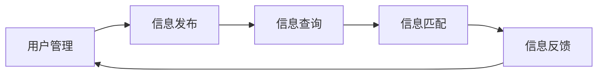

## 1.背景介绍

家教信息管理系统是一种服务于家长、学生和家教老师的信息化平台。随着互联网技术的发展，家教信息管理系统的需求越来越大，因此，设计和实现一个功能全面、操作简便、安全可靠的家教信息管理系统显得尤为重要。

## 2.核心概念与联系

家教信息管理系统主要包括用户管理、信息发布、信息查询、信息匹配、信息反馈等模块。每个模块都有其特定的功能和操作流程，同时各模块之间也有密切的联系和依赖关系。



## 3.核心算法原理具体操作步骤

家教信息管理系统的核心算法主要包括用户匹配算法和信息筛选算法。用户匹配算法主要是通过用户的需求和家教老师的资质进行匹配，信息筛选算法则是通过关键词搜索和用户偏好来筛选信息。

## 4.数学模型和公式详细讲解举例说明

在用户匹配算法中，我们使用余弦相似度公式来计算用户需求和家教老师资质的匹配度。余弦相似度公式如下：

$$ cos(\theta) = \frac{\vec{A} \cdot \vec{B}}{||\vec{A}|| ||\vec{B}||} $$

## 5.项目实践：代码实例和详细解释说明

以下是用户管理模块的部分代码实例：

```python
class User:
    def __init__(self, id, name, password):
        self.id = id
        self.name = name
        self.password = password

    def login(self, id, password):
        if id == self.id and password == self.password:
            return True
        else:
            return False
```

## 6.实际应用场景

家教信息管理系统可以广泛应用于家教服务市场，为家长、学生和家教老师提供便捷的信息服务。例如，家长可以通过系统快速找到合适的家教老师，家教老师也可以通过系统找到合适的家教工作。

## 7.工具和资源推荐

在开发家教信息管理系统时，推荐使用Python语言和Django框架，数据库推荐使用MySQL，前端开发推荐使用Vue.js。

## 8.总结：未来发展趋势与挑战

随着大数据和人工智能技术的发展，家教信息管理系统的功能将更加强大，匹配效率也将大大提高。但同时，如何保护用户隐私，如何提高系统的安全性等问题也将是未来发展的重要挑战。

## 9.附录：常见问题与解答

1.问题：家教信息管理系统的主要功能是什么？
答：家教信息管理系统的主要功能包括用户管理、信息发布、信息查询、信息匹配和信息反馈等。

2.问题：家教信息管理系统的核心算法是什么？
答：家教信息管理系统的核心算法主要包括用户匹配算法和信息筛选算法。

作者：禅与计算机程序设计艺术 / Zen and the Art of Computer Programming