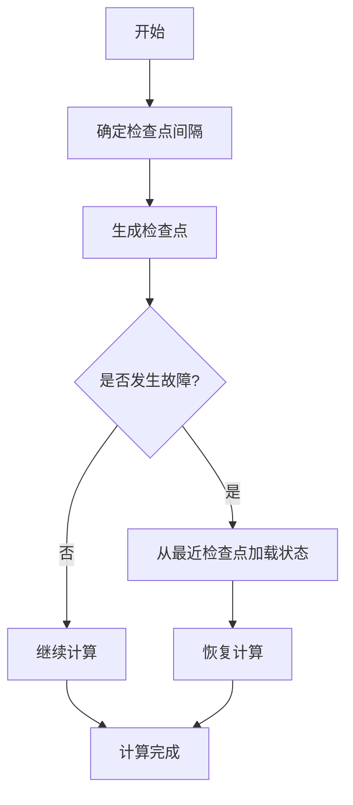
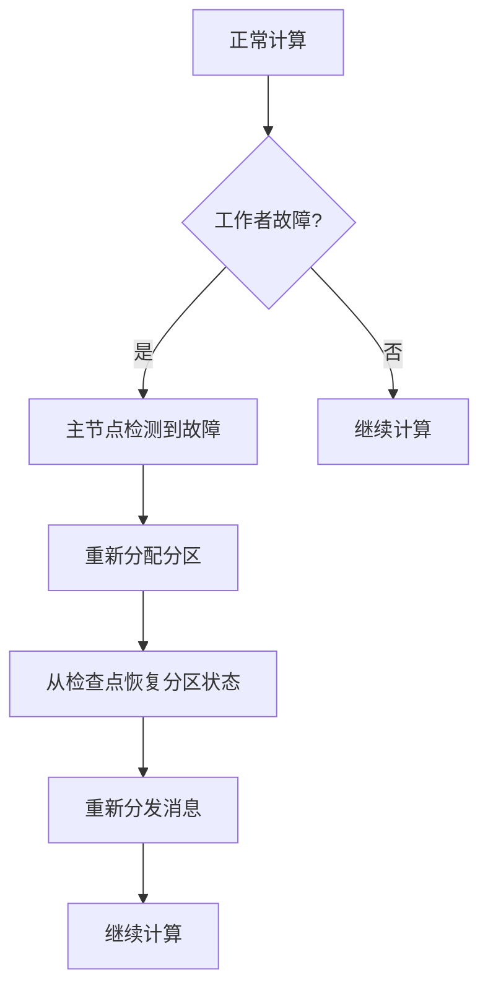
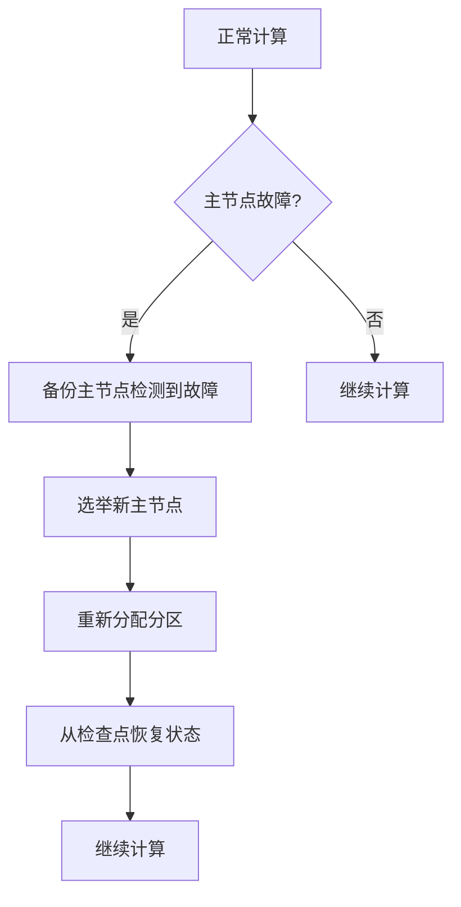
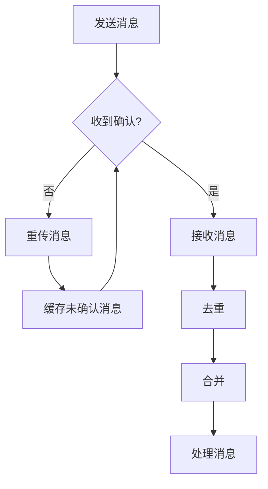

# 容错与恢复:确保Pregel计算的健壮性

## 1.背景介绍

在大数据时代,海量数据的处理和分析成为了一项关键的任务。Apache Giraph、Spark GraphX 和 Pregel 等图形处理系统应运而生,为高效处理大规模图形数据提供了强大的计算能力。其中,Pregel 是谷歌提出的一种基于大规模图形并行计算模型的框架,被广泛应用于社交网络分析、Web 链接分析、推荐系统等领域。

然而,在实际运行过程中,由于硬件故障、软件错误或网络问题等原因,Pregel 计算可能会遇到各种故障,导致作业失败或数据丢失。因此,确保 Pregel 计算的健壮性和容错能力至关重要。本文将探讨 Pregel 计算中的容错与恢复机制,帮助读者深入理解其核心原理和实现方式,从而提高系统的可靠性和稳定性。

## 2.核心概念与联系

### 2.1 Pregel 计算模型概述

Pregel 是一种基于大规模图形并行计算模型的框架,其核心思想是将图形数据划分为多个分区,每个分区由一个计算单元(Vertex)处理。计算过程通过迭代的方式进行,每轮迭代中,每个顶点根据其当前状态和邻居的信息进行计算,并将计算结果传递给邻居。整个过程在满足特定条件或达到最大迭代次数时终止。

Pregel 计算模型的核心组件包括:

- **Vertex(顶点)**: 表示图形中的节点,负责执行计算逻辑。
- **Edge(边)**: 表示节点之间的连接关系。
- **Message(消息)**: 顶点之间传递的数据单元。
- **Combiner(合并器)**: 用于合并来自不同源的消息,减少网络通信开销。
- **Aggregator(聚合器)**: 用于跨作业实例聚合全局统计信息。

### 2.2 容错与恢复的重要性

在分布式环境中,由于硬件故障、软件错误或网络问题等原因,Pregel 计算可能会遇到各种故障,导致作业失败或数据丢失。这不仅会影响计算的正确性,还可能导致严重的经济损失和时间浪费。因此,确保 Pregel 计算的健壮性和容错能力至关重要。

一个健壮的容错与恢复机制应当具备以下特性:

1. **故障检测**: 能够及时发现和识别各种故障,包括硬件故障、软件错误和网络问题等。
2. **容错处理**: 在发生故障时,能够采取适当的措施,避免数据丢失和计算中断。
3. **恢复机制**: 在故障解决后,能够从故障点恢复计算,而不需要从头开始重新执行。
4. **高可用性**: 即使在部分节点发生故障的情况下,整个系统仍能继续运行,保证服务的可用性。

## 3.核心算法原理具体操作步骤

Pregel 的容错与恢复机制主要基于以下几个核心算法:

1. **检查点(Checkpoint)机制**
2. **工作者(Worker)故障恢复**
3. **主节点(Master)故障恢复**
4. **消息传递的容错机制**

### 3.1 检查点(Checkpoint)机制

检查点机制是 Pregel 容错与恢复的基础。它定期将计算状态保存到持久存储中,以便在发生故障时能够从最近的检查点恢复。

Pregel 的检查点机制包括以下步骤:

1. **确定检查点间隔**: 根据作业的规模和容错需求,确定合适的检查点间隔。间隔越短,恢复时的数据丢失越少,但开销也越大。
2. **生成检查点**: 在每个检查点,Pregel 会将所有顶点的状态和边的状态保存到持久存储中,如HDFS。
3. **恢复时加载检查点**: 当发生故障需要恢复时,Pregel 会从最近的检查点加载状态数据,并从该点重新开始计算。

检查点机制的优点是能够有效减少计算的重复执行,从而提高效率。但它也存在一些缺点,如需要额外的存储空间来保存检查点数据,以及在生成检查点时会产生一定的性能开销。

### 3.2 工作者(Worker)故障恢复

在 Pregel 计算过程中,如果某个工作者节点发生故障,主节点会检测到该故障,并将该工作者管理的分区重新分配给其他工作者。

工作者故障恢复的步骤如下:

1. **主节点检测到工作者故障**: 通过定期的心跳检测机制,主节点能够发现工作者节点的故障。
2. **重新分配分区**: 主节点将故障工作者管理的分区重新分配给其他正常工作者。
3. **从检查点恢复分区状态**: 新的工作者会从最近的检查点加载分区的状态数据,并从该点重新开始计算。
4. **重新分发消息**: 为了保证计算的正确性,主节点需要将之前发送到故障工作者的消息重新分发给新的工作者。

工作者故障恢复机制能够有效地应对单个工作者节点的故障,确保计算的持续进行。但如果同时发生多个工作者故障,或者主节点发生故障,则需要采取其他措施。

### 3.3 主节点(Master)故障恢复

主节点在 Pregel 计算中扮演着关键的协调和管理角色。如果主节点发生故障,整个计算过程将无法继续进行。为了应对这种情况,Pregel 采用了主节点备份和选举机制。

主节点故障恢复的步骤如下:

1. **配置备份主节点**: 在启动 Pregel 作业时,可以配置一个或多个备份主节点。
2. **主节点故障检测**: 工作者节点通过定期的心跳检测机制,能够发现主节点的故障。
3. **选举新的主节点**: 当检测到主节点故障时,备份主节点之间会进行选举,选出一个新的主节点。
4. **重新分配分区**: 新的主节点会根据最新的分区分配情况,将分区重新分配给工作者节点。
5. **从检查点恢复状态**: 所有工作者节点从最近的检查点加载状态数据,并从该点重新开始计算。

主节点故障恢复机制能够确保 Pregel 计算的高可用性,但它也带来了一定的开销,如需要维护备份主节点,以及在故障恢复过程中的重新分配和状态恢复操作。

### 3.4 消息传递的容错机制

在 Pregel 计算过程中,顶点之间通过消息传递来交换数据和状态信息。为了确保消息传递的可靠性,Pregel 采用了多种容错机制。

1. **消息重传机制**: 如果发送方未收到接收方的确认,则会重新发送消息,直到收到确认或达到重试次数上限。
2. **消息缓冲机制**: 发送方会缓存已发送但未确认的消息,以便在需要时进行重传。
3. **消息去重机制**: 接收方会过滤掉重复的消息,避免重复计算。
4. **消息合并机制**: 在发送消息之前,Pregel 会使用 Combiner 合并来自同一源的多个消息,减少网络通信开销。

消息传递的容错机制能够有效地应对网络故障和节点故障,确保消息的可靠传递,从而保证 Pregel 计算的正确性。但这些机制也会带来一定的性能开销,需要在可靠性和效率之间进行权衡。

## 4.数学模型和公式详细讲解举例说明

在 Pregel 计算中,一些关键的数学模型和公式能够帮助我们更好地理解和优化容错与恢复机制。

### 4.1 检查点间隔优化

确定合适的检查点间隔是 Pregel 容错与恢复机制中一个重要的优化问题。过短的间隔会导致过多的检查点开销,而过长的间隔则会增加故障恢复时的数据丢失风险。

我们可以使用以下公式来估计最优的检查点间隔:

$$
T_{opt} = \sqrt{2 \cdot C \cdot M \cdot T_r}
$$

其中:

- $T_{opt}$ 表示最优的检查点间隔时间
- $C$ 表示生成检查点的开销
- $M$ 表示平均故障间隔时间
- $T_r$ 表示从故障点恢复的时间

通过minimizing以下代价函数,我们可以得到最优的检查点间隔:

$$
\begin{align*}
\text{Cost} &= \frac{C}{T_{opt}} + \frac{T_{opt}}{2M} \cdot T_r \\
&= \sqrt{\frac{C \cdot T_r}{2M}} + \sqrt{\frac{C \cdot M}{2T_r}}
\end{align*}
$$

这个公式能够帮助我们在检查点开销和故障恢复开销之间找到一个平衡点,从而优化 Pregel 计算的整体性能。

### 4.2 工作者故障恢复开销估计

当工作者节点发生故障时,Pregel 需要重新分配分区,并从检查点恢复分区状态。这个过程会产生一定的开销,包括数据传输开销和计算开销。

我们可以使用以下公式来估计工作者故障恢复的开销:

$$
\begin{align*}
\text{Recovery Cost} &= \sum_{i=1}^{n} \left( T_i^{transfer} + T_i^{compute} \right) \\
&= \sum_{i=1}^{n} \left( \frac{D_i}{B} + \alpha \cdot D_i \right)
\end{align*}
$$

其中:

- $n$ 表示需要重新分配的分区数量
- $T_i^{transfer}$ 表示传输第 $i$ 个分区数据的时间,与分区大小 $D_i$ 和网络带宽 $B$ 有关
- $T_i^{compute}$ 表示重新计算第 $i$ 个分区的时间,与分区大小 $D_i$ 和计算效率系数 $\alpha$ 有关

通过估计工作者故障恢复的开销,我们可以评估不同的分区策略和资源分配方案,从而优化 Pregel 计算的整体性能。

### 4.3 主节点故障恢复开销估计

当主节点发生故障时,Pregel 需要进行主节点选举,重新分配分区,并从检查点恢复所有分区的状态。这个过程的开销通常比工作者故障恢复更大。

我们可以使用以下公式来估计主节点故障恢复的开销:

$$
\begin{align*}
\text{Recovery Cost} &= T_{election} + \sum_{i=1}^{n} \left( T_i^{transfer} + T_i^{compute} \right) \\
&= T_{election} + \sum_{i=1}^{n} \left( \frac{