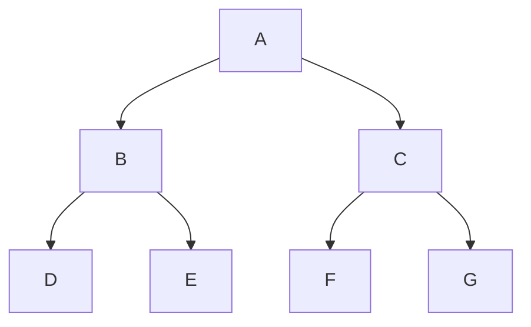

# 层次聚类(Hierarchical Clustering) - 原理与代码实例讲解

## 1.背景介绍

### 1.1 什么是聚类

聚类(Clustering)是一种无监督学习技术,旨在将数据集中的对象划分为多个"簇"(Cluster),使得同一簇中的对象相似度较高,而不同簇之间的对象相似度较低。聚类广泛应用于客户细分、图像分割、基因表达数据分析等领域。

### 1.2 聚类算法分类

常见的聚类算法可分为以下几类:

- 原型聚类(Prototype-based Clustering): K-Means、K-Medoids
- 层次聚类(Hierarchical Clustering): AGNES、DIANA
- 基于密度的聚类(Density-based Clustering): DBSCAN、OPTICS
- 基于网格的聚类(Grid-based Clustering): STING
- 基于模型的聚类(Model-based Clustering): EM聚类

### 1.3 层次聚类概述

层次聚类(Hierarchical Clustering)是一种常用的聚类分析方法,其特点是将数据对象按某种策略递归地划分为较小的簇,最终形成一棵层次聚类树(Dendrogram)。根据聚类过程,可分为:

- 凝聚层次聚类(Agglomerative): 自底向上,每个数据对象初始为一个簇,然后不断合并最相似的簇。
- 分裂层次聚类(Divisive): 自顶向下,初始所有对象为一个簇,然后递归分裂为较小的簇。

本文主要介绍凝聚层次聚类算法的原理与实现。

## 2.核心概念与联系

### 2.1 相似度度量

相似度度量是层次聚类的基础,常用的距离度量有:

- 欧氏距离(Euclidean Distance)
- 曼哈顿距离(Manhattan Distance) 
- 皮尔逊相关系数(Pearson Correlation)
- 余弦相似度(Cosine Similarity)

给定样本集 $X=\{x_1, x_2, \ldots, x_n\}$,其中 $x_i=(x_{i1}, x_{i2}, \ldots, x_{ip})^T \in \mathbb{R}^p$,欧氏距离定义为:

$$d(x_i, x_j) = \sqrt{\sum_{k=1}^{p}(x_{ik} - x_{jk})^2}$$

曼哈顿距离定义为:

$$d(x_i, x_j) = \sum_{k=1}^{p}|x_{ik} - x_{jk}|$$

### 2.2 簇间距离

层次聚类需要定义簇间距离,常用的有:

- 最短距离(Single Linkage)
- 最长距离(Complete Linkage)
- 均值距离(Average Linkage)
- 质心距离(Centroid Linkage)

设有两个簇 $C_i, C_j$,最短距离定义为:

$$d(C_i, C_j) = \min\limits_{x \in C_i, y \in C_j} d(x, y)$$

最长距离定义为:

$$d(C_i, C_j) = \max\limits_{x \in C_i, y \in C_j} d(x, y)$$

均值距离定义为:

$$d(C_i, C_j) = \frac{1}{|C_i||C_j|}\sum_{x \in C_i}\sum_{y \in C_j}d(x, y)$$

质心距离定义为两个簇质心之间的距离。

### 2.3 层次聚类树

层次聚类的结果可以用一棵树状图(Dendrogram)来表示,树的每个节点代表一个簇,节点高度表示簇的紧密程度。通过切割树可以得到不同层次的聚类结果。



## 3.核心算法原理具体操作步骤  

凝聚层次聚类的核心步骤如下:

1. 计算距离矩阵: 对所有样本对计算距离,构建距离矩阵。
2. 合并最近邻簇: 在距离矩阵中找到最小距离对应的两个簇,将它们合并为一个新簇。
3. 更新距离矩阵: 根据选定的簇间距离度量,重新计算新簇与其他簇的距离。
4. 重复步骤2-3: 直到所有样本聚为一个簇,或满足停止条件。
5. 构建层次聚类树: 根据簇的合并顺序构建树状图。

算法伪代码:

```python
# 初始化距离矩阵
distance_matrix = compute_distance_matrix(X)

# 每个样本初始为一个簇
clusters = [[x] for x in X]  

while len(clusters) > 1:
    # 找到最近邻簇对
    min_dist, cluster1, cluster2 = find_min_distance(distance_matrix)
    
    # 合并两个簇
    new_cluster = cluster1 + cluster2
    clusters.remove(cluster1)
    clusters.remove(cluster2)
    clusters.append(new_cluster)
    
    # 更新距离矩阵
    distance_matrix = update_distance_matrix(distance_matrix, new_cluster)

# 构建层次聚类树
tree = build_hierarchy_tree(clusters)
```

## 4.数学模型和公式详细讲解举例说明

### 4.1 距离矩阵计算

给定样本集 $X=\{x_1, x_2, \ldots, x_n\}$,我们需要计算所有样本对之间的距离,构建 $n \times n$ 的距离矩阵 $D$:

$$
D=\begin{bmatrix}
0 & d(x_1, x_2) & \cdots & d(x_1, x_n)\\
d(x_2, x_1) & 0 & \cdots & d(x_2, x_n)\\
\vdots & \vdots & \ddots & \vdots\\
d(x_n, x_1) & d(x_n, x_2) & \cdots & 0
\end{bmatrix}
$$

其中, $d(x_i, x_j)$ 表示样本 $x_i$ 与 $x_j$ 之间的距离。

例如,有样本集 $X=\{(1, 2), (2, 3), (5, 6)\}$,计算欧氏距离矩阵:

$$
D=\begin{bmatrix}
0 & \sqrt{2} & \sqrt{34}\\
\sqrt{2} & 0 & \sqrt{26}\\
\sqrt{34} & \sqrt{26} & 0
\end{bmatrix}
$$

### 4.2 簇间距离计算

合并两个簇 $C_i, C_j$ 后,需要计算新簇 $C_{ij}$ 与其他簇 $C_k$ 的距离。不同的距离度量方式计算公式不同:

- 最短距离(Single Linkage):
$$d(C_{ij}, C_k) = \min\limits_{x \in C_{ij}, y \in C_k} d(x, y)$$

- 最长距离(Complete Linkage):
$$d(C_{ij}, C_k) = \max\limits_{x \in C_{ij}, y \in C_k} d(x, y)$$

- 均值距离(Average Linkage):
$$d(C_{ij}, C_k) = \frac{1}{|C_{ij}||C_k|}\sum_{x \in C_{ij}}\sum_{y \in C_k}d(x, y)$$

- 质心距离(Centroid Linkage):
$$d(C_{ij}, C_k) = d(\bar{x}_{ij}, \bar{x}_k)$$
其中 $\bar{x}_{ij}, \bar{x}_k$ 分别为 $C_{ij}, C_k$ 的质心。

例如,有三个簇 $C_1=\{(1, 2)\}, C_2=\{(2, 3)\}, C_3=\{(5, 6), (6, 7)\}$,计算新簇 $C_{12}=C_1 \cup C_2$ 与 $C_3$ 的最短距离:

$$d(C_{12}, C_3) = \min\limits_{x \in C_{12}, y \in C_3} d(x, y) = \min\{\sqrt{34}, \sqrt{41}, \sqrt{50}, \sqrt{53}\} = \sqrt{34}$$

## 5.项目实践: 代码实例和详细解释说明

下面是使用 Python 实现凝聚层次聚类的代码示例,并对关键步骤进行详细说明:

```python
import numpy as np
from scipy.spatial.distance import pdist, squareform

def hierarchical_clustering(X, linkage='average'):
    """
    Hierarchical Clustering
    
    Parameters:
    -----------
    X: ndarray, shape (n_samples, n_features)
        Input data
    linkage: str, optional (default='average')
        Linkage method: 'single', 'complete', 'average', 'centroid'
        
    Returns:
    --------
    clusters: list of lists
        Hierarchical clustering encoded as lists of cluster indices
    """
    # 1. 计算距离矩阵
    distances = squareform(pdist(X))
    n = len(distances)
    clusters = [[i] for i in range(n)]
    
    # 2. 层次聚类循环
    while len(clusters) > 1:
        min_dist = np.inf
        merge_ids = None
        
        # 3. 找到最近邻簇对
        for i in range(len(clusters)):
            for j in range(i+1, len(clusters)):
                cluster1 = clusters[i]
                cluster2 = clusters[j]
                dist = calculate_cluster_distance(X, cluster1, cluster2, linkage)
                if dist < min_dist:
                    min_dist = dist
                    merge_ids = (i, j)
        
        # 4. 合并两个簇
        cluster1 = clusters[merge_ids[0]]
        cluster2 = clusters[merge_ids[1]]
        new_cluster = cluster1 + cluster2
        clusters.append(new_cluster)
        clusters.remove(cluster1)
        clusters.remove(cluster2)
        
    return clusters

def calculate_cluster_distance(X, cluster1, cluster2, linkage):
    """
    Calculate distance between two clusters
    
    Parameters:
    -----------
    X: ndarray, shape (n_samples, n_features)
        Input data
    cluster1, cluster2: list
        Cluster index lists
    linkage: str
        Linkage method
        
    Returns:
    --------
    dist: float
        Distance between two clusters
    """
    if linkage == 'single':
        dist = np.min([np.linalg.norm(X[i] - X[j]) for i in cluster1 for j in cluster2])
    elif linkage == 'complete':
        dist = np.max([np.linalg.norm(X[i] - X[j]) for i in cluster1 for j in cluster2])
    elif linkage == 'average':
        sum_dist = sum(np.linalg.norm(X[i] - X[j]) for i in cluster1 for j in cluster2)
        dist = sum_dist / (len(cluster1) * len(cluster2))
    elif linkage == 'centroid':
        centroid1 = np.mean(X[cluster1], axis=0)
        centroid2 = np.mean(X[cluster2], axis=0)
        dist = np.linalg.norm(centroid1 - centroid2)
    else:
        raise ValueError('Invalid linkage method')
    
    return dist
```

代码解释:

1. `hierarchical_clustering` 函数实现了层次聚类算法的主体流程。
2. 首先使用 `squareform` 和 `pdist` 从输入数据 `X` 计算距离矩阵 `distances`。
3. 初始化每个样本为一个簇,存储在 `clusters` 列表中。
4. 进入层次聚类循环,在每次迭代中:
   - 遍历所有簇对,计算它们的距离,找到最近邻簇对。
   - 合并最近邻簇对,形成一个新簇,添加到 `clusters` 中。
5. `calculate_cluster_distance` 函数根据指定的链接方法(linkage),计算两个簇之间的距离。
6. 最终返回层次聚类的结果 `clusters`,每个子列表表示一个簇,其中包含该簇的样本索引。

### 5.1 数据准备

我们使用 Scikit-learn 内置的 `make_blobs` 函数生成一些样本数据,用于演示层次聚类:

```python
from sklearn.datasets import make_blobs

X, y = make_blobs(n_samples=150, n_features=2, centers=3, cluster_std=0.5, random_state=0)
```

这将生成 150 个二维样本,分为 3 个簇,簇的标准差为 0.5。

### 5.2 层次聚类可视化

我们使用 Matplotlib 可视化层次聚类的结果:

```python
import matplotlib.pyplot as plt

# 层次聚类
clusters = hierarchical_clustering(X, linkage='average')

# 可视化
plt.scatter(X[:, 0], X[:, 1], c=y, cmap='viridis')
plt.title('Ground Truth')
plt.show()

# 绘制层次聚类树
from scipy.cluster.hierarchy import dendrogram, linkage

Z = linkage(X, 'average')
dendrogram(Z, truncate_mode='level', p=3)
plt.title('Hierarchical Clustering Dendrogram')
plt.show()
```

结果如下:

<img src="https://i.imgur.com/gA