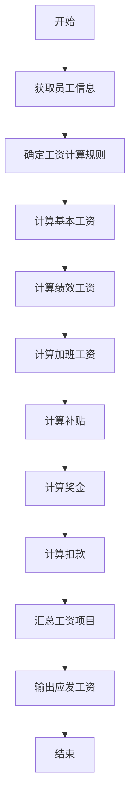

# 工资管理系统详细设计与具体代码实现

## 1.背景介绍

工资管理系统是企业人力资源管理中一个非常重要的组成部分。随着企业规模的不断扩大和人员的持续增加,传统的手工计算和管理工资的方式已经无法满足现代企业的需求。因此,开发一个高效、准确、安全的工资管理系统就显得尤为重要。

工资管理系统的主要功能包括:员工信息管理、工资项目设置、工资计算、工资发放、报表统计等。它能够自动计算员工的工资,减轻人工计算的工作量,提高工作效率,同时也能够保证工资数据的准确性和安全性。

## 2.核心概念与联系

工资管理系统涉及到一些核心概念,理解这些概念对于系统的设计和实现至关重要。

### 2.1 员工信息

员工信息是工资管理系统的基础数据,包括员工的基本信息(姓名、性别、出生年月日、身份证号等)、联系方式、入职日期、部门、职位、工资级别等。员工信息是计算工资的依据,也是管理人力资源的重要数据。

### 2.2 工资项目

工资项目是构成员工工资的各个组成部分,包括基本工资、绩效工资、加班工资、补贴、奖金、扣款等。不同的企业和行业,工资项目的设置也会有所不同。合理设置工资项目,对于准确计算工资至关重要。

### 2.3 工资计算规则

工资计算规则是根据企业的实际情况制定的,用于指导工资的计算。它包括了各个工资项目的计算方式、计算依据、计算顺序等。合理的工资计算规则能够保证工资计算的准确性和公平性。

### 2.4 工资发放

工资发放是指将计算出的工资支付给员工的过程。工资发放方式包括现金发放、银行转账等。工资发放不仅需要保证准确无误,还需要考虑安全性和及时性。

### 2.5 报表统计

报表统计是对工资数据进行汇总和分析,以便于管理层了解企业的工资支出情况、员工工资分布情况等,为企业的决策提供依据。常见的报表包括工资明细表、工资汇总表、部门工资分析表等。

上述核心概念相互关联、相互影响,共同构成了工资管理系统的核心业务逻辑。

## 3.核心算法原理具体操作步骤

工资管理系统的核心算法是工资计算算法,它根据企业制定的工资计算规则,对员工的各个工资项目进行计算,最终得出员工的应发工资。下面将详细介绍工资计算算法的原理和具体操作步骤。

### 3.1 算法原理

工资计算算法的基本原理是:根据员工的工资级别、工作表现等信息,结合企业制定的工资计算规则,对员工的各个工资项目进行计算,得出员工的应发工资。

算法的主要步骤如下:

1. 获取员工信息,包括工资级别、部门、职位、出勤情况等;
2. 根据员工信息,确定适用的工资计算规则;
3. 按照工资计算规则,依次计算员工的各个工资项目;
4. 将计算出的工资项目金额进行汇总,得出员工的应发工资。

在具体实现时,算法还需要考虑一些特殊情况,如加班工资的计算、扣款的处理等。

### 3.2 算法流程图

下面是工资计算算法的流程图,使用 Mermaid 语法绘制:



### 3.3 算法伪代码

下面是工资计算算法的伪代码:

```
输入: 员工信息 empInfo, 工资计算规则 rules
输出: 应发工资 payable

函数 calculateSalary(empInfo, rules):
    基本工资 = 计算基本工资(empInfo, rules)
    绩效工资 = 计算绩效工资(empInfo, rules)
    加班工资 = 计算加班工资(empInfo, rules)
    补贴 = 计算补贴(empInfo, rules)
    奖金 = 计算奖金(empInfo, rules)
    扣款 = 计算扣款(empInfo, rules)
    
    应发工资 = 基本工资 + 绩效工资 + 加班工资 + 补贴 + 奖金 - 扣款
    
    返回 应发工资
```

上面的伪代码展示了工资计算算法的基本思路,具体实现时还需要考虑各种特殊情况和边界条件。

## 4.数学模型和公式详细讲解举例说明

在工资管理系统中,一些工资项目的计算需要使用数学模型和公式。下面将详细介绍几个常见的数学模型和公式。

### 4.1 基本工资计算公式

基本工资是员工最基本的工资收入,通常与员工的工资级别和工作年限相关。基本工资的计算公式如下:

$$
基本工资 = 基本工资标准 \times 工龄系数
$$

其中,基本工资标准是根据员工的工资级别确定的固定值;工龄系数是根据员工的工作年限计算得出的系数,用于调整基本工资。

例如,某员工的工资级别为 5 级,基本工资标准为 5000 元/月,工作年限为 3 年。根据公司的工龄系数表,3 年工龄对应的工龄系数为 1.1。那么该员工的基本工资为:

$$
基本工资 = 5000 \times 1.1 = 5500 (元/月)
$$

### 4.2 绩效工资计算模型

绩效工资是根据员工的工作表现来确定的,通常采用某种绩效考核模型进行计算。一种常见的绩效考核模型是:

$$
绩效工资 = 基本工资 \times 绩效系数
$$

其中,绩效系数是根据员工的绩效考核结果确定的,一般在 0 到 2 之间浮动。

例如,某员工的基本工资为 5000 元/月,绩效考核结果为 85 分(满分 100 分)。根据公司的绩效工资计算规则,85 分对应的绩效系数为 1.5。那么该员工的绩效工资为:

$$
绩效工资 = 5000 \times 1.5 = 7500 (元/月)
$$

### 4.3 加班工资计算公式

加班工资是员工在正常工作时间之外工作所获得的报酬。加班工资的计算公式如下:

$$
加班工资 = 加班时长 \times 加班工资标准
$$

其中,加班时长是员工实际加班的小时数;加班工资标准是根据员工的工资级别和加班时间(工作日加班、节假日加班等)确定的固定值。

例如,某员工在上个月工作日加班 10 小时,节假日加班 5 小时。该员工的工资级别为 4 级,工作日加班工资标准为 50 元/小时,节假日加班工资标准为 100 元/小时。那么该员工的加班工资为:

$$
加班工资 = 10 \times 50 + 5 \times 100 = 1000 (元/月)
$$

### 4.4 其他工资项目的计算

除了上述几个工资项目外,还有一些其他的工资项目,如交通补贴、通讯补贴、午餐补贴等,它们的计算方式通常比较简单,可以直接使用固定值或者按照一定的规则进行计算。

例如,某公司的交通补贴计算规则为:

- 基层员工,每月交通补贴 200 元;
- 中层管理人员,每月交通补贴 300 元;
- 高层管理人员,每月交通补贴 500 元。

如果一名基层员工,那么他的交通补贴就是 200 元/月。

通过上述数学模型和公式,我们可以准确计算出员工的各个工资项目,从而得出员工的应发工资。在实际开发中,还需要根据企业的具体情况,对这些模型和公式进行调整和优化。

## 5.项目实践:代码实例和详细解释说明

为了更好地理解工资管理系统的实现,下面将给出一些核心代码实例,并进行详细的解释说明。

### 5.1 员工信息管理

员工信息是工资管理系统的基础数据,下面是一个简单的 `Employee` 类的实现:

```python
class Employee:
    def __init__(self, id, name, department, position, salary_grade, hire_date):
        self.id = id
        self.name = name
        self.department = department
        self.position = position
        self.salary_grade = salary_grade
        self.hire_date = hire_date

    # 计算工龄(年)
    def get_working_years(self):
        today = date.today()
        years = today.year - self.hire_date.year
        if today.month < self.hire_date.month or (today.month == self.hire_date.month and today.day < self.hire_date.day):
            years -= 1
        return years
```

在这个实现中,`Employee` 类包含了员工的基本信息,如员工编号、姓名、部门、职位、工资级别和入职日期。另外,还提供了一个 `get_working_years` 方法,用于计算员工的工作年限。

### 5.2 工资项目设置

工资项目是构成员工工资的各个组成部分,下面是一个简单的 `SalaryComponent` 类的实现:

```python
class SalaryComponent:
    def __init__(self, name, calculation_method):
        self.name = name
        self.calculation_method = calculation_method

    def calculate(self, employee):
        return self.calculation_method(employee)
```

在这个实现中,`SalaryComponent` 类表示一个工资项目,包含了工资项目的名称和计算方法。通过 `calculate` 方法,可以根据员工信息计算出该工资项目的金额。

下面是一个基本工资项目的计算方法实现:

```python
def calculate_base_salary(employee):
    base_salary_standards = {
        1: 3000,
        2: 4000,
        # ... 其他工资级别的标准
    }
    working_years_coefficients = {
        0: 1.0,
        1: 1.1,
        # ... 其他工作年限的系数
    }
    base_salary_standard = base_salary_standards[employee.salary_grade]
    working_years = employee.get_working_years()
    working_years_coefficient = working_years_coefficients[min(working_years, max(working_years_coefficients.keys()))]
    return base_salary_standard * working_years_coefficient
```

这个函数首先根据员工的工资级别获取基本工资标准,然后根据员工的工作年限获取工龄系数,最后将二者相乘得到基本工资。

### 5.3 工资计算规则

工资计算规则是指导工资计算的依据,下面是一个简单的 `SalaryCalculationRule` 类的实现:

```python
class SalaryCalculationRule:
    def __init__(self, components):
        self.components = components

    def calculate_salary(self, employee):
        salary = 0
        for component in self.components:
            salary += component.calculate(employee)
        return salary
```

在这个实现中,`SalaryCalculationRule` 类包含了一系列的工资项目。通过 `calculate_salary` 方法,可以遍历所有的工资项目,计算出员工的应发工资。

下面是一个示例,展示如何使用上述类来计算员工的工资:

```python
# 创建员工对象
employee = Employee(1, "张三", "技术部", "程序员", 3, date(2018, 6, 1))

# 创建工资项目
base_salary_component = SalaryComponent("基本工资", calculate_base_salary)
performance_salary_component = SalaryComponent("绩效工资", calculate_performance_salary)
# ... 其他工资项目

# 创建工资计算规则
salary_rule = SalaryCalculationRule([base_salary_component, performance_salary_component])

# 计算员工工资
salary = salary_rule.calculate_salary(employee)
print(f"员工 {employee.name} 的应发工资为: {salary} 元")
```

在这个示例中,我们首先创