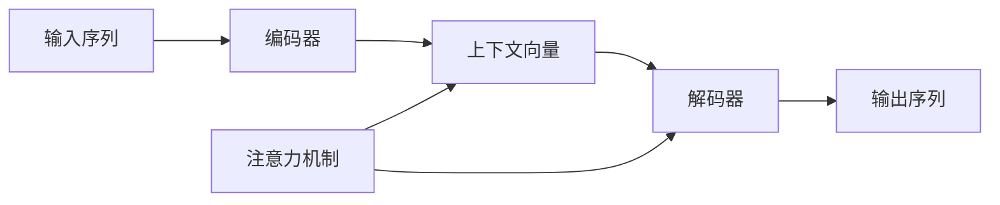

# 序列到序列学习 原理与代码实例讲解

## 1. 背景介绍
### 1.1 序列学习的重要性
在自然语言处理、语音识别、机器翻译等领域,我们经常需要处理序列数据。序列数据是指一系列按照时间顺序排列的数据点,如文本、语音、时间序列等。传统的机器学习方法很难有效地建模序列数据,因为它们通常假设数据点是独立同分布的。然而,序列数据中的元素往往具有强烈的相关性和顺序依赖性。因此,我们需要专门的序列学习算法来捕捉序列数据的时序特征。

### 1.2 序列到序列学习的应用
序列到序列(Sequence-to-Sequence,简称Seq2Seq)学习是一种强大的序列学习范式,它在机器翻译、文本摘要、对话系统等任务中取得了巨大成功。Seq2Seq模型可以将一个序列映射到另一个序列,实现了端到端的序列转换。例如,在机器翻译中,Seq2Seq模型可以直接将源语言句子转换为目标语言句子,无需人工设计复杂的特征和中间表示。

### 1.3 本文的主要内容
本文将全面介绍Seq2Seq学习的原理和实现。我们首先阐述Seq2Seq模型的核心概念和组成部分,然后详细讲解模型的数学原理和推导过程。接着,我们给出Seq2Seq模型的代码实现,并用实例说明如何应用模型进行序列转换任务。最后,我们总结Seq2Seq学习的优缺点,展望其未来的研究方向和挑战。

## 2. 核心概念与联系
### 2.1 编码器-解码器框架
Seq2Seq模型采用了编码器-解码器(Encoder-Decoder)的框架。编码器将输入序列压缩成一个固定长度的向量表示,解码器根据该向量表示生成输出序列。编码器和解码器通常都是循环神经网络(RNN),如LSTM或GRU。

### 2.2 注意力机制
传统的Seq2Seq模型使用固定长度的向量(即编码器的最后一个隐状态)来表示整个输入序列,这存在信息损失的问题。注意力机制(Attention Mechanism)通过在每个解码时间步引入加权的上下文向量来缓解这一问题。上下文向量是输入序列隐状态的加权平均,权重由解码器隐状态和编码器隐状态的相似度决定。

### 2.3 Seq2Seq模型变体
基于Seq2Seq框架,研究者提出了许多改进模型,如:
- 双向编码器(Bidirectional Encoder):同时使用前向和后向RNN编码输入序列,获得更全面的上下文信息。 
- 多层编码器/解码器(Multi-layer Encoder/Decoder):通过堆叠多层RNN增强模型表达能力。
- 集束搜索(Beam Search):生成阶段保留多个最优候选路径,提高解码质量。
- 指针网络(Pointer Network):在生成时可以直接从输入序列中拷贝单词,适用于OOV问题。
- 强化学习(Reinforcement Learning):引入策略梯度等方法,直接优化非可微的评价指标。

### 2.4 概念之间的联系
下图展示了Seq2Seq模型的核心概念之间的联系:

## 3. 核心算法原理具体操作步骤
### 3.1 编码阶段
1. 将输入序列$x=(x_1,\ldots,x_T)$通过嵌入层映射为实值向量序列$\mathbf{x}=(\mathbf{x}_1,\ldots,\mathbf{x}_T)$。
2. 初始化编码器隐状态$\mathbf{h}_0=\mathbf{0}$。
3. 对于$t=1,\ldots,T$,更新隐状态:
$$
\mathbf{h}_t=f_{\text{enc}}(\mathbf{x}_t,\mathbf{h}_{t-1})
$$
其中$f_{\text{enc}}$是编码器RNN的状态转移函数。
4. 将编码器最终隐状态$\mathbf{h}_T$作为上下文向量$\mathbf{c}$。

### 3.2 注意力计算
1. 在解码时间步$i$,计算解码器隐状态$\mathbf{s}_{i-1}$与编码器各时间步隐状态$\mathbf{h}_j$的注意力权重:
$$
e_{ij}=\mathbf{v}^\top \tanh(\mathbf{W}_1\mathbf{h}_j+\mathbf{W}_2\mathbf{s}_{i-1})\\
\alpha_{ij}=\frac{\exp(e_{ij})}{\sum_{k=1}^T \exp(e_{ik})}
$$
2. 计算注意力上下文向量:
$$
\mathbf{c}_i=\sum_{j=1}^T \alpha_{ij}\mathbf{h}_j
$$

### 3.3 解码阶段
1. 初始化解码器隐状态$\mathbf{s}_0=\mathbf{h}_T$,上一时刻输出$y_0=$`<START>`。
2. 对于$i=1,\ldots,T'$:
   1. 计算注意力上下文向量$\mathbf{c}_i$。
   2. 将$y_{i-1}$通过嵌入层映射为$\mathbf{y}_{i-1}$。
   3. 更新解码器隐状态:
   $$
   \mathbf{s}_i=f_{\text{dec}}(\mathbf{y}_{i-1},\mathbf{s}_{i-1},\mathbf{c}_i)
   $$
   4. 计算输出概率分布:
   $$
   P(y_i|y_1,\ldots,y_{i-1},\mathbf{x})=\text{softmax}(\mathbf{W}_o\mathbf{s}_i)
   $$
   5. 采样或贪心地选择$y_i$。
3. 生成`<END>`时停止解码。

## 4. 数学模型和公式详细讲解举例说明
### 4.1 编码器数学模型
编码器RNN在时间步$t$的隐状态$\mathbf{h}_t\in\mathbb{R}^n$由下式给出:
$$
\mathbf{h}_t=f_{\text{enc}}(\mathbf{x}_t,\mathbf{h}_{t-1})
$$
其中$\mathbf{x}_t\in\mathbb{R}^d$是输入向量,$\mathbf{h}_{t-1}$是上一时间步的隐状态,$f_{\text{enc}}$是非线性状态转移函数,如LSTM或GRU。以LSTM为例,状态转移函数为:
$$
\begin{aligned}
\mathbf{i}_t &= \sigma(\mathbf{W}_{ix}\mathbf{x}_t+\mathbf{W}_{ih}\mathbf{h}_{t-1}+\mathbf{b}_i)\\
\mathbf{f}_t &= \sigma(\mathbf{W}_{fx}\mathbf{x}_t+\mathbf{W}_{fh}\mathbf{h}_{t-1}+\mathbf{b}_f)\\
\mathbf{o}_t &= \sigma(\mathbf{W}_{ox}\mathbf{x}_t+\mathbf{W}_{oh}\mathbf{h}_{t-1}+\mathbf{b}_o)\\
\tilde{\mathbf{c}}_t &= \tanh(\mathbf{W}_{cx}\mathbf{x}_t+\mathbf{W}_{ch}\mathbf{h}_{t-1}+\mathbf{b}_c)\\
\mathbf{c}_t &= \mathbf{f}_t\odot \mathbf{c}_{t-1}+\mathbf{i}_t\odot\tilde{\mathbf{c}}_t\\
\mathbf{h}_t &= \mathbf{o}_t\odot\tanh(\mathbf{c}_t)
\end{aligned}
$$
其中$\mathbf{i}_t,\mathbf{f}_t,\mathbf{o}_t$分别是输入门、遗忘门和输出门,$\tilde{\mathbf{c}}_t$是候选记忆细胞,$\mathbf{c}_t$是记忆细胞。$\mathbf{W}_{(\cdot)}$和$\mathbf{b}_{(\cdot)}$是可学习的参数矩阵和偏置向量,$\sigma$是sigmoid函数,$\odot$是按元素乘法。

### 4.2 注意力计算的数学模型
在解码时间步$i$,注意力权重$\alpha_{ij}$衡量了目标词$y_i$对输入词$x_j$的关注程度。我们首先计算解码器隐状态$\mathbf{s}_{i-1}$与编码器隐状态$\mathbf{h}_j$的相似度得分$e_{ij}$:
$$
e_{ij}=\mathbf{v}^\top \tanh(\mathbf{W}_1\mathbf{h}_j+\mathbf{W}_2\mathbf{s}_{i-1})
$$
其中$\mathbf{v}$、$\mathbf{W}_1$、$\mathbf{W}_2$是可学习的参数。然后,我们对相似度得分做softmax归一化,得到注意力权重:
$$
\alpha_{ij}=\frac{\exp(e_{ij})}{\sum_{k=1}^T \exp(e_{ik})}
$$
最后,我们将注意力权重与编码器隐状态加权求和,得到注意力上下文向量:
$$
\mathbf{c}_i=\sum_{j=1}^T \alpha_{ij}\mathbf{h}_j
$$
直观地说,注意力机制使解码器能够在生成每个目标词时有选择地聚焦于输入序列的不同部分,自适应地提取相关信息。

### 4.3 解码器数学模型
解码器在时间步$i$的隐状态$\mathbf{s}_i\in\mathbb{R}^m$由下式给出:
$$
\mathbf{s}_i=f_{\text{dec}}(\mathbf{y}_{i-1},\mathbf{s}_{i-1},\mathbf{c}_i)
$$
其中$\mathbf{y}_{i-1}\in\mathbb{R}^d$是上一时刻的输出词嵌入向量,$\mathbf{s}_{i-1}$是上一时间步的隐状态,$\mathbf{c}_i$是注意力上下文向量,$f_{\text{dec}}$是非线性状态转移函数,通常与编码器RNN采用相同的类型。

解码器输出目标词的概率通过隐状态经过softmax层计算:
$$
P(y_i|y_1,\ldots,y_{i-1},\mathbf{x})=\text{softmax}(\mathbf{W}_o\mathbf{s}_i)
$$
其中$\mathbf{W}_o\in\mathbb{R}^{K\times m}$是输出层参数矩阵,$K$是目标词汇的大小。生成阶段可以采用贪心策略选择概率最大的词,也可以用集束搜索等策略综合多个高概率候选序列。

### 4.4 示例说明
考虑英语到法语的机器翻译任务。输入序列$\mathbf{x}$可以是英语单词的one-hot向量序列,如:"I love you" $\rightarrow$ $[1,0,\ldots,0],[0,0,\ldots,1,0,\ldots,0],[0,\ldots,0,1,0,\ldots,0]$。编码器逐词读取输入,更新隐状态,最终产生一个固定长度的上下文向量表示。

解码器以`<START>`为首词,预测第一个法语单词的概率分布。然后选择概率最大的单词"Je",将其作为下一时刻的输入。解码器在每一步根据当前隐状态、上一时刻输出和注意力机制得到的上下文向量,预测下一个单词的概率分布。不断重复生成过程,直到解码器输出`<END>`。最终可能得到的译文是:"Je t'aime"。

在训练阶段,我们通过最大化目标序列的对数似然来学习模型参数:
$$
\max_{\theta} \sum_{(\mathbf{x},\mathbf{y})\in\mathcal{D}} \log P(\mathbf{y}|\mathbf{x};\theta)
$$
其中$\mathcal{D}$是训练数据集,$\theta$是模型参数。我们通常使用随机梯度下降及其变种进行优化。

## 5. 项目实践：代码实例和详细解释说明
下面我们用PyTorch实现一个基本的Seq2Seq模型,并用它完成一个玩具