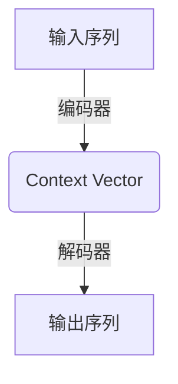

# 序列到序列模型 (Seq2Seq) 原理与代码实例讲解

## 1. 背景介绍

序列到序列模型(Sequence-to-Sequence, Seq2Seq)是一种广泛应用于自然语言处理(NLP)和其他领域的神经网络架构。它被用于解决输入和输出都是可变长度序列的问题,例如机器翻译、文本摘要、对话系统等。传统的神经网络模型通常只能处理固定长度的输入和输出,而Seq2Seq模型则能够灵活地处理可变长度的序列数据。

在机器翻译任务中,Seq2Seq模型可以将一种语言的句子(源语言序列)转换为另一种语言的句子(目标语言序列)。在文本摘要任务中,它可以将一个长文本(源序列)转换为一个简短的摘要(目标序列)。此外,Seq2Seq模型还可以应用于其他领域,如语音识别、图像字幕生成等。

Seq2Seq模型的核心思想是使用两个递归神经网络(RNN)来分别编码输入序列和解码输出序列。编码器RNN读取输入序列,并将其编码为一个向量表示(context vector),该向量捕获了输入序列的语义信息。解码器RNN则利用context vector和先前生成的输出符号来预测下一个输出符号,从而逐步生成整个输出序列。

## 2. 核心概念与联系

### 2.1 编码器(Encoder)

编码器的作用是将可变长度的输入序列映射为固定长度的context vector。常见的编码器实现方式有:

1. **RNN编码器**: 使用RNN(如LSTM或GRU)逐个读取输入序列中的符号,并将每个时间步的隐藏状态传递给下一个时间步,最后一个时间步的隐藏状态即为context vector。
2. **CNN编码器**: 使用卷积神经网络(CNN)对输入序列进行编码,CNN的输出特征图被展平为context vector。
3. **Transformer编码器**: 使用Transformer的编码器部分,通过自注意力机制对输入序列进行编码,最后一层编码器的输出即为context vector。

### 2.2 解码器(Decoder)

解码器的作用是根据context vector生成目标序列。常见的解码器实现方式有:

1. **RNN解码器**: 使用RNN(如LSTM或GRU)逐个生成目标序列中的符号,每个时间步的输入包括前一时间步的输出符号和context vector。
2. **Transformer解码器**: 使用Transformer的解码器部分,通过自注意力和交叉注意力机制生成目标序列,交叉注意力使用编码器的输出作为键值对。
3. **注意力机制(Attention Mechanism)**: 在解码过程中,注意力机制允许解码器selectively聚焦于输入序列的不同部分,从而捕获输入和输出之间的对齐关系。

### 2.3 Beam Search

在测试(inference)阶段,Beam Search是一种常用的近似搜索算法,用于从所有可能的输出序列中找到最优序列。它维护一个概率分数最高的候选输出序列集合(beam),在每个时间步,扩展这些候选序列,并保留概率分数最高的 k 个序列,其中 k 是beam size。这种方式比贪心搜索(只保留单个最高概率序列)更有效,因为它考虑了多个可能的候选序列。

### 2.4 注意力机制(Attention Mechanism)

注意力机制是Seq2Seq模型的一个关键组成部分,它允许模型在生成每个目标符号时,selectively聚焦于输入序列的不同部分。具体来说,在每个解码步骤,注意力机制会计算一个注意力分数向量,其中每个分数表示目标符号与输入序列中每个位置的关联程度。然后,输入序列的表示将根据这些注意力分数进行加权求和,产生一个context vector,该向量编码了与当前目标符号相关的输入信息。context vector将与解码器的隐藏状态一起用于预测下一个输出符号。

注意力机制的优点是它允许模型建立输入和输出序列之间的对齐关系,而不需要将整个输入序列压缩到固定长度的context vector中。这使得Seq2Seq模型能够更好地处理长序列输入,并产生更高质量的输出。

## 3. 核心算法原理具体操作步骤

下面我们将详细介绍Seq2Seq模型的核心算法原理和具体操作步骤:

### 3.1 模型架构

Seq2Seq模型的基本架构如下所示:

该架构由两个主要组件组成:

1. **编码器(Encoder)**: 将可变长度的输入序列编码为固定长度的context vector。
2. **解码器(Decoder)**: 根据context vector生成目标输出序列。

### 3.2 编码器(Encoder)

编码器通常使用RNN(如LSTM或GRU)来处理输入序列。假设输入序列为 $X = (x_1, x_2, \dots, x_T)$,其中 $T$ 是序列长度。在每个时间步 $t$,RNN会读取当前输入 $x_t$ 和上一时间步的隐藏状态 $h_{t-1}$,计算当前时间步的隐藏状态 $h_t$:

$$h_t = f(x_t, h_{t-1})$$

其中 $f$ 是RNN的递归函数,例如LSTM或GRU。最后一个时间步的隐藏状态 $h_T$ 即为context vector,它编码了整个输入序列的信息。

### 3.3 解码器(Decoder)

解码器也通常使用RNN来生成输出序列。假设目标输出序列为 $Y = (y_1, y_2, \dots, y_{T'})$,其中 $T'$ 是序列长度。在每个时间步 $t$,解码器RNN会读取前一时间步的输出 $y_{t-1}$ 和上一时间步的隐藏状态 $s_{t-1}$,以及来自编码器的context vector $c$,计算当前时间步的隐藏状态 $s_t$:

$$s_t = g(y_{t-1}, s_{t-1}, c)$$

其中 $g$ 是解码器RNN的递归函数。然后,解码器会基于当前隐藏状态 $s_t$ 和context vector $c$,通过一个输出层(如softmax层)计算下一个输出符号 $y_t$ 的概率分布:

$$P(y_t | y_{<t}, X) = \text{OutputLayer}(s_t, c)$$

在训练阶段,我们最大化生成正确目标序列的条件概率 $P(Y | X)$。在测试阶段,我们使用贪心搜索或Beam Search等方法从模型输出的概率分布中选择最可能的输出序列。

### 3.4 注意力机制(Attention Mechanism)

注意力机制允许解码器在生成每个输出符号时,selectively关注输入序列的不同部分。具体来说,在每个解码步骤,注意力机制会计算一个注意力分数向量 $\alpha_t = (\alpha_{t1}, \alpha_{t2}, \dots, \alpha_{tT})$,其中每个 $\alpha_{tj}$ 表示当前目标符号 $y_t$ 与输入序列第 $j$ 个位置的关联程度。然后,输入序列的表示将根据这些注意力分数进行加权求和,产生一个context vector $c_t$:

$$c_t = \sum_{j=1}^T \alpha_{tj} h_j$$

其中 $h_j$ 是编码器在时间步 $j$ 的隐藏状态。context vector $c_t$ 将与解码器的隐藏状态 $s_t$ 一起用于预测下一个输出符号 $y_t$:

$$P(y_t | y_{<t}, X) = \text{OutputLayer}(s_t, c_t)$$

注意力分数 $\alpha_{tj}$ 通常使用以下公式计算:

$$\alpha_{tj} = \frac{\exp(e_{tj})}{\sum_{k=1}^T \exp(e_{tk})}$$

其中 $e_{tj}$ 是一个与注意力机制相关的评分函数,用于衡量目标符号 $y_t$ 与输入序列第 $j$ 个位置的关联程度。

注意力机制的优点是它允许模型建立输入和输出序列之间的对齐关系,而不需要将整个输入序列压缩到固定长度的context vector中。这使得Seq2Seq模型能够更好地处理长序列输入,并产生更高质量的输出。

## 4. 数学模型和公式详细讲解举例说明

在本节中,我们将详细讲解Seq2Seq模型中使用的数学模型和公式,并给出具体的例子说明。

### 4.1 编码器(Encoder)

编码器的目标是将可变长度的输入序列 $X = (x_1, x_2, \dots, x_T)$ 编码为固定长度的context vector $c$。常见的编码器实现方式是使用RNN,例如LSTM或GRU。

假设我们使用LSTM作为编码器,其递归公式如下:

$$\begin{aligned}
f_t &= \sigma(W_f \cdot [h_{t-1}, x_t] + b_f) \\
i_t &= \sigma(W_i \cdot [h_{t-1}, x_t] + b_i) \\
\tilde{C}_t &= \tanh(W_C \cdot [h_{t-1}, x_t] + b_C) \\
C_t &= f_t \odot C_{t-1} + i_t \odot \tilde{C}_t \\
o_t &= \sigma(W_o \cdot [h_{t-1}, x_t] + b_o) \\
h_t &= o_t \odot \tanh(C_t)
\end{aligned}$$

其中:

- $f_t$、$i_t$ 和 $o_t$ 分别表示遗忘门、输入门和输出门
- $C_t$ 是细胞状态向量
- $\sigma$ 是sigmoid激活函数
- $\odot$ 表示元素wise乘积
- $W_f$、$W_i$、$W_C$ 和 $W_o$ 是权重矩阵
- $b_f$、$b_i$、$b_C$ 和 $b_o$ 是偏置向量

在最后一个时间步 $T$,LSTM的隐藏状态 $h_T$ 即为context vector $c$,它编码了整个输入序列的信息。

### 4.2 解码器(Decoder)

解码器的目标是根据context vector $c$ 生成目标输出序列 $Y = (y_1, y_2, \dots, y_{T'})$。常见的解码器实现方式也是使用RNN,例如LSTM或GRU。

假设我们使用LSTM作为解码器,其递归公式如下:

$$\begin{aligned}
f_t &= \sigma(W_f \cdot [s_{t-1}, y_{t-1}, c] + b_f) \\
i_t &= \sigma(W_i \cdot [s_{t-1}, y_{t-1}, c] + b_i) \\
\tilde{C}_t &= \tanh(W_C \cdot [s_{t-1}, y_{t-1}, c] + b_C) \\
C_t &= f_t \odot C_{t-1} + i_t \odot \tilde{C}_t \\
o_t &= \sigma(W_o \cdot [s_{t-1}, y_{t-1}, c] + b_o) \\
s_t &= o_t \odot \tanh(C_t)
\end{aligned}$$

其中:

- $s_t$ 是解码器LSTM在时间步 $t$ 的隐藏状态
- $y_{t-1}$ 是前一时间步的输出符号
- $c$ 是来自编码器的context vector

在每个时间步 $t$,解码器会基于当前隐藏状态 $s_t$ 和context vector $c$,通过一个输出层(如softmax层)计算下一个输出符号 $y_t$ 的概率分布:

$$P(y_t | y_{<t}, X) = \text{softmax}(W_o \cdot [s_t, c] + b_o)$$

其中 $W_o$ 和 $b_o$ 是输出层的权重矩阵和偏置向量。

在训练阶段,我们最大化生成正确目标序列的条件概率 $P(Y | X)$,即最小化负对数似然损失:

$$\mathcal{L}(\theta) = -\frac{1}{N} \sum_{n=1}^N \log P(Y^{(n)} | X^{(n)}; \theta)$$

其中 $N$ 是训练样本数,  $\theta$ 是模型参数