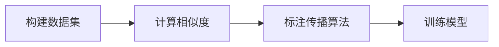
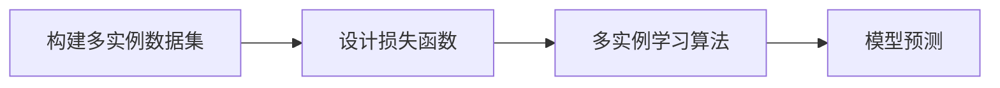
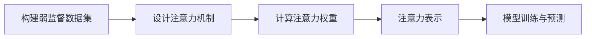

# 弱监督学习 原理与代码实例讲解

## 1.背景介绍

在现实世界中,获取大量高质量的标记数据通常是一个巨大的挑战。手工标注数据不仅耗费人力物力,而且往往存在着标注偏差和噪声问题。与此同时,未标记的原始数据却随处可得。因此,如何利用未标记或部分标记的数据进行训练和学习,成为机器学习领域的一个重要研究方向。

弱监督学习(Weakly Supervised Learning)作为一种有效的解决方案应运而生。它利用成本较低的弱标注(Weak Annotation)信息,如图像级别的标签、关键词、元数据等,代替传统的完全监督学习所需的精细标注数据,从而大大降低了数据标注的成本。

弱监督学习广泛应用于计算机视觉、自然语言处理等领域,展现出巨大的应用潜力。本文将全面介绍弱监督学习的核心概念、算法原理、数学模型以及实际应用场景,并提供详细的代码实例,帮助读者深入理解和掌握这一前沿技术。

## 2.核心概念与联系

### 2.1 弱监督学习的定义

弱监督学习是一种利用成本较低的弱标注信息进行模型训练的机器学习范式。与完全监督学习需要精细标注数据不同,弱监督学习只需要部分或低质量的标注信息,如图像级别的标签、关键词、元数据等。

### 2.2 弱监督学习与其他学习范式的关系

弱监督学习可以看作是完全监督学习和无监督学习之间的一种折中方案。相比完全监督学习,它降低了数据标注的成本;相比无监督学习,它利用了部分标注信息,可以获得更好的性能。

此外,弱监督学习还与半监督学习和多实例学习等有一定联系。半监督学习利用未标记数据和少量标记数据进行训练,而弱监督学习则利用弱标注数据和未标记数据。多实例学习则是一种特殊的弱监督学习范式,其标注信息是在袋(bag)级别而非实例级别。

### 2.3 弱监督学习的优缺点

优点:
- 降低了数据标注成本
- 利用了大量未标记数据,提高了模型的泛化能力
- 适用于各种场景,如计算机视觉、自然语言处理等

缺点:
- 训练过程相对复杂,需要设计特殊的算法和损失函数
- 模型性能通常低于完全监督学习
- 存在标注噪声和偏差问题

## 3.核心算法原理具体操作步骤  

弱监督学习的核心算法原理主要包括以下几个方面:

### 3.1 标注传播(Label Propagation)

标注传播是弱监督学习中一种常见的技术,其基本思想是利用已有的弱标注信息,通过一定的规则或模型,将标注信息从标记实例传播到未标记实例,从而获得更多的标记数据。

具体操作步骤如下:

1. 构建数据集,包含少量带弱标注的实例和大量未标记实例
2. 定义相似性度量,计算实例之间的相似度
3. 利用标注传播算法,如高斯场模型、随机游走等,将标注从已标注实例传播到未标注实例
4. 使用传播后的标记数据训练模型



### 3.2 多实例学习(Multiple Instance Learning)

多实例学习是弱监督学习的一种特殊形式,其标注信息是在袋(bag)级别而非实例级别。每个袋包含多个实例,只有袋级别的标签,而实例级别的标签未知。

多实例学习的具体操作步骤如下:

1. 构建多实例数据集,包含正袋(至少一个正实例)和负袋(全部为负实例)
2. 设计合适的实例级别和袋级别的损失函数
3. 利用多实例学习算法,如mi-SVM、MI-Kernel等,同时优化实例级别和袋级别的损失函数
4. 使用训练好的模型进行预测



### 3.3 注意力模型(Attention Model)

注意力模型是弱监督学习中一种常用的技术,可以自动关注输入数据中的关键部分,从而提高模型的性能。在弱监督学习中,注意力模型可以帮助模型聚焦于带有弱标注信息的区域,从而更好地利用这些信息进行学习。

注意力模型的具体操作步骤如下:

1. 构建弱监督数据集,包含带弱标注的实例
2. 设计注意力机制,计算每个输入元素对输出的重要性权重
3. 利用注意力权重对输入进行加权求和,得到注意力表示
4. 将注意力表示输入到后续的模型中进行训练和预测



### 3.4 正则化与约束(Regularization and Constraints)

由于弱监督学习中存在标注噪声和偏差问题,因此需要引入正则化和约束机制来提高模型的鲁棒性和泛化能力。

常见的正则化方法包括:

- L1/L2正则化:在损失函数中加入L1或L2范数项,以约束模型参数的大小
- dropout:在训练过程中随机dropout一部分神经元,以防止过拟合
- 数据增广:通过一些变换(如旋转、平移等)生成更多的训练数据

常见的约束方法包括:

- 约束注意力分布:限制注意力分布的熵或其他统计量,以减少噪声的影响
- 约束潜在变量:在模型中引入潜在变量,并对其施加约束,以捕获数据的内在结构
- 半监督正则化:利用未标记数据对模型施加正则化约束,提高模型的泛化能力

通过合理地应用正则化和约束机制,可以有效提高弱监督学习模型的性能和鲁棒性。

## 4.数学模型和公式详细讲解举例说明

在弱监督学习中,常常需要设计特殊的损失函数和优化目标,以充分利用弱标注信息。下面将介绍几种常见的数学模型和公式。

### 4.1 多实例学习的损失函数

在多实例学习中,我们需要同时优化实例级别和袋级别的损失函数。常见的实例级别损失函数包括二值交叉熵损失、Hinge损失等;常见的袋级别损失函数包括最大值损失、平均值损失等。

假设有 $N$ 个袋,第 $i$ 个袋包含 $M_i$ 个实例,其中 $y_i \in \{0, 1\}$ 表示该袋的标签(0为负袋,1为正袋)。对于第 $j$ 个实例,我们用 $f(x_{ij})$ 表示其预测值。则多实例学习的损失函数可以表示为:

$$
\mathcal{L}_{MI} = \frac{1}{N}\sum_{i=1}^{N}\left[\mathcal{L}_{bag}(y_i, \{f(x_{ij})\}_{j=1}^{M_i}) + \lambda\sum_{j=1}^{M_i}\mathcal{L}_{inst}(f(x_{ij}))\right]
$$

其中 $\mathcal{L}_{bag}$ 是袋级别损失函数, $\mathcal{L}_{inst}$ 是实例级别损失函数, $\lambda$ 是一个权重系数。

例如,当 $\mathcal{L}_{bag}$ 取最大值损失, $\mathcal{L}_{inst}$ 取Hinge损失时,损失函数可以写为:

$$
\mathcal{L}_{MI} = \frac{1}{N}\sum_{i=1}^{N}\left[\max_{1\leq j\leq M_i}\left[y_i\cdot f(x_{ij})\right] + \lambda\sum_{j=1}^{M_i}\max\left(0, 1-y_if(x_{ij})\right)\right]
$$

### 4.2 注意力模型的计算公式

在注意力模型中,我们需要计算每个输入元素对输出的重要性权重。假设输入为 $X = \{x_1, x_2, \cdots, x_n\}$,我们希望得到一个注意力权重向量 $\alpha = \{\alpha_1, \alpha_2, \cdots, \alpha_n\}$,其中 $\alpha_i$ 表示 $x_i$ 对输出的重要性。

常见的注意力计算公式包括:

1. **加性注意力(Additive Attention)**

$$
\alpha_i = \text{softmax}(v^Tg(W_1x_i + W_2h))
$$

其中 $h$ 是上下文向量, $W_1$、$W_2$ 和 $v$ 是可学习的参数, $g$ 是一个非线性激活函数。

2. **缩放点积注意力(Scaled Dot-Product Attention)**

$$
\alpha_i = \text{softmax}\left(\frac{q^TW_Qx_i}{\sqrt{d_k}}\right)
$$

其中 $q$ 是查询向量, $W_Q$ 是可学习的参数矩阵, $d_k$ 是缩放因子。

通过计算得到的注意力权重 $\alpha$,我们可以对输入进行加权求和,得到注意力表示:

$$
c = \sum_{i=1}^{n}\alpha_ix_i
$$

该注意力表示 $c$ 可以输入到后续的模型中,以获得更好的性能。

### 4.3 正则化与约束的数学形式

在弱监督学习中,常常需要对模型施加正则化或约束,以提高其鲁棒性和泛化能力。下面是一些常见的正则化和约束形式。

1. **L1/L2正则化**

$$
\mathcal{R}(\theta) = \lambda\|\theta\|_p^p
$$

其中 $\theta$ 表示模型参数, $p=1$ 时为L1正则化, $p=2$ 时为L2正则化, $\lambda$ 是正则化系数。

2. **注意力熵正则化**

$$
\mathcal{R}(\alpha) = -\lambda\sum_{i=1}^{n}\alpha_i\log\alpha_i
$$

其中 $\alpha$ 是注意力权重向量,该正则项可以约束注意力分布的熵,避免注意力过于集中。

3. **半监督正则化**

$$
\mathcal{R}(f) = \lambda\sum_{x\in\mathcal{U}}\|f(x)\|^2
$$

其中 $f$ 是模型的输出, $\mathcal{U}$ 是未标记数据集,该正则项可以约束模型在未标记数据上的输出,提高模型的泛化能力。

通过将这些正则化和约束项加入到损失函数中,可以有效提高弱监督学习模型的性能和鲁棒性。

## 5.项目实践:代码实例和详细解释说明

为了帮助读者更好地理解弱监督学习的原理和实现,下面将提供一个基于PyTorch的代码实例,实现一个简单的多实例学习模型。

### 5.1 数据准备

首先,我们需要准备一个多实例数据集。这里以一个简单的二维数据集为例,包含正袋和负袋。每个袋中包含若干个实例,实例的特征为二维坐标。

```python
import numpy as np

# 生成正袋数据
n_pos_bags = 10
pos_data = np.random.randn(n_pos_bags, 10, 2) + np.array([2, 2])

# 生成负袋数据
n_neg_bags = 10
neg_data = np.random.randn(n_neg_bags, 10, 2)

# 构建数据集
bags = np.concatenate([pos_data, neg_data], axis=0)
labels = np.array([1] * n_pos_bags + [0] * n_neg_bags)
```

### 5.2 模型定义

接下来,我们定义一个简单的多实例学习模型,包括一个实例级别的网络和一个袋级别的网络。

```python