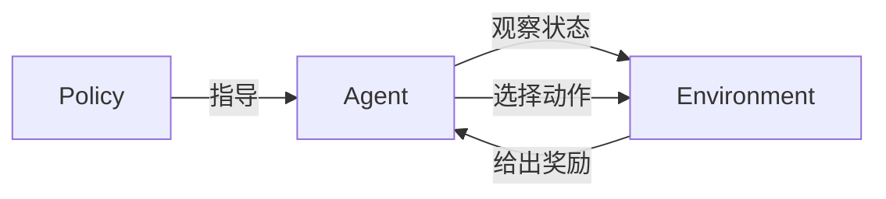

# 强化学习 (Reinforcement Learning) 原理与代码实例讲解

## 1.背景介绍

强化学习(Reinforcement Learning, RL)是机器学习的一个重要分支,它专注于如何基于环境反馈来学习决策序列,以最大化预期的长期回报。与监督学习和无监督学习不同,强化学习系统不是从标记好的训练数据中学习,而是通过与环境的交互来学习。

强化学习的概念源于心理学中关于行为主义的理论,后来被数学家们形式化为最优控制理论的一个分支。20世纪90年代,强化学习算法在解决复杂问题方面取得了突破性进展,并被广泛应用于机器人控制、游戏AI、自动驾驶等领域。

### 1.1 强化学习基本要素

强化学习系统由四个核心要素组成:

- **Agent(智能体)**: 观察环境状态,并根据策略选择动作。
- **Environment(环境)**: 描述问题所处的状态空间,并根据Agent的动作转移到新状态。
- **Reward(奖励)**: 环境对Agent当前动作的反馈,指导Agent朝着正确方向学习。
- **Policy(策略)**: Agent根据观测到的状态选择动作的策略。



### 1.2 强化学习的应用场景

强化学习可以应用于各种决策序列优化问题,例如:

- 机器人控制与规划
- 游戏AI(AlphaGo、Dota等)
- 自动驾驶与导航
- 资源管理与调度
- 投资组合优化
- 对话系统
- 网络路由

## 2.核心概念与联系  

### 2.1 马尔可夫决策过程(Markov Decision Process, MDP)

马尔可夫决策过程是强化学习问题的数学表述,由一个五元组(S, A, P, R, γ)组成:

- S是状态空间的集合
- A是动作空间的集合  
- P是状态转移概率函数,P(s, a, s')表示在状态s执行动作a后,转移到状态s'的概率
- R是奖励函数,R(s, a)表示在状态s执行动作a获得的即时奖励
- γ∈[0, 1]是折现因子,用于权衡当前奖励与未来奖励的权重

在MDP中,Agent的目标是找到一个策略π,使得期望的累积折现奖励最大化:

$$J(\pi) = \mathbb{E}_\pi \Big[\sum_{t=0}^\infty \gamma^t R(s_t, a_t)\Big]$$

其中,π(a|s)表示在状态s下选择动作a的概率。

### 2.2 价值函数(Value Function)

价值函数用于评估一个状态或状态-动作对的期望累积奖励,是学习最优策略的关键。有两种价值函数:

- 状态价值函数 V(s):在状态s下,执行策略π后的期望累积奖励
- 动作价值函数 Q(s, a):在状态s下,执行动作a,然后继续执行策略π后的期望累积奖励

它们可以通过贝尔曼方程(Bellman Equations)来定义:

$$V^\pi(s) = \mathbb{E}_\pi\Big[R(s, a) + \gamma \sum_{s'\in S} P(s, a, s')V^\pi(s')\Big]$$

$$Q^\pi(s, a) = \mathbb{E}_\pi\Big[R(s, a) + \gamma \sum_{s'\in S} P(s, a, s')V^\pi(s')\Big]$$

学习最优策略π*,使得V(s)和Q(s, a)最大化。

### 2.3 探索与利用权衡(Exploration-Exploitation Tradeoff)

在学习过程中,Agent需要权衡探索(exploration)和利用(exploitation)之间的关系:

- 探索:尝试新的动作,以发现更好的策略
- 利用:根据已学习的知识,选择目前看来最优的动作

过多探索会导致效率低下,过多利用则可能陷入次优解。合理的探索-利用策略对于找到最优解至关重要。

### 2.4 时序差分学习(Temporal Difference Learning)

时序差分(TD)学习是一种重要的强化学习技术,通过估计价值函数来学习策略。TD学习的思想是:

- 使用之前估计的价值函数来更新当前状态的价值估计
- 新估计的值是旧估计值与实际奖励的加权和

TD学习的优点是无需模型,可以从原始经验中直接学习,同时结合了动态规划和蒙特卡罗方法的优势。

## 3.核心算法原理具体操作步骤

### 3.1 动态规划算法(Dynamic Programming)

动态规划算法适用于完全可观测的MDP,即状态转移概率和奖励函数已知。主要算法有:

1. **价值迭代(Value Iteration)**

价值迭代通过不断更新状态价值函数V(s),直到收敛为最优价值函数V*(s)。算法步骤:

```
初始化 V(s) = 0, for all s in S
repeat:
    for all s in S:
        V(s) = max_a [ R(s,a) + gamma * sum_s' P(s,a,s') * V(s') ]
until 收敛
```

2. **策略迭代(Policy Iteration)**  

策略迭代分两步:首先通过求解贝尔曼方程得到当前策略的价值函数,然后对价值函数进行改进得到新策略。重复这个过程直到收敛。

### 3.2 时序差分学习算法

时序差分学习算法无需提前知道环境的转移概率和奖励函数,可以从实际交互中直接学习。

1. **Sarsa算法**

Sarsa是一种基于在线TD控制的算法,用于学习动作价值函数Q(s, a)。算法步骤:

```
初始化 Q(s,a) = 0, for all s in S, a in A  
repeat:
    初始状态 s
    选择动作 a (基于某种策略,如ε-greedy)
    repeat for each step:
        执行动作 a, 观测奖励 r, 新状态 s'
        选择新动作 a' (基于某种策略)
        Q(s,a) = Q(s,a) + alpha * (r + gamma * Q(s',a') - Q(s,a))
        s = s', a = a'
    until 终止
until 收敛
```

2. **Q-Learning算法**

Q-Learning是一种离线算法,直接学习最优动作价值函数Q*(s, a)。算法步骤:

```
初始化 Q(s,a) = 0, for all s in S, a in A
repeat:
    初始状态 s  
    repeat for each step:
        选择动作 a (基于某种策略,如ε-greedy)
        执行动作 a, 观测奖励 r, 新状态 s'
        Q(s,a) = Q(s,a) + alpha * (r + gamma * max_a' Q(s',a') - Q(s,a))
        s = s'
    until 终止  
until 收敛
```

Q-Learning的优点是收敛性证明简单,但也存在过估计的问题。

### 3.3 策略梯度算法(Policy Gradient)

策略梯度算法直接对策略π进行参数化,通过梯度上升的方式优化策略参数,使得期望累积奖励最大化。

假设策略π由参数θ参数化,π(a|s; θ)表示在状态s下选择动作a的概率。则目标函数为:

$$J(\theta) = \mathbb{E}_{\pi_\theta}\Big[\sum_{t=0}^\infty \gamma^t R(s_t, a_t)\Big]$$

使用策略梯度定理,可以得到目标函数的梯度:

$$\nabla_\theta J(\theta) = \mathbb{E}_{\pi_\theta}\Big[\sum_{t=0}^\infty \nabla_\theta \log\pi_\theta(a_t|s_t)Q^{\pi_\theta}(s_t, a_t)\Big]$$

基于梯度估计,可以使用梯度上升法更新策略参数θ。

常见的策略梯度算法包括REINFORCE、Actor-Critic等。

## 4.数学模型和公式详细讲解举例说明

### 4.1 马尔可夫奖励过程(Markov Reward Process, MRP)

马尔可夫奖励过程是一种特殊的马尔可夫决策过程,其中没有动作的概念,状态转移完全由概率决定。MRP由一个四元组(S, P, R, γ)定义:

- S是有限状态集合
- P是状态转移概率矩阵,P(s, s')表示从状态s转移到s'的概率
- R是奖励函数,R(s)表示在状态s获得的即时奖励  
- γ∈[0, 1]是折现因子

在MRP中,我们希望找到状态价值函数V(s),使得期望累积折现奖励最大化:

$$V(s) = \mathbb{E}\Big[\sum_{k=0}^\infty \gamma^k R(s_k) | s_0 = s\Big]$$

其中,{sk}是由P决定的状态序列。

对于MRP,价值函数V(s)满足以下贝尔曼方程:

$$V(s) = R(s) + \gamma \sum_{s'\in S} P(s, s')V(s')$$

我们可以将其表示为矩阵形式:

$$\mathbf{V} = \mathbf{R} + \gamma \mathbf{P}\mathbf{V}$$

其中,V是状态价值向量,R是奖励向量。

通过求解上述线性方程组,可以得到最优状态价值函数V*。

### 4.2 时序差分误差(Temporal Difference Error)

时序差分误差(TD Error)是时序差分学习算法的核心概念,用于驱动价值函数的更新。

对于状态价值函数V(s),TD误差定义为:

$$\delta_t = R_{t+1} + \gamma V(S_{t+1}) - V(S_t)$$

对于动作价值函数Q(s, a),TD误差定义为:

$$\delta_t = R_{t+1} + \gamma Q(S_{t+1}, A_{t+1}) - Q(S_t, A_t)$$

TD误差反映了当前价值估计与实际获得的奖励加上折现后的下一状态价值之间的差异。

在时序差分学习算法中,我们使用TD误差来更新价值函数:

$$V(S_t) \leftarrow V(S_t) + \alpha \delta_t$$
$$Q(S_t, A_t) \leftarrow Q(S_t, A_t) + \alpha \delta_t$$

其中,α是学习率,控制更新的幅度。

### 4.3 策略梯度定理(Policy Gradient Theorem)

策略梯度定理为直接优化策略参数提供了理论基础。假设策略π由参数θ参数化,我们希望最大化目标函数J(θ):

$$J(\theta) = \mathbb{E}_{\pi_\theta}\Big[\sum_{t=0}^\infty \gamma^t R(s_t, a_t)\Big]$$

策略梯度定理给出了目标函数梯度的表达式:

$$\nabla_\theta J(\theta) = \mathbb{E}_{\pi_\theta}\Big[\sum_{t=0}^\infty \nabla_\theta \log\pi_\theta(a_t|s_t)Q^{\pi_\theta}(s_t, a_t)\Big]$$

其中,Q^π(s, a)是在策略π下的动作价值函数。

直观地说,策略梯度是对数概率的梯度,加权了动作价值函数。如果动作价值函数较高,那么就应该增加选择该动作的概率。

基于策略梯度定理,我们可以使用梯度上升法来优化策略参数θ,从而提高期望累积奖励。

## 5.项目实践:代码实例和详细解释说明

为了更好地理解强化学习算法,我们将通过一个简单的网格世界(Gridworld)示例,实现Q-Learning算法并可视化学习过程。

### 5.1 网格世界环境

我们考虑一个4x4的网格世界,其中有一个起点(S)、一个终点(G)和两个障碍物(H)。Agent的目标是从起点出发,找到到达终点的最短路径。

```python
import numpy as np
import matplotlib.pyplot as plt

# 定义网格世界
world = np.array([
    ["S", "0", "0", "0"],
    ["0", "0", "H", "0"],
    ["0", "0", "H", "0"],
    ["0", "0", "0", "G"]
])

# 可能的动作
actions = ["up", "down", "left", "right"]

# 绘制网格世界
fig, ax