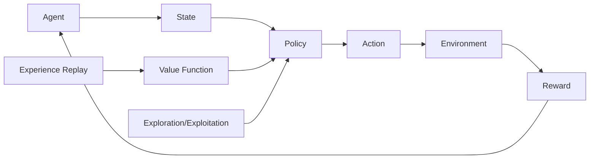

# 强化学习 原理与代码实例讲解

## 1. 背景介绍
### 1.1 强化学习的定义
强化学习(Reinforcement Learning, RL)是机器学习的一个重要分支,它是一种通过智能体(Agent)与环境(Environment)交互来学习最优策略的方法。与监督学习和无监督学习不同,强化学习不需要预先准备好的训练数据,而是通过智能体在与环境交互的过程中,根据环境的反馈(Reward)来不断调整和优化自身的策略(Policy),最终学习到一个能够使累积奖励最大化的最优策略。

### 1.2 强化学习的发展历程
强化学习的研究可以追溯到20世纪50年代,当时Richard Bellman提出了动态规划的概念。1989年,Chris Watkins在其博士论文中提出了Q-learning算法,标志着现代强化学习的开端。此后,强化学习领域不断发展,涌现出一系列经典算法,如SARSA、Policy Gradient、Actor-Critic等。近年来,随着深度学习的兴起,深度强化学习(Deep Reinforcement Learning, DRL)受到广泛关注,并在Atari游戏、围棋等领域取得了突破性进展。

### 1.3 强化学习的应用场景
强化学习在许多领域都有广泛的应用,例如:
- 游戏AI:通过强化学习,AI可以学会玩各种游戏,如Atari游戏、围棋、星际争霸等。
- 机器人控制:强化学习可以用于训练机器人完成各种任务,如行走、抓取、避障等。
- 自动驾驶:通过强化学习,无人车可以学会在复杂的交通环境中自主驾驶。  
- 推荐系统:强化学习可以用于个性化推荐,根据用户的行为动态调整推荐策略。
- 智能调度:在工厂、数据中心等场景中,强化学习可以用于优化调度策略,提高资源利用率。

## 2. 核心概念与联系
### 2.1 智能体(Agent)与环境(Environment)
强化学习的核心要素是智能体和环境。智能体是一个可以感知环境状态并采取行动的实体,其目标是通过与环境交互来最大化累积奖励。环境则定义了智能体所处的世界,它接收智能体的行动,并返回新的状态和奖励。智能体与环境不断交互,形成一个闭环的学习过程。

### 2.2 状态(State)、行动(Action)和奖励(Reward) 
在每个时间步,智能体都会观察到环境的当前状态(State),并根据状态选择一个行动(Action)。环境接收到行动后,会转移到一个新的状态,并给予智能体一定的奖励(Reward)作为反馈。奖励可以是正的,表示行动的好坏,也可以是负的,表示惩罚。智能体的目标就是学习一个策略,使得在状态和行动的序列中获得的累积奖励最大化。

### 2.3 策略(Policy)与价值函数(Value Function)
策略定义了智能体在每个状态下采取行动的概率分布。确定性策略直接给出在某个状态下要采取的行动,而随机性策略则给出一个行动的概率分布。智能体的目标就是学习一个最优策略,使得累积奖励最大化。

价值函数用于评估状态或状态-行动对的好坏。状态价值函数 $V(s)$ 表示从状态 $s$ 开始,遵循某个策略所能获得的期望累积奖励。而动作价值函数 $Q(s,a)$ 表示在状态 $s$ 下采取行动 $a$,然后遵循某个策略所能获得的期望累积奖励。价值函数可以帮助智能体评估和改进策略。

### 2.4 探索(Exploration)与利用(Exploitation)
在强化学习中,智能体面临着探索与利用的权衡。探索是指尝试新的行动,收集更多的信息,发现可能更好的策略。而利用则是基于当前已知的信息,采取已知的最优行动来获得奖励。过度探索会减少当前的奖励,而过度利用则可能错失更好的策略。因此,需要在探索和利用之间取得平衡,如 $\epsilon$-greedy 探索等。

### 2.5 经验回放(Experience Replay)
经验回放是一种用于提高样本利用效率和稳定训练过程的技术。在智能体与环境交互的过程中,将每一步的转移(transition)存储到回放缓冲区(replay buffer)中。训练时,从回放缓冲区中随机采样一批转移数据,用于更新价值函数或策略网络的参数。经验回放可以打破数据的相关性,提高样本利用效率,稳定训练过程。

### 2.6 On-policy与Off-policy学习
On-policy学习是指智能体使用与当前策略一致的数据来学习和改进策略,即用于学习的数据是由当前策略产生的。SARSA算法就是一种典型的on-policy算法。

而Off-policy学习则允许智能体使用不同于当前策略的数据来学习,即用于学习的数据可以来自其他策略,如历史数据或其他智能体的经验。Q-learning算法就是一种典型的off-policy算法,它使用贪婪策略来生成数据,但学习时使用当前的Q值来更新。Off-policy学习通常具有更好的样本利用效率。

强化学习的核心概念之间关系如下图所示:



## 3. 核心算法原理具体操作步骤
强化学习有许多经典的算法,下面以Q-learning为例,详细介绍其原理和操作步骤。

### 3.1 Q-learning算法原理
Q-learning是一种基于值(value-based)的强化学习算法,它通过学习动作价值函数 $Q(s,a)$ 来寻找最优策略。Q值表示在状态 $s$ 下采取行动 $a$ 然后遵循最优策略所能获得的期望累积奖励。Q-learning的核心思想是利用贝尔曼方程来迭代更新Q值:

$$Q(s,a) \leftarrow Q(s,a) + \alpha [r + \gamma \max_{a'} Q(s',a') - Q(s,a)]$$

其中,$s$ 是当前状态,$a$ 是在状态 $s$ 下采取的行动,$r$ 是获得的即时奖励,$s'$ 是转移到的下一个状态,$\alpha$ 是学习率,$\gamma$ 是折扣因子。

这个更新公式表明,Q值应该向 $r + \gamma \max_{a'} Q(s',a')$ 移动,即当前的即时奖励加上下一个状态的最大Q值的折扣。通过不断迭代更新,Q值最终会收敛到最优值 $Q^*(s,a)$,此时贪婪策略 $\pi(s) = \arg\max_a Q(s,a)$ 就是最优策略。

### 3.2 Q-learning算法步骤
1. 初始化Q表 $Q(s,a)$,对于所有的状态-行动对,初始值可以设为0或随机值。

2. 对每一个回合(episode):
   - 初始化起始状态 $s$
   - 对回合中的每一步:
     - 根据 $\epsilon$-greedy 策略,以 $\epsilon$ 的概率随机选择一个行动 $a$,否则选择 $\arg\max_a Q(s,a)$
     - 执行行动 $a$,观察奖励 $r$ 和下一个状态 $s'$
     - 根据贝尔曼方程更新 $Q(s,a)$:
       $$Q(s,a) \leftarrow Q(s,a) + \alpha [r + \gamma \max_{a'} Q(s',a') - Q(s,a)]$$
     - $s \leftarrow s'$
   - 直到 $s$ 为终止状态

3. 重复第2步,直到Q值收敛或达到预设的回合数

在学习过程中,Q-learning会不断更新Q表,使其收敛到最优值。学习完成后,可以根据Q表得到最优策略:在每个状态下选择Q值最大的行动。

## 4. 数学模型和公式详细讲解举例说明
### 4.1 马尔可夫决策过程(Markov Decision Process, MDP)
强化学习问题通常被建模为马尔可夫决策过程。一个MDP由以下元素组成:
- 状态集合 $\mathcal{S}$
- 行动集合 $\mathcal{A}$
- 转移概率 $\mathcal{P}(s'|s,a)$,表示在状态 $s$ 下采取行动 $a$ 后转移到状态 $s'$ 的概率
- 奖励函数 $\mathcal{R}(s,a,s')$,表示在状态 $s$ 下采取行动 $a$ 后转移到状态 $s'$ 所获得的即时奖励
- 折扣因子 $\gamma \in [0,1]$,表示未来奖励的折扣程度

MDP满足马尔可夫性质,即下一个状态只取决于当前状态和行动,与之前的历史无关:

$$\mathcal{P}(s_{t+1}|s_t,a_t,s_{t-1},a_{t-1},...) = \mathcal{P}(s_{t+1}|s_t,a_t)$$

在MDP中,智能体与环境交互产生一个状态、行动、奖励的序列:$s_0,a_0,r_0,s_1,a_1,r_1,...$。智能体的目标是最大化期望累积奖励:

$$\mathbb{E}[\sum_{t=0}^{\infty} \gamma^t r_t]$$

### 4.2 贝尔曼方程(Bellman Equation)
贝尔曼方程是强化学习的核心,它描述了状态价值函数或动作价值函数的递归关系。对于状态价值函数 $V^{\pi}(s)$,贝尔曼方程为:

$$V^{\pi}(s) = \sum_{a} \pi(a|s) \sum_{s',r} \mathcal{P}(s',r|s,a) [r + \gamma V^{\pi}(s')]$$

它表示在状态 $s$ 下,遵循策略 $\pi$ 所能获得的期望累积奖励等于在 $s$ 下采取行动 $a$ 的概率乘以(即时奖励加上下一个状态的期望累积奖励的折扣)的期望。

对于动作价值函数 $Q^{\pi}(s,a)$,贝尔曼方程为:

$$Q^{\pi}(s,a) = \sum_{s',r} \mathcal{P}(s',r|s,a) [r + \gamma \sum_{a'} \pi(a'|s') Q^{\pi}(s',a')]$$

它表示在状态 $s$ 下采取行动 $a$,然后遵循策略 $\pi$ 所能获得的期望累积奖励等于(即时奖励加上下一个状态下遵循策略 $\pi$ 的期望累积奖励的折扣)的期望。

贝尔曼方程揭示了价值函数的递归性质,为价值函数的迭代更新提供了理论基础。许多强化学习算法如Q-learning、SARSA等都是基于贝尔曼方程展开的。

### 4.3 举例说明
考虑一个简单的网格世界环境,如下图所示:

```
+---+---+---+
| S |   |   |
+---+---+---+
|   |   | G |
+---+---+---+
```

其中,S表示起始状态,G表示目标状态。智能体在每个状态下有4个可选行动:上、下、左、右。执行每个行动都有0.8的概率按预期方向移动,0.1的概率向左偏移,0.1的概率向右偏移。如果智能体撞到边界,则停留在原位。达到目标状态G会获得+1的奖励,其他状态的即时奖励都为0。折扣因子 $\gamma=0.9$。

我们可以用Q-learning算法来解决这个问题。初始化一个$6\times 4$的Q表(6个状态,4个行动),值都为0。然后开始与环境交互:
1. 初始化起始状态 S
2. 在状态 S,以 $\epsilon=0.1$ 的概率随机选择一个行动,否则选择Q值最大的行动,假设选择"右"
3. 