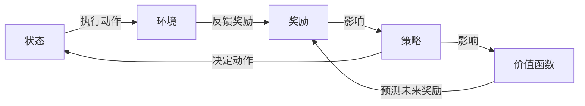

## 1.背景介绍
强化学习是一种机器学习的方法，它允许机器或软件代理在环境中学习行为，以实现某种目标。强化学习的核心思想是：代理通过执行动作并观察结果来学习，从而最大化某种长期的累积奖励。

## 2.核心概念与联系
强化学习的核心概念包括状态、动作、奖励、策略和价值函数。

- 状态(state)：代表代理在环境中的位置或状况。
- 动作(action)：代理可以在某个状态下执行的操作。
- 奖励(reward)：代理执行动作后，环境给出的反馈。
- 策略(policy)：决定代理在某个状态下应该执行哪个动作的规则。
- 价值函数(value function)：预测未来奖励的函数。

这些概念之间的关系可以通过以下Mermaid流程图进行说明：

## 3.核心算法原理具体操作步骤
强化学习的核心算法包括Q-learning、Deep Q Network (DQN)等。这里以Q-learning为例，简述其操作步骤：

1. 初始化Q-table为0。
2. 为每个episode执行以下操作：
   - 选择并执行一个动作。
   - 收集奖励。
   - 使用Q-learning的更新公式更新Q-table。
3. 根据Q-table选择最优的动作。

## 4.数学模型和公式详细讲解举例说明
Q-learning的更新公式如下：

$$
Q(s, a) = Q(s, a) + \alpha [r + \gamma \max_{a'} Q(s', a') - Q(s, a)]
$$

其中，$s$和$a$分别是当前的状态和动作，$r$是收到的奖励，$\alpha$是学习率，$\gamma$是折扣因