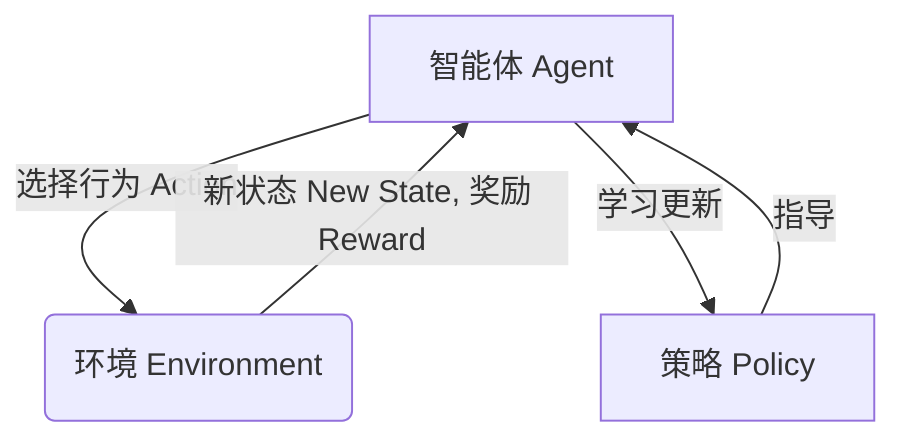

# 强化学习与自适应控制原理与代码实战案例讲解

## 1.背景介绍

### 1.1 什么是强化学习?

强化学习(Reinforcement Learning, RL)是机器学习的一个重要分支,旨在让智能体(Agent)通过与环境(Environment)的交互来学习如何采取最优策略,以最大化长期累积奖励。与监督学习不同,强化学习没有给定正确答案,智能体必须通过不断试错来发现哪种行为是好的,哪种是坏的。

### 1.2 强化学习的应用

强化学习在许多领域都有广泛的应用,例如:

- 机器人控制
- 自动驾驶
- 游戏AI
- 资源管理和优化
- 自然语言处理
- 计算机系统优化

### 1.3 自适应控制的重要性

在实际应用中,环境通常是复杂的、动态变化的,单一的控制策略往往难以适应各种情况。自适应控制技术可以根据环境的变化动态调整控制策略,提高系统的鲁棒性和适应性。将强化学习与自适应控制相结合,可以使智能体在不确定环境中学习最优控制策略。

## 2.核心概念与联系  

### 2.1 强化学习的核心要素

强化学习系统由四个核心要素组成:

- 智能体(Agent)
- 环境(Environment)
- 策略(Policy)
- 奖励(Reward)

智能体根据当前状态选择行为,执行行为后环境转移到新状态,并给出相应的奖励信号。智能体的目标是学习一个最优策略,使长期累积奖励最大化。

### 2.2 马尔可夫决策过程

强化学习问题通常建模为马尔可夫决策过程(Markov Decision Process, MDP),由以下要素组成:

- 状态集合 $\mathcal{S}$
- 行为集合 $\mathcal{A}$
- 转移概率 $\mathcal{P}_{ss'}^a = \Pr(s' | s, a)$
- 奖励函数 $\mathcal{R}_s^a = \mathbb{E}[R | s, a]$
- 折扣因子 $\gamma \in [0, 1)$

目标是找到一个最优策略 $\pi^*$,使得在任意状态 $s$ 下,按照该策略行动可获得最大期望回报:

$$\pi^* = \arg\max_\pi \mathbb{E}_\pi \left[ \sum_{t=0}^\infty \gamma^t R_{t+1} | s_0 = s \right]$$

### 2.3 价值函数和Q函数

在强化学习中,我们通常使用价值函数(Value Function)或Q函数(Q-Function)来评估一个策略的好坏。

- 价值函数 $V^\pi(s)$ 表示在策略 $\pi$ 下,从状态 $s$ 开始,期望可以获得的累积奖励。
- Q函数 $Q^\pi(s, a)$ 表示在策略 $\pi$ 下,从状态 $s$ 执行行为 $a$,之后期望可以获得的累积奖励。

通过估计并优化价值函数或Q函数,我们可以找到最优策略。

## 3.核心算法原理具体操作步骤

强化学习算法主要分为三大类:基于价值函数的算法、基于策略的算法和Actor-Critic算法。

### 3.1 基于价值函数的算法

#### 3.1.1 Q-Learning

Q-Learning是最经典的基于价值函数的强化学习算法之一。它的核心思想是通过不断更新Q函数,逼近最优Q函数,从而得到最优策略。算法步骤如下:

1. 初始化Q函数,例如全部设为0
2. 对于每个状态-行为对 $(s, a)$:
    - 执行行为 $a$,观测到新状态 $s'$ 和奖励 $r$
    - 更新Q函数:
        $$Q(s, a) \leftarrow Q(s, a) + \alpha \left[ r + \gamma \max_{a'} Q(s', a') - Q(s, a) \right]$$
        其中 $\alpha$ 是学习率, $\gamma$ 是折扣因子
3. 重复步骤2,直到收敛

在收敛后,Q函数近似了最优Q函数,我们可以根据 $\pi^*(s) = \arg\max_a Q^*(s, a)$ 得到最优策略。

#### 3.1.2 Sarsa

Sarsa算法与Q-Learning类似,区别在于它使用实际执行的下一个行为来更新Q函数,而不是使用最大Q值。算法步骤如下:

1. 初始化Q函数
2. 对于每个状态-行为对 $(s, a)$:
    - 执行行为 $a$,观测到新状态 $s'$,奖励 $r$,并根据当前策略选择下一个行为 $a'$
    - 更新Q函数:
        $$Q(s, a) \leftarrow Q(s, a) + \alpha \left[ r + \gamma Q(s', a') - Q(s, a) \right]$$
3. 重复步骤2,直到收敛

Sarsa算法在于策略评估和策略改进同时进行,因此可以应用于在线学习场景。

### 3.2 基于策略的算法

#### 3.2.1 Policy Gradient

Policy Gradient算法直接对策略函数进行优化,使期望回报最大化。算法步骤如下:

1. 初始化策略参数 $\theta$
2. 对于每个episode:
    - 根据当前策略 $\pi_\theta$ 与环境交互,收集轨迹 $\tau = (s_0, a_0, r_0, s_1, a_1, r_1, \ldots)$
    - 计算该轨迹的回报 $R(\tau)$
    - 根据回报更新策略参数:
        $$\theta \leftarrow \theta + \alpha \nabla_\theta \log \pi_\theta(\tau) R(\tau)$$
        其中 $\alpha$ 是学习率
3. 重复步骤2,直到收敛

Policy Gradient算法可以直接优化任意形式的策略函数,包括深度神经网络策略,但收敛速度较慢,需要大量样本。

#### 3.2.2 REINFORCE

REINFORCE算法是Policy Gradient的一种Monte Carlo采样方法。它的思路是对每个episode的回报进行采样,然后根据采样结果更新策略参数。算法步骤如下:

1. 初始化策略参数 $\theta$
2. 对于每个episode:
    - 根据当前策略 $\pi_\theta$ 与环境交互,收集轨迹 $\tau = (s_0, a_0, r_0, s_1, a_1, r_1, \ldots)$
    - 计算该轨迹的回报 $R(\tau)$
    - 根据回报更新策略参数:
        $$\theta \leftarrow \theta + \alpha \gamma^t \nabla_\theta \log \pi_\theta(a_t | s_t) R(\tau)$$
        其中 $\alpha$ 是学习率, $\gamma$ 是折扣因子
3. 重复步骤2,直到收敛

REINFORCE算法通过采样估计策略梯度,减少了计算量,但收敛速度较慢,方差较大。

### 3.3 Actor-Critic算法

Actor-Critic算法将策略函数(Actor)和价值函数(Critic)分开训练,结合了价值函数和策略梯度的优点。算法步骤如下:

1. 初始化Actor网络(策略函数)和Critic网络(价值函数)
2. 对于每个状态 $s$:
    - Actor根据当前策略 $\pi_\theta(s)$ 选择行为 $a$
    - 执行行为 $a$,观测到新状态 $s'$,奖励 $r$
    - 计算TD误差 $\delta = r + \gamma V(s') - V(s)$
    - 更新Critic网络,使TD误差最小化
    - 更新Actor网络,使 $\nabla_\theta \log \pi_\theta(a|s) \cdot A(s, a)$ 最大化
        其中 $A(s, a) = Q(s, a) - V(s)$ 是优势函数
3. 重复步骤2,直到收敛

Actor-Critic算法将策略评估(Critic)和策略改进(Actor)分开,可以相互借力,提高了稳定性和收敛速度。

## 4.数学模型和公式详细讲解举例说明

### 4.1 马尔可夫决策过程

马尔可夫决策过程(MDP)是强化学习问题的数学模型,由以下要素组成:

- 状态集合 $\mathcal{S}$
- 行为集合 $\mathcal{A}$
- 转移概率 $\mathcal{P}_{ss'}^a = \Pr(s' | s, a)$,表示在状态 $s$ 执行行为 $a$ 后,转移到状态 $s'$ 的概率
- 奖励函数 $\mathcal{R}_s^a = \mathbb{E}[R | s, a]$,表示在状态 $s$ 执行行为 $a$ 后,期望获得的奖励
- 折扣因子 $\gamma \in [0, 1)$,用于权衡当前奖励和未来奖励的重要性

在MDP中,我们的目标是找到一个最优策略 $\pi^*$,使得在任意状态 $s$ 下,按照该策略行动可获得最大期望回报:

$$\pi^* = \arg\max_\pi \mathbb{E}_\pi \left[ \sum_{t=0}^\infty \gamma^t R_{t+1} | s_0 = s \right]$$

其中 $R_{t+1}$ 表示在时刻 $t$ 获得的奖励。

#### 例子:机器人导航

考虑一个机器人导航的例子,机器人需要在一个网格世界中找到目标位置。

- 状态 $s$ 表示机器人的当前位置
- 行为 $a$ 包括上下左右四个方向移动
- 转移概率 $\mathcal{P}_{ss'}^a$ 表示机器人从位置 $s$ 执行行为 $a$ 后,到达位置 $s'$ 的概率
- 奖励函数 $\mathcal{R}_s^a$ 可以设置为:
    - 到达目标位置时,给予大的正奖励
    - 撞墙或离开边界时,给予负奖励
    - 其他情况,给予小的负奖励(鼓励快速到达目标)

机器人的目标是学习一个策略 $\pi^*$,使得从任意起始位置出发,都可以最快到达目标位置。

### 4.2 价值函数和Q函数

在强化学习中,我们通常使用价值函数(Value Function)或Q函数(Q-Function)来评估一个策略的好坏。

#### 价值函数

价值函数 $V^\pi(s)$ 表示在策略 $\pi$ 下,从状态 $s$ 开始,期望可以获得的累积奖励,定义为:

$$V^\pi(s) = \mathbb{E}_\pi \left[ \sum_{t=0}^\infty \gamma^t R_{t+1} | s_0 = s \right]$$

价值函数满足贝尔曼方程:

$$V^\pi(s) = \mathbb{E}_\pi \left[ R_{t+1} + \gamma V^\pi(s_{t+1}) | s_t = s \right]$$

我们可以通过迭代更新的方式求解价值函数。

#### Q函数

Q函数 $Q^\pi(s, a)$ 表示在策略 $\pi$ 下,从状态 $s$ 执行行为 $a$,之后期望可以获得的累积奖励,定义为:

$$Q^\pi(s, a) = \mathbb{E}_\pi \left[ \sum_{t=0}^\infty \gamma^t R_{t+1} | s_0 = s, a_0 = a \right]$$

Q函数满足贝尔曼方程:

$$Q^\pi(s, a) = \mathbb{E}_\pi \left[ R_{t+1} + \gamma \sum_{s'} \mathcal{P}_{ss'}^a V^\pi(s') | s_t = s, a_t = a \right]$$

我们可以通过迭代更新的方式求解Q函数。

#### 例子:棋盘游戏

考虑一个简单的棋盘游戏,游戏的状态 $s$ 表示当前棋子的位置,行为 $a$ 表示移动棋子的方向。我们可以定义奖励函数 $\mathcal{R}_s^a$ 为:

- 到达终点时,给予大的正奖励
- 其