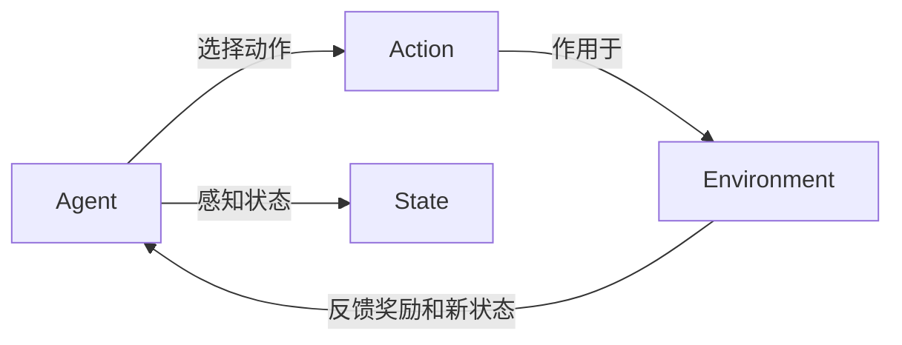

# 强化学习：基础概念解析

## 1.背景介绍

强化学习(Reinforcement Learning,RL)是机器学习的一个重要分支,它研究如何让智能体(Agent)在与环境的交互中学习最优策略,以获得最大的累积奖励。与监督学习和非监督学习不同,强化学习不需要预先准备好标注数据,而是通过不断试错、反馈和优化来自主学习。

强化学习的思想源自于心理学中的行为主义理论,即生物体会根据环境反馈调整自己的行为,从而适应环境。20世纪80年代,理查德·萨顿(Richard Sutton)和安德鲁·巴尔托(Andrew Barto)将强化学习引入到人工智能和机器学习领域。近年来,随着深度学习的发展,深度强化学习(Deep Reinforcement Learning,DRL)取得了显著进展,在围棋、视频游戏、机器人控制等领域展现出了超越人类的能力。

强化学习在工业界也有广泛应用,如无人驾驶、智能电网调度、推荐系统、金融投资等。掌握强化学习的基本概念和算法,对于理解和应用人工智能技术具有重要意义。本文将系统介绍强化学习的核心概念、经典算法、数学原理以及代码实践,帮助读者快速入门强化学习。

## 2.核心概念与联系

### 2.1 Agent、State、Action与Environment

强化学习涉及四个核心概念:智能体(Agent)、状态(State)、动作(Action)和环境(Environment)。

- 智能体:感知环境状态,根据策略选择动作,通过与环境交互获得奖励反馈,目标是最大化累积奖励。
- 状态:表示智能体所处的环境状态,通常用特征向量表示。
- 动作:智能体根据当前状态采取的行为决策,可以是离散的(如左、右)或连续的(如速度、角度)。 
- 环境:智能体与之交互的对象,根据智能体的动作更新状态,并给出即时奖励。

它们之间的关系可以用下面的Mermaid图表示:



### 2.2 Policy、Value Function与Model

强化学习的目标是学习最优策略(Optimal Policy),使得智能体能获得最大的期望累积奖励。与之相关的三个重要概念是:

- 策略(Policy):将状态映射为动作的函数,表示智能体的行为决策规则。常用 $\pi$ 表示。
- 价值函数(Value Function):评估状态或状态-动作对的长期价值,包括状态价值函数 $V^\pi(s)$ 和动作价值函数 $Q^\pi(s,a)$。
- 环境模型(Model):对环境的转移概率 $P(s'|s,a)$ 和奖励函数 $R(s,a)$ 进行建模。

基于是否利用环境模型,强化学习可分为:
- 基于模型的方法(Model-based):学习环境模型,然后基于模型进行规划和决策。
- 无模型方法(Model-free):直接学习价值函数或策略,不需要显式建模环境。

### 2.3 探索与利用

强化学习面临探索-利用困境(Exploration-Exploitation Dilemma)。探索是尝试新的动作以发现潜在的高价值状态,利用是执行当前已知的最优动作以获得稳定回报。二者需要权衡:
- $\epsilon$-贪心($\epsilon$-greedy):以 $\epsilon$ 的概率随机探索,否则采取贪心动作。
- 软性最大化(Softmax):根据动作价值的相对大小,以 Boltzmann 分布的概率选择动作。

## 3.核心算法原理具体操作步骤

强化学习的经典算法主要有:

### 3.1 值迭代(Value Iteration)

值迭代通过迭代贝尔曼最优方程来计算最优状态价值函数 $V^*(s)$:

$$
V^*(s) = \max_a \sum_{s'} P(s'|s,a) [R(s,a,s') + \gamma V^*(s')]
$$

其中 $\gamma$ 为折扣因子。算法流程为:

1. 初始化 $V_0(s)=0$
2. 重复直到收敛:
   - 对每个状态 $s$,更新 $V_{k+1}(s) = \max_a \sum_{s'} P(s'|s,a) [R(s,a,s') + \gamma V_k(s')]$
3. 得到最优价值函数 $V^*$ 后,最优策略为:$\pi^*(s) = \arg\max_a \sum_{s'} P(s'|s,a) [R(s,a,s') + \gamma V^*(s')]$

### 3.2 策略迭代(Policy Iteration) 

策略迭代交替执行策略评估和策略改进,直到找到最优策略:

1. 初始化策略 $\pi_0$
2. 重复直到 $\pi$ 收敛:
   - 策略评估:计算 $V^{\pi}(s)$,即固定 $\pi$ 求解线性方程组:
     $V^\pi(s) = \sum_{s'} P(s'|s,\pi(s)) [R(s,\pi(s),s') + \gamma V^\pi(s')]$
   - 策略改进:更新 $\pi(s) = \arg\max_a \sum_{s'} P(s'|s,a) [R(s,a,s') + \gamma V^\pi(s')]$
3. 得到最优策略 $\pi^*$

### 3.3 蒙特卡洛方法(Monte Carlo Methods)

蒙特卡洛方法通过采样完整的状态-动作序列来学习最优策略,不需要知道环境模型:

1. 初始化 $Q(s,a)=0,Returns(s,a)=[]$
2. 重复多个回合:
   - 根据 $\pi$ 生成一个状态-动作序列 $S_0,A_0,R_1,S_1,A_1,\dots,S_{T-1},A_{T-1},R_T$
   - 对每个状态-动作对 $(S_t,A_t)$:
     - $G \leftarrow \sum_{k=t+1}^T \gamma^{k-t-1} R_k$
     - $Returns(S_t,A_t).append(G)$
     - $Q(S_t,A_t) \leftarrow average(Returns(S_t,A_t))$
   - 更新策略: $\pi(s) = \arg\max_a Q(s,a)$

### 3.4 时序差分学习(Temporal Difference Learning)

时序差分学习结合了动态规划和蒙特卡洛方法的优点,通过自举(Bootstrap)的方式在每个时间步更新价值函数。经典算法有:

- Sarsa:基于状态-动作对 $(S_t,A_t)$ 的 TD(0)更新:
  $Q(S_t,A_t) \leftarrow Q(S_t,A_t) + \alpha [R_{t+1} + \gamma Q(S_{t+1},A_{t+1}) - Q(S_t,A_t)]$
- Q-Learning:基于状态 $S_t$ 和下一步最优动作 $\max_a Q(S_{t+1},a)$ 的更新:
  $Q(S_t,A_t) \leftarrow Q(S_t,A_t) + \alpha [R_{t+1} + \gamma \max_a Q(S_{t+1},a) - Q(S_t,A_t)]$

其中 $\alpha$ 为学习率。

## 4.数学模型和公式详细讲解举例说明

### 4.1 马尔可夫决策过程(Markov Decision Process,MDP)

强化学习问题可以用马尔可夫决策过程来建模,一个MDP由五元组 $\langle \mathcal{S},\mathcal{A},P,R,\gamma \rangle$ 定义:

- 状态空间 $\mathcal{S}$:所有可能的状态集合。
- 动作空间 $\mathcal{A}$:在每个状态下智能体可采取的动作集合。
- 转移概率 $P(s'|s,a)$:在状态 $s$ 下执行动作 $a$ 后转移到状态 $s'$ 的概率。满足马尔可夫性质,即下一状态只取决于当前状态和动作。
- 奖励函数 $R(s,a)$:在状态 $s$ 下采取动作 $a$ 获得的即时奖励的期望值。
- 折扣因子 $\gamma \in [0,1]$:未来奖励的衰减率,折现未来不确定的奖励。

例如,一个简单的网格世界环境可以建模为MDP:

- 状态:网格中每个位置坐标 $(i,j)$。
- 动作:上、下、左、右四个方向。
- 转移概率:执行动作后到达相邻网格的概率,如果撞墙则保持不变。
- 奖励:到达目标位置给予正奖励,其他默认为负奖励或零。
- 折扣因子:可设为接近1的值,如0.99,表示更看重长远利益。

### 4.2 贝尔曼方程(Bellman Equation)

状态价值函数 $V^\pi(s)$ 表示从状态 $s$ 开始,执行策略 $\pi$ 能获得的期望累积奖励:

$$
V^\pi(s) = \mathbb{E}_\pi [\sum_{k=0}^\infty \gamma^k R_{t+k+1} | S_t=s]
$$

动作价值函数 $Q^\pi(s,a)$ 表示在状态 $s$ 下选择动作 $a$,然后继续执行 $\pi$ 得到的期望回报:

$$
Q^\pi(s,a) = \mathbb{E}_\pi [\sum_{k=0}^\infty \gamma^k R_{t+k+1} | S_t=s, A_t=a]
$$

两者满足贝尔曼方程:

$$
V^\pi(s) = \sum_a \pi(a|s) \sum_{s'} P(s'|s,a) [R(s,a) + \gamma V^\pi(s')]
$$
$$
Q^\pi(s,a) = \sum_{s'} P(s'|s,a) [R(s,a) + \gamma \sum_{a'} \pi(a'|s') Q^\pi(s',a')]
$$

最优价值函数 $V^*(s)$ 和 $Q^*(s,a)$ 满足贝尔曼最优方程:

$$
V^*(s) = \max_a \sum_{s'} P(s'|s,a) [R(s,a) + \gamma V^*(s')]
$$
$$
Q^*(s,a) = \sum_{s'} P(s'|s,a) [R(s,a) + \gamma \max_{a'} Q^*(s',a')]
$$

强化学习的目标就是通过不断试错和更新,求解贝尔曼最优方程,得到最优价值函数和最优策略。

## 5.项目实践：代码实例和详细解释说明

下面以一个简单的网格世界环境为例,演示强化学习算法的代码实现。

### 5.1 环境设置

我们考虑一个4x4的网格世界,智能体从左上角S出发,目标是到达右下角的宝藏位置G。

```python
import numpy as np

class GridWorld:
    def __init__(self):
        self.grid = np.zeros((4,4))
        self.grid[0,0] = 1  # 起点
        self.grid[3,3] = 2  # 终点
        self.state = (0,0) # 初始状态
        
    def reset(self):
        self.state = (0,0)
        return self.state
    
    def step(self, action):
        i, j = self.state
        if action == 0:  # 左
            j = max(0, j-1)
        elif action == 1:  # 右
            j = min(3, j+1)
        elif action == 2:  # 上
            i = max(0, i-1)
        elif action == 3:  # 下
            i = min(3, i+1)
        
        self.state = (i, j)
        reward = -1
        done = (i == 3 and j == 3)
        return self.state, reward, done
```

### 5.2 值迭代

```python
def value_iteration(env, gamma=0.9, theta=1e-6):
    V = np.zeros((4,4))
    while True:
        delta = 0
        for i in range(4):
            for j in range(4):
                v = V[i,j]
                V[i,j] = max([-1 + gamma * V[max(0,i-1), j], 
                              -1 + gamma * V[min(3,i+1), j],
                              -1 + gamma * V[i, max(0,j-1)],
                              -1 + gamma * V[i, min(3,j+1)]])
                