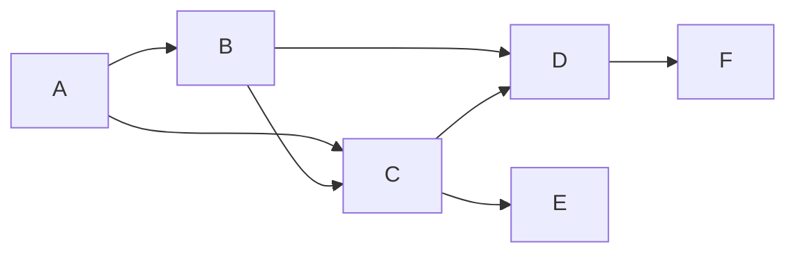

# 影响力分析与社会网络：AI代理的工作流研究

## 1.背景介绍

在当今快节奏的数字时代,社交媒体和在线社区的影响力与日俱增。人们不仅可以通过这些平台获取信息和娱乐,还可以与他人建立联系、分享想法和参与讨论。然而,信息在这些网络中的传播方式以及个人和群体对整个网络产生的影响,往往是复杂和难以捉摸的。

影响力分析(Influence Analysis)作为一种研究社会网络结构、信息传播模式和关键影响者的方法,已经引起了广泛关注。它通过分析网络中的节点(代表个人或实体)之间的连接关系,以及信息在这些连接中的流动,来揭示网络的内在机制和影响力模式。

在这种背景下,人工智能(AI)代理的应用为影响力分析提供了新的视角和工具。AI代理可以模拟网络中的行为者,并根据预定义的目标和策略做出决策和行动,从而帮助我们更好地理解复杂的社会网络动态。

## 2.核心概念与联系

### 2.1 社会网络分析

社会网络分析(Social Network Analysis, SNA)是一种研究社会实体之间关系网络的方法。它将社会现象视为由节点(代表个人或组织)和连接(代表节点之间的关系或互动)组成的网络结构。通过分析这些网络结构,我们可以揭示隐藏在复杂社会系统中的模式和规律。

### 2.2 影响力分析

影响力分析旨在识别和量化网络中的关键影响者,以及他们对信息传播和决策制定的影响。它通常包括以下几个方面:

1. **中心性分析**:评估节点在网络中的重要性,例如度中心性(连接数)、介数中心性(中介作用)和特征向量中心性(影响力)等。

2. **信息扩散模型**:研究信息在网络中的传播模式,例如独立级联模型(Independent Cascade Model)和线性阈值模型(Linear Threshold Model)等。

3. **影响最大化问题**:确定一组种子节点,使得从这些节点开始的信息传播可以最大化影响整个网络。

4. **评估影响力**:通过网络实验或模拟,评估特定节点或策略对网络的影响程度。

### 2.3 AI代理与工作流

AI代理是一种自主的软件实体,能够根据环境感知、内部知识和目标做出决策并采取行动。在影响力分析中,AI代理可以模拟网络中的行为者(如个人或组织),并根据预定义的策略与其他代理进行交互。

通过设计和部署AI代理,我们可以研究以下问题:

1. **信息传播模式**:不同策略下的信息在网络中的传播模式如何?

2. **影响力评估**:哪些节点或策略对网络产生了最大影响?

3. **网络干预**:如何通过干预(如添加/删除节点或边)来优化网络结构和信息流动?

4. **博弈论分析**:当多个代理追求不同目标时,网络中会出现什么样的动态行为和均衡状态?

AI代理的工作流通常包括以下步骤:

1. **定义环境**:构建代表社会网络的环境模型,包括节点、边和相关属性。

2. **设计代理**:为每个代理指定目标、策略和决策机制。

3. **模拟运行**:让代理在模拟环境中运行,并记录它们的行为和网络状态的变化。

4. **数据分析**:分析模拟数据,提取有价值的见解和模式。

5. **优化和迭代**:根据分析结果,优化代理策略或网络结构,并重复上述步骤。

该工作流程使我们能够以可控和可重复的方式研究复杂的社会网络现象,从而获得对影响力分析的深入理解。

## 3.核心算法原理具体操作步骤

影响力分析中的核心算法包括中心性分析、信息扩散模型和影响最大化问题等。下面我们将详细介绍它们的原理和具体操作步骤。

### 3.1 中心性分析算法

中心性分析旨在评估节点在网络中的重要性和影响力。常用的中心性指标包括:

1. **度中心性(Degree Centrality)**:一个节点的度数,即与该节点直接相连的边的数量。度中心性高的节点被认为在网络中更加重要和有影响力。

   算法步骤:
   1) 对于每个节点 $v$,计算它的度数 $d(v)$。
   2) 将度数标准化,得到节点 $v$ 的度中心性 $C_D(v) = \frac{d(v)}{n-1}$,其中 $n$ 是网络中节点的总数。

2. **介数中心性(Betweenness Centrality)**:一个节点位于其他节点对之间最短路径上的次数。介数中心性高的节点被认为在网络中扮演着重要的中介角色。

   算法步骤:
   1) 对于每对节点 $(s, t)$,计算它们之间的最短路径数量 $\sigma_{st}$。
   2) 对于每个节点 $v$,计算经过它的最短路径数量 $\sigma_{st}(v)$。
   3) 节点 $v$ 的介数中心性为 $C_B(v) = \sum_{s \neq v \neq t} \frac{\sigma_{st}(v)}{\sigma_{st}}$。

3. **特征向量中心性(Eigenvector Centrality)**:一个节点的重要性不仅取决于它自身,还取决于与它相连的节点的重要性。特征向量中心性通过迭代计算得到每个节点的影响力分数。

   算法步骤:
   1) 构建邻接矩阵 $A$,其中 $A_{ij} = 1$ 当 $(i, j)$ 是一条边,否则为 0。
   2) 计算 $A$ 的最大特征值 $\lambda$ 和对应的特征向量 $x$。
   3) 节点 $i$ 的特征向量中心性为 $x_i$。

### 3.2 信息扩散模型

信息扩散模型描述了信息在社会网络中的传播方式。两种常用的模型是:

1. **独立级联模型(Independent Cascade Model, ICM)**:每个已激活的节点在下一个时间步长内,有一次机会去激活它的每个未激活邻居,且这个过程是独立发生的。

   算法步骤:
   1) 初始化一组种子节点 $S$ 为激活状态。
   2) 对于每个激活节点 $u$,它在下一时间步长内激活每个未激活邻居 $v$ 的概率为 $p_{uv}$,且这些事件是独立发生的。
   3) 重复步骤 2),直到没有新的节点被激活。

2. **线性阈值模型(Linear Threshold Model, LTM)**:每个节点有一个阈值,当它受到的累积影响超过阈值时,它就会被激活。

   算法步骤:
   1) 初始化一组种子节点 $S$ 为激活状态。
   2) 对于每个未激活节点 $v$,计算它受到的影响 $I_v = \sum_{u \in N(v)} w_{uv}$,其中 $N(v)$ 是 $v$ 的已激活邻居集合, $w_{uv}$ 是 $u$ 对 $v$ 的影响权重。
   3) 如果 $I_v \geq \theta_v$ (其中 $\theta_v$ 是 $v$ 的阈值),则激活节点 $v$。
   4) 重复步骤 2)和 3),直到没有新的节点被激活。

### 3.3 影响最大化问题

影响最大化问题(Influence Maximization Problem)旨在确定一组种子节点,使得从这些节点开始的信息传播可以最大化影响整个网络。这是一个 NP-硬问题,通常使用近似算法来求解。

1. **贪婪算法(Greedy Algorithm)**:迭代地选择能够最大化边际影响的节点作为种子节点。

   算法步骤:
   1) 初始化种子集 $S = \emptyset$。
   2) 重复以下步骤 $k$ 次(其中 $k$ 是期望的种子节点数量):
      a) 对于每个节点 $v \notin S$,计算将它添加到 $S$ 后的边际影响增量 $\Delta(v|S)$。
      b) 选择 $\Delta(v|S)$ 最大的节点 $u$,将其添加到 $S$。
   3) 返回 $S$ 作为种子节点集合。

2. **基于反向影响集采样的算法(Reverse Influence Sampling, RIS)**:通过蒙特卡罗采样估计每个节点的影响spread,从而近似求解影响最大化问题。

   算法步骤:
   1) 初始化种子集 $S = \emptyset$。
   2) 重复以下步骤 $k$ 次:
      a) 通过蒙特卡罗采样估计每个节点 $v$ 的影响spread $I(v)$。
      b) 选择 $I(v)$ 最大的节点 $u$,将其添加到 $S$。
   3) 返回 $S$ 作为种子节点集合。

上述算法可以应用于不同的信息扩散模型(如 ICM 和 LTM),并根据具体问题进行调整和优化。

## 4.数学模型和公式详细讲解举例说明

在影响力分析中,数学模型和公式扮演着重要的角色,用于描述和量化社会网络中的各种现象和指标。下面我们将详细讲解一些常用的数学模型和公式,并给出具体的例子说明。

### 4.1 网络表示

社会网络通常被表示为一个无向图 $G = (V, E)$,其中 $V$ 是节点集合(代表个人或实体), $E$ 是边集合(代表节点之间的关系或互动)。我们可以使用邻接矩阵 $A$ 来表示图 $G$,其中 $A_{ij} = 1$ 当 $(i, j) \in E$,否则为 0。

例如,下图是一个简单的社会网络,包含 6 个节点和 7 条边:

它的邻接矩阵为:

$$
A = \begin{bmatrix}
0 & 1 & 1 & 0 & 0 & 0 \\
1 & 0 & 1 & 1 & 0 & 0 \\
1 & 1 & 0 & 1 & 1 & 0 \\
0 & 1 & 1 & 0 & 0 & 1 \\
0 & 0 & 1 & 0 & 0 & 0 \\
0 & 0 & 0 & 1 & 0 & 0
\end{bmatrix}
$$

### 4.2 中心性指标

中心性指标用于评估节点在网络中的重要性和影响力。常见的中心性指标包括度中心性、介数中心性和特征向量中心性等。

1. **度中心性(Degree Centrality)**

   度中心性 $C_D(v)$ 是节点 $v$ 的度数 $d(v)$ 除以最大可能度数 $(n-1)$ 的比值,即:

   $$C_D(v) = \frac{d(v)}{n-1}$$

   其中 $n$ 是网络中节点的总数。

   例如,在上面的网络中,节点 C 的度数为 4,因此它的度中心性为 $C_D(C) = \frac{4}{6-1} = 0.8$。

2. **介数中心性(Betweenness Centrality)**

   介数中心性 $C_B(v)$ 是节点 $v$ 位于其他节点对之间最短路径上的次数,除以所有节点对的最短路径数量的比值,即:

   $$C_B(v) = \sum_{s \neq v \neq t} \frac{\sigma_{st}(v)}{\sigma_{st}}$$

   其中 $\sigma_{st}$ 是节点 $s$ 和 $t$ 之间的最短路径数量, $\sigma_{st}(v)$ 是经过节点 $v$ 的最短路径数量。

   在上面的网络中,节点 C 位于 4 条最短路径上(A-D, A-E, B-E 和 B-F),因此它的介数中心性为 $