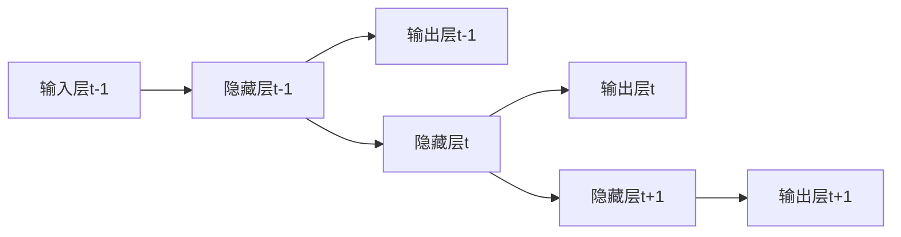

## 1.背景介绍

在过去的几年里，我们已经见证了深度学习在各种领域取得了巨大的成功。特别是在自然语言处理（NLP）和时间序列预测等领域，深度学习已经成为了主导的方法。在这些领域中，一种特别重要的神经网络结构就是循环神经网络（Recurrent Neural Network，RNN）。RNN的主要特点是能够处理序列数据，这使得它在语音识别、语言模型、翻译系统等任务上有着广泛的应用。

## 2.核心概念与联系

### 2.1 循环神经网络的基本构造

循环神经网络的主要特点是网络中存在着环，这使得信息可以在网络中传递。这种结构使得RNN可以处理任意长度的序列数据。

RNN的一个基本模型如下：

在这个模型中，隐藏层的输出不仅用于生成当前的输出，还会被用于下一步的输入。这就是RNN的基本构造。

### 2.2 循环神经网络的时间展开

为了更好地理解RNN，我们通常会将其进行时间展开。时间展开就是将RNN在处理序列数据时的操作进行展示。

在这个时间展开的模型中，我们可以看到，隐藏层的输出被用于下一步的输入，形成了一个时间序列的处理过程。

## 3.核心算法原理具体操作步骤

RNN的核心算法主要包括前向传播和反向传播两部分。

### 3.1 前向传播

前向传播的步骤如下：

1. 对于每一个时间步，计算隐藏层的状态。这个状态是由当前时间步的输入和前一个时间步的隐藏层状态共同决定的。
2. 使用隐藏层的状态来计算当前时间步的输出。

这个过程可以用以下的公式来表示：

$ h_t = f(W_{hh}h_{t-1} + W_{xh}x_t + b_h) $

$ y_t = W_{hy}h_t + b_y $

其中，$h_t$是当前时间步的隐藏层状态，$x_t$是当前时间步的输入，$y_t$是当前时间步的输出，$W_{hh}$、$W_{xh}$、$W_{hy}$是权重矩阵，$b_h$、$b_y$是偏置项，$f$是激活函数。

### 3.2 反向传播

反向传播的步骤如下：

1. 计算输出层的误差。
2. 根据输出层的误差，计算隐藏层的误差。
3. 根据隐藏层的误差，更新权重和偏置项。

这个过程可以用以下的公式来表示：

$ \delta^y_t = y_t - \hat{y}_t $

$ \delta^h_t = (W_{hy}^T\delta^y_t + W_{hh}^T\delta^h_{t+1}) \odot f'(h_t) $

$ \Delta W_{hy} = \Delta W_{hy} + \delta^y_th_t^T $

$ \Delta W_{hh} = \Delta W_{hh} + \delta^h_th_{t-1}^T $

$ \Delta W_{xh} = \Delta W_{xh} + \delta^h_tx_t^T $

$ \Delta b_h = \Delta b_h + \delta^h_t $

$ \Delta b_y = \Delta b_y + \delta^y_t $

其中，$\delta^y_t$是输出层的误差，$\delta^h_t$是隐藏层的误差，$\Delta W_{hy}$、$\Delta W_{hh}$、$\Delta W_{xh}$是权重矩阵的更新量，$\Delta b_h$、$\Delta b_y$是偏置项的更新量，$\hat{y}_t$是当前时间步的目标输出，$\odot$表示元素级别的乘法。

## 4.数学模型和公式详细讲解举例说明

在这一部分，我们将通过一个具体的例子来详细讲解前向传播和反向传播的过程。

假设我们有一个简单的RNN，只有一个隐藏层，隐藏层的大小为2，输入层的大小为3，输出层的大小为1。我们使用tanh作为激活函数。

### 4.1 前向传播

假设我们的输入是$x = [0.5, 0.6, 0.7]$，目标输出是$\hat{y} = 0.1$，初始隐藏层状态是$h_0 = [0, 0]$。

我们首先计算隐藏层的状态：

$ h_1 = tanh(W_{hh}h_0 + W_{xh}x + b_h) $

然后，我们计算输出：

$ y_1 = W_{hy}h_1 + b_y $

### 4.2 反向传播

首先，我们计算输出层的误差：

$ \delta^y_1 = y_1 - \hat{y} $

然后，我们计算隐藏层的误差：

$ \delta^h_1 = W_{hy}^T\delta^y_1 \odot (1 - h_1^2) $

最后，我们更新权重和偏置项：

$ \Delta W_{hy} = \Delta W_{hy} + \