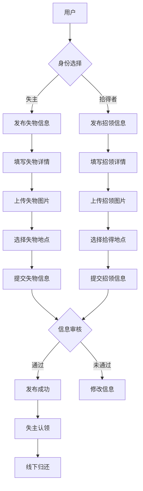

# 微信小程序失物招领系统设计

## 1. 背景介绍

随着移动互联网的快速发展,微信小程序作为一种轻量级应用形式,在各个领域得到广泛应用。失物招领是一个常见的社会问题,传统的失物招领方式效率低下,而微信小程序恰好可以发挥其优势,为失物招领提供一个便捷高效的平台。本文将探讨如何设计一个功能完善、用户体验良好的微信小程序失物招领系统。

### 1.1 微信小程序概述
#### 1.1.1 微信小程序的定义与特点  
#### 1.1.2 微信小程序的应用现状
#### 1.1.3 微信小程序在失物招领领域的优势

### 1.2 失物招领的现状与问题
#### 1.2.1 传统失物招领方式的局限性
#### 1.2.2 互联网时代失物招领面临的新挑战
#### 1.2.3 微信小程序在失物招领领域的应用前景

## 2. 核心概念与联系

### 2.1 失物招领系统的核心概念
#### 2.1.1 失物信息
#### 2.1.2 招领信息  
#### 2.1.3 用户角色

### 2.2 失物招领系统的业务流程
#### 2.2.1 发布失物信息流程
#### 2.2.2 发布招领信息流程
#### 2.2.3 失物认领流程

### 2.3 失物招领系统的关键技术
#### 2.3.1 微信小程序框架
#### 2.3.2 数据存储与同步
#### 2.3.3 图像识别与比对
#### 2.3.4 地理位置服务  

## 3. 核心算法原理与具体操作步骤

### 3.1 图像识别算法
#### 3.1.1 图像特征提取
#### 3.1.2 图像比对原理
#### 3.1.3 相似度计算方法

### 3.2 推荐算法
#### 3.2.1 基于内容的推荐
#### 3.2.2 协同过滤推荐  
#### 3.2.3 混合推荐策略

### 3.3 地理位置匹配算法 
#### 3.3.1 地理编码与逆地理编码
#### 3.3.2 空间索引构建
#### 3.3.3 距离计算与排序

## 4. 数学模型和公式详细讲解举例说明

### 4.1 图像相似度计算
#### 4.1.1 余弦相似度
$similarity = \cos(\theta) = {A \cdot B \over \|A\| \|B\|}$
#### 4.1.2 汉明距离
$d(x,y) = \sum_{i=1}^{n} |x_i - y_i|$

### 4.2 协同过滤算法
#### 4.2.1 用户相似度计算
$sim(u,v) = \frac{\sum_{i \in I_{uv}} r_{ui} \cdot r_{vi}}{\sqrt{\sum_{i \in I_{uv}} r_{ui}^2} \sqrt{\sum_{i \in I_{uv}} r_{vi}^2}}$
#### 4.2.2 物品相似度计算  
$sim(i,j) = \frac{\sum_{u \in U_{ij}} r_{ui} \cdot r_{uj}}{\sqrt{\sum_{u \in U_{ij}} r_{ui}^2} \sqrt{\sum_{u \in U_{ij}} r_{uj}^2}}$

### 4.3 地理距离计算
#### 4.3.1 欧几里得距离
$d = \sqrt{(x_1-x_2)^2 + (y_1-y_2)^2}$
#### 4.3.2 曼哈顿距离
$d = |x_1-x_2| + |y_1-y_2|$

## 5. 项目实践：代码实例和详细解释说明

### 5.1 微信小程序框架搭建
#### 5.1.1 项目结构组织
#### 5.1.2 页面设计与开发
#### 5.1.3 组件封装与复用

### 5.2 后端接口设计与实现  
#### 5.2.1 RESTful API 设计原则
#### 5.2.2 失物信息接口实现
#### 5.2.3 招领信息接口实现
#### 5.2.4 用户认证与授权

### 5.3 数据存储方案
#### 5.3.1 数据库选型与设计
#### 5.3.2 数据同步与缓存策略 
#### 5.3.3 图片存储与处理

### 5.4 算法模块实现
#### 5.4.1 图像识别模块
#### 5.4.2 推荐算法模块
#### 5.4.3 地理位置服务模块

## 6. 实际应用场景

### 6.1 校园失物招领
#### 6.1.1 校园失物招领现状
#### 6.1.2 微信小程序在校园失物招领中的应用
#### 6.1.3 校园失物招领小程序案例分析

### 6.2 公共场所失物招领
#### 6.2.1 公共场所失物招领面临的挑战
#### 6.2.2 微信小程序在公共场所失物招领中的优势
#### 6.2.3 机场/车站失物招领小程序案例分析

### 6.3 社区失物招领
#### 6.3.1 社区失物招领的特点
#### 6.3.2 微信小程序在社区失物招领中的应用模式
#### 6.3.3 社区失物招领小程序案例分析

## 7. 工具和资源推荐

### 7.1 微信小程序开发工具
#### 7.1.1 微信开发者工具
#### 7.1.2 Wepy框架
#### 7.1.3 Mpvue框架

### 7.2 后端开发工具与框架
#### 7.2.1 Node.js
#### 7.2.2 Express框架
#### 7.2.3 Koa框架
#### 7.2.4 Egg.js框架

### 7.3 人工智能与机器学习平台
#### 7.3.1 TensorFlow
#### 7.3.2 PyTorch
#### 7.3.3 百度AI开放平台
#### 7.3.4 腾讯AI开放平台

### 7.4 地图服务与位置服务
#### 7.4.1 腾讯位置服务
#### 7.4.2 百度地图API
#### 7.4.3 高德地图API

## 8. 总结：未来发展趋势与挑战

### 8.1 失物招领领域的发展趋势
#### 8.1.1 人工智能技术的应用
#### 8.1.2 区块链技术的探索
#### 8.1.3 跨平台失物招领服务

### 8.2 微信小程序失物招领系统面临的挑战
#### 8.2.1 用户隐私保护
#### 8.2.2 失物信息真实性验证
#### 8.2.3 线上线下服务衔接

### 8.3 未来展望
#### 8.3.1 失物招领服务的智能化
#### 8.3.2 失物招领与社交网络的融合
#### 8.3.3 失物招领平台的生态建设

## 9. 附录：常见问题与解答

### 9.1 如何提高失物招领的成功率？
### 9.2 如何保证失物招领信息的真实性？
### 9.3 微信小程序失物招领系统如何盈利？
### 9.4 如何处理失物招领过程中的纠纷？
### 9.5 失物招领小程序如何与线下服务对接？

作者：禅与计算机程序设计艺术 / Zen and the Art of Computer Programming