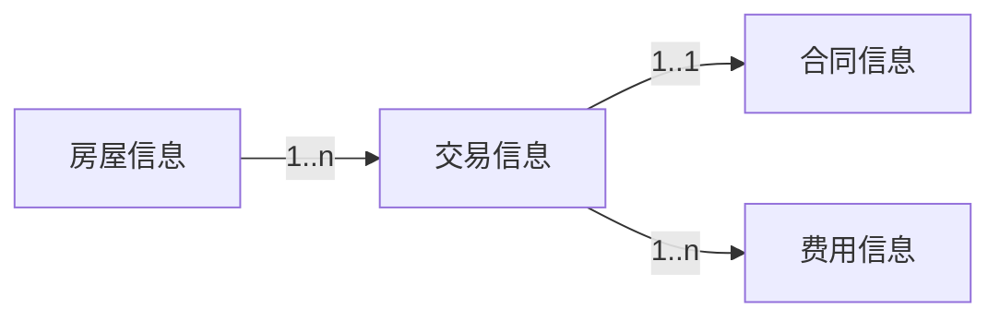
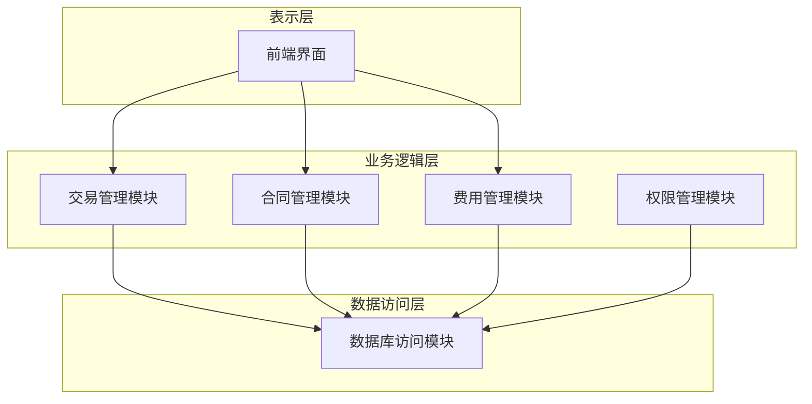

# 房管局房屋交易管理系统详细设计与具体代码实现

## 1.背景介绍

随着城市化进程的不断加快,房地产行业发展迅猛,房屋交易活动日益频繁。为了有效管理房屋交易过程,确保交易信息的透明度和可追溯性,政府住房管理部门亟需一套高效的房屋交易管理系统。该系统需要涵盖房屋登记、交易审核、合同管理、费用缴纳等多个环节,并能为公众提供查询服务。

## 2.核心概念与联系

### 2.1 房屋信息

房屋信息是系统的核心数据,包括房屋地址、面积、用途、权属等基本信息,以及房屋交易记录。每栋房屋都有唯一的编号作为标识。

### 2.2 交易信息

交易信息记录了房屋所有权转移的详细过程,包括买卖双方信息、交易价格、交易日期等。每笔交易都有唯一的交易编号。

### 2.3 合同信息

合同信息存储了买卖双方签订的房屋交易合同的内容,是交易的法律依据。合同编号与交易编号一一对应。

### 2.4 费用信息

交易过程中需要缴纳若干费用,如契税、营业税等。费用信息记录了缴费金额、缴费日期等内容。

### 2.5 角色权限

系统设置了多种角色,如管理员、审核员、缴费员等,不同角色拥有不同的操作权限。

### 2.6 核心关系

上述核心概念之间存在以下关系:
- 一栋房屋可发生多笔交易
- 一笔交易对应一份合同
- 一笔交易需缴纳多种费用



## 3.核心算法原理具体操作步骤

### 3.1 房屋登记算法

1) 获取房屋基本信息(地址、面积、用途等)
2) 生成唯一房屋编号
3) 创建房屋对象,存入数据库

```python
def register_house(info):
    house_id = generate_id()
    house = House(house_id, info)
    db.insert(house)
    return house_id
```

### 3.2 交易审核算法

1) 获取交易申请信息
2) 验证买卖双方身份信息
3) 验证房屋状态(是否可交易)
4) 生成交易编号
5) 创建交易对象,状态标记为"待审核"
6) 发送审核请求给审核员

```python
def submit_transaction(buyer, seller, house):
    validate_identities(buyer, seller)
    validate_house_status(house)
    
    tx_id = generate_tx_id()
    tx = Transaction(tx_id, buyer, seller, house)
    tx.status = "PENDING_APPROVAL"
    db.insert(tx)
    
    notify_approvers(tx)
```

### 3.3 合同生成算法  

1) 获取审核通过的交易信息
2) 根据交易信息生成合同内容
3) 生成合同编号
4) 创建合同对象,与交易对象关联
5) 发送合同给买卖双方签署

```python
def generate_contract(transaction):
    contract_id = generate_id()
    content = render_template(transaction)
    contract = Contract(contract_id, content)
    contract.transaction = transaction
    db.insert(contract)
    
    notify_parties(contract)
```

### 3.4 费用计算与缴纳算法

1) 获取交易信息
2) 根据交易信息计算应缴纳的费用
3) 创建费用对象
4) 发送缴费通知给缴费方
5) 接收缴费记录,更新费用状态

```python 
def calculate_fees(transaction):
    fees = []
    for fee_type in FEE_TYPES:
        amount = compute_fee(transaction, fee_type)
        fee = Fee(fee_type, amount)
        fees.append(fee)
        db.insert(fee)
        notify_payer(fee)
        
    return fees
```

## 4.数学模型和公式详细讲解举例说明

在房屋交易管理系统中,需要计算多种费用,如契税、营业税等。这些费用通常是根据房屋交易价格和相应的费率计算得出。我们将以契税计算为例,介绍相关的数学模型和公式。

契税是针对房地产转移交易而征收的一种税费,旨在调节房地产交易。契税的计算公式如下:

$$
契税 = 交易价格 \times 契税费率
$$

其中,契税费率因地区和房屋用途不同而有所差异。以北京市为例,契税费率分为以下几种情况:

1. 个人购买家庭唯一住房,费率为1%
2. 个人购买第二套及以上住房,费率为1.5%
3. 非个人购买住房,费率为3%
4. 非住宅房地产,费率为3%

我们可以用如下代码实现契税计算:

```python
def compute_deed_tax(transaction):
    price = transaction.price
    usage = transaction.house.usage
    buyer_type = transaction.buyer.type
    
    if buyer_type == "INDIVIDUAL" and usage == "RESIDENTIAL":
        if is_first_home(transaction.buyer):
            rate = 0.01
        else:
            rate = 0.015
    else:
        rate = 0.03
        
    tax = price * rate
    return tax
```

在上述代码中,我们首先获取交易价格、房屋用途和买家类型。然后根据相应的规则确定契税费率。最后将交易价格与费率相乘,得到应缴纳的契税金额。

需要注意的是,对于个人买家,我们还需要判断是否为首次购房。这可以通过查询买家的历史交易记录来实现。

```python
def is_first_home(buyer):
    transactions = db.get_transactions(buyer)
    return len(transactions) == 0
```

通过上述数学模型和代码实现,我们可以精准计算出每笔交易应缴纳的契税金额。

## 5.项目实践:代码实例和详细解释说明

### 5.1 系统架构

房屋交易管理系统采用经典的三层架构,包括表示层(前端)、业务逻辑层(后端)和数据访问层。



### 5.2 核心类设计

```python
class House:
    def __init__(self, id, info):
        self.id = id
        self.address = info['address']
        self.area = info['area']
        self.usage = info['usage']
        self.owner = info['owner']
        
class Transaction:
    def __init__(self, id, buyer, seller, house):
        self.id = id
        self.buyer = buyer
        self.seller = seller
        self.house = house
        self.price = None
        self.date = None
        self.status = None
        
class Contract:
    def __init__(self, id, content):
        self.id = id
        self.content = content
        self.transaction = None
        
class Fee:
    def __init__(self, type, amount):
        self.type = type
        self.amount = amount
        self.transaction = None
        self.status = "UNPAID"
        
# 其他类定义...
```

### 5.3 交易流程示例

```python
# 房屋登记
house_info = {
    'address': '北京市海淀区xxx路1号楼',
    'area': 90,
    'usage': 'RESIDENTIAL',
    'owner': '张三'
}
house_id = register_house(house_info)

# 发起交易申请
buyer = User('李四', 'INDIVIDUAL')
seller = User('张三', 'INDIVIDUAL')
transaction = submit_transaction(buyer, seller, house_id)

# 审核员审核交易
# ...
transaction.status = "APPROVED"

# 生成合同
contract = generate_contract(transaction)

# 买卖双方签署合同
# ...

# 计算并缴纳费用  
fees = calculate_fees(transaction)
for fee in fees:
    # 缴费流程
    # ...
    fee.status = "PAID"
    
# 交易完成
transaction.status = "COMPLETED"
```

上述代码演示了一个典型的房屋交易流程,包括房屋登记、交易申请、审核、合同生成和费用缴纳等步骤。在实际项目中,这些步骤会更加完善和复杂,还需要处理各种异常情况。

## 6.实际应用场景

房屋交易管理系统在实际应用中发挥着重要作用,可以为政府住房管理部门、房地产经纪机构、银行等多个领域提供支持。

### 6.1 政府住房管理部门

政府住房管理部门是该系统的主要使用者,可以通过系统实现以下功能:

- 房屋登记和信息管理
- 交易审核和监管
- 契税等费用征收
- 房地产市场数据统计和分析

### 6.2 房地产经纪机构

房地产经纪机构可以将该系统集成到自身的业务流程中,实现:

- 房源信息录入和维护
- 线上签约和合同管理
- 交易费用计算和缴纳
- 客户资料和交易记录管理

### 6.3 银行业金融机构

银行等金融机构可以利用该系统的数据,为房地产贷款业务提供支持:

- 验证房屋权属信息
- 查询交易价格和合同内容
- 风控审核和反洗钱监管
- 抵押贷款管理

## 7.工具和资源推荐

在开发和部署房屋交易管理系统时,可以使用以下工具和资源:

### 7.1 开发工具

- Python: 常用的编程语言,具有丰富的Web开发框架和库
- Django/Flask: 流行的Python Web框架
- MySQL/PostgreSQL: 常用的关系型数据库
- Git: 版本控制工具
- Docker: 容器化部署工具

### 7.2 云服务

- 阿里云/腾讯云/AWS: 提供云服务器、数据库、对象存储等资源
- 域名注册商: 为系统注册域名

### 7.3 开源资源

- Bootstrap/Vue.js: 前端UI框架
- Celery: 异步任务队列
- Sentry: 错误监控
- Swagger: API文档工具

### 7.4 安全工具

- JWT: 用于生成安全令牌
- Bcrypt: 密码哈希加密
- VPN: 为远程访问提供安全通道

选择合适的工具和资源,可以极大提高开发效率,并确保系统的安全性和可扩展性。

## 8.总结:未来发展趋势与挑战

### 8.1 发展趋势

#### 8.1.1 智能化

利用人工智能和大数据技术,实现智能化的房屋估值、个性化推荐和决策支持,提高交易效率。

#### 8.1.2 一站式服务

将房屋交易、贷款、装修、搬家等多个环节整合到同一平台,为用户提供一站式的房地产服务。

#### 8.1.3 区块链技术

借助区块链的分布式账本和智能合约功能,提高交易透明度,简化合同流程,实现自动化执行。

### 8.2 面临挑战

#### 8.2.1 数据安全和隐私保护

如何确保交易数据的安全性,防止泄露和被滥用,是系统面临的重大挑战。

#### 8.2.2 法律法规合规

房地产行业监管日趋严格,系统需要及时跟进并遵守相关法律法规的变化。

#### 8.2.3 系统扩展性

随着业务规模的扩大,系统需要具备良好的扩展性,以应对日益增长的访问量和数据量。

## 9.附录:常见问题与解答

### 9.1 如何保证交易数据的真实性?

系统会对买卖双方的身份信息进行严格验证,并对房屋权属和交易合同内容进行审核,确保数据的真实性和合法性。同时,所有交易记录都会永久存储,具有可追溯性。

### 9.2 交易费用如何计算?

不同